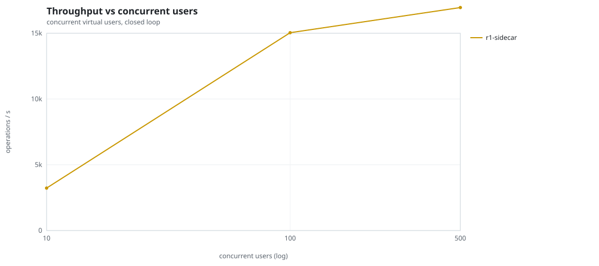
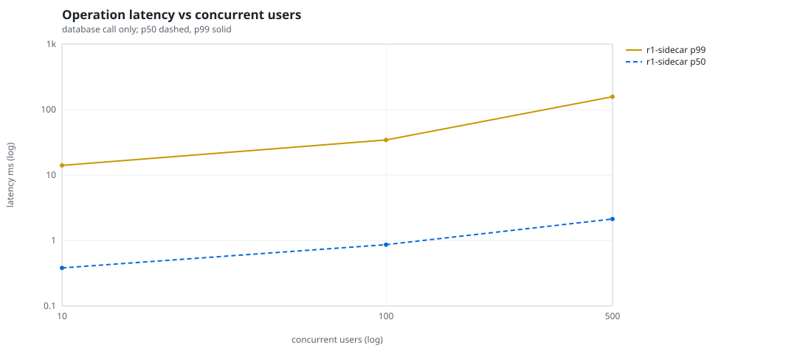
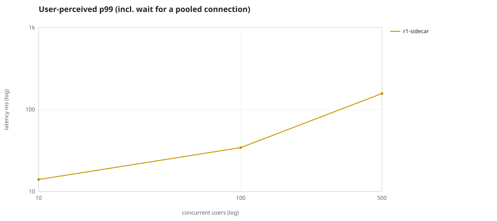
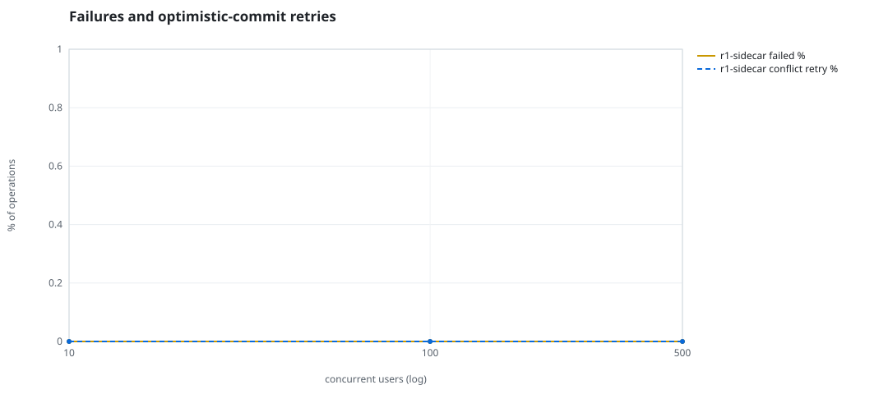
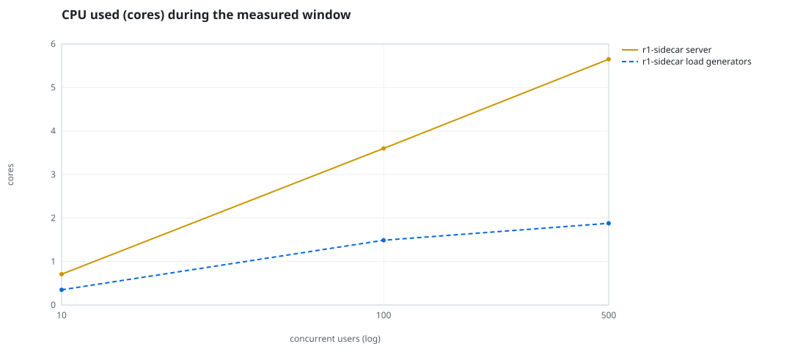
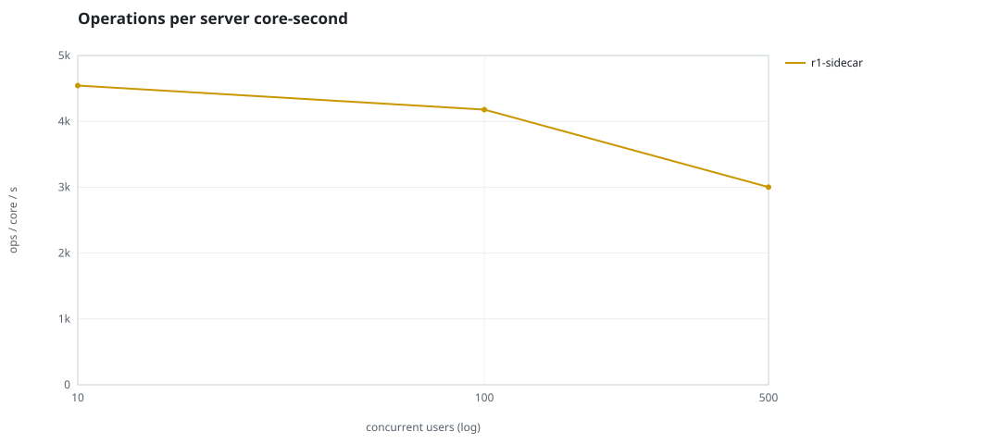
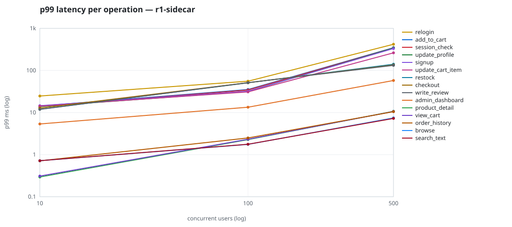

# Mini-SaaS concurrency simulation — sidecar

Run: `r1-sidecar` on 2026-09-26T06:54:44 · commit `3de0ce4` · macOS-26.6.2-arm64-arm-64bit-Mach-O · 10 CPUs

## Configuration

- **transport**: sidecar
- **levels**: [10, 100, 500]
- **duration**: 30.0
- **warmup**: 5.0
- **ramp**: 5.0
- **think**: [0.0, 0.0]
- **processes**: 10
- **connections**: 0
- **durability**: safe
- **products**: 5000
- **accounts**: 20000
- **scenario**: baseline
- **seed**: 1
- **fresh_per_stage**: False
- **seed time**: 1.11 s, 12.9 MiB after seeding

## Capacity and performance curve

Latencies are of the database call (service operation) in milliseconds; `user p99` adds the wait for a pooled connection.

| users | conns | ops/s | reads/s | writes/s | p50 | p95 | p99 | p99.9 | max | user p99 | success % | conflict retry % | srv CPU | srv RSS MiB | gen CPU | thr CV | invariants |
|---:|---:|---:|---:|---:|---:|---:|---:|---:|---:|---:|---:|---:|---:|---:|---:|---:|---:|
| 10 | 10 | 3226.3 | 2431.1 | 795.2 | 0.381 | 10.954 | 14.017 | 20.805 | 627.383 | 14.018 | 100.0 | 0.0 | 0.71 | 70.2 | 0.35 | 0.094 | ok |
| 100 | 100 | 15040.2 | 11367.3 | 3672.9 | 0.863 | 22.746 | 34.35 | 165.599 | 2045.763 | 34.351 | 100.0 | 0.0 | 3.6 | 334.9 | 1.49 | 0.258 | ok |
| 500 | 500 | 16956.4 | 12822.5 | 4133.8 | 2.13 | 98.102 | 157.12 | 378.988 | 2818.499 | 157.121 | 100.0 | 0.0 | 5.65 | 441.0 | 1.88 | 0.13 | ok |

## Insights

- **Peak throughput**: 16956.4 ops/s at 500 users (p99 157.12 ms).
- **Capacity at p99 ≤ 10 ms**: 0 users (DB latency); 0 users counting pool wait.
- **Capacity at p99 ≤ 50 ms**: 100 users (DB latency); 100 users counting pool wait.
- **Capacity at p99 ≤ 100 ms**: 100 users (DB latency); 100 users counting pool wait.
- **Capacity at p99 ≤ 250 ms**: 500 users (DB latency); 500 users counting pool wait.
- **Capacity at p99 ≤ 1000 ms**: 500 users (DB latency); 500 users counting pool wait.
- **USL fit**: σ (contention) = 0.01, κ (coherency) = 1.26e-05, predicted peak at N ≈ 280.4 (rmse log 0.0563).
- **Ops per server core-second**: 10→4544, 100→4178, 500→3001.
- **Read-your-writes violations**: none.
- **Business invariants**: all stages ok.
- **Offline integrity check** (elitesql check): ok in 20.74 s.
  - right after killing the server (no clean close): exit 3, 0 errors, 701866 warnings; after one clean open/close: exit 0, 0 errors, 0 warnings.
- **Database size**: 31.0 MiB after the first stage, 188.0 MiB after the last; 42775 paid orders in total.

## p99 latency per operation (ms)

| op | share % | 10 | 100 | 500 |
|---|---:|---:|---:|---:|
| add_to_cart | 10.95 | 14.33 | 35.28 | 347.02 |
| admin_dashboard | 1.07 | 5.37 | 13.40 | 57.75 |
| browse | 21.9 | 0.72 | 1.75 | 7.46 |
| checkout | 4.44 | 12.74 | 51.33 | 134.88 |
| order_history | 3.24 | 0.71 | 2.49 | 10.51 |
| product_detail | 18.59 | 0.29 | 2.27 | 10.74 |
| relogin | 1.71 | 24.76 | 55.51 | 419.45 |
| restock | 0.35 | 11.98 | 50.87 | 140.63 |
| search_text | 8.63 | 0.72 | 1.77 | 7.25 |
| session_check | 13.04 | 14.01 | 34.40 | 343.00 |
| signup | 0.57 | 14.55 | 32.20 | 331.95 |
| update_cart_item | 3.26 | 14.18 | 31.00 | 262.62 |
| update_profile | 1.13 | 13.90 | 31.75 | 342.61 |
| view_cart | 8.89 | 0.31 | 2.32 | 10.60 |
| write_review | 2.24 | 11.90 | 51.35 | 132.39 |

## Errors and business outcomes at the highest level

```json
{
 "statuses": {
  "ok": 501961,
  "empty_cart": 6601,
  "not_found": 51,
  "out_of_stock": 78
 },
 "errors": {}
}
```

## Charts








