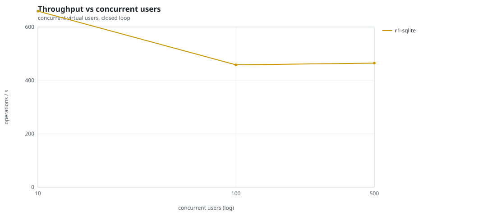
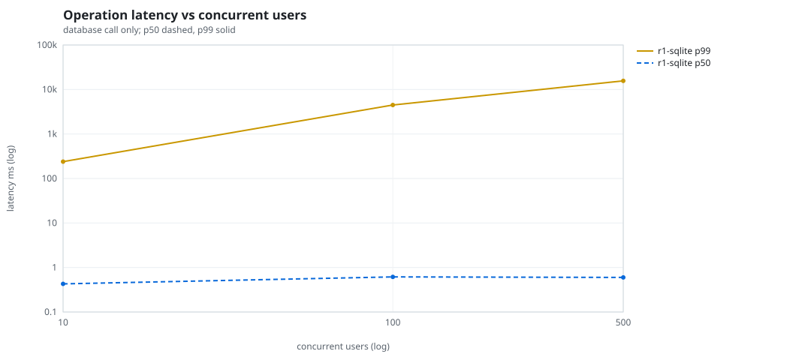
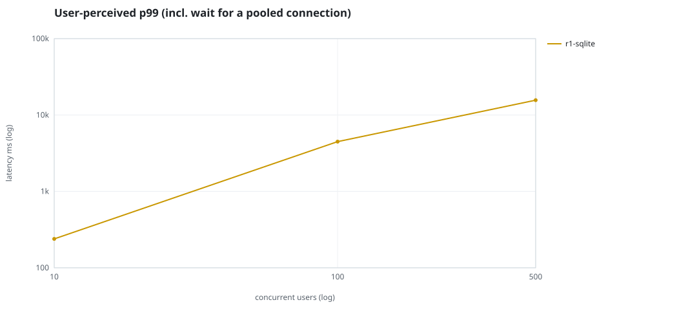
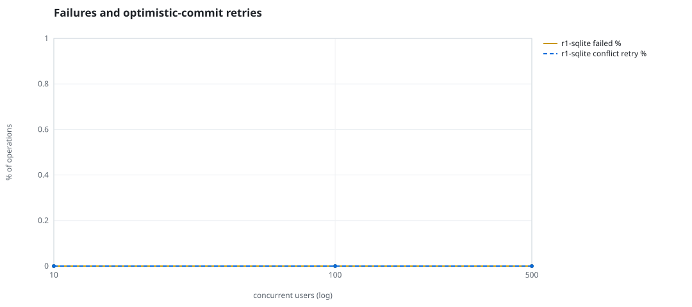
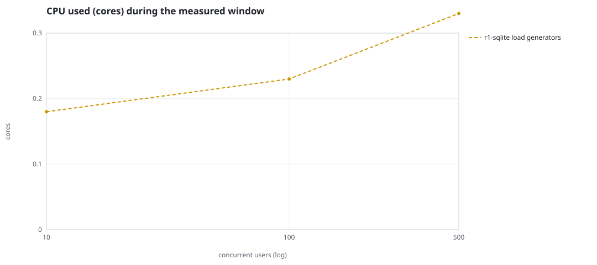
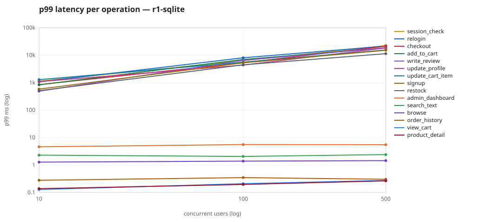

# Mini-SaaS concurrency simulation — sqlite

Run: `r1-sqlite` on 2026-09-26T06:57:31 · commit `3de0ce4` · macOS-26.6.2-arm64-arm-64bit-Mach-O · 10 CPUs

## Configuration

- **transport**: sqlite
- **levels**: [10, 100, 500]
- **duration**: 30.0
- **warmup**: 5.0
- **ramp**: 5.0
- **think**: [0.0, 0.0]
- **processes**: 10
- **connections**: 0
- **durability**: safe
- **products**: 5000
- **accounts**: 20000
- **scenario**: baseline
- **seed**: 1
- **fresh_per_stage**: False
- **seed time**: 0.19 s, 4.6 MiB after seeding

## Capacity and performance curve

Latencies are of the database call (service operation) in milliseconds; `user p99` adds the wait for a pooled connection.

| users | conns | ops/s | reads/s | writes/s | p50 | p95 | p99 | p99.9 | max | user p99 | success % | conflict retry % | srv CPU | srv RSS MiB | gen CPU | thr CV | invariants |
|---:|---:|---:|---:|---:|---:|---:|---:|---:|---:|---:|---:|---:|---:|---:|---:|---:|---:|
| 10 | 10 | 659.4 | 497.2 | 162.2 | 0.429 | 10.014 | 239.02 | 2329.121 | 7301.98 | 239.022 | 100.0 | 0.0 | None | None | 0.18 | 0.146 | ok |
| 100 | 100 | 458.3 | 347.5 | 110.8 | 0.615 | 1431.195 | 4483.536 | 8859.344 | 13142.024 | 4483.539 | 100.0 | 0.0 | None | None | 0.23 | 0.272 | ok |
| 500 | 500 | 464.7 | 351.3 | 113.4 | 0.599 | 6651.953 | 15653.834 | 24831.923 | 31444.266 | 15653.837 | 100.0 | 0.0 | None | None | 0.33 | 0.263 | ok |

## Insights

- **Peak throughput**: 659.4 ops/s at 10 users (p99 239.02 ms).
- **Capacity at p99 ≤ 10 ms**: 0 users (DB latency); 0 users counting pool wait.
- **Capacity at p99 ≤ 50 ms**: 0 users (DB latency); 0 users counting pool wait.
- **Capacity at p99 ≤ 100 ms**: 0 users (DB latency); 0 users counting pool wait.
- **Capacity at p99 ≤ 250 ms**: 10 users (DB latency); 10 users counting pool wait.
- **Capacity at p99 ≤ 1000 ms**: 10 users (DB latency); 10 users counting pool wait.
- **USL fit**: σ (contention) = 0.3, κ (coherency) = 3.16e-04, predicted peak at N ≈ 47.0 (rmse log 0.1935).
- **Generator CPU includes the database**: SQLite runs inside the load-generator processes, so `gen CPU` is application plus engine and there is no server column.
- **Read-your-writes violations**: none.
- **Business invariants**: all stages ok.
- **Offline integrity check** (PRAGMA integrity_check): ok in 0.01 s.
- **Database size**: 4.9 MiB after the first stage, 5.4 MiB after the last; 1824 paid orders in total.

## p99 latency per operation (ms)

| op | share % | 10 | 100 | 500 |
|---|---:|---:|---:|---:|
| add_to_cart | 10.91 | 831.43 | 6980.05 | 18655.94 |
| admin_dashboard | 1.11 | 4.60 | 5.54 | 5.46 |
| browse | 21.74 | 1.27 | 1.38 | 1.44 |
| checkout | 4.36 | 846.62 | 5311.05 | 21256.84 |
| order_history | 3.38 | 0.28 | 0.35 | 0.30 |
| product_detail | 18.49 | 0.14 | 0.19 | 0.26 |
| relogin | 1.58 | 1062.62 | 8060.60 | 21477.65 |
| restock | 0.32 | 508.36 | 4463.43 | 11391.65 |
| search_text | 8.79 | 2.29 | 2.05 | 2.38 |
| session_check | 13.19 | 1145.33 | 6317.32 | 22388.02 |
| signup | 0.52 | 579.05 | 5267.90 | 15097.27 |
| update_cart_item | 3.42 | 1282.88 | 5569.17 | 15497.27 |
| update_profile | 1.14 | 1082.96 | 4359.44 | 18436.32 |
| view_cart | 8.7 | 0.13 | 0.21 | 0.27 |
| write_review | 2.34 | 487.39 | 6517.46 | 18633.12 |

## Errors and business outcomes at the highest level

```json
{
 "statuses": {
  "ok": 13710,
  "empty_cart": 229,
  "not_found": 1
 },
 "errors": {}
}
```

## Charts








