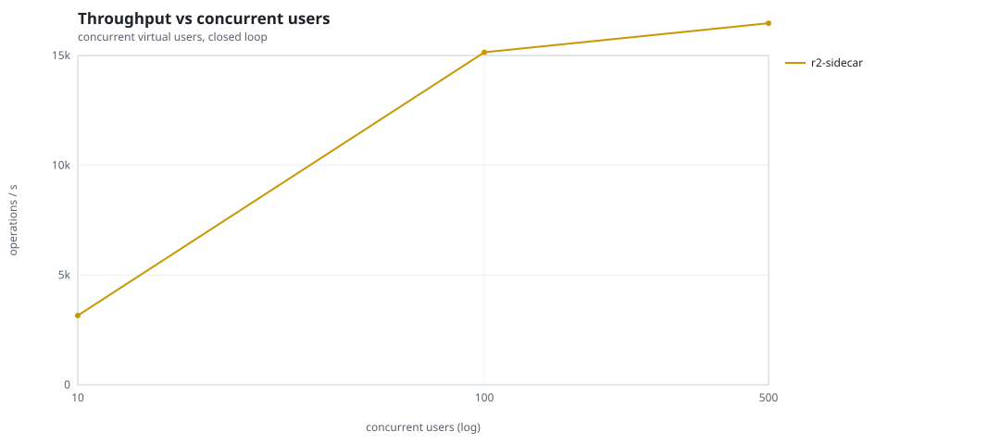
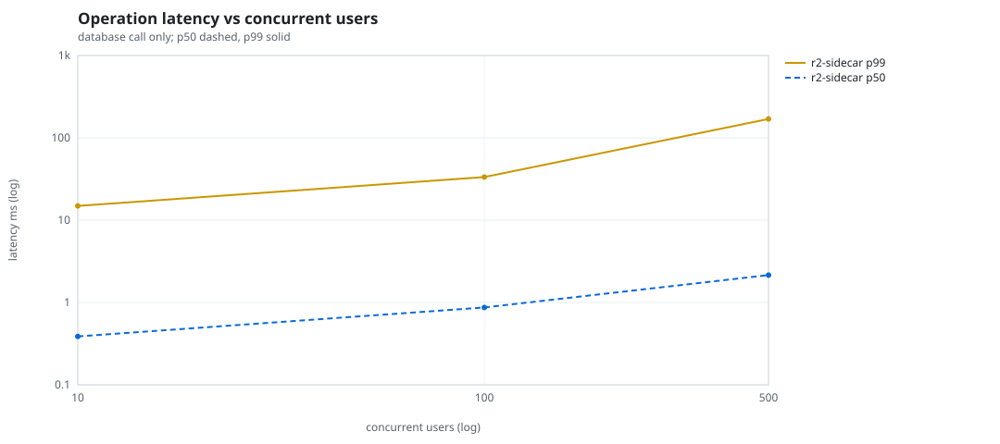
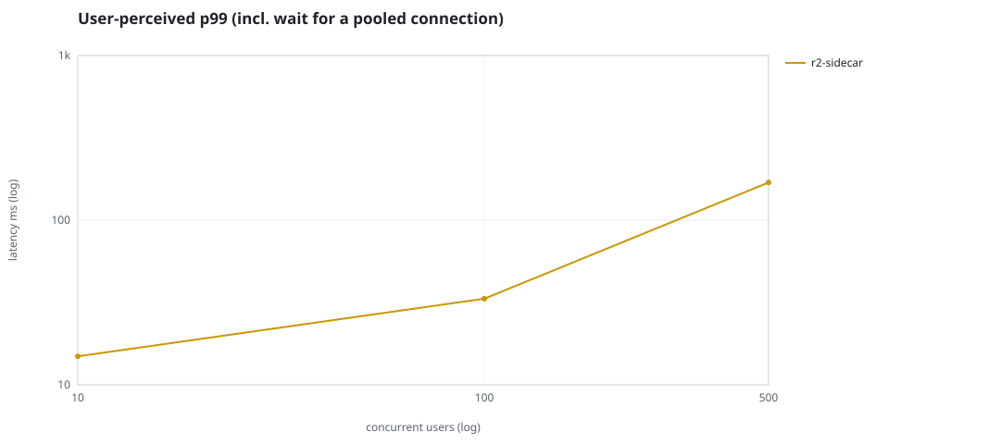
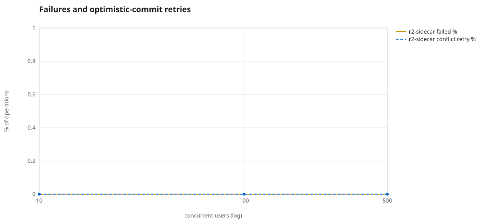
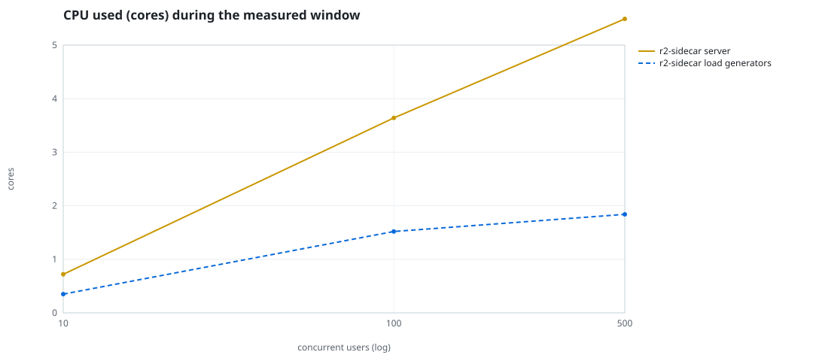
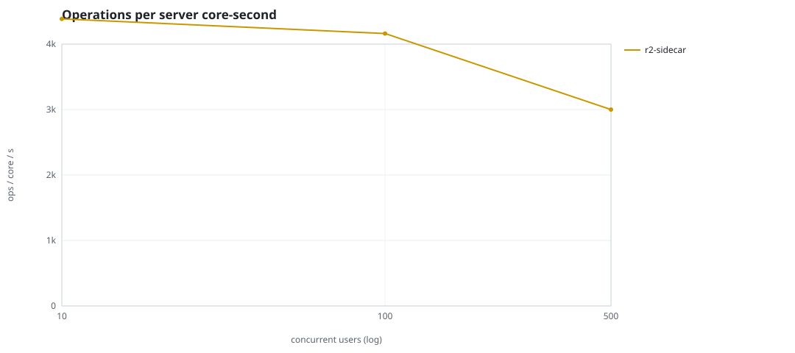
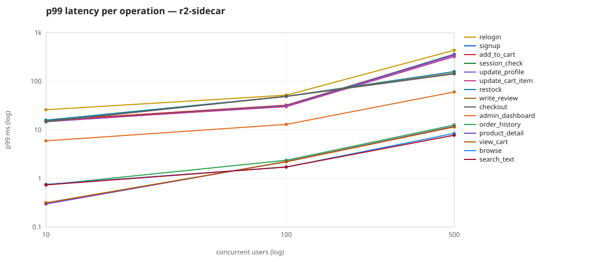

# Mini-SaaS concurrency simulation — sidecar

Run: `r2-sidecar` on 2026-09-26T07:02:08 · commit `3de0ce4` · macOS-26.6.2-arm64-arm-64bit-Mach-O · 10 CPUs

## Configuration

- **transport**: sidecar
- **levels**: [10, 100, 500]
- **duration**: 30.0
- **warmup**: 5.0
- **ramp**: 5.0
- **think**: [0.0, 0.0]
- **processes**: 10
- **connections**: 0
- **durability**: safe
- **products**: 5000
- **accounts**: 20000
- **scenario**: baseline
- **seed**: 2
- **fresh_per_stage**: False
- **seed time**: 1.07 s, 12.9 MiB after seeding

## Capacity and performance curve

Latencies are of the database call (service operation) in milliseconds; `user p99` adds the wait for a pooled connection.

| users | conns | ops/s | reads/s | writes/s | p50 | p95 | p99 | p99.9 | max | user p99 | success % | conflict retry % | srv CPU | srv RSS MiB | gen CPU | thr CV | invariants |
|---:|---:|---:|---:|---:|---:|---:|---:|---:|---:|---:|---:|---:|---:|---:|---:|---:|---:|
| 10 | 10 | 3157.7 | 2386.6 | 771.1 | 0.387 | 11.322 | 14.894 | 22.139 | 4293.75 | 14.895 | 100.0 | 0.0 | 0.72 | 71.8 | 0.35 | 0.133 | ok |
| 100 | 100 | 15147.5 | 11436.8 | 3710.8 | 0.87 | 22.734 | 33.348 | 89.616 | 2459.914 | 33.349 | 100.0 | 0.0 | 3.64 | 340.3 | 1.52 | 0.255 | ok |
| 500 | 500 | 16470.7 | 12435.9 | 4034.8 | 2.151 | 99.328 | 169.339 | 746.179 | 3294.004 | 169.34 | 100.0 | 0.0 | 5.49 | 437.8 | 1.84 | 0.172 | ok |

## Insights

- **Peak throughput**: 16470.7 ops/s at 500 users (p99 169.339 ms).
- **Capacity at p99 ≤ 10 ms**: 0 users (DB latency); 0 users counting pool wait.
- **Capacity at p99 ≤ 50 ms**: 100 users (DB latency); 100 users counting pool wait.
- **Capacity at p99 ≤ 100 ms**: 100 users (DB latency); 100 users counting pool wait.
- **Capacity at p99 ≤ 250 ms**: 500 users (DB latency); 500 users counting pool wait.
- **Capacity at p99 ≤ 1000 ms**: 500 users (DB latency); 500 users counting pool wait.
- **USL fit**: σ (contention) = 0.01, κ (coherency) = 1.58e-05, predicted peak at N ≈ 249.9 (rmse log 0.0574).
- **Ops per server core-second**: 10→4386, 100→4161, 500→3000.
- **Read-your-writes violations**: none.
- **Business invariants**: all stages ok.
- **Offline integrity check** (elitesql check): ok in 20.91 s.
  - right after killing the server (no clean close): exit 3, 0 errors, 700878 warnings; after one clean open/close: exit 0, 0 errors, 0 warnings.
- **Database size**: 30.6 MiB after the first stage, 188.8 MiB after the last; 42677 paid orders in total.

## p99 latency per operation (ms)

| op | share % | 10 | 100 | 500 |
|---|---:|---:|---:|---:|
| add_to_cart | 10.98 | 15.75 | 32.32 | 353.67 |
| admin_dashboard | 1.11 | 5.96 | 12.99 | 60.48 |
| browse | 21.95 | 0.76 | 1.72 | 8.49 |
| checkout | 4.38 | 14.91 | 48.83 | 142.37 |
| order_history | 3.28 | 0.74 | 2.37 | 12.61 |
| product_detail | 18.58 | 0.30 | 2.24 | 11.80 |
| relogin | 1.68 | 26.06 | 51.77 | 436.80 |
| restock | 0.35 | 15.88 | 49.07 | 158.63 |
| search_text | 8.8 | 0.74 | 1.72 | 7.77 |
| session_check | 13.21 | 14.89 | 31.58 | 349.71 |
| signup | 0.52 | 15.50 | 31.76 | 362.06 |
| update_cart_item | 3.26 | 15.19 | 30.09 | 323.77 |
| update_profile | 1.07 | 14.74 | 31.11 | 344.93 |
| view_cart | 8.66 | 0.32 | 2.21 | 11.54 |
| write_review | 2.17 | 14.72 | 49.16 | 147.21 |

## Errors and business outcomes at the highest level

```json
{
 "statuses": {
  "ok": 487648,
  "empty_cart": 6320,
  "not_found": 32,
  "out_of_stock": 121
 },
 "errors": {}
}
```

## Charts








