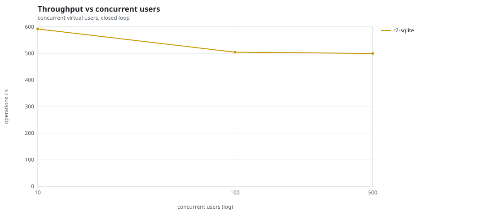
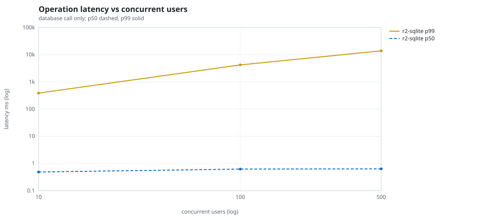
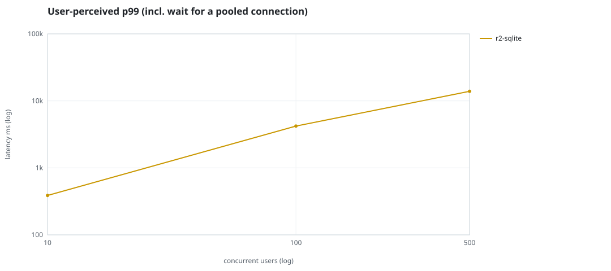
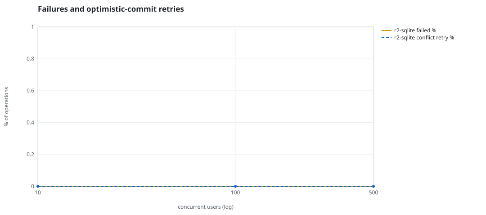
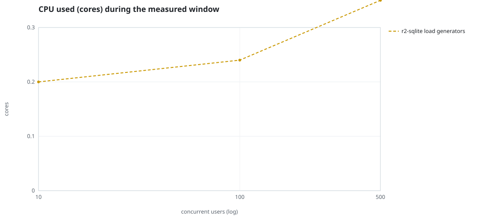
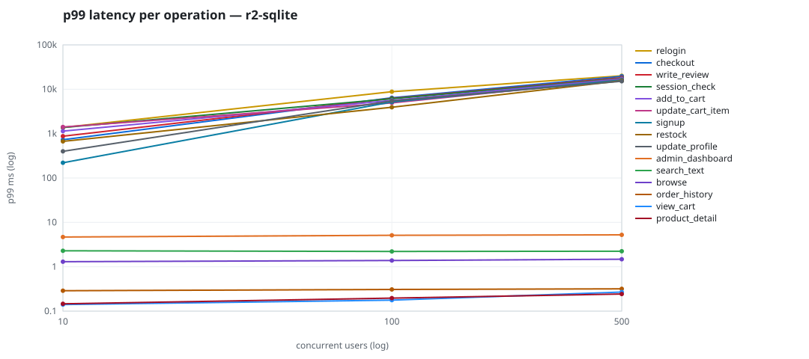

# Mini-SaaS concurrency simulation — sqlite

Run: `r2-sqlite` on 2026-09-26T06:59:50 · commit `3de0ce4` · macOS-26.6.2-arm64-arm-64bit-Mach-O · 10 CPUs

## Configuration

- **transport**: sqlite
- **levels**: [10, 100, 500]
- **duration**: 30.0
- **warmup**: 5.0
- **ramp**: 5.0
- **think**: [0.0, 0.0]
- **processes**: 10
- **connections**: 0
- **durability**: safe
- **products**: 5000
- **accounts**: 20000
- **scenario**: baseline
- **seed**: 2
- **fresh_per_stage**: False
- **seed time**: 0.19 s, 4.6 MiB after seeding

## Capacity and performance curve

Latencies are of the database call (service operation) in milliseconds; `user p99` adds the wait for a pooled connection.

| users | conns | ops/s | reads/s | writes/s | p50 | p95 | p99 | p99.9 | max | user p99 | success % | conflict retry % | srv CPU | srv RSS MiB | gen CPU | thr CV | invariants |
|---:|---:|---:|---:|---:|---:|---:|---:|---:|---:|---:|---:|---:|---:|---:|---:|---:|---:|
| 10 | 10 | 592.0 | 449.2 | 142.8 | 0.485 | 18.0 | 387.447 | 2103.765 | 4143.143 | 387.45 | 100.0 | 0.0 | None | None | 0.2 | 0.21 | ok |
| 100 | 100 | 504.7 | 379.4 | 125.2 | 0.622 | 1204.045 | 4207.297 | 8556.356 | 14235.234 | 4207.3 | 100.0 | 0.0 | None | None | 0.24 | 0.261 | ok |
| 500 | 500 | 500.0 | 377.9 | 122.2 | 0.635 | 6007.119 | 13889.825 | 23134.906 | 30195.004 | 13889.828 | 100.0 | 0.0 | None | None | 0.35 | 0.223 | ok |

## Insights

- **Peak throughput**: 592.0 ops/s at 10 users (p99 387.447 ms).
- **Capacity at p99 ≤ 10 ms**: 0 users (DB latency); 0 users counting pool wait.
- **Capacity at p99 ≤ 50 ms**: 0 users (DB latency); 0 users counting pool wait.
- **Capacity at p99 ≤ 100 ms**: 0 users (DB latency); 0 users counting pool wait.
- **Capacity at p99 ≤ 250 ms**: 0 users (DB latency); 0 users counting pool wait.
- **Capacity at p99 ≤ 1000 ms**: 10 users (DB latency); 10 users counting pool wait.
- **USL fit**: σ (contention) = 0.28, κ (coherency) = 1.58e-04, predicted peak at N ≈ 67.4 (rmse log 0.1285).
- **Generator CPU includes the database**: SQLite runs inside the load-generator processes, so `gen CPU` is application plus engine and there is no server column.
- **Read-your-writes violations**: none.
- **Business invariants**: all stages ok.
- **Offline integrity check** (PRAGMA integrity_check): ok in 0.01 s.
- **Database size**: 4.8 MiB after the first stage, 5.4 MiB after the last; 1888 paid orders in total.

## p99 latency per operation (ms)

| op | share % | 10 | 100 | 500 |
|---|---:|---:|---:|---:|
| add_to_cart | 10.52 | 1140.04 | 5607.34 | 17193.82 |
| admin_dashboard | 1.11 | 4.68 | 5.13 | 5.24 |
| browse | 22.52 | 1.30 | 1.38 | 1.48 |
| checkout | 4.63 | 730.29 | 6428.45 | 19503.13 |
| order_history | 3.04 | 0.29 | 0.31 | 0.32 |
| product_detail | 18.93 | 0.15 | 0.20 | 0.24 |
| relogin | 1.61 | 1380.44 | 8812.55 | 20133.59 |
| restock | 0.32 | 668.84 | 3936.49 | 15575.74 |
| search_text | 8.63 | 2.29 | 2.21 | 2.24 |
| session_check | 13.05 | 1370.52 | 6128.51 | 17564.74 |
| signup | 0.57 | 220.93 | 5176.24 | 16201.15 |
| update_cart_item | 3.26 | 1412.64 | 4918.26 | 16600.47 |
| update_profile | 1.06 | 399.83 | 5475.64 | 15173.91 |
| view_cart | 8.6 | 0.14 | 0.18 | 0.27 |
| write_review | 2.14 | 876.80 | 6226.96 | 18287.34 |

## Errors and business outcomes at the highest level

```json
{
 "statuses": {
  "ok": 14748,
  "empty_cart": 253
 },
 "errors": {}
}
```

## Charts








