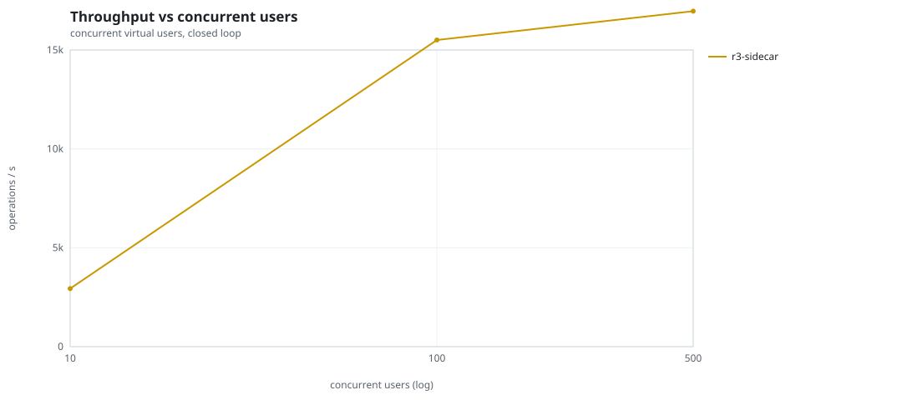
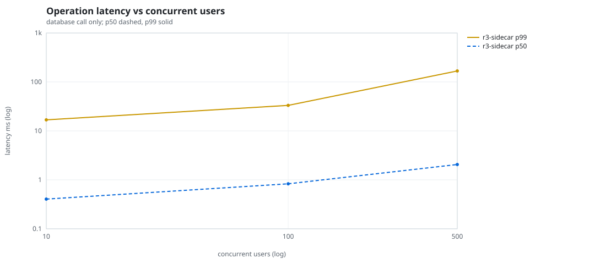
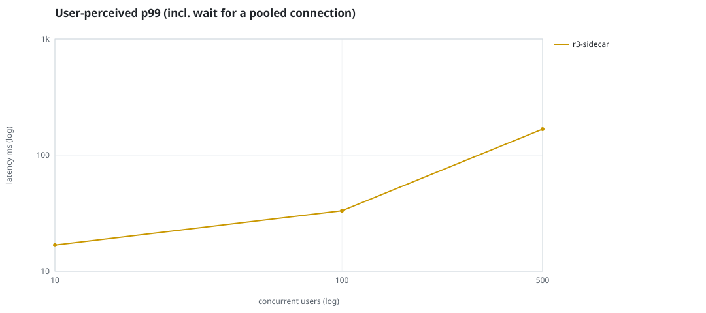
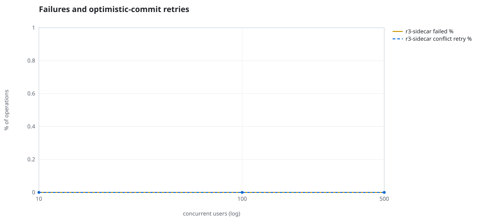
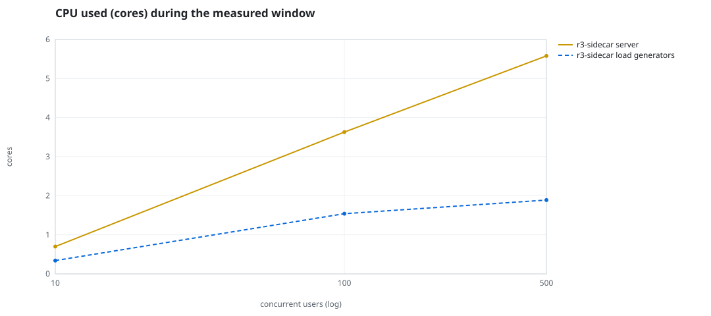
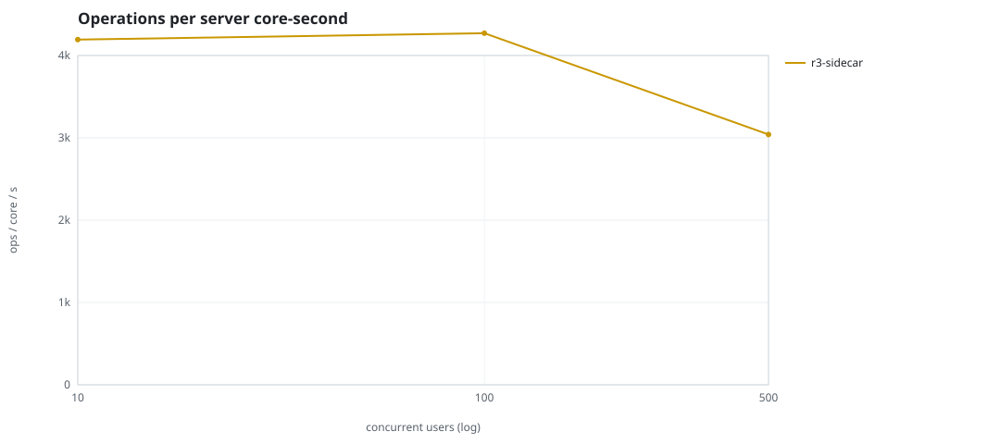
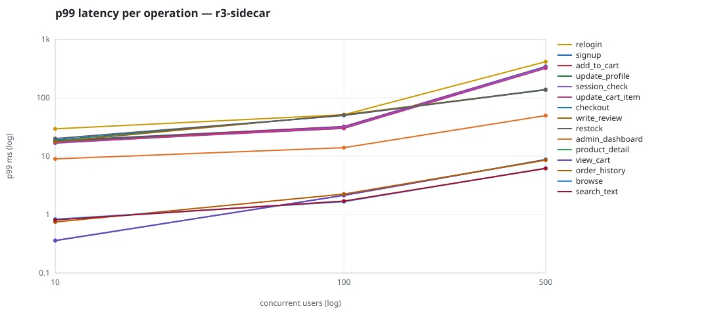

# Mini-SaaS concurrency simulation — sidecar

Run: `r3-sidecar` on 2026-09-26T07:04:55 · commit `3de0ce4` · macOS-26.6.2-arm64-arm-64bit-Mach-O · 10 CPUs

## Configuration

- **transport**: sidecar
- **levels**: [10, 100, 500]
- **duration**: 30.0
- **warmup**: 5.0
- **ramp**: 5.0
- **think**: [0.0, 0.0]
- **processes**: 10
- **connections**: 0
- **durability**: safe
- **products**: 5000
- **accounts**: 20000
- **scenario**: baseline
- **seed**: 3
- **fresh_per_stage**: False
- **seed time**: 1.13 s, 12.9 MiB after seeding

## Capacity and performance curve

Latencies are of the database call (service operation) in milliseconds; `user p99` adds the wait for a pooled connection.

| users | conns | ops/s | reads/s | writes/s | p50 | p95 | p99 | p99.9 | max | user p99 | success % | conflict retry % | srv CPU | srv RSS MiB | gen CPU | thr CV | invariants |
|---:|---:|---:|---:|---:|---:|---:|---:|---:|---:|---:|---:|---:|---:|---:|---:|---:|---:|
| 10 | 10 | 2935.5 | 2222.3 | 713.2 | 0.404 | 12.583 | 16.816 | 26.818 | 4758.959 | 16.817 | 100.0 | 0.0 | 0.7 | 74.4 | 0.34 | 0.192 | ok |
| 100 | 100 | 15503.7 | 11692.9 | 3810.8 | 0.83 | 22.253 | 33.2 | 109.024 | 2471.669 | 33.201 | 100.0 | 0.0 | 3.63 | 346.0 | 1.54 | 0.251 | ok |
| 500 | 500 | 16962.7 | 12817.1 | 4145.5 | 2.06 | 96.714 | 167.802 | 361.615 | 2642.642 | 167.803 | 100.0 | 0.0 | 5.58 | 466.9 | 1.89 | 0.124 | ok |

## Insights

- **Peak throughput**: 16962.7 ops/s at 500 users (p99 167.802 ms).
- **Capacity at p99 ≤ 10 ms**: 0 users (DB latency); 0 users counting pool wait.
- **Capacity at p99 ≤ 50 ms**: 100 users (DB latency); 100 users counting pool wait.
- **Capacity at p99 ≤ 100 ms**: 100 users (DB latency); 100 users counting pool wait.
- **Capacity at p99 ≤ 250 ms**: 500 users (DB latency); 500 users counting pool wait.
- **Capacity at p99 ≤ 1000 ms**: 500 users (DB latency); 500 users counting pool wait.
- **USL fit**: σ (contention) = 0.01, κ (coherency) = 2.00e-05, predicted peak at N ≈ 222.7 (rmse log 0.0668).
- **Ops per server core-second**: 10→4194, 100→4271, 500→3040.
- **Seconds with zero completed operations** (stalls): [(100, 1)].
- **Read-your-writes violations**: none.
- **Business invariants**: all stages ok.
- **Offline integrity check** (elitesql check): ok in 21.19 s.
  - right after killing the server (no clean close): exit 3, 0 errors, 712128 warnings; after one clean open/close: exit 0, 0 errors, 0 warnings.
- **Database size**: 30.1 MiB after the first stage, 192.0 MiB after the last; 43212 paid orders in total.

## p99 latency per operation (ms)

| op | share % | 10 | 100 | 500 |
|---|---:|---:|---:|---:|
| add_to_cart | 10.85 | 17.92 | 32.06 | 342.21 |
| admin_dashboard | 1.08 | 8.98 | 13.99 | 49.65 |
| browse | 22.09 | 0.84 | 1.66 | 6.25 |
| checkout | 4.35 | 18.88 | 50.35 | 138.47 |
| order_history | 3.34 | 0.75 | 2.25 | 8.56 |
| product_detail | 18.63 | 0.36 | 2.14 | 8.79 |
| relogin | 1.64 | 29.39 | 51.32 | 415.42 |
| restock | 0.32 | 20.07 | 49.81 | 136.81 |
| search_text | 8.54 | 0.81 | 1.70 | 6.17 |
| session_check | 13.12 | 16.75 | 31.28 | 336.06 |
| signup | 0.57 | 18.41 | 32.18 | 342.49 |
| update_cart_item | 3.25 | 17.16 | 30.05 | 319.32 |
| update_profile | 1.11 | 17.76 | 30.05 | 340.79 |
| view_cart | 8.89 | 0.36 | 2.14 | 8.72 |
| write_review | 2.21 | 17.73 | 51.49 | 137.03 |

## Errors and business outcomes at the highest level

```json
{
 "statuses": {
  "ok": 502054,
  "empty_cart": 6651,
  "out_of_stock": 140,
  "not_found": 35
 },
 "errors": {}
}
```

## Charts








