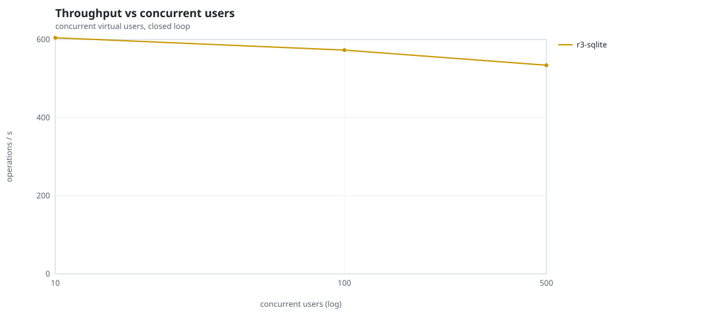
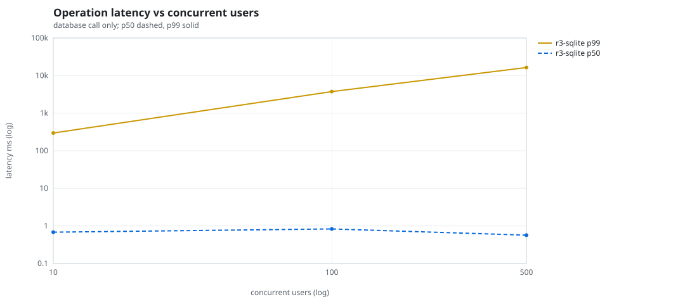
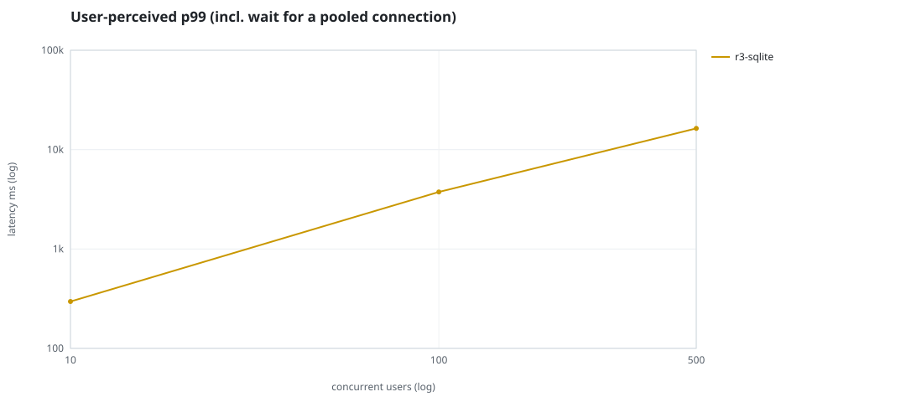
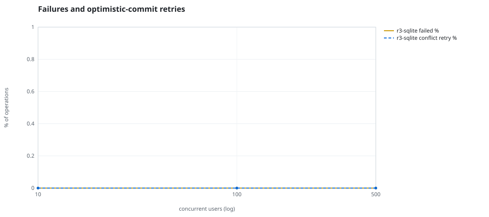
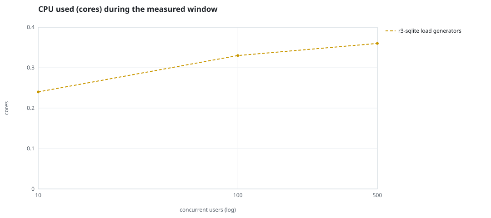
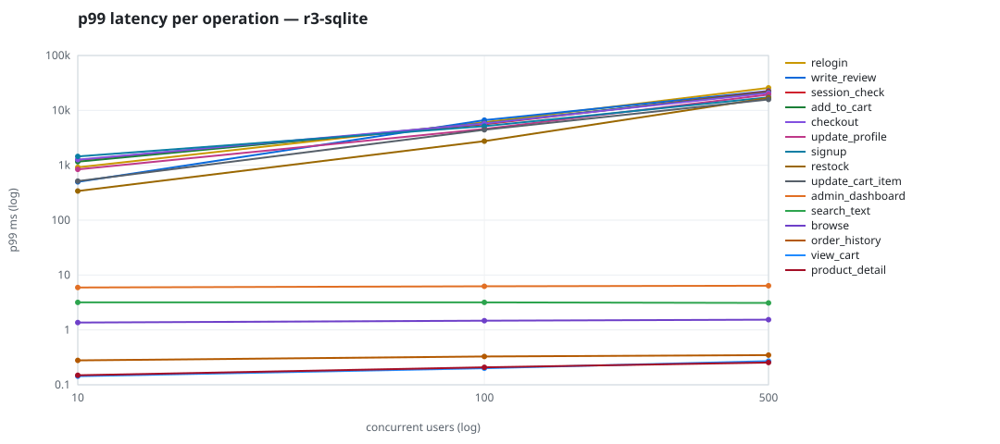

# Mini-SaaS concurrency simulation — sqlite

Run: `r3-sqlite` on 2026-09-26T07:07:42 · commit `3de0ce4` · macOS-26.6.2-arm64-arm-64bit-Mach-O · 10 CPUs

## Configuration

- **transport**: sqlite
- **levels**: [10, 100, 500]
- **duration**: 30.0
- **warmup**: 5.0
- **ramp**: 5.0
- **think**: [0.0, 0.0]
- **processes**: 10
- **connections**: 0
- **durability**: safe
- **products**: 5000
- **accounts**: 20000
- **scenario**: baseline
- **seed**: 3
- **fresh_per_stage**: False
- **seed time**: 0.18 s, 4.6 MiB after seeding

## Capacity and performance curve

Latencies are of the database call (service operation) in milliseconds; `user p99` adds the wait for a pooled connection.

| users | conns | ops/s | reads/s | writes/s | p50 | p95 | p99 | p99.9 | max | user p99 | success % | conflict retry % | srv CPU | srv RSS MiB | gen CPU | thr CV | invariants |
|---:|---:|---:|---:|---:|---:|---:|---:|---:|---:|---:|---:|---:|---:|---:|---:|---:|---:|
| 10 | 10 | 604.3 | 455.7 | 148.5 | 0.681 | 15.507 | 296.469 | 2504.751 | 4889.035 | 296.471 | 100.0 | 0.0 | None | None | 0.24 | 0.129 | ok |
| 100 | 100 | 572.9 | 437.4 | 135.5 | 0.828 | 1049.184 | 3754.072 | 7970.715 | 14485.012 | 3754.075 | 100.0 | 0.0 | None | None | 0.33 | 0.236 | ok |
| 500 | 500 | 534.1 | 405.5 | 128.6 | 0.567 | 5596.03 | 16374.735 | 26041.681 | 31544.969 | 16374.738 | 100.0 | 0.0 | None | None | 0.36 | 0.264 | ok |

## Insights

- **Peak throughput**: 604.3 ops/s at 10 users (p99 296.469 ms).
- **Capacity at p99 ≤ 10 ms**: 0 users (DB latency); 0 users counting pool wait.
- **Capacity at p99 ≤ 50 ms**: 0 users (DB latency); 0 users counting pool wait.
- **Capacity at p99 ≤ 100 ms**: 0 users (DB latency); 0 users counting pool wait.
- **Capacity at p99 ≤ 250 ms**: 0 users (DB latency); 0 users counting pool wait.
- **Capacity at p99 ≤ 1000 ms**: 10 users (DB latency); 10 users counting pool wait.
- **USL fit**: σ (contention) = 0.26, κ (coherency) = 1.58e-04, predicted peak at N ≈ 68.3 (rmse log 0.0911).
- **Generator CPU includes the database**: SQLite runs inside the load-generator processes, so `gen CPU` is application plus engine and there is no server column.
- **Read-your-writes violations**: none.
- **Business invariants**: all stages ok.
- **Offline integrity check** (PRAGMA integrity_check): ok in 0.01 s.
- **Database size**: 4.8 MiB after the first stage, 5.4 MiB after the last; 1923 paid orders in total.

## p99 latency per operation (ms)

| op | share % | 10 | 100 | 500 |
|---|---:|---:|---:|---:|
| add_to_cart | 10.88 | 1159.84 | 5821.56 | 21357.78 |
| admin_dashboard | 1.05 | 5.94 | 6.23 | 6.38 |
| browse | 22.23 | 1.36 | 1.47 | 1.54 |
| checkout | 4.32 | 1265.08 | 5771.11 | 20789.56 |
| order_history | 3.15 | 0.28 | 0.33 | 0.35 |
| product_detail | 18.57 | 0.15 | 0.21 | 0.26 |
| relogin | 1.71 | 916.97 | 6096.87 | 25737.83 |
| restock | 0.28 | 339.54 | 2747.07 | 16895.93 |
| search_text | 8.31 | 3.18 | 3.18 | 3.10 |
| session_check | 13.11 | 1243.58 | 5575.63 | 22168.02 |
| signup | 0.61 | 1448.72 | 5157.89 | 17273.32 |
| update_cart_item | 3.25 | 514.36 | 4430.06 | 15858.55 |
| update_profile | 1.15 | 842.31 | 4593.84 | 19365.20 |
| view_cart | 9.01 | 0.14 | 0.20 | 0.27 |
| write_review | 2.38 | 497.93 | 6630.89 | 22627.54 |

## Errors and business outcomes at the highest level

```json
{
 "statuses": {
  "ok": 15792,
  "empty_cart": 229,
  "not_found": 2
 },
 "errors": {}
}
```

## Charts








