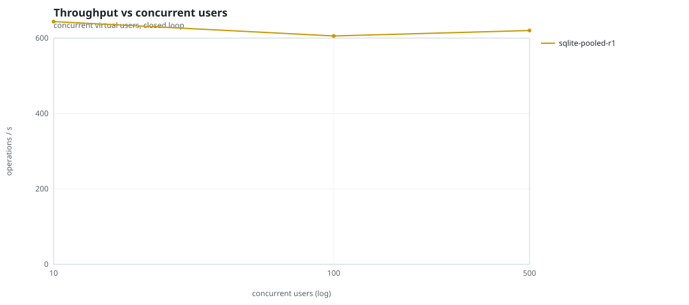
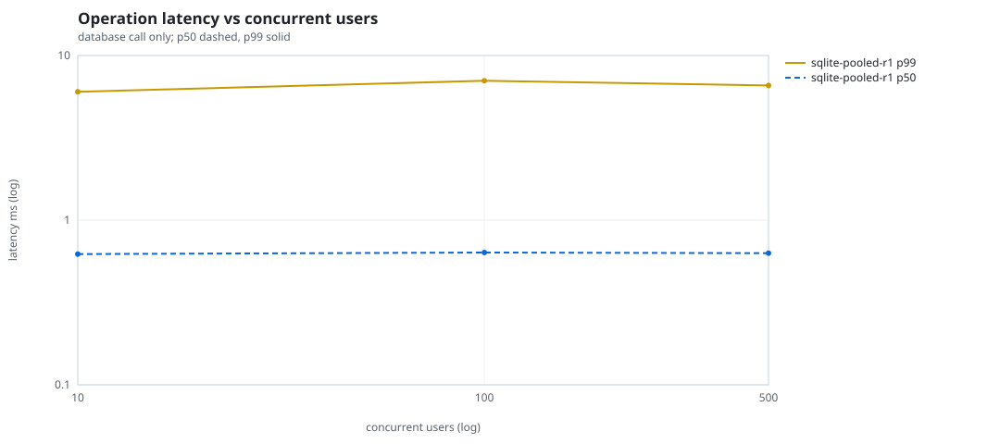
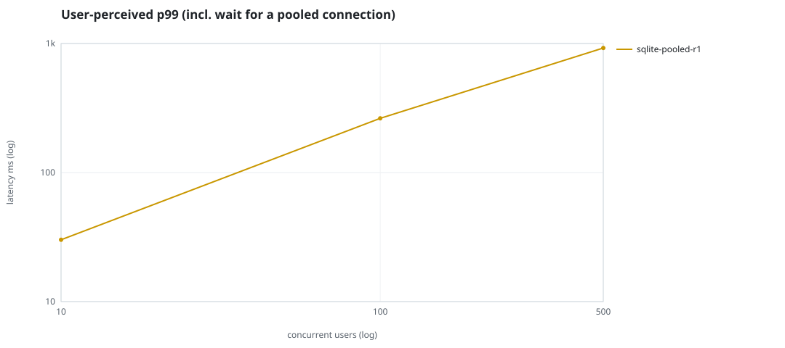
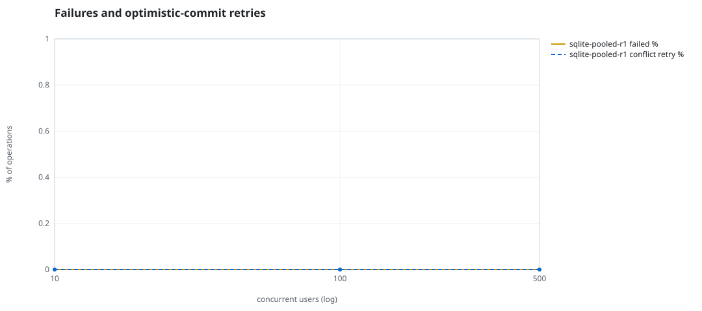
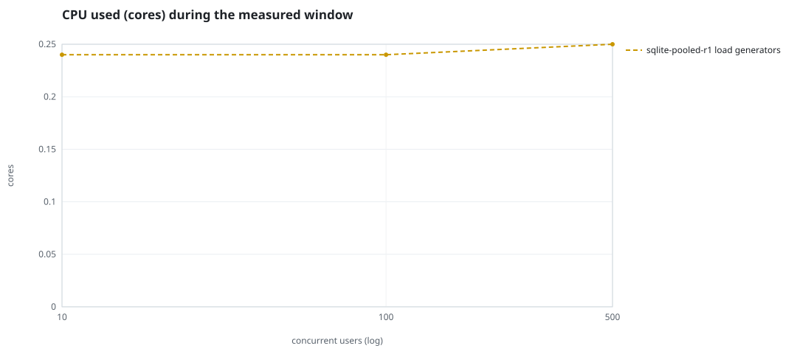
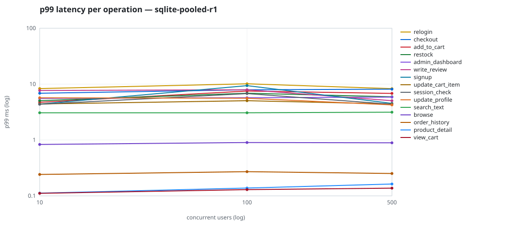

# Mini-SaaS concurrency simulation — sqlite

Run: `sqlite-pooled-r1` on 2026-09-26T07:10:16 · commit `3de0ce4` · macOS-26.6.2-arm64-arm-64bit-Mach-O · 10 CPUs

## Configuration

- **transport**: sqlite
- **levels**: [10, 100, 500]
- **duration**: 30.0
- **warmup**: 5.0
- **ramp**: 5.0
- **think**: [0.0, 0.0]
- **processes**: 1
- **connections**: 1
- **durability**: safe
- **products**: 5000
- **accounts**: 20000
- **scenario**: baseline
- **seed**: 1
- **fresh_per_stage**: False
- **seed time**: None s, 0.0 MiB after seeding

## Capacity and performance curve

Latencies are of the database call (service operation) in milliseconds; `user p99` adds the wait for a pooled connection.

| users | conns | ops/s | reads/s | writes/s | p50 | p95 | p99 | p99.9 | max | user p99 | success % | conflict retry % | srv CPU | srv RSS MiB | gen CPU | thr CV | invariants |
|---:|---:|---:|---:|---:|---:|---:|---:|---:|---:|---:|---:|---:|---:|---:|---:|---:|---:|
| 10 | 1 | 643.9 | 486.5 | 157.5 | 0.622 | 4.096 | 6.019 | 8.903 | 10.331 | 30.144 | 100.0 | 0.0 | None | None | 0.24 | 0.098 | ok |
| 100 | 1 | 605.8 | 458.9 | 146.8 | 0.636 | 4.21 | 7.026 | 9.887 | 30.078 | 263.198 | 100.0 | 0.0 | None | None | 0.24 | 0.089 | ok |
| 500 | 1 | 620.2 | 468.3 | 151.9 | 0.63 | 4.132 | 6.58 | 9.696 | 11.703 | 923.192 | 100.0 | 0.0 | None | None | 0.25 | 0.065 | ok |

## Insights

- **Peak throughput**: 643.9 ops/s at 10 users (p99 6.019 ms).
- **Capacity at p99 ≤ 10 ms**: 500 users (DB latency); 0 users counting pool wait.
- **Capacity at p99 ≤ 50 ms**: 500 users (DB latency); 10 users counting pool wait.
- **Capacity at p99 ≤ 100 ms**: 500 users (DB latency); 10 users counting pool wait.
- **Capacity at p99 ≤ 250 ms**: 500 users (DB latency); 10 users counting pool wait.
- **Capacity at p99 ≤ 1000 ms**: 500 users (DB latency); 500 users counting pool wait.
- **USL fit**: σ (contention) = 0.27, κ (coherency) = 1.00e-04, predicted peak at N ≈ 85.4 (rmse log 0.1009).
- **Generator CPU includes the database**: SQLite runs inside the load-generator processes, so `gen CPU` is application plus engine and there is no server column.
- **Read-your-writes violations**: none.
- **Business invariants**: all stages ok.
- **Offline integrity check** (PRAGMA integrity_check): ok in 0.01 s.
- **Database size**: 4.9 MiB after the first stage, 5.5 MiB after the last; 2192 paid orders in total.

## p99 latency per operation (ms)

| op | share % | 10 | 100 | 500 |
|---|---:|---:|---:|---:|
| add_to_cart | 10.86 | 4.74 | 7.51 | 6.82 |
| admin_dashboard | 1.02 | 5.55 | 5.72 | 5.85 |
| browse | 22.17 | 0.83 | 0.90 | 0.89 |
| checkout | 4.35 | 6.87 | 7.92 | 8.12 |
| order_history | 3.25 | 0.24 | 0.27 | 0.25 |
| product_detail | 18.72 | 0.11 | 0.14 | 0.16 |
| relogin | 1.56 | 8.33 | 10.14 | 8.30 |
| restock | 0.33 | 5.05 | 6.87 | 5.92 |
| search_text | 8.69 | 3.07 | 3.07 | 3.14 |
| session_check | 13.01 | 4.37 | 6.76 | 4.36 |
| signup | 0.55 | 4.40 | 9.39 | 4.52 |
| update_cart_item | 3.42 | 4.42 | 5.04 | 4.41 |
| update_profile | 1.15 | 5.70 | 5.58 | 4.25 |
| view_cart | 8.68 | 0.11 | 0.13 | 0.14 |
| write_review | 2.23 | 7.69 | 7.92 | 5.05 |

## Errors and business outcomes at the highest level

```json
{
 "statuses": {
  "ok": 18350,
  "empty_cart": 256,
  "not_found": 1
 },
 "errors": {}
}
```

## Charts








