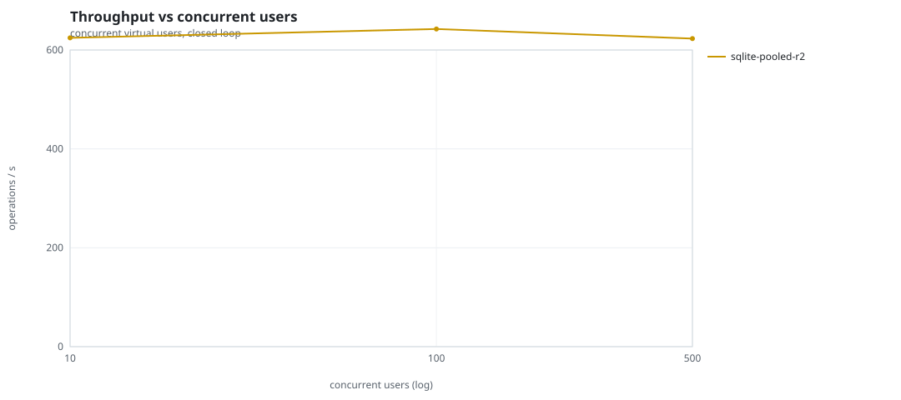
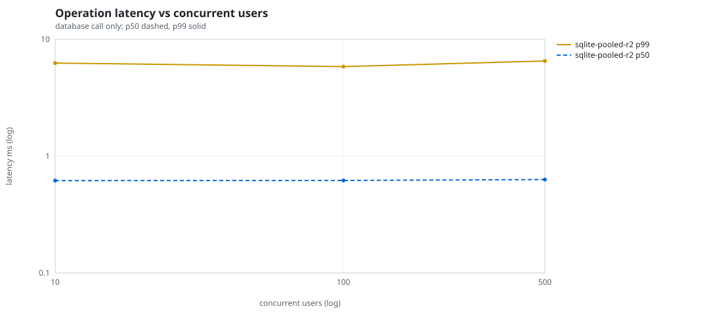
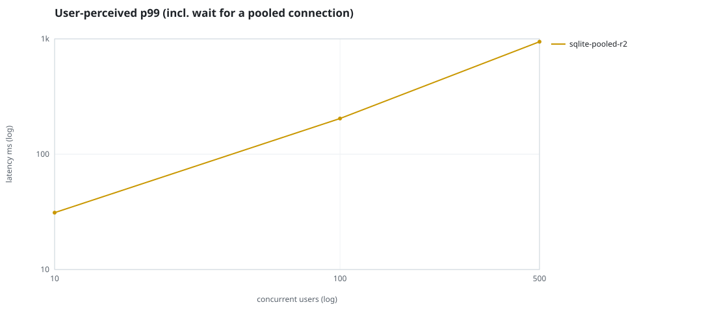
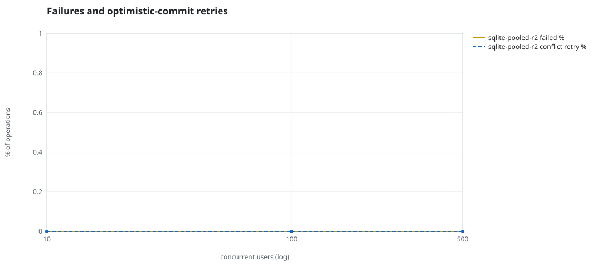
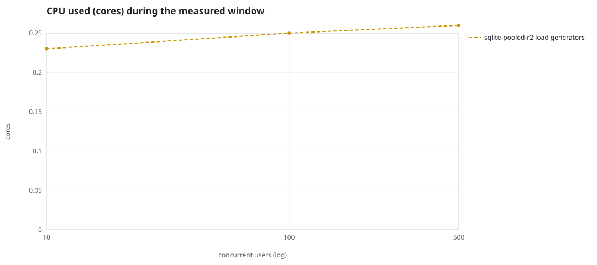
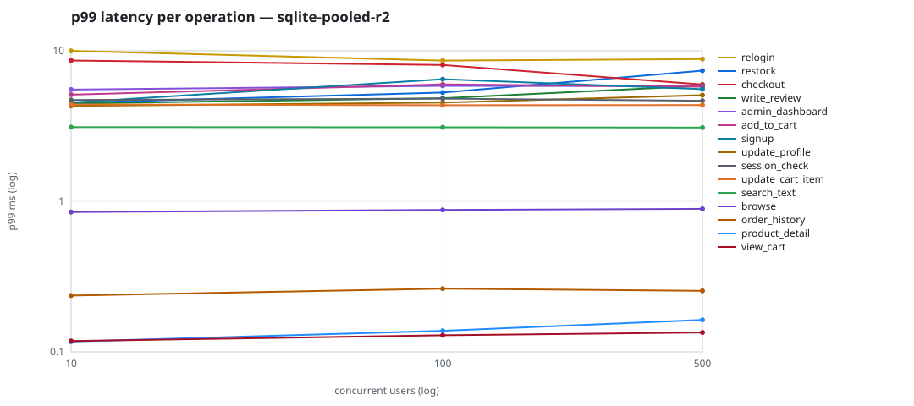

# Mini-SaaS concurrency simulation — sqlite

Run: `sqlite-pooled-r2` on 2026-09-26T07:12:23 · commit `3de0ce4` · macOS-26.6.2-arm64-arm-64bit-Mach-O · 10 CPUs

## Configuration

- **transport**: sqlite
- **levels**: [10, 100, 500]
- **duration**: 30.0
- **warmup**: 5.0
- **ramp**: 5.0
- **think**: [0.0, 0.0]
- **processes**: 1
- **connections**: 1
- **durability**: safe
- **products**: 5000
- **accounts**: 20000
- **scenario**: baseline
- **seed**: 2
- **fresh_per_stage**: False
- **seed time**: None s, 0.0 MiB after seeding

## Capacity and performance curve

Latencies are of the database call (service operation) in milliseconds; `user p99` adds the wait for a pooled connection.

| users | conns | ops/s | reads/s | writes/s | p50 | p95 | p99 | p99.9 | max | user p99 | success % | conflict retry % | srv CPU | srv RSS MiB | gen CPU | thr CV | invariants |
|---:|---:|---:|---:|---:|---:|---:|---:|---:|---:|---:|---:|---:|---:|---:|---:|---:|---:|
| 10 | 1 | 624.6 | 472.8 | 151.8 | 0.618 | 4.157 | 6.269 | 9.667 | 15.977 | 31.155 | 100.0 | 0.0 | None | None | 0.23 | 0.047 | ok |
| 100 | 1 | 642.4 | 485.0 | 157.4 | 0.62 | 4.104 | 5.843 | 8.669 | 13.92 | 203.938 | 100.0 | 0.0 | None | None | 0.25 | 0.077 | ok |
| 500 | 1 | 623.1 | 468.8 | 154.3 | 0.631 | 4.138 | 6.537 | 9.173 | 13.886 | 945.028 | 100.0 | 0.0 | None | None | 0.26 | 0.092 | ok |

## Insights

- **Peak throughput**: 642.4 ops/s at 100 users (p99 5.843 ms).
- **Capacity at p99 ≤ 10 ms**: 500 users (DB latency); 0 users counting pool wait.
- **Capacity at p99 ≤ 50 ms**: 500 users (DB latency); 10 users counting pool wait.
- **Capacity at p99 ≤ 100 ms**: 500 users (DB latency); 10 users counting pool wait.
- **Capacity at p99 ≤ 250 ms**: 500 users (DB latency); 100 users counting pool wait.
- **Capacity at p99 ≤ 1000 ms**: 500 users (DB latency); 500 users counting pool wait.
- **USL fit**: σ (contention) = 0.25, κ (coherency) = 1.00e-04, predicted peak at N ≈ 86.6 (rmse log 0.0693).
- **Generator CPU includes the database**: SQLite runs inside the load-generator processes, so `gen CPU` is application plus engine and there is no server column.
- **Read-your-writes violations**: none.
- **Business invariants**: all stages ok.
- **Offline integrity check** (PRAGMA integrity_check): ok in 0.01 s.
- **Database size**: 4.8 MiB after the first stage, 5.5 MiB after the last; 2217 paid orders in total.

## p99 latency per operation (ms)

| op | share % | 10 | 100 | 500 |
|---|---:|---:|---:|---:|
| add_to_cart | 10.82 | 5.11 | 5.99 | 5.77 |
| admin_dashboard | 1.08 | 5.53 | 5.84 | 5.81 |
| browse | 22.35 | 0.85 | 0.88 | 0.89 |
| checkout | 4.58 | 8.62 | 8.04 | 5.97 |
| order_history | 2.99 | 0.24 | 0.26 | 0.25 |
| product_detail | 18.93 | 0.12 | 0.14 | 0.16 |
| relogin | 1.59 | 9.99 | 8.60 | 8.81 |
| restock | 0.33 | 4.51 | 5.28 | 7.38 |
| search_text | 8.63 | 3.11 | 3.10 | 3.09 |
| session_check | 12.96 | 4.71 | 4.81 | 4.65 |
| signup | 0.53 | 4.53 | 6.47 | 5.56 |
| update_cart_item | 3.16 | 4.40 | 4.35 | 4.36 |
| update_profile | 1.09 | 4.30 | 4.53 | 5.07 |
| view_cart | 8.75 | 0.12 | 0.13 | 0.13 |
| write_review | 2.21 | 4.46 | 4.84 | 5.86 |

## Errors and business outcomes at the highest level

```json
{
 "statuses": {
  "ok": 18413,
  "empty_cart": 278,
  "not_found": 1
 },
 "errors": {}
}
```

## Charts








