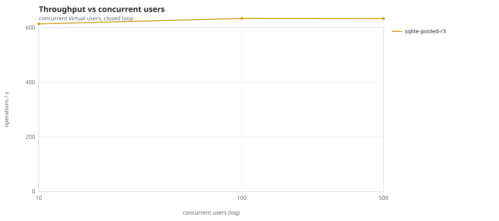
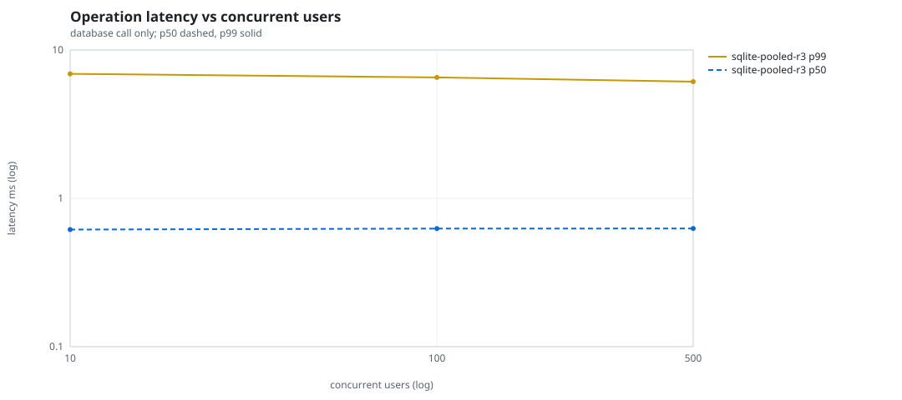
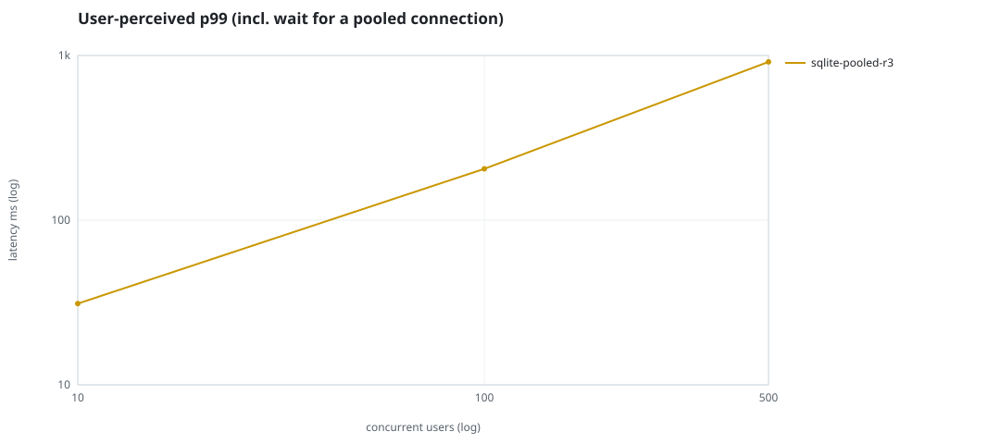
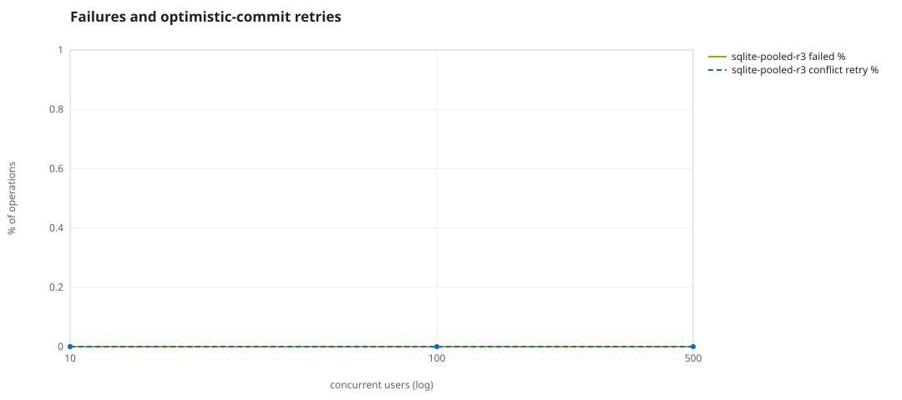
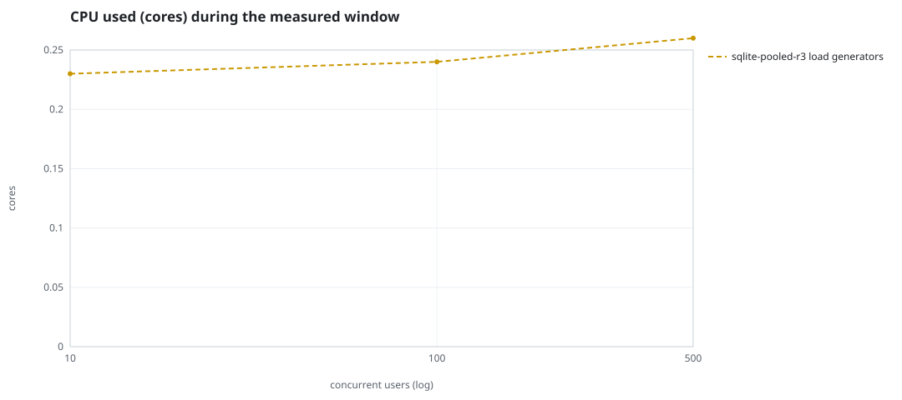
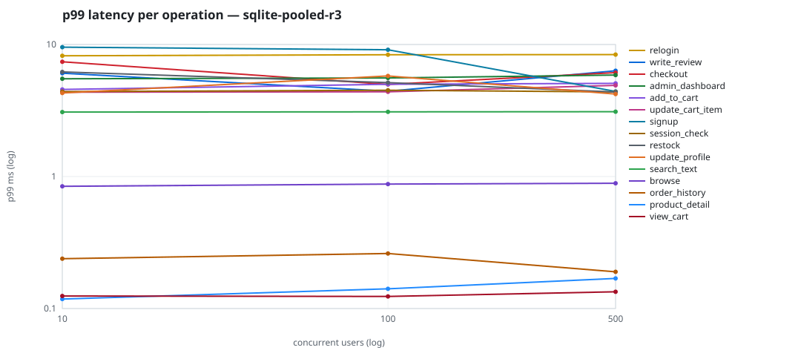

# Mini-SaaS concurrency simulation — sqlite

Run: `sqlite-pooled-r3` on 2026-09-26T07:14:30 · commit `3de0ce4` · macOS-26.6.2-arm64-arm-64bit-Mach-O · 10 CPUs

## Configuration

- **transport**: sqlite
- **levels**: [10, 100, 500]
- **duration**: 30.0
- **warmup**: 5.0
- **ramp**: 5.0
- **think**: [0.0, 0.0]
- **processes**: 1
- **connections**: 1
- **durability**: safe
- **products**: 5000
- **accounts**: 20000
- **scenario**: baseline
- **seed**: 3
- **fresh_per_stage**: False
- **seed time**: None s, 0.0 MiB after seeding

## Capacity and performance curve

Latencies are of the database call (service operation) in milliseconds; `user p99` adds the wait for a pooled connection.

| users | conns | ops/s | reads/s | writes/s | p50 | p95 | p99 | p99.9 | max | user p99 | success % | conflict retry % | srv CPU | srv RSS MiB | gen CPU | thr CV | invariants |
|---:|---:|---:|---:|---:|---:|---:|---:|---:|---:|---:|---:|---:|---:|---:|---:|---:|---:|
| 10 | 1 | 613.7 | 463.3 | 150.5 | 0.616 | 4.145 | 6.905 | 8.728 | 11.827 | 31.132 | 100.0 | 0.0 | None | None | 0.23 | 0.052 | ok |
| 100 | 1 | 633.7 | 484.1 | 149.5 | 0.625 | 4.116 | 6.531 | 8.37 | 16.113 | 205.132 | 100.0 | 0.0 | None | None | 0.24 | 0.053 | ok |
| 500 | 1 | 633.4 | 481.9 | 151.5 | 0.626 | 4.117 | 6.118 | 9.109 | 11.946 | 914.313 | 100.0 | 0.0 | None | None | 0.26 | 0.077 | ok |

## Insights

- **Peak throughput**: 633.7 ops/s at 100 users (p99 6.531 ms).
- **Capacity at p99 ≤ 10 ms**: 500 users (DB latency); 0 users counting pool wait.
- **Capacity at p99 ≤ 50 ms**: 500 users (DB latency); 10 users counting pool wait.
- **Capacity at p99 ≤ 100 ms**: 500 users (DB latency); 10 users counting pool wait.
- **Capacity at p99 ≤ 250 ms**: 500 users (DB latency); 100 users counting pool wait.
- **Capacity at p99 ≤ 1000 ms**: 500 users (DB latency); 500 users counting pool wait.
- **USL fit**: σ (contention) = 0.25, κ (coherency) = 7.94e-05, predicted peak at N ≈ 97.2 (rmse log 0.0707).
- **Generator CPU includes the database**: SQLite runs inside the load-generator processes, so `gen CPU` is application plus engine and there is no server column.
- **Read-your-writes violations**: none.
- **Business invariants**: all stages ok.
- **Offline integrity check** (PRAGMA integrity_check): ok in 0.01 s.
- **Database size**: 4.8 MiB after the first stage, 5.5 MiB after the last; 2102 paid orders in total.

## p99 latency per operation (ms)

| op | share % | 10 | 100 | 500 |
|---|---:|---:|---:|---:|
| add_to_cart | 11.08 | 4.56 | 5.00 | 5.08 |
| admin_dashboard | 0.98 | 5.50 | 5.58 | 5.87 |
| browse | 22.04 | 0.84 | 0.88 | 0.89 |
| checkout | 4.14 | 7.40 | 4.99 | 6.13 |
| order_history | 3.12 | 0.24 | 0.26 | 0.19 |
| product_detail | 18.65 | 0.12 | 0.14 | 0.17 |
| relogin | 1.72 | 8.22 | 8.36 | 8.39 |
| restock | 0.27 | 6.20 | 5.15 | 4.36 |
| search_text | 8.52 | 3.08 | 3.09 | 3.10 |
| session_check | 13.2 | 4.40 | 4.50 | 4.38 |
| signup | 0.59 | 9.55 | 9.12 | 4.41 |
| update_cart_item | 3.18 | 4.35 | 4.38 | 4.90 |
| update_profile | 1.14 | 4.29 | 5.78 | 4.22 |
| view_cart | 8.98 | 0.12 | 0.12 | 0.13 |
| write_review | 2.41 | 6.06 | 4.43 | 6.32 |

## Errors and business outcomes at the highest level

```json
{
 "statuses": {
  "ok": 18730,
  "empty_cart": 272
 },
 "errors": {}
}
```

## Charts








