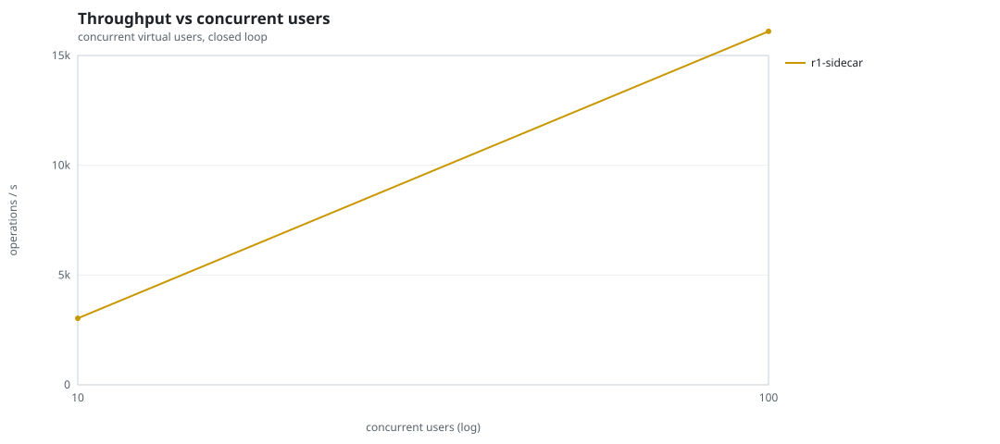
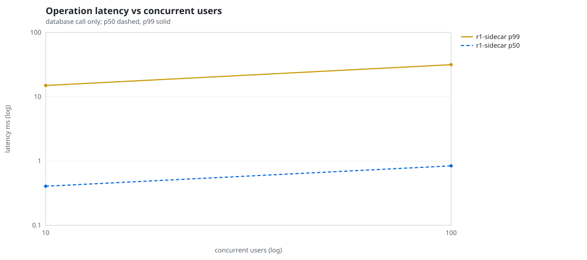
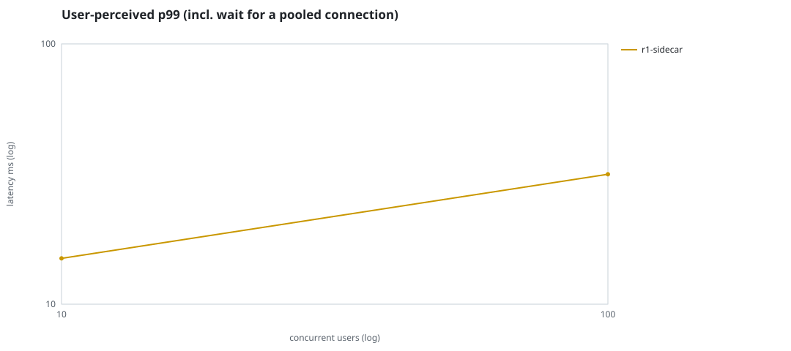
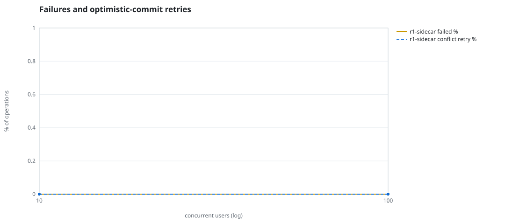
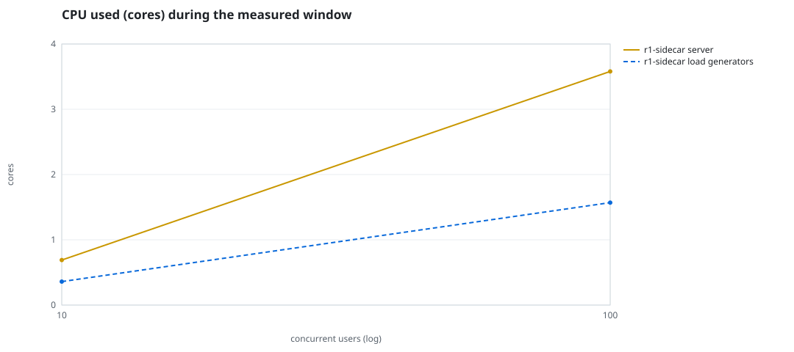
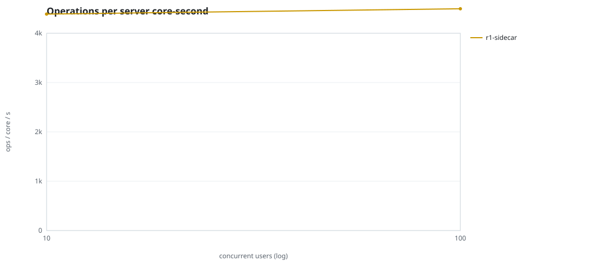
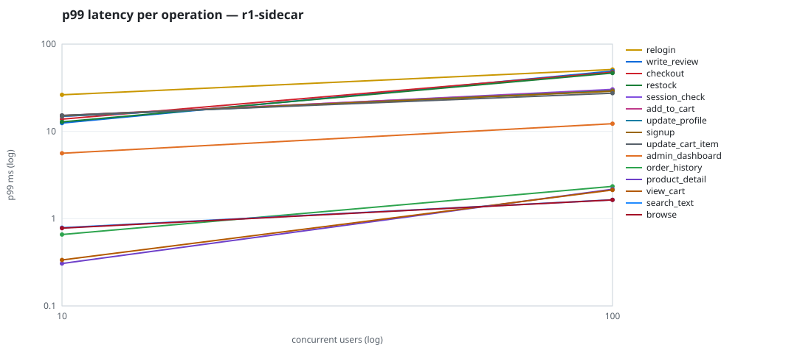

# Mini-SaaS concurrency simulation — sidecar

Run: `r1-sidecar` on 2026-09-26T06:50:14 · commit `3de0ce4` · macOS-26.6.2-arm64-arm-64bit-Mach-O · 10 CPUs

## Configuration

- **transport**: sidecar
- **levels**: [10, 100]
- **duration**: 15.0
- **warmup**: 5.0
- **ramp**: 5.0
- **think**: [0.0, 0.0]
- **processes**: 10
- **connections**: 0
- **durability**: safe
- **products**: 5000
- **accounts**: 20000
- **scenario**: baseline
- **seed**: 1
- **fresh_per_stage**: False
- **seed time**: 1.12 s, 12.9 MiB after seeding

## Capacity and performance curve

Latencies are of the database call (service operation) in milliseconds; `user p99` adds the wait for a pooled connection.

| users | conns | ops/s | reads/s | writes/s | p50 | p95 | p99 | p99.9 | max | user p99 | success % | conflict retry % | srv CPU | srv RSS MiB | gen CPU | thr CV | invariants |
|---:|---:|---:|---:|---:|---:|---:|---:|---:|---:|---:|---:|---:|---:|---:|---:|---:|---:|
| 10 | 10 | 3028.1 | 2280.3 | 747.8 | 0.406 | 11.779 | 14.998 | 22.58 | 28.832 | 14.999 | 100.0 | 0.0 | 0.69 | 49.1 | 0.36 | 0.045 | ok |
| 100 | 100 | 16098.2 | 12176.1 | 3922.1 | 0.842 | 20.712 | 31.556 | 196.547 | 1747.752 | 31.557 | 100.0 | 0.0 | 3.58 | 187.6 | 1.57 | 0.19 | ok |

## Insights

- **Peak throughput**: 16098.2 ops/s at 100 users (p99 31.556 ms).
- **Capacity at p99 ≤ 10 ms**: 0 users (DB latency); 0 users counting pool wait.
- **Capacity at p99 ≤ 50 ms**: 100 users (DB latency); 100 users counting pool wait.
- **Capacity at p99 ≤ 100 ms**: 100 users (DB latency); 100 users counting pool wait.
- **Capacity at p99 ≤ 250 ms**: 100 users (DB latency); 100 users counting pool wait.
- **Capacity at p99 ≤ 1000 ms**: 100 users (DB latency); 100 users counting pool wait.
- **Ops per server core-second**: 10→4389, 100→4497.
- **Read-your-writes violations**: none.
- **Business invariants**: all stages ok.
- **Offline integrity check** (elitesql check): ok in 9.14 s.
  - right after killing the server (no clean close): exit 3, 0 errors, 261694 warnings; after one clean open/close: exit 0, 0 errors, 0 warnings.
- **Database size**: 22.4 MiB after the first stage, 81.6 MiB after the last; 13665 paid orders in total.

## p99 latency per operation (ms)

| op | share % | 10 | 100 |
|---|---:|---:|---:|
| add_to_cart | 10.91 | 15.19 | 29.69 |
| admin_dashboard | 1.11 | 5.61 | 12.24 |
| browse | 21.79 | 0.78 | 1.64 |
| checkout | 4.44 | 13.83 | 47.62 |
| order_history | 3.33 | 0.66 | 2.35 |
| product_detail | 18.4 | 0.31 | 2.17 |
| relogin | 1.7 | 26.25 | 51.18 |
| restock | 0.35 | 12.87 | 46.62 |
| search_text | 8.71 | 0.79 | 1.65 |
| session_check | 13.04 | 14.87 | 30.34 |
| signup | 0.56 | 15.13 | 28.90 |
| update_cart_item | 3.28 | 15.25 | 27.39 |
| update_profile | 1.15 | 14.93 | 29.20 |
| view_cart | 8.92 | 0.34 | 2.13 |
| write_review | 2.31 | 12.47 | 49.19 |

## Errors and business outcomes at the highest level

```json
{
 "statuses": {
  "ok": 238295,
  "empty_cart": 3157,
  "not_found": 21
 },
 "errors": {}
}
```

## Charts








