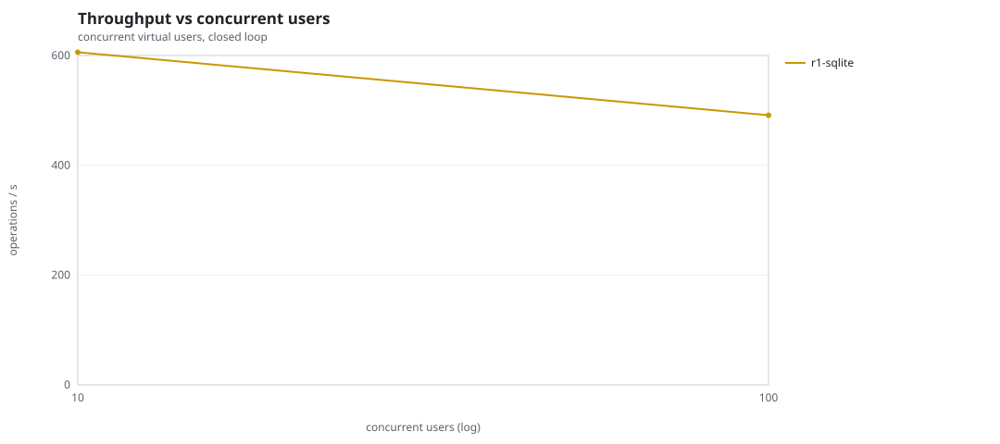
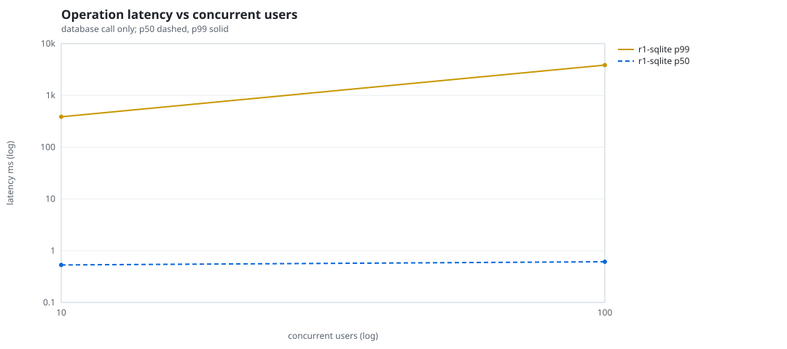
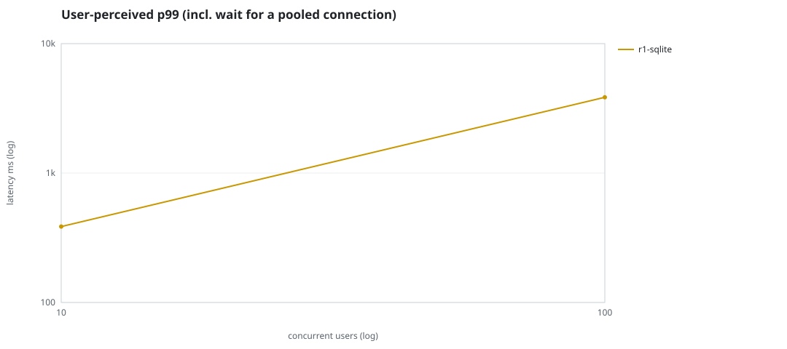
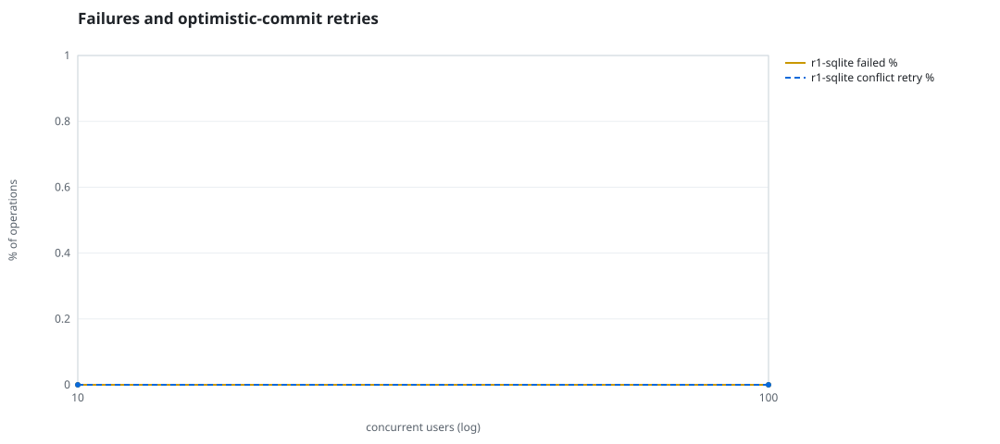
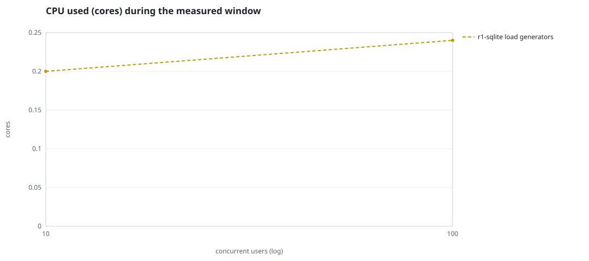
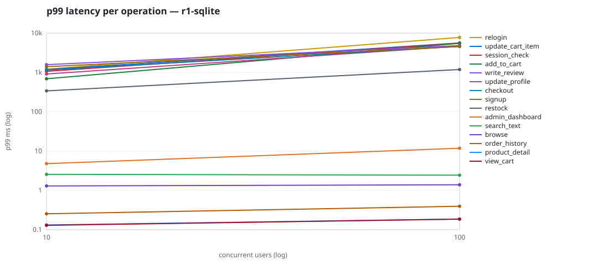

# Mini-SaaS concurrency simulation — sqlite

Run: `r1-sqlite` on 2026-09-26T06:51:30 · commit `3de0ce4` · macOS-26.6.2-arm64-arm-64bit-Mach-O · 10 CPUs

## Configuration

- **transport**: sqlite
- **levels**: [10, 100]
- **duration**: 15.0
- **warmup**: 5.0
- **ramp**: 5.0
- **think**: [0.0, 0.0]
- **processes**: 10
- **connections**: 0
- **durability**: safe
- **products**: 5000
- **accounts**: 20000
- **scenario**: baseline
- **seed**: 1
- **fresh_per_stage**: False
- **seed time**: 0.19 s, 4.6 MiB after seeding

## Capacity and performance curve

Latencies are of the database call (service operation) in milliseconds; `user p99` adds the wait for a pooled connection.

| users | conns | ops/s | reads/s | writes/s | p50 | p95 | p99 | p99.9 | max | user p99 | success % | conflict retry % | srv CPU | srv RSS MiB | gen CPU | thr CV | invariants |
|---:|---:|---:|---:|---:|---:|---:|---:|---:|---:|---:|---:|---:|---:|---:|---:|---:|---:|
| 10 | 10 | 605.9 | 451.5 | 154.5 | 0.53 | 9.937 | 386.05 | 2246.104 | 4965.613 | 386.052 | 100.0 | 0.0 | None | None | 0.2 | 0.098 | ok |
| 100 | 100 | 491.1 | 370.8 | 120.3 | 0.611 | 1144.861 | 3851.459 | 8195.641 | 13329.012 | 3851.462 | 100.0 | 0.0 | None | None | 0.24 | 0.258 | ok |

## Insights

- **Peak throughput**: 605.9 ops/s at 10 users (p99 386.05 ms).
- **Capacity at p99 ≤ 10 ms**: 0 users (DB latency); 0 users counting pool wait.
- **Capacity at p99 ≤ 50 ms**: 0 users (DB latency); 0 users counting pool wait.
- **Capacity at p99 ≤ 100 ms**: 0 users (DB latency); 0 users counting pool wait.
- **Capacity at p99 ≤ 250 ms**: 0 users (DB latency); 0 users counting pool wait.
- **Capacity at p99 ≤ 1000 ms**: 10 users (DB latency); 10 users counting pool wait.
- **Generator CPU includes the database**: SQLite runs inside the load-generator processes, so `gen CPU` is application plus engine and there is no server column.
- **Read-your-writes violations**: none.
- **Business invariants**: all stages ok.
- **Offline integrity check** (PRAGMA integrity_check): ok in 0.01 s.
- **Database size**: 4.7 MiB after the first stage, 4.9 MiB after the last; 847 paid orders in total.

## p99 latency per operation (ms)

| op | share % | 10 | 100 |
|---|---:|---:|---:|
| add_to_cart | 11.2 | 688.67 | 5518.13 |
| admin_dashboard | 1.01 | 4.78 | 11.79 |
| browse | 22.07 | 1.30 | 1.39 |
| checkout | 4.73 | 1144.86 | 4600.86 |
| order_history | 3.08 | 0.25 | 0.39 |
| product_detail | 18.36 | 0.13 | 0.19 |
| relogin | 1.64 | 1208.50 | 7760.42 |
| restock | 0.39 | 339.80 | 1188.35 |
| search_text | 8.44 | 2.55 | 2.43 |
| session_check | 13.06 | 1066.16 | 5545.88 |
| signup | 0.55 | 1400.44 | 4556.83 |
| update_cart_item | 3.55 | 1179.94 | 5622.06 |
| update_profile | 1.24 | 914.82 | 4673.20 |
| view_cart | 8.48 | 0.13 | 0.19 |
| write_review | 2.19 | 1579.95 | 4823.93 |

## Errors and business outcomes at the highest level

```json
{
 "statuses": {
  "ok": 7266,
  "empty_cart": 101
 },
 "errors": {}
}
```

## Charts








