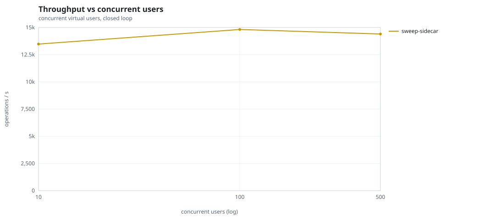
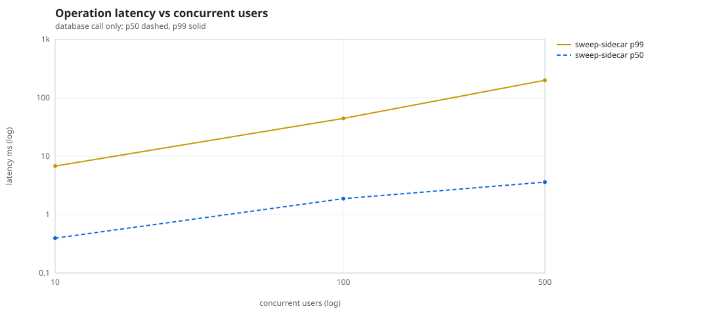
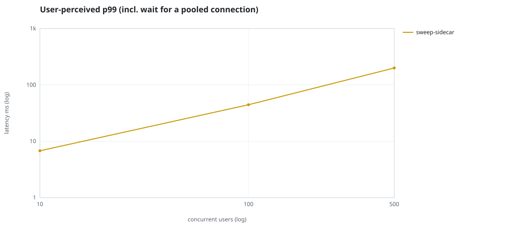
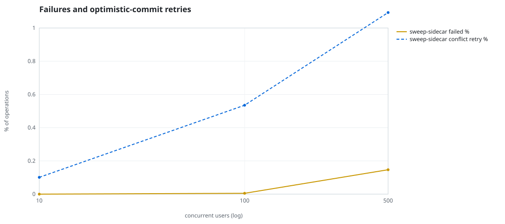
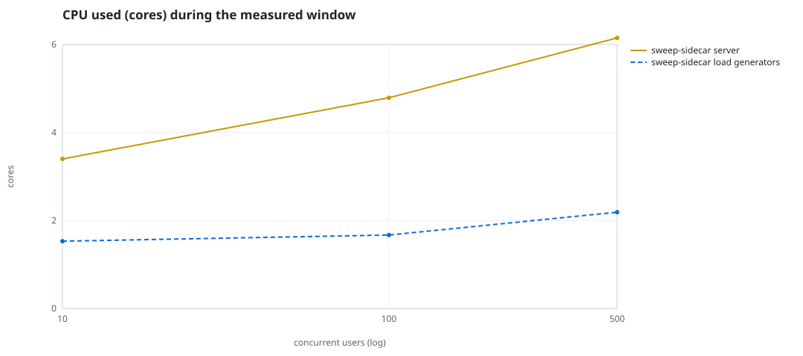
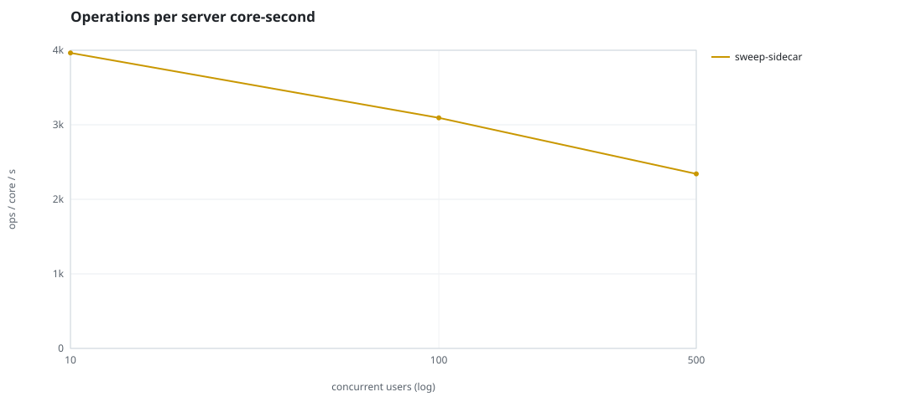
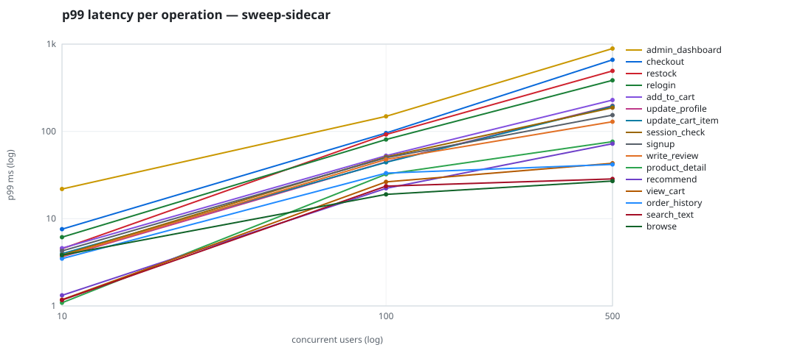

# Mini-SaaS concurrency simulation — sidecar

Run: `sweep-sidecar` on 2026-09-19T12:06:20 · commit `b4dda86` · macOS-26.6.2-arm64-arm-64bit · 10 CPUs

## Configuration

- **transport**: sidecar
- **levels**: [10, 100, 500]
- **duration**: 20.0
- **warmup**: 3.0
- **ramp**: 3.0
- **think**: [0.0, 0.0]
- **processes**: 0
- **connections**: 0
- **durability**: balanced
- **products**: 5000
- **accounts**: 20000
- **scenario**: compound-index
- **seed**: 1
- **fresh_per_stage**: False
- **seed time**: 1.2 s, 13.1 MiB after seeding

## Capacity and performance curve

Latencies are of the database call (service operation) in milliseconds; `user p99` adds the wait for a pooled connection.

| users | conns | ops/s | reads/s | writes/s | p50 | p95 | p99 | p99.9 | max | user p99 | success % | conflict retry % | srv CPU | srv RSS MiB | gen CPU | thr CV | invariants |
|---:|---:|---:|---:|---:|---:|---:|---:|---:|---:|---:|---:|---:|---:|---:|---:|---:|---:|
| 10 | 10 | 13477.4 | 10419.7 | 3057.7 | 0.395 | 2.174 | 6.776 | 14.844 | 659.463 | 6.779 | 100.0 | 0.101 | 3.4 | 130.6 | 1.53 | 0.158 | ok |
| 100 | 100 | 14817.9 | 11461.0 | 3356.9 | 1.875 | 22.3 | 44.374 | 115.881 | 2060.329 | 44.375 | 99.995 | 0.535 | 4.79 | 308.0 | 1.67 | 0.297 | ok |
| 500 | 500 | 14400.8 | 11139.4 | 3261.4 | 3.596 | 115.959 | 199.322 | 1720.465 | 3417.606 | 199.323 | 99.853 | 1.093 | 6.15 | 281.8 | 2.19 | 0.302 | ok |

## Insights

- **Peak throughput**: 14817.9 ops/s at 100 users (p99 44.374 ms).
- **Capacity at p99 ≤ 10 ms**: 10 users (DB latency); 10 users counting pool wait.
- **Capacity at p99 ≤ 50 ms**: 100 users (DB latency); 100 users counting pool wait.
- **Capacity at p99 ≤ 100 ms**: 100 users (DB latency); 100 users counting pool wait.
- **Capacity at p99 ≤ 250 ms**: 500 users (DB latency); 500 users counting pool wait.
- **Capacity at p99 ≤ 1000 ms**: 500 users (DB latency); 500 users counting pool wait.
- **USL fit**: σ (contention) = 0.24, κ (coherency) = 7.94e-05, predicted peak at N ≈ 97.8 (rmse log 0.0493).
- **Ops per server core-second**: 10→3964, 100→3094, 500→2342.
- **Seconds with zero completed operations** (stalls): [(100, 1)].
- **Read-your-writes violations**: none.
- **Business invariants**: all stages ok.
- **Offline integrity check** (elitesql check): ok in 15.84 s.
  - right after killing the server (no clean close): exit 3, 0 errors, 548894 warnings; after one clean open/close: exit 0, 0 errors, 0 warnings.
- **Database size**: 65.4 MiB after the first stage, 118.4 MiB after the last; 32012 paid orders in total.

## p99 latency per operation (ms)

| op | share % | 10 | 100 | 500 |
|---|---:|---:|---:|---:|
| add_to_cart | 10.23 | 4.59 | 52.65 | 228.87 |
| admin_dashboard | 1.02 | 21.87 | 148.81 | 889.53 |
| browse | 20.31 | 3.82 | 18.98 | 26.96 |
| checkout | 3.94 | 7.58 | 95.84 | 661.00 |
| order_history | 3.08 | 3.48 | 33.28 | 41.81 |
| product_detail | 17.32 | 1.09 | 32.29 | 76.30 |
| recommend | 7.09 | 1.32 | 22.24 | 72.22 |
| relogin | 1.57 | 6.14 | 80.79 | 385.22 |
| restock | 0.31 | 4.53 | 92.17 | 493.89 |
| search_text | 8.14 | 1.17 | 23.58 | 28.55 |
| session_check | 12.2 | 3.83 | 50.97 | 187.20 |
| signup | 0.49 | 4.27 | 49.86 | 153.62 |
| update_cart_item | 3.07 | 3.97 | 44.26 | 193.67 |
| update_profile | 1.06 | 3.66 | 44.70 | 196.88 |
| view_cart | 8.16 | 1.18 | 26.39 | 43.13 |
| write_review | 2.02 | 3.72 | 47.73 | 129.08 |

## Errors and business outcomes at the highest level

```json
{
 "statuses": {
  "ok": 284247,
  "empty_cart": 3331,
  "conflict_exhausted": 424,
  "not_found": 14
 },
 "errors": {
  "conflict_exhausted": {
   "count": 464,
   "first": "[elitesql:9] conflict, retry transaction: products/b8 changed after this transaction began",
   "ops": {
    "checkout": 424,
    "restock": 40
   }
  }
 }
}
```

## Charts








