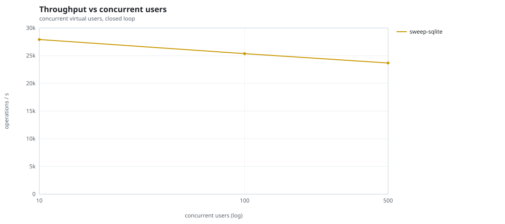
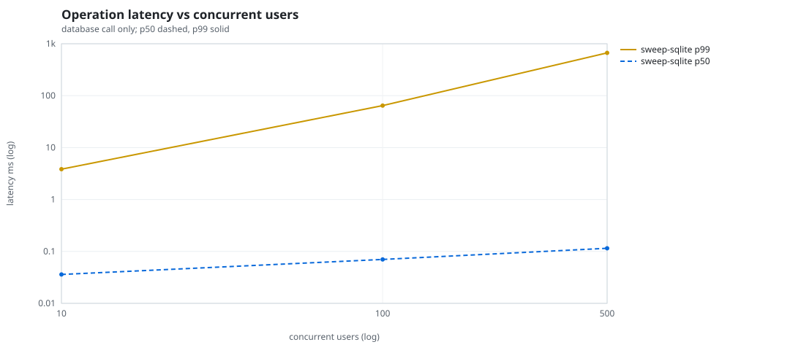
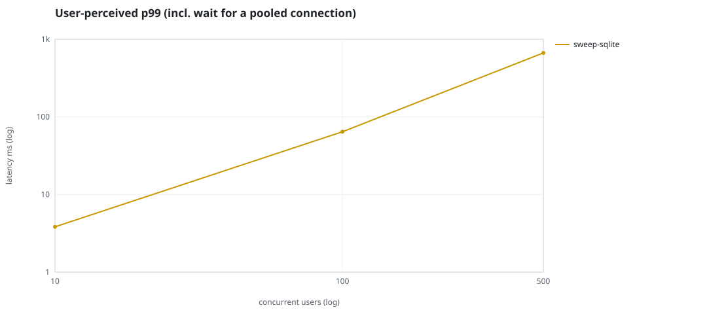
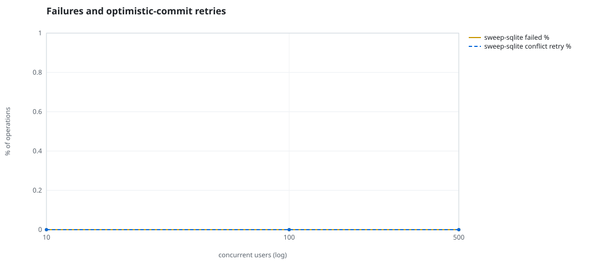
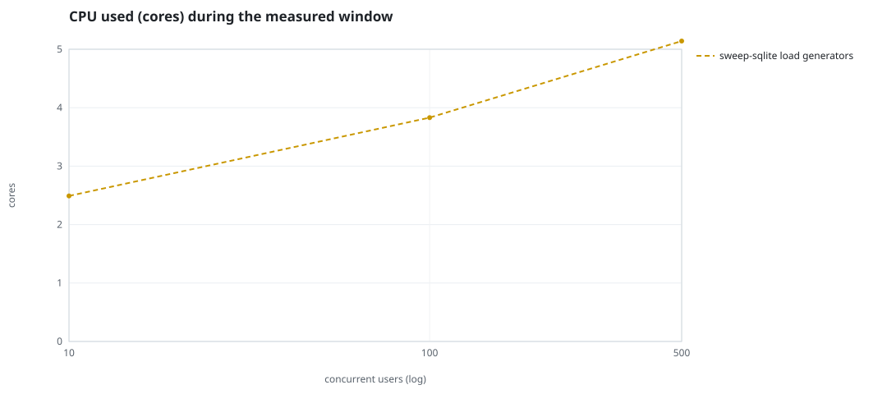
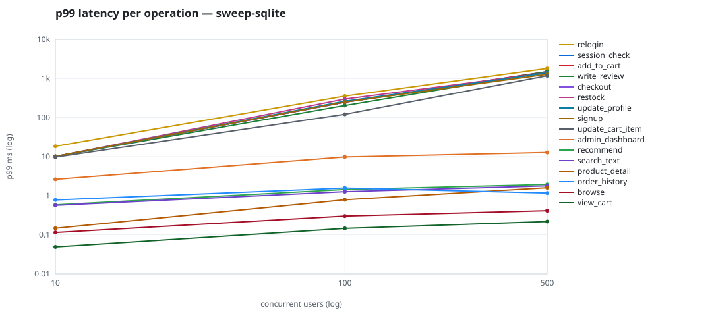

# Mini-SaaS concurrency simulation — sqlite

Run: `sweep-sqlite` on 2026-09-19T12:08:17 · commit `b4dda86` · macOS-26.6.2-arm64-arm-64bit · 10 CPUs

## Configuration

- **transport**: sqlite
- **levels**: [10, 100, 500]
- **duration**: 20.0
- **warmup**: 3.0
- **ramp**: 3.0
- **think**: [0.0, 0.0]
- **processes**: 0
- **connections**: 0
- **durability**: balanced
- **products**: 5000
- **accounts**: 20000
- **scenario**: compound-index
- **seed**: 1
- **fresh_per_stage**: False
- **seed time**: 0.14 s, 4.6 MiB after seeding

## Capacity and performance curve

Latencies are of the database call (service operation) in milliseconds; `user p99` adds the wait for a pooled connection.

| users | conns | ops/s | reads/s | writes/s | p50 | p95 | p99 | p99.9 | max | user p99 | success % | conflict retry % | srv CPU | srv RSS MiB | gen CPU | thr CV | invariants |
|---:|---:|---:|---:|---:|---:|---:|---:|---:|---:|---:|---:|---:|---:|---:|---:|---:|---:|
| 10 | 10 | 27922.3 | 21584.4 | 6337.9 | 0.036 | 1.293 | 3.836 | 39.627 | 866.943 | 3.836 | 100.0 | 0.0 | None | None | 2.49 | 0.037 | ok |
| 100 | 100 | 25362.8 | 19619.8 | 5743.1 | 0.07 | 3.845 | 64.349 | 764.77 | 4091.626 | 64.35 | 100.0 | 0.0 | None | None | 3.83 | 0.192 | ok |
| 500 | 500 | 23676.8 | 18310.8 | 5366.0 | 0.115 | 10.348 | 667.085 | 2520.536 | 6349.504 | 667.086 | 100.0 | 0.0 | None | None | 5.14 | 0.046 | ok |

## Insights

- **Peak throughput**: 27922.3 ops/s at 10 users (p99 3.836 ms).
- **Capacity at p99 ≤ 10 ms**: 10 users (DB latency); 10 users counting pool wait.
- **Capacity at p99 ≤ 50 ms**: 10 users (DB latency); 10 users counting pool wait.
- **Capacity at p99 ≤ 100 ms**: 100 users (DB latency); 100 users counting pool wait.
- **Capacity at p99 ≤ 250 ms**: 100 users (DB latency); 100 users counting pool wait.
- **Capacity at p99 ≤ 1000 ms**: 500 users (DB latency); 500 users counting pool wait.
- **USL fit**: σ (contention) = 0.26, κ (coherency) = 2.00e-04, predicted peak at N ≈ 60.9 (rmse log 0.1044).
- **Generator CPU includes the database**: SQLite runs inside the load-generator processes, so `gen CPU` is application plus engine and there is no server column.
- **Read-your-writes violations**: none.
- **Business invariants**: all stages ok.
- **Offline integrity check** (PRAGMA integrity_check): ok in 0.11 s.
- **Database size**: 11.6 MiB after the first stage, 24.4 MiB after the last; 57381 paid orders in total.

## p99 latency per operation (ms)

| op | share % | 10 | 100 | 500 |
|---|---:|---:|---:|---:|
| add_to_cart | 10.2 | 10.11 | 248.90 | 1497.96 |
| admin_dashboard | 1.03 | 2.63 | 9.83 | 12.81 |
| browse | 20.3 | 0.12 | 0.30 | 0.41 |
| checkout | 3.99 | 10.11 | 248.81 | 1396.62 |
| order_history | 3.11 | 0.78 | 1.58 | 1.18 |
| product_detail | 17.33 | 0.15 | 0.79 | 1.61 |
| recommend | 7.07 | 0.59 | 1.45 | 1.94 |
| relogin | 1.55 | 18.44 | 357.34 | 1807.56 |
| restock | 0.3 | 10.14 | 299.25 | 1395.33 |
| search_text | 8.13 | 0.57 | 1.27 | 1.79 |
| session_check | 12.2 | 10.08 | 248.46 | 1498.92 |
| signup | 0.5 | 10.19 | 250.87 | 1282.96 |
| update_cart_item | 3.09 | 9.73 | 121.54 | 1178.53 |
| update_profile | 1.03 | 10.07 | 263.77 | 1392.99 |
| view_cart | 8.14 | 0.05 | 0.15 | 0.22 |
| write_review | 2.03 | 10.14 | 204.13 | 1497.67 |

## Errors and business outcomes at the highest level

```json
{
 "statuses": {
  "ok": 467182,
  "empty_cart": 5513,
  "out_of_stock": 810,
  "not_found": 31
 },
 "errors": {}
}
```

## Charts








