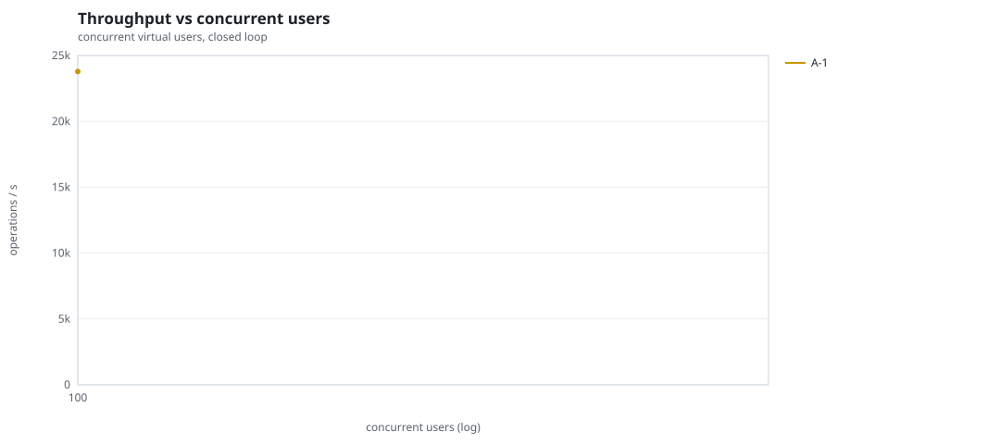
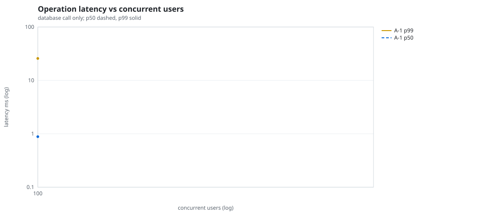
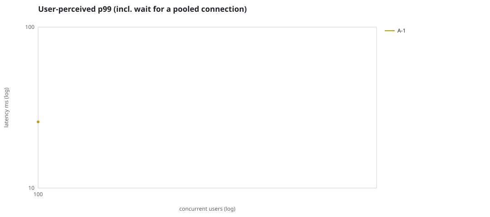
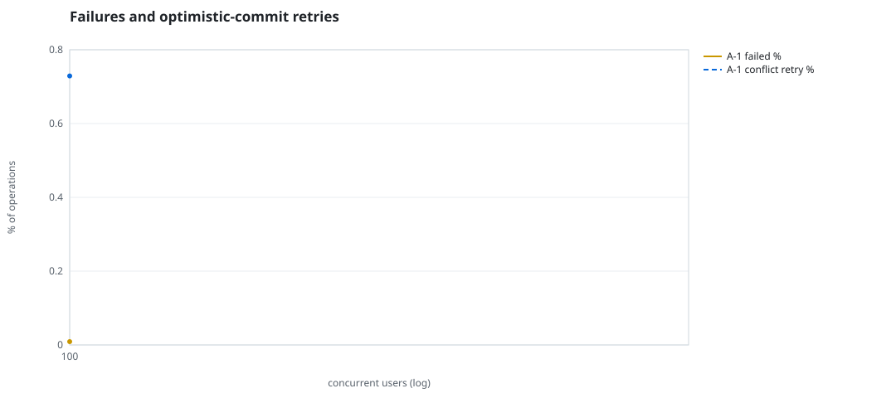
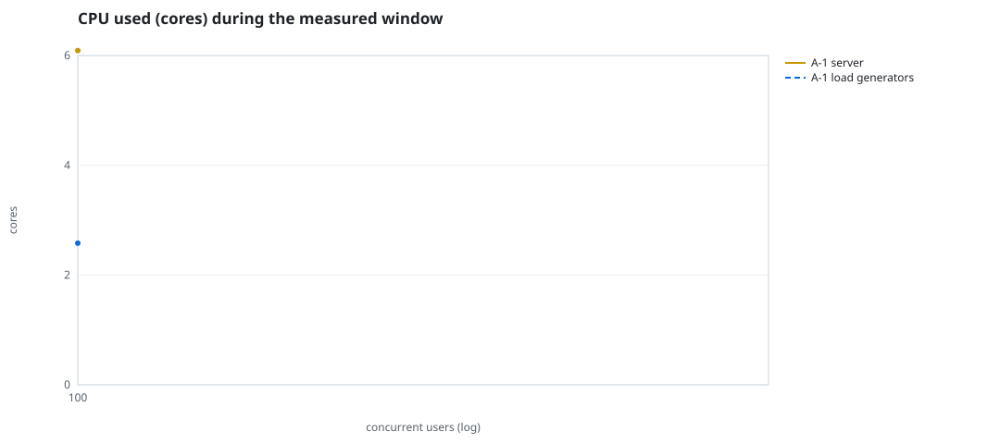
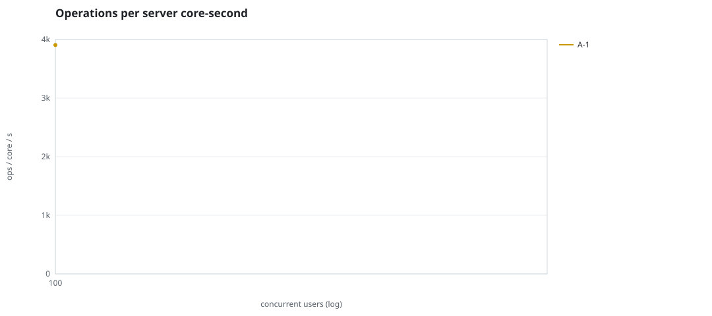
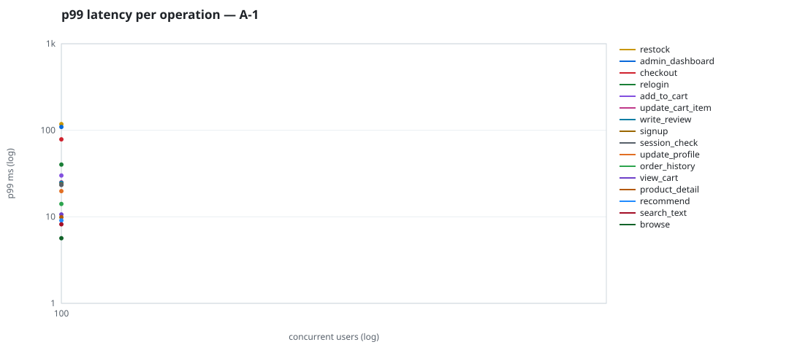

# Mini-SaaS concurrency simulation — sidecar

Run: `A-1` on 2026-09-23T14:11:10 · commit `92e0290` · macOS-26.6.2-arm64-arm-64bit · 10 CPUs

## Configuration

- **transport**: sidecar
- **levels**: [100]
- **duration**: 15.0
- **warmup**: 3.0
- **ramp**: 3.0
- **think**: [0.0, 0.0]
- **processes**: 0
- **connections**: 0
- **durability**: balanced
- **products**: 5000
- **accounts**: 20000
- **scenario**: compound-index
- **seed**: 1
- **fresh_per_stage**: False
- **seed time**: 1.12 s, 13.1 MiB after seeding

## Capacity and performance curve

Latencies are of the database call (service operation) in milliseconds; `user p99` adds the wait for a pooled connection.

| users | conns | ops/s | reads/s | writes/s | p50 | p95 | p99 | p99.9 | max | user p99 | success % | conflict retry % | srv CPU | srv RSS MiB | gen CPU | thr CV | invariants |
|---:|---:|---:|---:|---:|---:|---:|---:|---:|---:|---:|---:|---:|---:|---:|---:|---:|---:|
| 100 | 100 | 23786.8 | 18403.4 | 5383.4 | 0.884 | 14.796 | 25.771 | 68.332 | 1125.587 | 25.772 | 99.991 | 0.729 | 6.09 | 192.7 | 2.58 | 0.081 | ok |

## Insights

- **Peak throughput**: 23786.8 ops/s at 100 users (p99 25.771 ms).
- **Capacity at p99 ≤ 10 ms**: 0 users (DB latency); 0 users counting pool wait.
- **Capacity at p99 ≤ 50 ms**: 100 users (DB latency); 100 users counting pool wait.
- **Capacity at p99 ≤ 100 ms**: 100 users (DB latency); 100 users counting pool wait.
- **Capacity at p99 ≤ 250 ms**: 100 users (DB latency); 100 users counting pool wait.
- **Capacity at p99 ≤ 1000 ms**: 100 users (DB latency); 100 users counting pool wait.
- **Ops per server core-second**: 100→3906.
- **Read-your-writes violations**: none.
- **Business invariants**: all stages ok.
- **Offline integrity check** (elitesql check): ok in 8.29 s.
  - right after killing the server (no clean close): exit 3, 0 errors, 286456 warnings; after one clean open/close: exit 0, 0 errors, 0 warnings.
- **Database size**: 88.8 MiB after the first stage, 88.8 MiB after the last; 15055 paid orders in total.

## p99 latency per operation (ms)

| op | share % | 100 |
|---|---:|---:|
| add_to_cart | 10.12 | 29.99 |
| admin_dashboard | 1.03 | 109.21 |
| browse | 20.39 | 5.66 |
| checkout | 4.08 | 78.55 |
| order_history | 3.02 | 14.08 |
| product_detail | 17.25 | 9.88 |
| recommend | 7.16 | 9.08 |
| relogin | 1.53 | 40.17 |
| restock | 0.3 | 117.85 |
| search_text | 8.18 | 8.19 |
| session_check | 12.18 | 23.33 |
| signup | 0.51 | 23.63 |
| update_cart_item | 3.03 | 25.00 |
| update_profile | 1.03 | 19.80 |
| view_cart | 8.18 | 10.65 |
| write_review | 2.04 | 24.72 |

## Errors and business outcomes at the highest level

```json
{
 "statuses": {
  "ok": 352421,
  "empty_cart": 4329,
  "conflict_exhausted": 31,
  "not_found": 21
 },
 "errors": {
  "conflict_exhausted": {
   "count": 50,
   "first": "[elitesql:9] conflict, retry transaction: products/b4 changed after this transaction began",
   "ops": {
    "checkout": 46,
    "restock": 4
   }
  }
 }
}
```

## Charts








