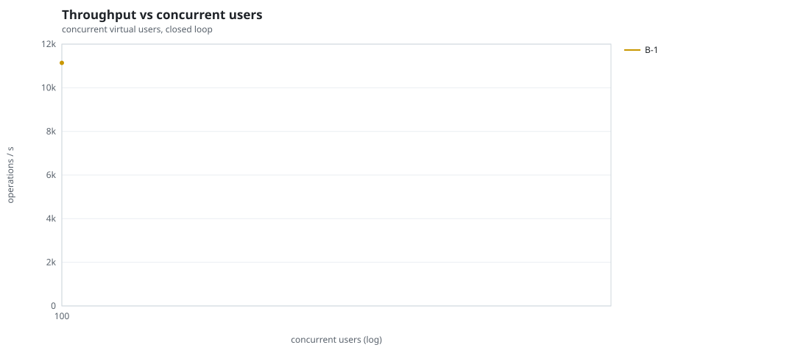
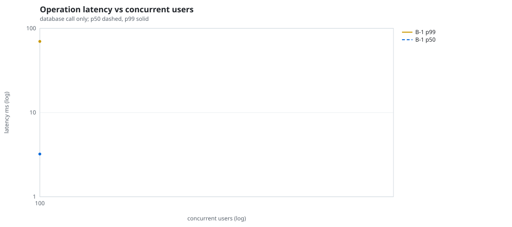
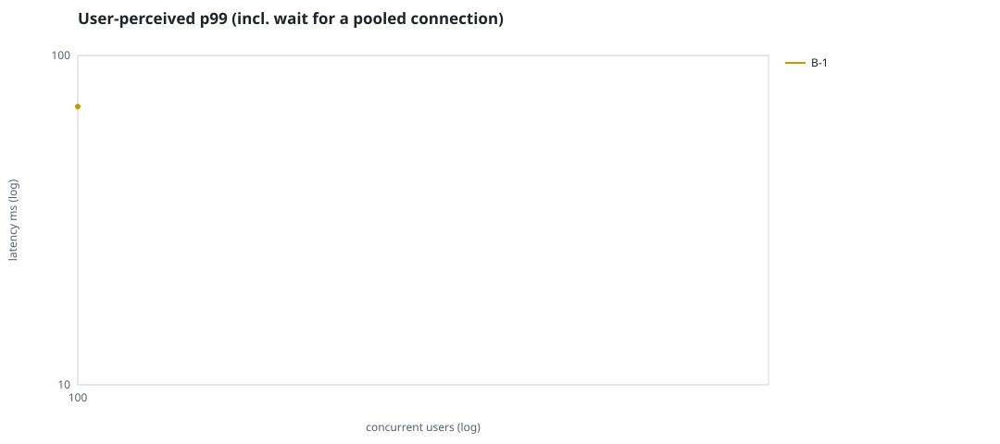
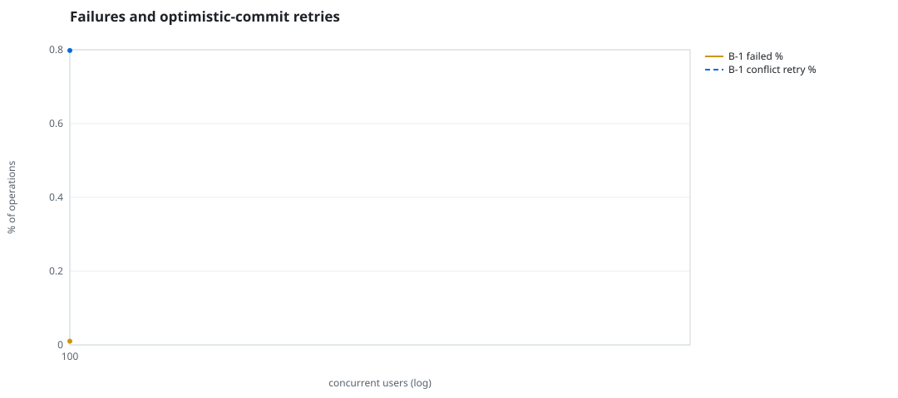
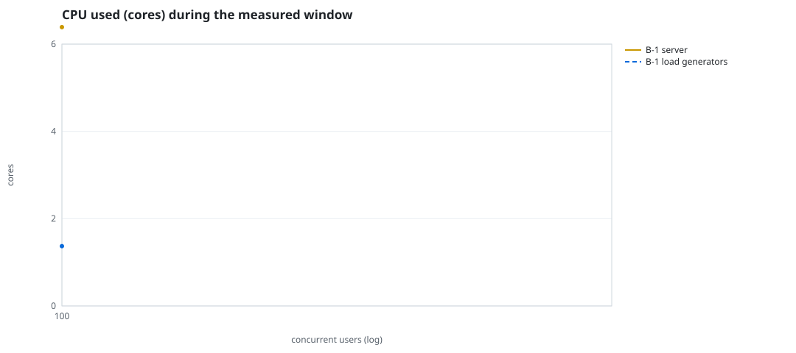
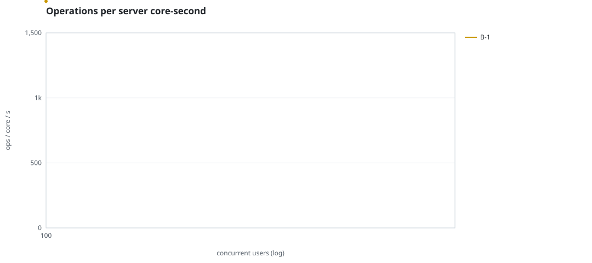
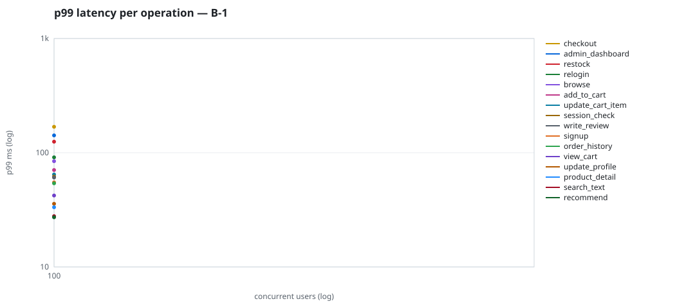

# Mini-SaaS concurrency simulation — sidecar

Run: `B-1` on 2026-09-23T13:03:09 · commit `92e0290` · macOS-26.6.2-arm64-arm-64bit · 10 CPUs

## Configuration

- **transport**: sidecar
- **levels**: [100]
- **duration**: 15.0
- **warmup**: 3.0
- **ramp**: 3.0
- **think**: [0.0, 0.0]
- **processes**: 0
- **connections**: 0
- **durability**: balanced
- **products**: 5000
- **accounts**: 20000
- **scenario**: compound-index
- **seed**: 1
- **fresh_per_stage**: False
- **seed time**: 1.17 s, 13.1 MiB after seeding

## Capacity and performance curve

Latencies are of the database call (service operation) in milliseconds; `user p99` adds the wait for a pooled connection.

| users | conns | ops/s | reads/s | writes/s | p50 | p95 | p99 | p99.9 | max | user p99 | success % | conflict retry % | srv CPU | srv RSS MiB | gen CPU | thr CV | invariants |
|---:|---:|---:|---:|---:|---:|---:|---:|---:|---:|---:|---:|---:|---:|---:|---:|---:|---:|
| 100 | 100 | 11139.3 | 8627.2 | 2512.1 | 3.215 | 31.27 | 69.962 | 139.411 | 1197.174 | 69.964 | 99.99 | 0.798 | 6.39 | 123.0 | 1.37 | 0.094 | ok |

## Insights

- **Peak throughput**: 11139.3 ops/s at 100 users (p99 69.962 ms).
- **Capacity at p99 ≤ 10 ms**: 0 users (DB latency); 0 users counting pool wait.
- **Capacity at p99 ≤ 50 ms**: 0 users (DB latency); 0 users counting pool wait.
- **Capacity at p99 ≤ 100 ms**: 100 users (DB latency); 100 users counting pool wait.
- **Capacity at p99 ≤ 250 ms**: 100 users (DB latency); 100 users counting pool wait.
- **Capacity at p99 ≤ 1000 ms**: 100 users (DB latency); 100 users counting pool wait.
- **Ops per server core-second**: 100→1743.
- **Read-your-writes violations**: none.
- **Business invariants**: all stages ok.
- **Offline integrity check** (elitesql check): ok in 5.15 s.
  - right after killing the server (no clean close): exit 3, 0 errors, 166978 warnings; after one clean open/close: exit 0, 0 errors, 0 warnings.
- **Database size**: 47.9 MiB after the first stage, 47.9 MiB after the last; 7027 paid orders in total.

## p99 latency per operation (ms)

| op | share % | 100 |
|---|---:|---:|
| add_to_cart | 10.06 | 70.49 |
| admin_dashboard | 1.04 | 141.77 |
| browse | 20.5 | 84.29 |
| checkout | 4.07 | 168.74 |
| order_history | 3.03 | 53.92 |
| product_detail | 17.33 | 33.31 |
| recommend | 7.14 | 27.23 |
| relogin | 1.58 | 91.16 |
| restock | 0.32 | 124.90 |
| search_text | 8.12 | 27.81 |
| session_check | 12.18 | 61.79 |
| signup | 0.49 | 55.03 |
| update_cart_item | 2.99 | 64.46 |
| update_profile | 1.01 | 35.69 |
| view_cart | 8.12 | 42.19 |
| write_review | 2.03 | 60.61 |

## Errors and business outcomes at the highest level

```json
{
 "statuses": {
  "ok": 164999,
  "empty_cart": 2061,
  "conflict_exhausted": 17,
  "not_found": 12
 },
 "errors": {
  "conflict_exhausted": {
   "count": 19,
   "first": "[elitesql:9] conflict, retry transaction: products/c15 changed after this transaction began",
   "ops": {
    "checkout": 18,
    "restock": 1
   }
  }
 }
}
```

## Charts








