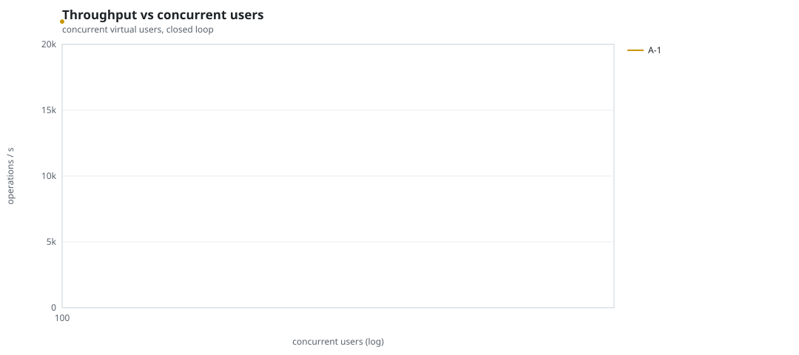
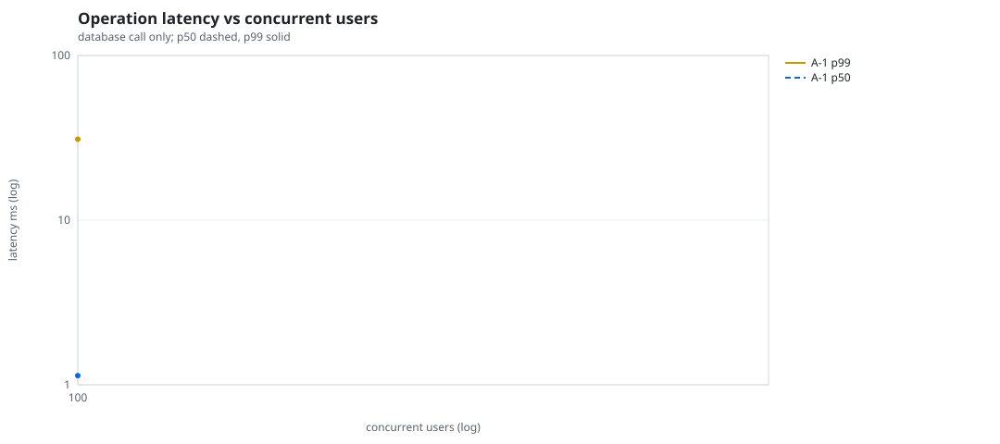
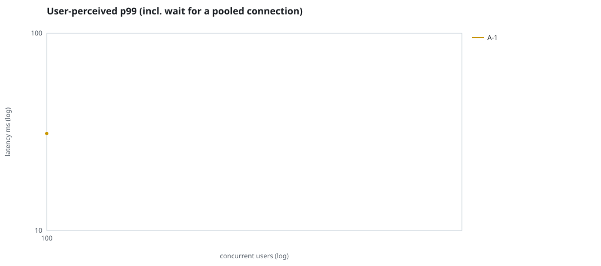
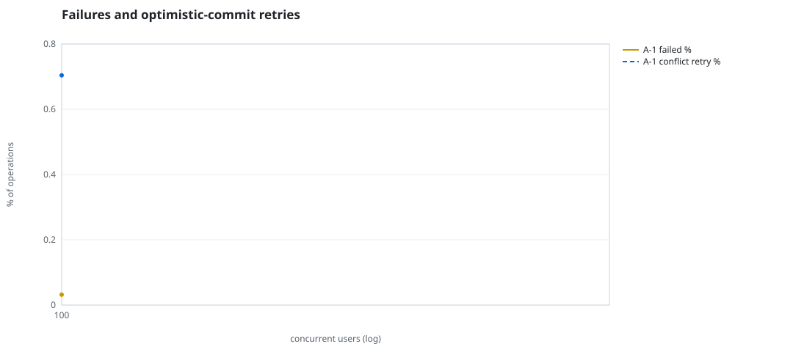
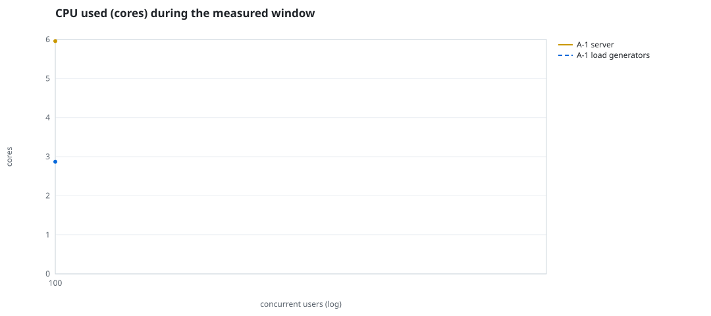
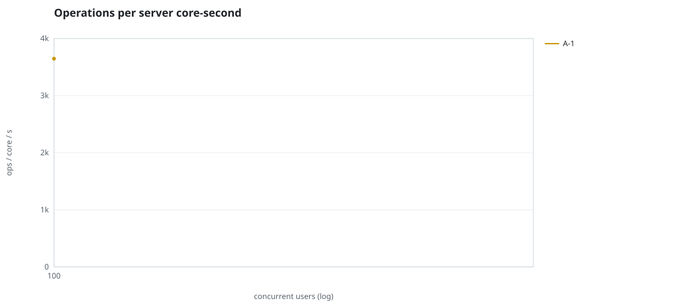
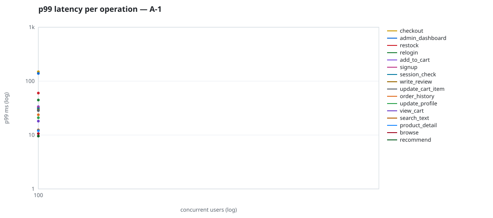

# Mini-SaaS concurrency simulation — sidecar

Run: `A-1` on 2026-09-23T13:54:33 · commit `92e0290` · macOS-26.6.2-arm64-arm-64bit · 10 CPUs

## Configuration

- **transport**: sidecar
- **levels**: [100]
- **duration**: 15.0
- **warmup**: 3.0
- **ramp**: 3.0
- **think**: [0.0, 0.0]
- **processes**: 0
- **connections**: 0
- **durability**: balanced
- **products**: 5000
- **accounts**: 20000
- **scenario**: compound-index
- **seed**: 1
- **fresh_per_stage**: False
- **seed time**: 1.3 s, 13.1 MiB after seeding

## Capacity and performance curve

Latencies are of the database call (service operation) in milliseconds; `user p99` adds the wait for a pooled connection.

| users | conns | ops/s | reads/s | writes/s | p50 | p95 | p99 | p99.9 | max | user p99 | success % | conflict retry % | srv CPU | srv RSS MiB | gen CPU | thr CV | invariants |
|---:|---:|---:|---:|---:|---:|---:|---:|---:|---:|---:|---:|---:|---:|---:|---:|---:|---:|
| 100 | 100 | 21728.5 | 16809.8 | 4918.7 | 1.136 | 16.45 | 31.026 | 108.662 | 1158.83 | 31.028 | 99.968 | 0.704 | 5.96 | 218.3 | 2.87 | 0.128 | ok |

## Insights

- **Peak throughput**: 21728.5 ops/s at 100 users (p99 31.026 ms).
- **Capacity at p99 ≤ 10 ms**: 0 users (DB latency); 0 users counting pool wait.
- **Capacity at p99 ≤ 50 ms**: 100 users (DB latency); 100 users counting pool wait.
- **Capacity at p99 ≤ 100 ms**: 100 users (DB latency); 100 users counting pool wait.
- **Capacity at p99 ≤ 250 ms**: 100 users (DB latency); 100 users counting pool wait.
- **Capacity at p99 ≤ 1000 ms**: 100 users (DB latency); 100 users counting pool wait.
- **Ops per server core-second**: 100→3646.
- **Read-your-writes violations**: none.
- **Business invariants**: all stages ok.
- **Offline integrity check** (elitesql check): ok in 7.91 s.
  - right after killing the server (no clean close): exit 3, 0 errors, 269570 warnings; after one clean open/close: exit 0, 0 errors, 0 warnings.
- **Database size**: 82.9 MiB after the first stage, 82.9 MiB after the last; 13874 paid orders in total.

## p99 latency per operation (ms)

| op | share % | 100 |
|---|---:|---:|
| add_to_cart | 10.1 | 33.62 |
| admin_dashboard | 1.03 | 138.98 |
| browse | 20.37 | 10.63 |
| checkout | 4.08 | 149.06 |
| order_history | 3.01 | 23.75 |
| product_detail | 17.24 | 12.02 |
| recommend | 7.14 | 9.57 |
| relogin | 1.54 | 44.64 |
| restock | 0.3 | 60.12 |
| search_text | 8.19 | 12.41 |
| session_check | 12.19 | 30.88 |
| signup | 0.51 | 32.35 |
| update_cart_item | 3.03 | 28.40 |
| update_profile | 1.03 | 20.96 |
| view_cart | 8.21 | 18.12 |
| write_review | 2.04 | 29.11 |

## Errors and business outcomes at the highest level

```json
{
 "statuses": {
  "ok": 321867,
  "conflict_exhausted": 104,
  "empty_cart": 3937,
  "not_found": 20
 },
 "errors": {
  "conflict_exhausted": {
   "count": 127,
   "first": "[elitesql:9] conflict, retry transaction: products/d180 changed after this transaction began",
   "ops": {
    "checkout": 127
   }
  }
 }
}
```

## Charts








