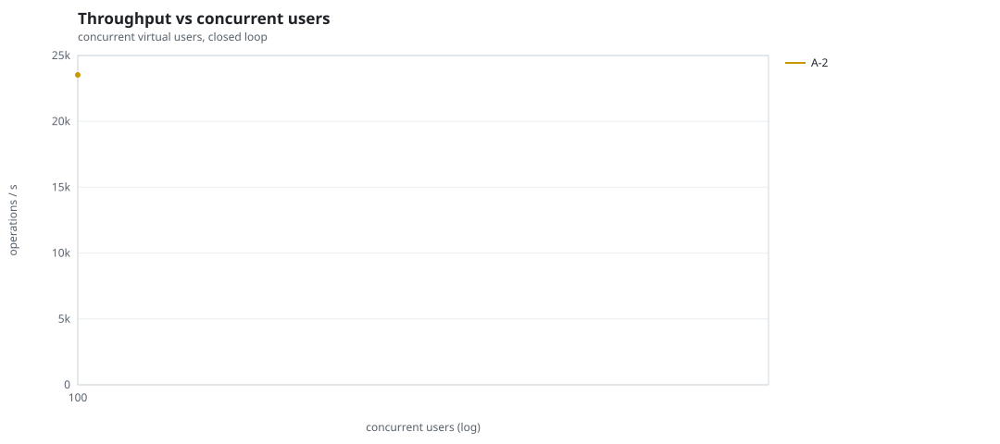
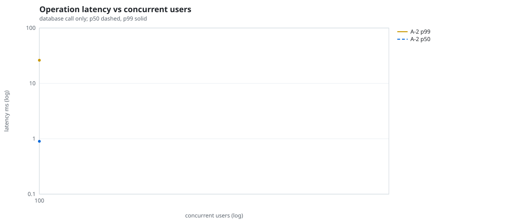
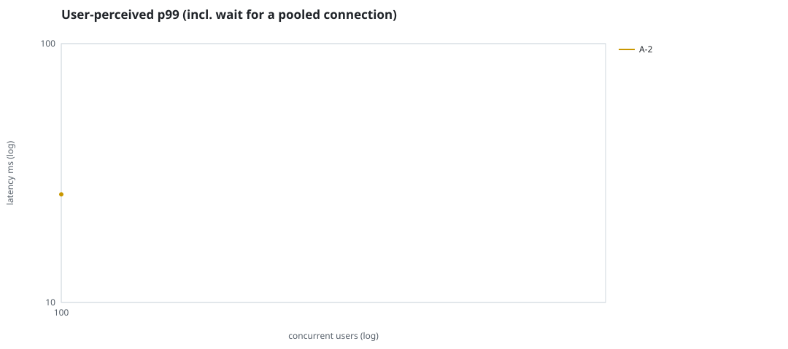
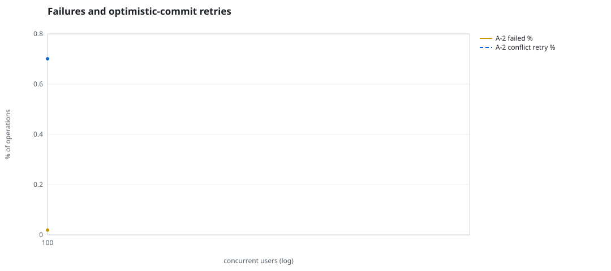
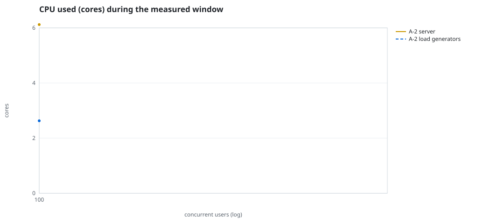
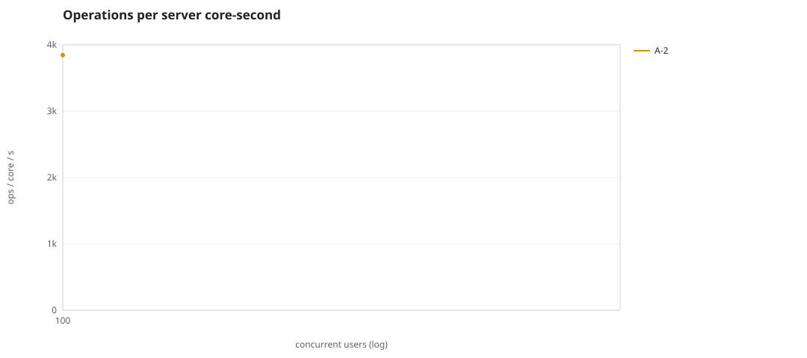
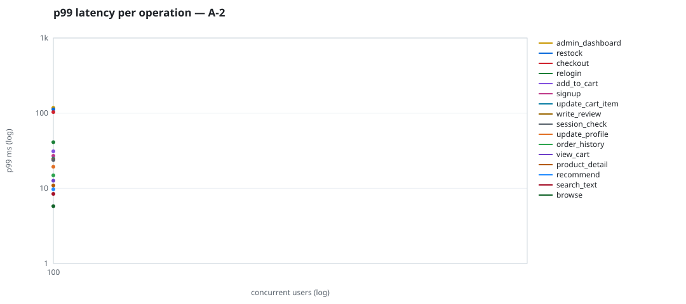

# Mini-SaaS concurrency simulation — sidecar

Run: `A-2` on 2026-09-23T14:40:14 · commit `92e0290` · macOS-26.6.2-arm64-arm-64bit · 10 CPUs

## Configuration

- **transport**: sidecar
- **levels**: [100]
- **duration**: 15.0
- **warmup**: 3.0
- **ramp**: 3.0
- **think**: [0.0, 0.0]
- **processes**: 0
- **connections**: 0
- **durability**: balanced
- **products**: 5000
- **accounts**: 20000
- **scenario**: compound-index
- **seed**: 1
- **fresh_per_stage**: False
- **seed time**: 1.12 s, 13.1 MiB after seeding

## Capacity and performance curve

Latencies are of the database call (service operation) in milliseconds; `user p99` adds the wait for a pooled connection.

| users | conns | ops/s | reads/s | writes/s | p50 | p95 | p99 | p99.9 | max | user p99 | success % | conflict retry % | srv CPU | srv RSS MiB | gen CPU | thr CV | invariants |
|---:|---:|---:|---:|---:|---:|---:|---:|---:|---:|---:|---:|---:|---:|---:|---:|---:|---:|
| 100 | 100 | 23525.1 | 18201.7 | 5323.3 | 0.9 | 14.823 | 26.17 | 74.37 | 1051.12 | 26.171 | 99.981 | 0.701 | 6.12 | 191.8 | 2.63 | 0.071 | ok |

## Insights

- **Peak throughput**: 23525.1 ops/s at 100 users (p99 26.17 ms).
- **Capacity at p99 ≤ 10 ms**: 0 users (DB latency); 0 users counting pool wait.
- **Capacity at p99 ≤ 50 ms**: 100 users (DB latency); 100 users counting pool wait.
- **Capacity at p99 ≤ 100 ms**: 100 users (DB latency); 100 users counting pool wait.
- **Capacity at p99 ≤ 250 ms**: 100 users (DB latency); 100 users counting pool wait.
- **Capacity at p99 ≤ 1000 ms**: 100 users (DB latency); 100 users counting pool wait.
- **Ops per server core-second**: 100→3844.
- **Read-your-writes violations**: none.
- **Business invariants**: all stages ok.
- **Offline integrity check** (elitesql check): ok in 8.3 s.
  - right after killing the server (no clean close): exit 3, 0 errors, 283872 warnings; after one clean open/close: exit 0, 0 errors, 0 warnings.
- **Database size**: 88.0 MiB after the first stage, 88.0 MiB after the last; 14862 paid orders in total.

## p99 latency per operation (ms)

| op | share % | 100 |
|---|---:|---:|
| add_to_cart | 10.12 | 31.05 |
| admin_dashboard | 1.02 | 117.64 |
| browse | 20.4 | 5.79 |
| checkout | 4.08 | 103.28 |
| order_history | 3.01 | 14.87 |
| product_detail | 17.22 | 10.91 |
| recommend | 7.15 | 9.71 |
| relogin | 1.53 | 41.12 |
| restock | 0.29 | 112.31 |
| search_text | 8.18 | 8.43 |
| session_check | 12.19 | 23.78 |
| signup | 0.51 | 27.06 |
| update_cart_item | 3.03 | 24.83 |
| update_profile | 1.03 | 19.37 |
| view_cart | 8.2 | 12.64 |
| write_review | 2.04 | 24.34 |

## Errors and business outcomes at the highest level

```json
{
 "statuses": {
  "ok": 348536,
  "empty_cart": 4253,
  "conflict_exhausted": 67,
  "not_found": 20
 },
 "errors": {
  "conflict_exhausted": {
   "count": 85,
   "first": "[elitesql:9] conflict, retry transaction: products/c16 changed after this transaction began",
   "ops": {
    "restock": 3,
    "checkout": 82
   }
  }
 }
}
```

## Charts








