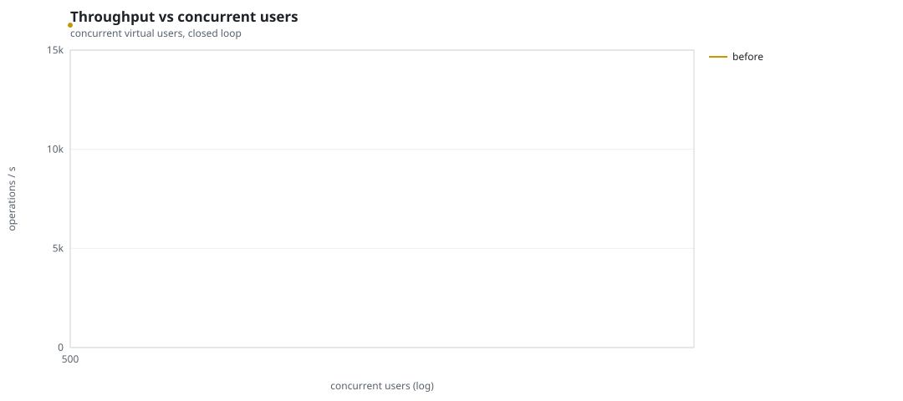
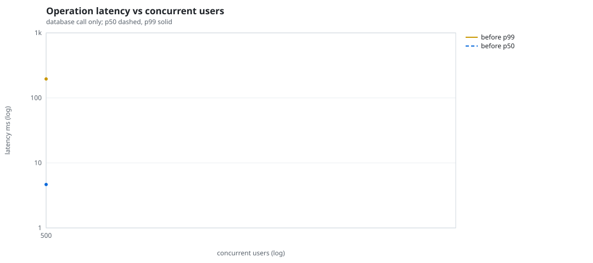
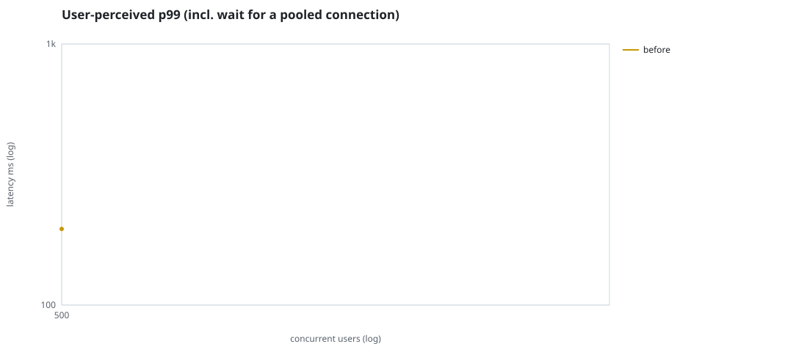
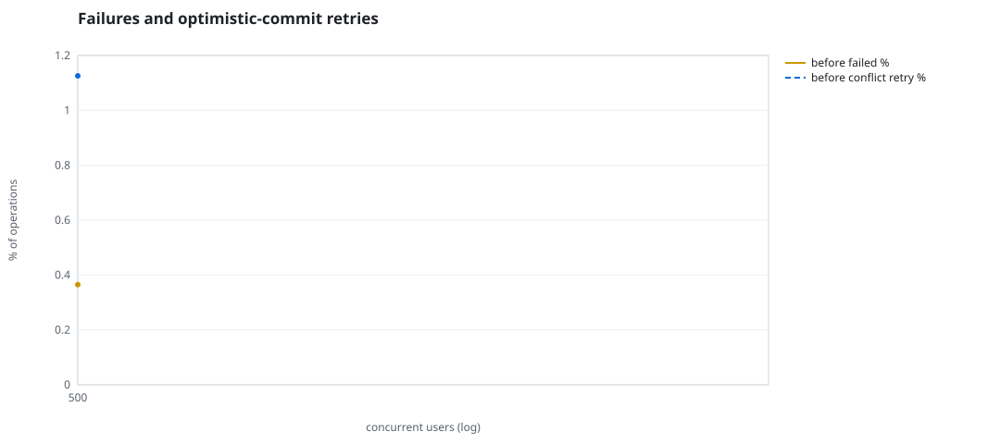
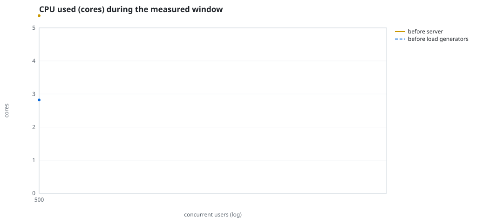
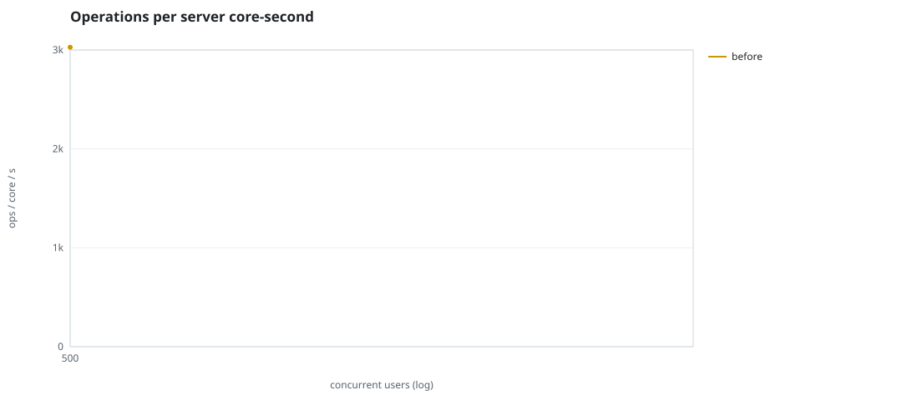
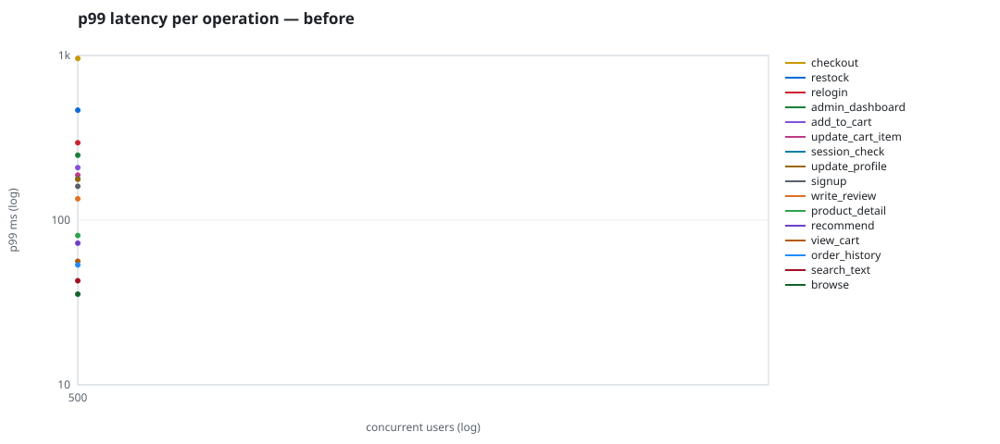

# Mini-SaaS concurrency simulation — sidecar

Run: `before` on 2026-09-23T15:22:50 · commit `92e0290` · macOS-26.6.2-arm64-arm-64bit · 10 CPUs

## Configuration

- **transport**: sidecar
- **levels**: [500]
- **duration**: 15.0
- **warmup**: 3.0
- **ramp**: 3.0
- **think**: [0.0, 0.0]
- **processes**: 0
- **connections**: 0
- **durability**: balanced
- **products**: 5000
- **accounts**: 20000
- **scenario**: compound-index
- **seed**: 1
- **fresh_per_stage**: False
- **seed time**: 1.3 s, 13.1 MiB after seeding

## Capacity and performance curve

Latencies are of the database call (service operation) in milliseconds; `user p99` adds the wait for a pooled connection.

| users | conns | ops/s | reads/s | writes/s | p50 | p95 | p99 | p99.9 | max | user p99 | success % | conflict retry % | srv CPU | srv RSS MiB | gen CPU | thr CV | invariants |
|---:|---:|---:|---:|---:|---:|---:|---:|---:|---:|---:|---:|---:|---:|---:|---:|---:|---:|
| 500 | 500 | 16259.0 | 12571.6 | 3687.4 | 4.661 | 113.458 | 195.703 | 739.161 | 2319.994 | 195.704 | 99.635 | 1.126 | 5.37 | 196.8 | 2.82 | 0.104 | ok |

## Insights

- **Peak throughput**: 16259.0 ops/s at 500 users (p99 195.703 ms).
- **Capacity at p99 ≤ 10 ms**: 0 users (DB latency); 0 users counting pool wait.
- **Capacity at p99 ≤ 50 ms**: 0 users (DB latency); 0 users counting pool wait.
- **Capacity at p99 ≤ 100 ms**: 0 users (DB latency); 0 users counting pool wait.
- **Capacity at p99 ≤ 250 ms**: 500 users (DB latency); 500 users counting pool wait.
- **Capacity at p99 ≤ 1000 ms**: 500 users (DB latency); 500 users counting pool wait.
- **Ops per server core-second**: 500→3028.
- **Read-your-writes violations**: none.
- **Business invariants**: all stages ok.
- **Offline integrity check** (elitesql check): ok in 6.22 s.
  - right after killing the server (no clean close): exit 3, 0 errors, 211838 warnings; after one clean open/close: exit 0, 0 errors, 0 warnings.
- **Database size**: 63.1 MiB after the first stage, 63.1 MiB after the last; 9391 paid orders in total.

## p99 latency per operation (ms)

| op | share % | 500 |
|---|---:|---:|
| add_to_cart | 10.26 | 208.62 |
| admin_dashboard | 1.01 | 248.11 |
| browse | 20.31 | 35.52 |
| checkout | 4.07 | 958.96 |
| order_history | 3.1 | 53.44 |
| product_detail | 17.38 | 80.69 |
| recommend | 7.13 | 72.47 |
| relogin | 1.51 | 295.17 |
| restock | 0.29 | 465.29 |
| search_text | 8.11 | 42.88 |
| session_check | 12.16 | 178.02 |
| signup | 0.48 | 160.54 |
| update_cart_item | 3.02 | 187.87 |
| update_profile | 1.01 | 177.22 |
| view_cart | 8.13 | 56.32 |
| write_review | 2.02 | 134.87 |

## Errors and business outcomes at the highest level

```json
{
 "statuses": {
  "ok": 240306,
  "empty_cart": 2676,
  "conflict_exhausted": 890,
  "not_found": 13
 },
 "errors": {
  "conflict_exhausted": {
   "count": 1023,
   "first": "[elitesql:9] conflict, retry transaction: products/c10 changed after this transaction began",
   "ops": {
    "restock": 60,
    "checkout": 963
   }
  }
 }
}
```

## Charts








