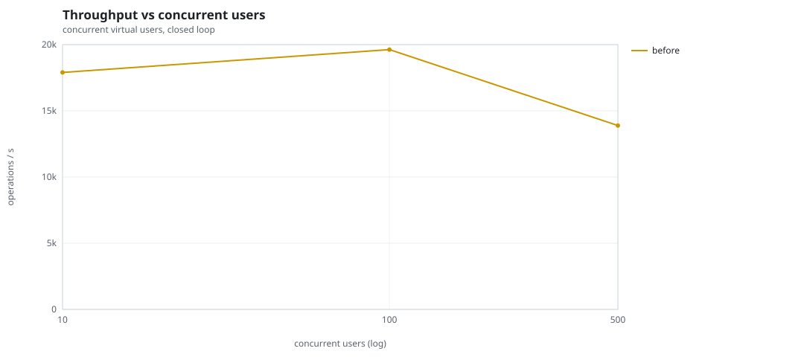
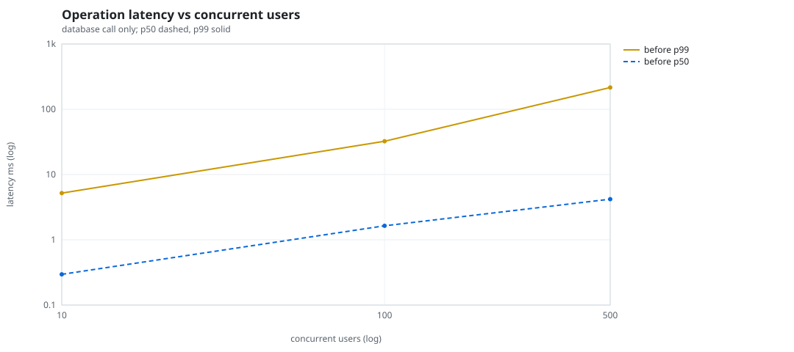
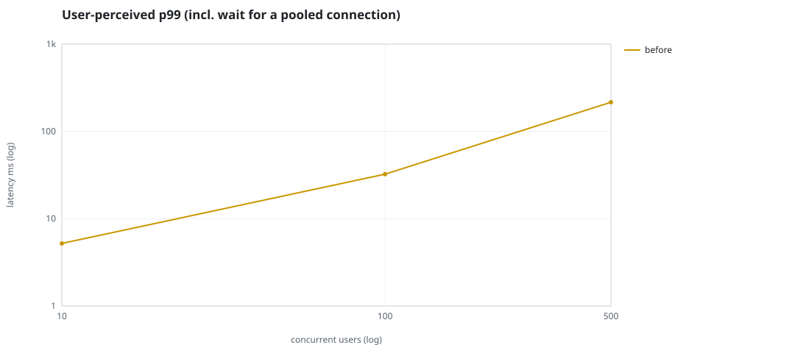
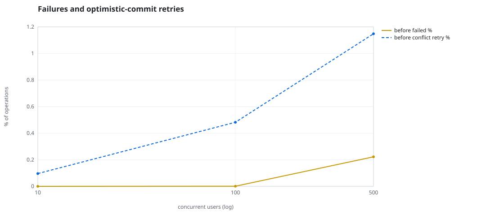
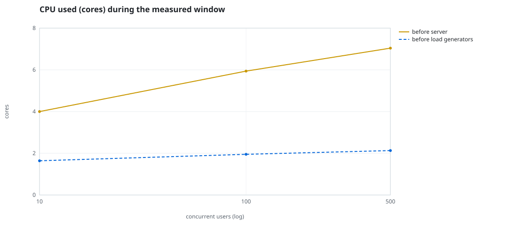
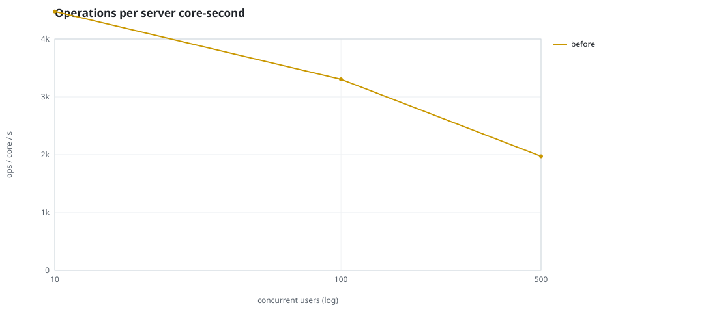
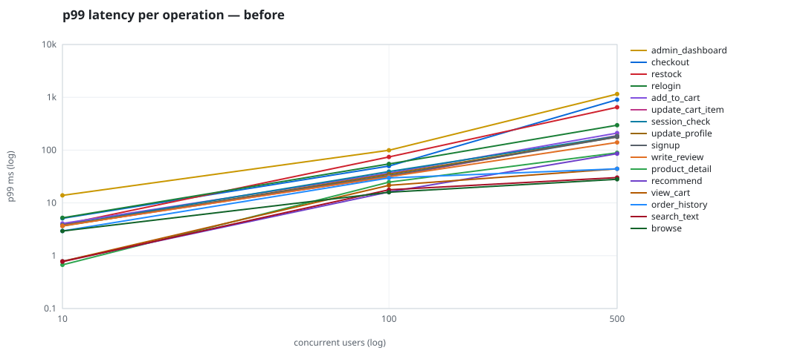

# Mini-SaaS concurrency simulation — sidecar

Run: `before` on 2026-09-23T15:48:36 · commit `92e0290` · macOS-26.6.2-arm64-arm-64bit · 10 CPUs

## Configuration

- **transport**: sidecar
- **levels**: [10, 100, 500]
- **duration**: 20.0
- **warmup**: 3.0
- **ramp**: 3.0
- **think**: [0.0, 0.0]
- **processes**: 0
- **connections**: 0
- **durability**: balanced
- **products**: 5000
- **accounts**: 20000
- **scenario**: compound-index
- **seed**: 1
- **fresh_per_stage**: False
- **seed time**: 1.12 s, 13.1 MiB after seeding

## Capacity and performance curve

Latencies are of the database call (service operation) in milliseconds; `user p99` adds the wait for a pooled connection.

| users | conns | ops/s | reads/s | writes/s | p50 | p95 | p99 | p99.9 | max | user p99 | success % | conflict retry % | srv CPU | srv RSS MiB | gen CPU | thr CV | invariants |
|---:|---:|---:|---:|---:|---:|---:|---:|---:|---:|---:|---:|---:|---:|---:|---:|---:|---:|
| 10 | 10 | 17899.9 | 13847.9 | 4052.1 | 0.296 | 1.763 | 5.201 | 11.086 | 567.809 | 5.202 | 100.0 | 0.096 | 4.0 | 171.6 | 1.64 | 0.135 | ok |
| 100 | 100 | 19624.2 | 15184.1 | 4440.1 | 1.641 | 16.503 | 32.388 | 74.606 | 1734.599 | 32.389 | 99.999 | 0.482 | 5.94 | 306.2 | 1.95 | 0.289 | ok |
| 500 | 500 | 13886.0 | 10739.9 | 3146.1 | 4.191 | 131.666 | 215.714 | 778.029 | 2749.292 | 215.715 | 99.778 | 1.148 | 7.04 | 459.0 | 2.13 | 0.122 | ok |

## Insights

- **Peak throughput**: 19624.2 ops/s at 100 users (p99 32.388 ms).
- **Capacity at p99 ≤ 10 ms**: 10 users (DB latency); 10 users counting pool wait.
- **Capacity at p99 ≤ 50 ms**: 100 users (DB latency); 100 users counting pool wait.
- **Capacity at p99 ≤ 100 ms**: 100 users (DB latency); 100 users counting pool wait.
- **Capacity at p99 ≤ 250 ms**: 500 users (DB latency); 500 users counting pool wait.
- **Capacity at p99 ≤ 1000 ms**: 500 users (DB latency); 500 users counting pool wait.
- **USL fit**: σ (contention) = 0.23, κ (coherency) = 3.16e-04, predicted peak at N ≈ 49.3 (rmse log 0.0214).
- **Ops per server core-second**: 10→4475, 100→3304, 500→1972.
- **Read-your-writes violations**: none.
- **Business invariants**: all stages ok.
- **Offline integrity check** (elitesql check): ok in 15.32 s.
  - right after killing the server (no clean close): exit 3, 0 errors, 649280 warnings; after one clean open/close: exit 0, 0 errors, 0 warnings.
- **Database size**: 83.6 MiB after the first stage, 169.8 MiB after the last; 38564 paid orders in total.

## p99 latency per operation (ms)

| op | share % | 10 | 100 | 500 |
|---|---:|---:|---:|---:|
| add_to_cart | 10.23 | 4.08 | 36.74 | 210.26 |
| admin_dashboard | 1.02 | 13.91 | 99.27 | 1153.13 |
| browse | 20.3 | 2.94 | 15.91 | 28.09 |
| checkout | 3.95 | 5.10 | 49.91 | 901.49 |
| order_history | 3.1 | 2.95 | 29.73 | 44.31 |
| product_detail | 17.32 | 0.67 | 24.71 | 89.09 |
| recommend | 7.1 | 0.79 | 16.13 | 85.61 |
| relogin | 1.56 | 5.21 | 54.81 | 296.63 |
| restock | 0.31 | 3.87 | 74.38 | 649.11 |
| search_text | 8.16 | 0.77 | 17.74 | 30.18 |
| session_check | 12.2 | 3.78 | 39.25 | 183.42 |
| signup | 0.48 | 3.79 | 32.97 | 177.44 |
| update_cart_item | 3.05 | 3.73 | 31.35 | 188.70 |
| update_profile | 1.04 | 3.65 | 35.06 | 177.83 |
| view_cart | 8.15 | 0.78 | 21.54 | 44.31 |
| write_review | 2.01 | 3.69 | 31.46 | 139.94 |

## Errors and business outcomes at the highest level

```json
{
 "statuses": {
  "ok": 273871,
  "empty_cart": 3162,
  "conflict_exhausted": 617,
  "out_of_stock": 57,
  "not_found": 13
 },
 "errors": {
  "conflict_exhausted": {
   "count": 652,
   "first": "[elitesql:9] conflict, retry transaction: products/c16 changed after this transaction began",
   "ops": {
    "restock": 62,
    "checkout": 590
   }
  }
 }
}
```

## Charts








