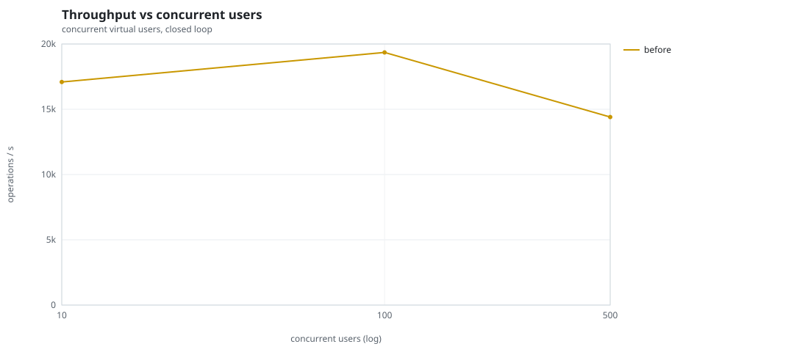
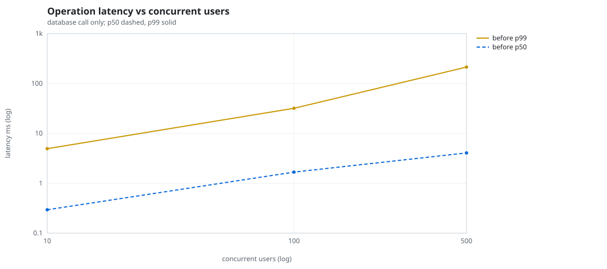
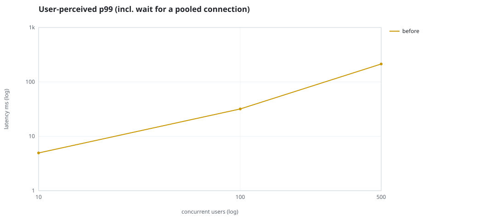
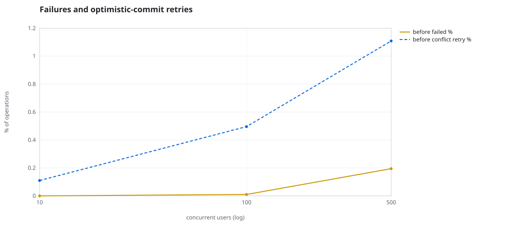
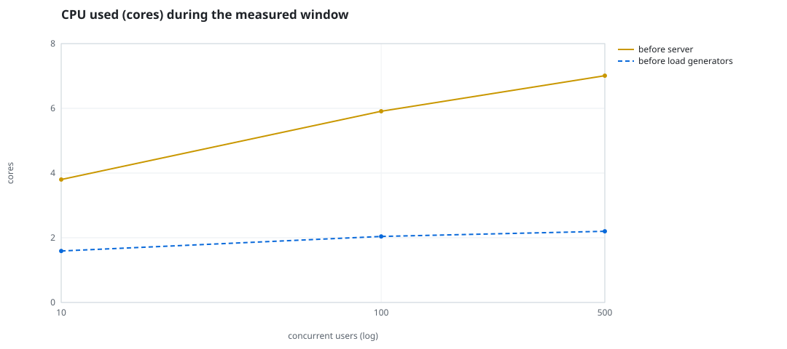
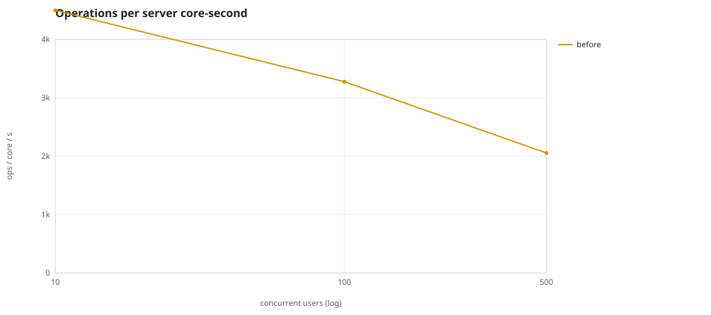
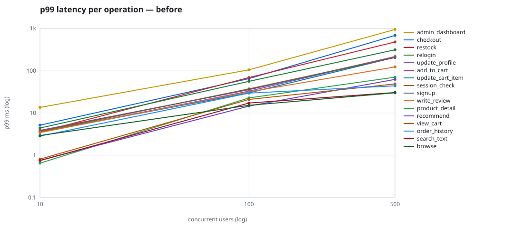

# Mini-SaaS concurrency simulation — sidecar

Run: `before` on 2026-09-23T15:34:33 · commit `92e0290` · macOS-26.6.2-arm64-arm-64bit · 10 CPUs

## Configuration

- **transport**: sidecar
- **levels**: [10, 100, 500]
- **duration**: 20.0
- **warmup**: 3.0
- **ramp**: 3.0
- **think**: [0.0, 0.0]
- **processes**: 0
- **connections**: 0
- **durability**: balanced
- **products**: 5000
- **accounts**: 20000
- **scenario**: compound-index
- **seed**: 1
- **fresh_per_stage**: False
- **seed time**: 1.12 s, 13.1 MiB after seeding

## Capacity and performance curve

Latencies are of the database call (service operation) in milliseconds; `user p99` adds the wait for a pooled connection.

| users | conns | ops/s | reads/s | writes/s | p50 | p95 | p99 | p99.9 | max | user p99 | success % | conflict retry % | srv CPU | srv RSS MiB | gen CPU | thr CV | invariants |
|---:|---:|---:|---:|---:|---:|---:|---:|---:|---:|---:|---:|---:|---:|---:|---:|---:|---:|
| 10 | 10 | 17087.5 | 13219.1 | 3868.3 | 0.294 | 1.513 | 4.94 | 10.914 | 580.119 | 4.941 | 100.0 | 0.11 | 3.8 | 167.8 | 1.59 | 0.227 | ok |
| 100 | 100 | 19354.2 | 14971.5 | 4382.8 | 1.672 | 16.57 | 31.833 | 78.422 | 1943.561 | 31.834 | 99.99 | 0.496 | 5.91 | 322.3 | 2.04 | 0.297 | ok |
| 500 | 500 | 14406.6 | 11139.9 | 3266.8 | 4.051 | 125.886 | 213.42 | 592.567 | 2425.944 | 213.421 | 99.805 | 1.109 | 7.01 | 434.8 | 2.2 | 0.116 | ok |

## Insights

- **Peak throughput**: 19354.2 ops/s at 100 users (p99 31.833 ms).
- **Capacity at p99 ≤ 10 ms**: 10 users (DB latency); 10 users counting pool wait.
- **Capacity at p99 ≤ 50 ms**: 100 users (DB latency); 100 users counting pool wait.
- **Capacity at p99 ≤ 100 ms**: 100 users (DB latency); 100 users counting pool wait.
- **Capacity at p99 ≤ 250 ms**: 500 users (DB latency); 500 users counting pool wait.
- **Capacity at p99 ≤ 1000 ms**: 500 users (DB latency); 500 users counting pool wait.
- **USL fit**: σ (contention) = 0.23, κ (coherency) = 2.51e-04, predicted peak at N ≈ 55.4 (rmse log 0.0183).
- **Ops per server core-second**: 10→4497, 100→3275, 500→2055.
- **Seconds with zero completed operations** (stalls): [(100, 1)].
- **Read-your-writes violations**: none.
- **Business invariants**: all stages ok.
- **Offline integrity check** (elitesql check): ok in 15.21 s.
  - right after killing the server (no clean close): exit 3, 0 errors, 642394 warnings; after one clean open/close: exit 0, 0 errors, 0 warnings.
- **Database size**: 81.3 MiB after the first stage, 167.9 MiB after the last; 38121 paid orders in total.

## p99 latency per operation (ms)

| op | share % | 10 | 100 | 500 |
|---|---:|---:|---:|---:|
| add_to_cart | 10.24 | 3.90 | 35.75 | 216.43 |
| admin_dashboard | 1.01 | 13.61 | 105.41 | 950.24 |
| browse | 20.31 | 2.94 | 15.24 | 30.22 |
| checkout | 3.94 | 5.17 | 65.25 | 688.08 |
| order_history | 3.1 | 2.85 | 29.64 | 44.06 |
| product_detail | 17.34 | 0.65 | 22.82 | 70.72 |
| recommend | 7.09 | 0.76 | 14.61 | 62.60 |
| relogin | 1.55 | 4.42 | 56.25 | 314.15 |
| restock | 0.31 | 3.58 | 68.99 | 479.34 |
| search_text | 8.17 | 0.75 | 17.28 | 30.65 |
| session_check | 12.19 | 3.59 | 37.30 | 207.86 |
| signup | 0.48 | 3.78 | 36.30 | 205.97 |
| update_cart_item | 3.04 | 3.58 | 30.04 | 208.19 |
| update_profile | 1.04 | 3.48 | 32.97 | 216.48 |
| view_cart | 8.16 | 0.81 | 21.01 | 48.79 |
| write_review | 2.02 | 3.46 | 31.82 | 123.69 |

## Errors and business outcomes at the highest level

```json
{
 "statuses": {
  "ok": 284234,
  "conflict_exhausted": 563,
  "empty_cart": 3271,
  "out_of_stock": 49,
  "not_found": 15
 },
 "errors": {
  "conflict_exhausted": {
   "count": 605,
   "first": "[elitesql:9] conflict, retry transaction: products/b4 changed after this transaction began",
   "ops": {
    "checkout": 556,
    "restock": 49
   }
  }
 }
}
```

## Charts








