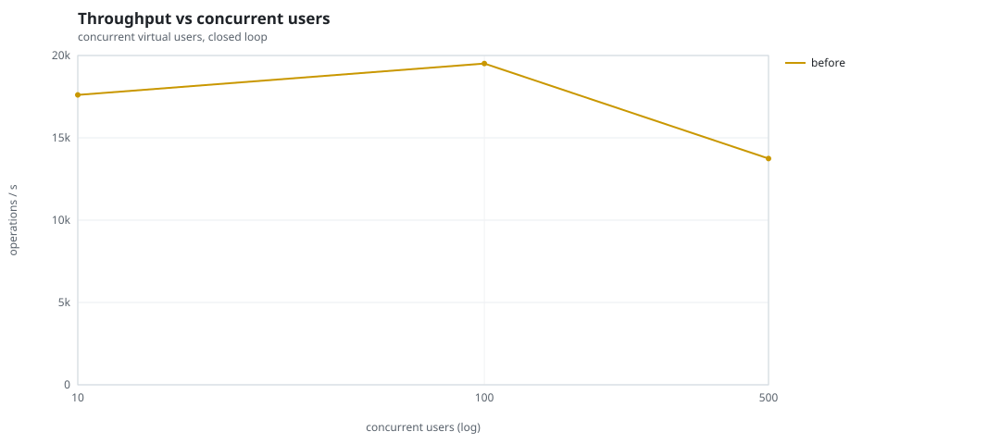
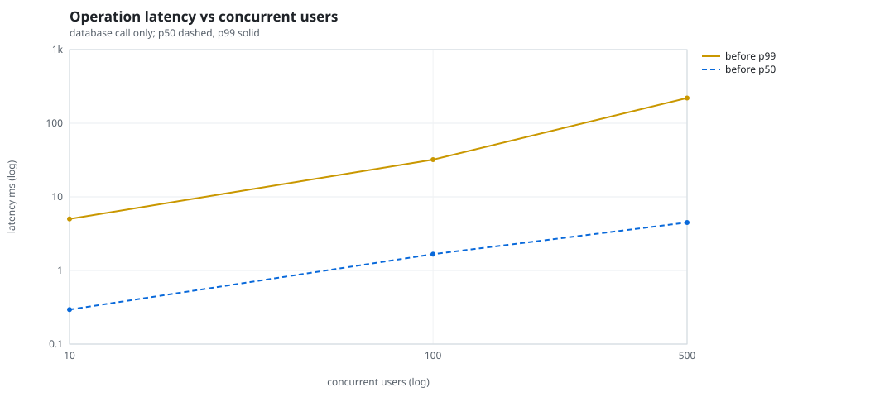
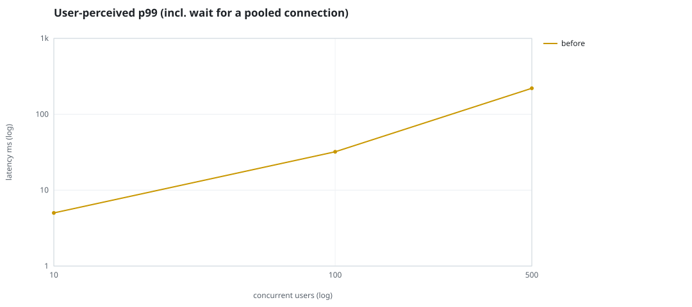
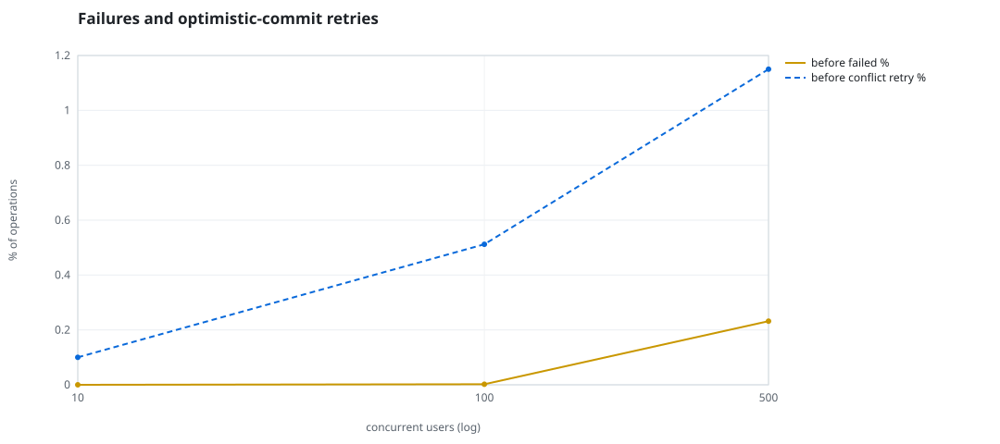
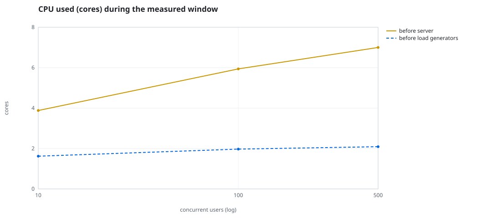
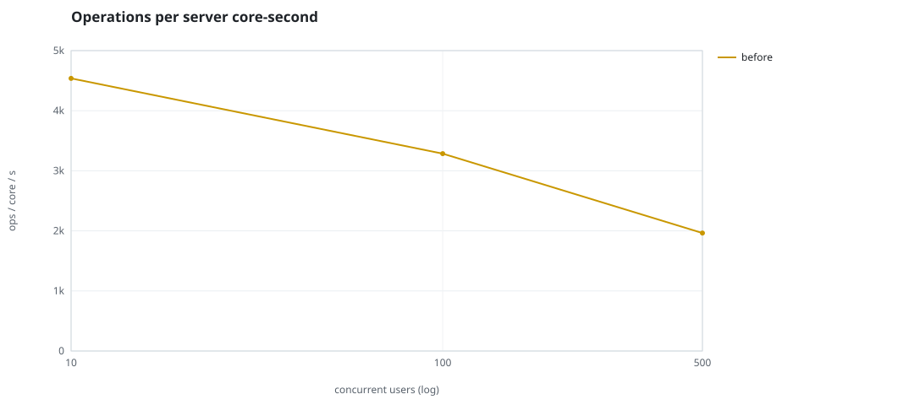
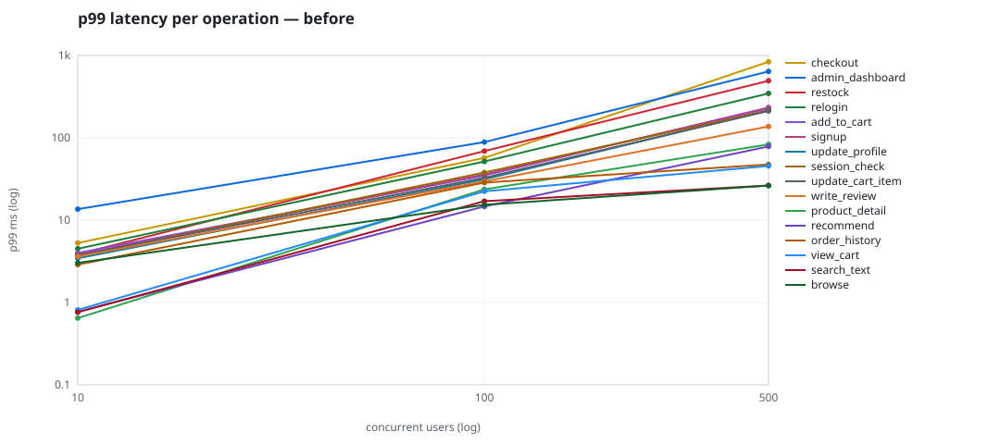

# Mini-SaaS concurrency simulation — sidecar

Run: `before` on 2026-09-23T15:56:37 · commit `92e0290` · macOS-26.6.2-arm64-arm-64bit · 10 CPUs

## Configuration

- **transport**: sidecar
- **levels**: [10, 100, 500]
- **duration**: 20.0
- **warmup**: 3.0
- **ramp**: 3.0
- **think**: [0.0, 0.0]
- **processes**: 0
- **connections**: 0
- **durability**: balanced
- **products**: 5000
- **accounts**: 20000
- **scenario**: compound-index
- **seed**: 1
- **fresh_per_stage**: False
- **seed time**: 1.13 s, 13.1 MiB after seeding

## Capacity and performance curve

Latencies are of the database call (service operation) in milliseconds; `user p99` adds the wait for a pooled connection.

| users | conns | ops/s | reads/s | writes/s | p50 | p95 | p99 | p99.9 | max | user p99 | success % | conflict retry % | srv CPU | srv RSS MiB | gen CPU | thr CV | invariants |
|---:|---:|---:|---:|---:|---:|---:|---:|---:|---:|---:|---:|---:|---:|---:|---:|---:|---:|
| 10 | 10 | 17605.5 | 13621.7 | 3983.8 | 0.294 | 1.624 | 5.012 | 10.91 | 528.931 | 5.013 | 100.0 | 0.1 | 3.88 | 166.8 | 1.62 | 0.197 | ok |
| 100 | 100 | 19509.6 | 15094.6 | 4415.0 | 1.666 | 16.566 | 32.034 | 71.638 | 1743.898 | 32.035 | 99.998 | 0.512 | 5.94 | 319.8 | 1.97 | 0.277 | ok |
| 500 | 500 | 13742.5 | 10629.1 | 3113.4 | 4.485 | 130.164 | 220.033 | 657.01 | 1833.284 | 220.034 | 99.768 | 1.15 | 7.0 | 424.5 | 2.09 | 0.134 | ok |

## Insights

- **Peak throughput**: 19509.6 ops/s at 100 users (p99 32.034 ms).
- **Capacity at p99 ≤ 10 ms**: 10 users (DB latency); 10 users counting pool wait.
- **Capacity at p99 ≤ 50 ms**: 100 users (DB latency); 100 users counting pool wait.
- **Capacity at p99 ≤ 100 ms**: 100 users (DB latency); 100 users counting pool wait.
- **Capacity at p99 ≤ 250 ms**: 500 users (DB latency); 500 users counting pool wait.
- **Capacity at p99 ≤ 1000 ms**: 500 users (DB latency); 500 users counting pool wait.
- **USL fit**: σ (contention) = 0.23, κ (coherency) = 3.16e-04, predicted peak at N ≈ 49.3 (rmse log 0.0204).
- **Ops per server core-second**: 10→4538, 100→3284, 500→1963.
- **Seconds with zero completed operations** (stalls): [(100, 1)].
- **Read-your-writes violations**: none.
- **Business invariants**: all stages ok.
- **Offline integrity check** (elitesql check): ok in 15.1 s.
  - right after killing the server (no clean close): exit 3, 0 errors, 640506 warnings; after one clean open/close: exit 0, 0 errors, 0 warnings.
- **Database size**: 81.9 MiB after the first stage, 166.8 MiB after the last; 37978 paid orders in total.

## p99 latency per operation (ms)

| op | share % | 10 | 100 | 500 |
|---|---:|---:|---:|---:|
| add_to_cart | 10.24 | 4.00 | 34.86 | 233.58 |
| admin_dashboard | 1.02 | 13.60 | 88.73 | 640.00 |
| browse | 20.34 | 3.02 | 15.37 | 26.33 |
| checkout | 3.94 | 5.28 | 56.98 | 837.81 |
| order_history | 3.09 | 2.88 | 28.57 | 47.43 |
| product_detail | 17.32 | 0.65 | 23.64 | 83.32 |
| recommend | 7.09 | 0.77 | 14.65 | 78.65 |
| relogin | 1.55 | 4.50 | 51.62 | 346.14 |
| restock | 0.31 | 3.86 | 69.12 | 493.14 |
| search_text | 8.17 | 0.76 | 16.99 | 26.42 |
| session_check | 12.2 | 3.69 | 37.93 | 215.14 |
| signup | 0.49 | 3.81 | 35.88 | 228.29 |
| update_cart_item | 3.04 | 3.75 | 32.75 | 212.32 |
| update_profile | 1.04 | 3.44 | 31.40 | 215.46 |
| view_cart | 8.16 | 0.81 | 22.39 | 45.57 |
| write_review | 2.01 | 3.62 | 29.56 | 137.60 |

## Errors and business outcomes at the highest level

```json
{
 "statuses": {
  "ok": 271059,
  "conflict_exhausted": 639,
  "empty_cart": 3089,
  "out_of_stock": 51,
  "not_found": 13
 },
 "errors": {
  "conflict_exhausted": {
   "count": 664,
   "first": "[elitesql:9] conflict, retry transaction: products/c16 changed after this transaction began",
   "ops": {
    "checkout": 606,
    "restock": 57,
    "write_review": 1
   }
  }
 }
}
```

## Charts








