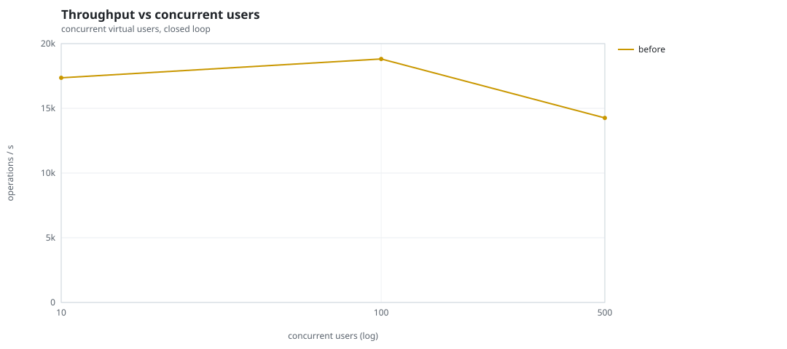
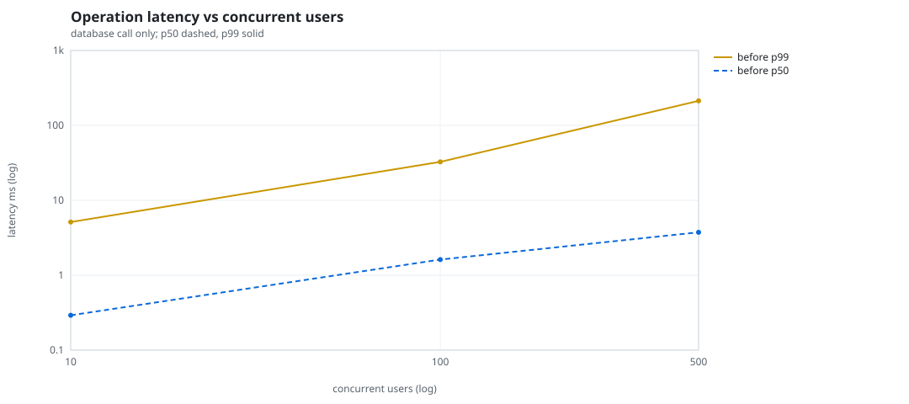
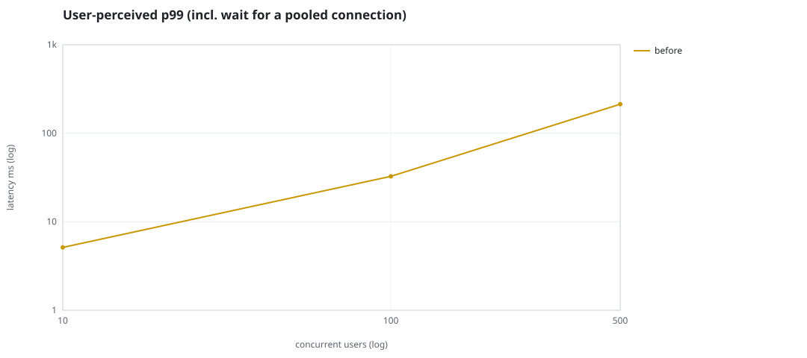
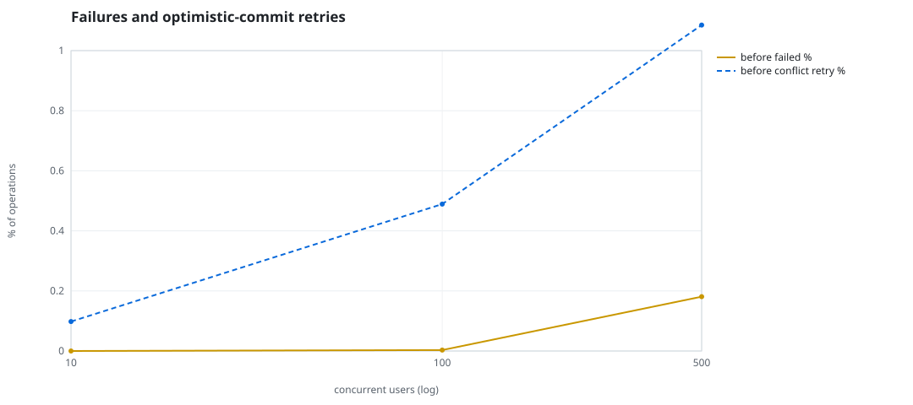
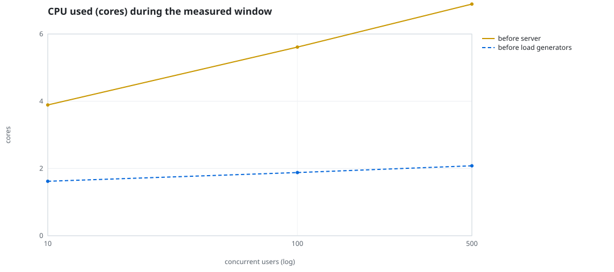
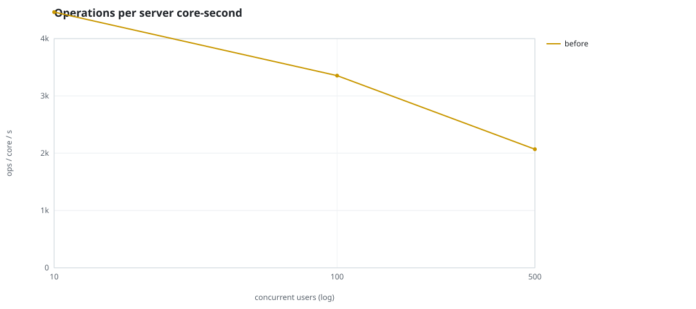
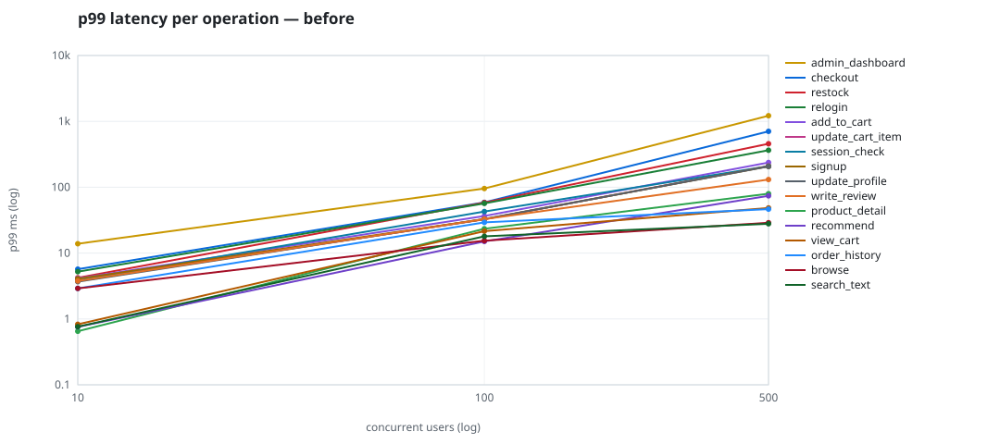

# Mini-SaaS concurrency simulation — sidecar

Run: `before` on 2026-09-23T16:11:00 · commit `92e0290` · macOS-26.6.2-arm64-arm-64bit · 10 CPUs

## Configuration

- **transport**: sidecar
- **levels**: [10, 100, 500]
- **duration**: 20.0
- **warmup**: 3.0
- **ramp**: 3.0
- **think**: [0.0, 0.0]
- **processes**: 0
- **connections**: 0
- **durability**: balanced
- **products**: 5000
- **accounts**: 20000
- **scenario**: compound-index
- **seed**: 1
- **fresh_per_stage**: False
- **seed time**: 1.15 s, 13.1 MiB after seeding

## Capacity and performance curve

Latencies are of the database call (service operation) in milliseconds; `user p99` adds the wait for a pooled connection.

| users | conns | ops/s | reads/s | writes/s | p50 | p95 | p99 | p99.9 | max | user p99 | success % | conflict retry % | srv CPU | srv RSS MiB | gen CPU | thr CV | invariants |
|---:|---:|---:|---:|---:|---:|---:|---:|---:|---:|---:|---:|---:|---:|---:|---:|---:|---:|
| 10 | 10 | 17361.5 | 13431.1 | 3930.3 | 0.292 | 1.638 | 5.131 | 11.165 | 636.381 | 5.132 | 100.0 | 0.098 | 3.89 | 169.8 | 1.62 | 0.196 | ok |
| 100 | 100 | 18816.4 | 14559.5 | 4256.9 | 1.617 | 16.763 | 32.628 | 83.16 | 1925.266 | 32.629 | 99.997 | 0.489 | 5.61 | 320.8 | 1.88 | 0.332 | ok |
| 500 | 500 | 14258.3 | 11024.5 | 3233.8 | 3.742 | 123.671 | 213.078 | 738.867 | 2830.813 | 213.079 | 99.819 | 1.085 | 6.89 | 436.7 | 2.08 | 0.158 | ok |

## Insights

- **Peak throughput**: 18816.4 ops/s at 100 users (p99 32.628 ms).
- **Capacity at p99 ≤ 10 ms**: 10 users (DB latency); 10 users counting pool wait.
- **Capacity at p99 ≤ 50 ms**: 100 users (DB latency); 100 users counting pool wait.
- **Capacity at p99 ≤ 100 ms**: 100 users (DB latency); 100 users counting pool wait.
- **Capacity at p99 ≤ 250 ms**: 500 users (DB latency); 500 users counting pool wait.
- **Capacity at p99 ≤ 1000 ms**: 500 users (DB latency); 500 users counting pool wait.
- **USL fit**: σ (contention) = 0.24, κ (coherency) = 2.51e-04, predicted peak at N ≈ 55.0 (rmse log 0.0354).
- **Ops per server core-second**: 10→4463, 100→3354, 500→2069.
- **Read-your-writes violations**: none.
- **Business invariants**: all stages ok.
- **Offline integrity check** (elitesql check): ok in 15.39 s.
  - right after killing the server (no clean close): exit 3, 0 errors, 640784 warnings; after one clean open/close: exit 0, 0 errors, 0 warnings.
- **Database size**: 82.0 MiB after the first stage, 167.0 MiB after the last; 38055 paid orders in total.

## p99 latency per operation (ms)

| op | share % | 10 | 100 | 500 |
|---|---:|---:|---:|---:|
| add_to_cart | 10.25 | 4.12 | 36.60 | 237.17 |
| admin_dashboard | 1.02 | 13.85 | 95.69 | 1219.84 |
| browse | 20.31 | 2.91 | 15.40 | 28.89 |
| checkout | 3.94 | 5.70 | 58.93 | 704.42 |
| order_history | 3.1 | 2.91 | 29.29 | 46.44 |
| product_detail | 17.32 | 0.65 | 23.43 | 79.76 |
| recommend | 7.09 | 0.76 | 15.05 | 74.07 |
| relogin | 1.55 | 5.21 | 56.83 | 364.21 |
| restock | 0.31 | 4.21 | 58.53 | 457.11 |
| search_text | 8.17 | 0.76 | 17.96 | 27.90 |
| session_check | 12.2 | 3.82 | 42.70 | 208.61 |
| signup | 0.49 | 4.06 | 32.75 | 207.83 |
| update_cart_item | 3.04 | 3.82 | 32.52 | 210.62 |
| update_profile | 1.04 | 3.68 | 32.85 | 207.17 |
| view_cart | 8.15 | 0.83 | 21.49 | 48.53 |
| write_review | 2.01 | 3.77 | 32.75 | 130.65 |

## Errors and business outcomes at the highest level

```json
{
 "statuses": {
  "ok": 281278,
  "empty_cart": 3305,
  "conflict_exhausted": 517,
  "out_of_stock": 51,
  "not_found": 15
 },
 "errors": {
  "conflict_exhausted": {
   "count": 546,
   "first": "[elitesql:9] conflict, retry transaction: products/b8 changed after this transaction began",
   "ops": {
    "checkout": 495,
    "restock": 51
   }
  }
 }
}
```

## Charts








