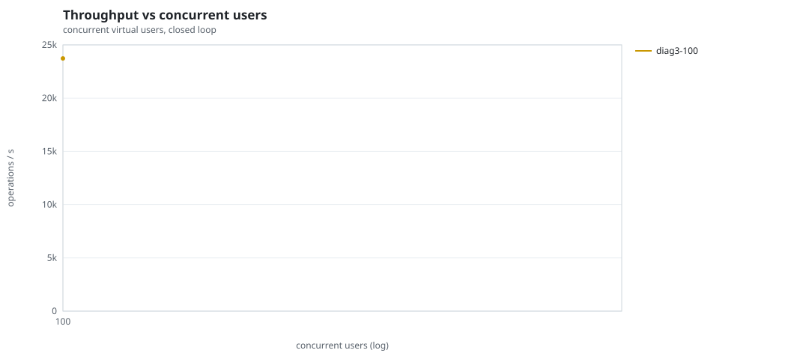
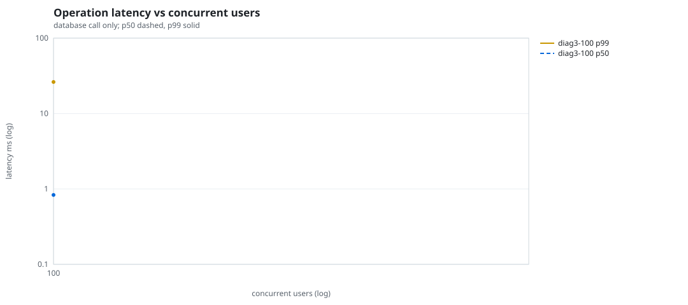
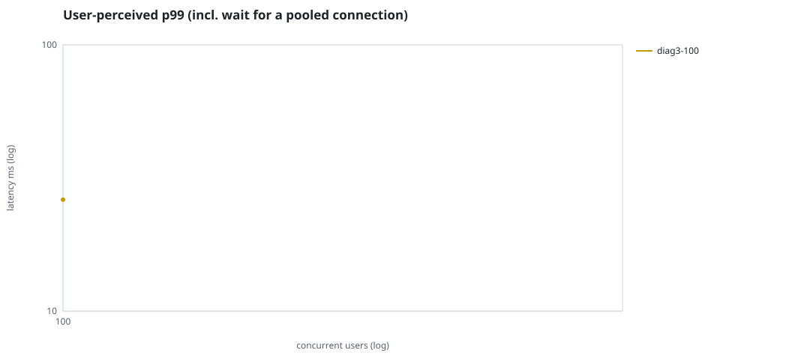
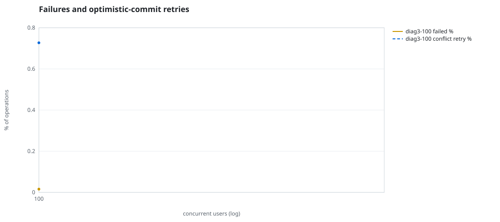
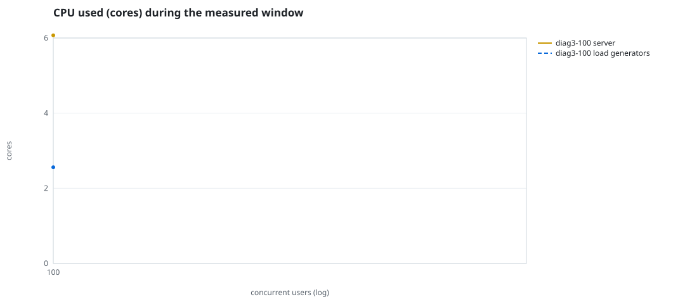
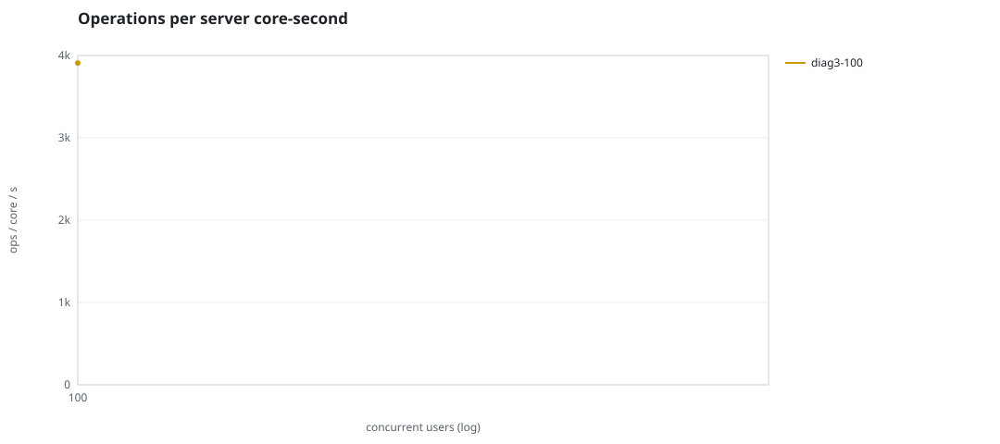
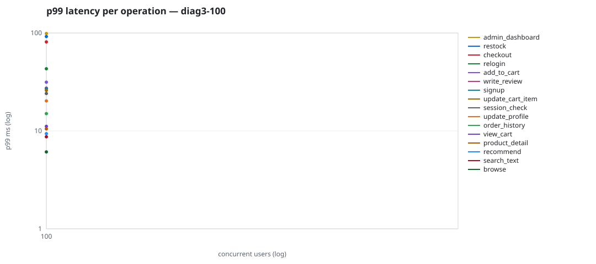

# Mini-SaaS concurrency simulation — sidecar

Run: `diag3-100` on 2026-09-23T14:47:14 · commit `92e0290` · macOS-26.6.2-arm64-arm-64bit · 10 CPUs

## Configuration

- **transport**: sidecar
- **levels**: [100]
- **duration**: 15.0
- **warmup**: 3.0
- **ramp**: 3.0
- **think**: [0.0, 0.0]
- **processes**: 0
- **connections**: 0
- **durability**: balanced
- **products**: 5000
- **accounts**: 20000
- **scenario**: compound-index
- **seed**: 1
- **fresh_per_stage**: False
- **seed time**: 1.12 s, 13.1 MiB after seeding

## Capacity and performance curve

Latencies are of the database call (service operation) in milliseconds; `user p99` adds the wait for a pooled connection.

| users | conns | ops/s | reads/s | writes/s | p50 | p95 | p99 | p99.9 | max | user p99 | success % | conflict retry % | srv CPU | srv RSS MiB | gen CPU | thr CV | invariants |
|---:|---:|---:|---:|---:|---:|---:|---:|---:|---:|---:|---:|---:|---:|---:|---:|---:|---:|
| 100 | 100 | 23726.1 | 18358.4 | 5367.7 | 0.832 | 14.838 | 26.206 | 65.535 | 989.988 | 26.207 | 99.984 | 0.727 | 6.07 | 251.8 | 2.56 | 0.068 | ok |

## Insights

- **Peak throughput**: 23726.1 ops/s at 100 users (p99 26.206 ms).
- **Capacity at p99 ≤ 10 ms**: 0 users (DB latency); 0 users counting pool wait.
- **Capacity at p99 ≤ 50 ms**: 100 users (DB latency); 100 users counting pool wait.
- **Capacity at p99 ≤ 100 ms**: 100 users (DB latency); 100 users counting pool wait.
- **Capacity at p99 ≤ 250 ms**: 100 users (DB latency); 100 users counting pool wait.
- **Capacity at p99 ≤ 1000 ms**: 100 users (DB latency); 100 users counting pool wait.
- **Ops per server core-second**: 100→3909.
- **Read-your-writes violations**: none.
- **Business invariants**: all stages ok.
- **Offline integrity check** (elitesql check): ok in 8.35 s.
  - right after killing the server (no clean close): exit 3, 0 errors, 285702 warnings; after one clean open/close: exit 0, 0 errors, 0 warnings.
- **Database size**: 88.6 MiB after the first stage, 88.6 MiB after the last; 14980 paid orders in total.

## p99 latency per operation (ms)

| op | share % | 100 |
|---|---:|---:|
| add_to_cart | 10.11 | 31.45 |
| admin_dashboard | 1.03 | 98.87 |
| browse | 20.41 | 6.10 |
| checkout | 4.08 | 81.07 |
| order_history | 3.02 | 15.01 |
| product_detail | 17.22 | 10.48 |
| recommend | 7.14 | 9.38 |
| relogin | 1.54 | 43.15 |
| restock | 0.3 | 92.03 |
| search_text | 8.2 | 8.71 |
| session_check | 12.19 | 24.09 |
| signup | 0.51 | 27.01 |
| update_cart_item | 3.03 | 25.93 |
| update_profile | 1.03 | 20.25 |
| view_cart | 8.17 | 11.13 |
| write_review | 2.04 | 27.35 |

## Errors and business outcomes at the highest level

```json
{
 "statuses": {
  "ok": 351511,
  "empty_cart": 4300,
  "not_found": 24,
  "conflict_exhausted": 56
 },
 "errors": {
  "conflict_exhausted": {
   "count": 70,
   "first": "[elitesql:9] conflict, retry transaction: products/b6 changed after this transaction began",
   "ops": {
    "checkout": 69,
    "restock": 1
   }
  }
 }
}
```

## Charts








