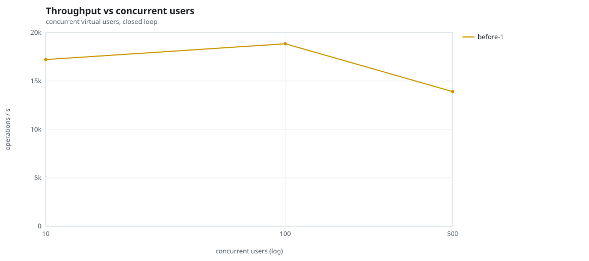
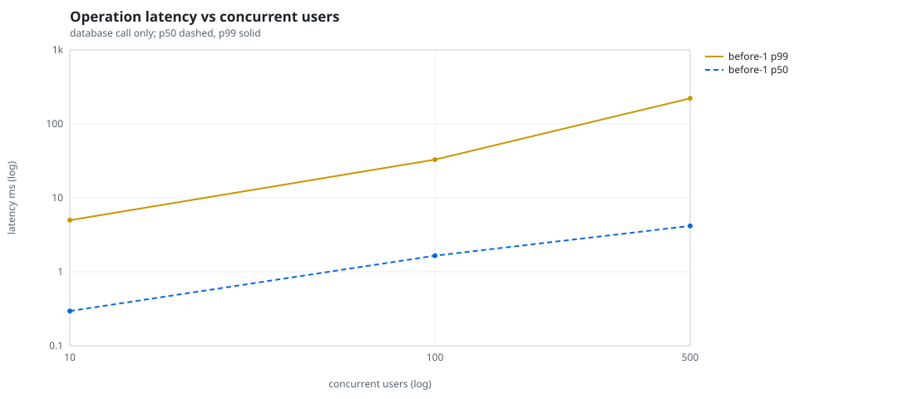
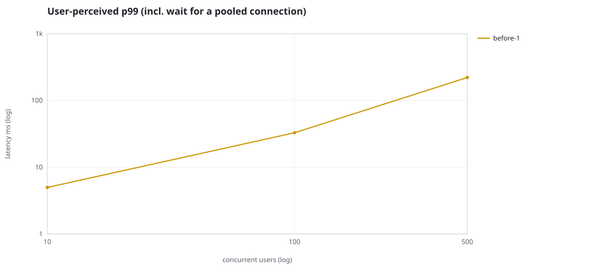
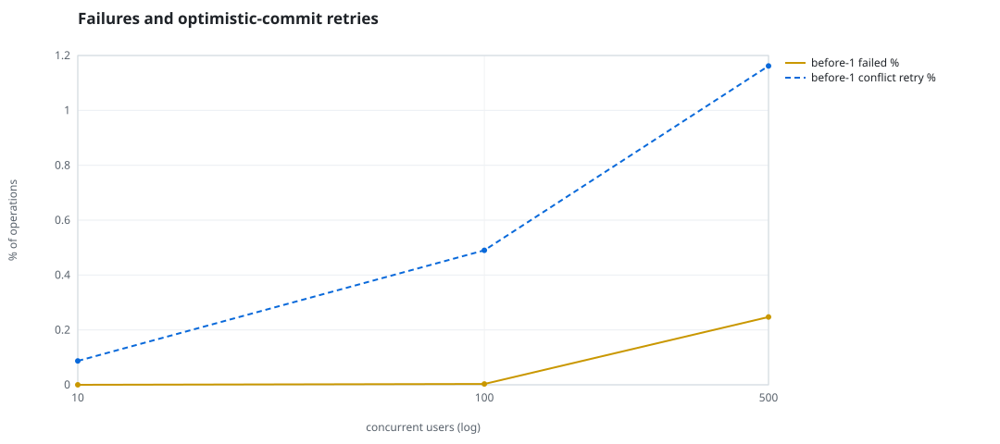
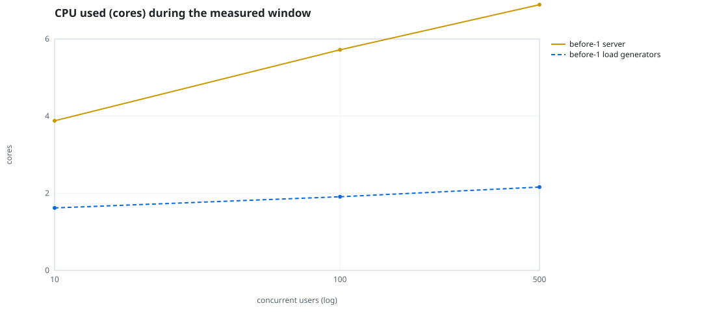
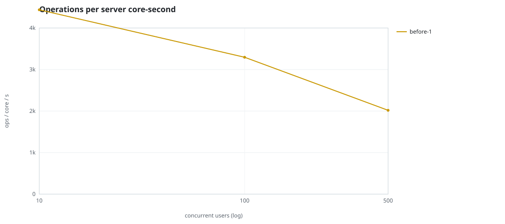
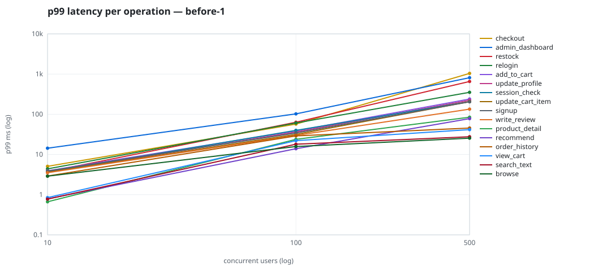

# Mini-SaaS concurrency simulation — sidecar

Run: `before-1` on 2026-09-23T15:28:20 · commit `92e0290` · macOS-26.6.2-arm64-arm-64bit · 10 CPUs

## Configuration

- **transport**: sidecar
- **levels**: [10, 100, 500]
- **duration**: 20.0
- **warmup**: 3.0
- **ramp**: 3.0
- **think**: [0.0, 0.0]
- **processes**: 0
- **connections**: 0
- **durability**: balanced
- **products**: 5000
- **accounts**: 20000
- **scenario**: compound-index
- **seed**: 1
- **fresh_per_stage**: False
- **seed time**: 1.12 s, 13.1 MiB after seeding

## Capacity and performance curve

Latencies are of the database call (service operation) in milliseconds; `user p99` adds the wait for a pooled connection.

| users | conns | ops/s | reads/s | writes/s | p50 | p95 | p99 | p99.9 | max | user p99 | success % | conflict retry % | srv CPU | srv RSS MiB | gen CPU | thr CV | invariants |
|---:|---:|---:|---:|---:|---:|---:|---:|---:|---:|---:|---:|---:|---:|---:|---:|---:|---:|
| 10 | 10 | 17221.5 | 13321.7 | 3899.8 | 0.295 | 1.568 | 4.981 | 11.274 | 543.395 | 4.982 | 100.0 | 0.087 | 3.88 | 169.6 | 1.62 | 0.232 | ok |
| 100 | 100 | 18848.3 | 14580.8 | 4267.5 | 1.654 | 16.757 | 32.904 | 85.106 | 1712.136 | 32.905 | 99.997 | 0.49 | 5.72 | 327.4 | 1.91 | 0.305 | ok |
| 500 | 500 | 13904.2 | 10751.8 | 3152.5 | 4.174 | 127.214 | 221.067 | 815.73 | 1992.42 | 221.068 | 99.753 | 1.162 | 6.89 | 442.4 | 2.16 | 0.161 | ok |

## Insights

- **Peak throughput**: 18848.3 ops/s at 100 users (p99 32.904 ms).
- **Capacity at p99 ≤ 10 ms**: 10 users (DB latency); 10 users counting pool wait.
- **Capacity at p99 ≤ 50 ms**: 100 users (DB latency); 100 users counting pool wait.
- **Capacity at p99 ≤ 100 ms**: 100 users (DB latency); 100 users counting pool wait.
- **Capacity at p99 ≤ 250 ms**: 500 users (DB latency); 500 users counting pool wait.
- **Capacity at p99 ≤ 1000 ms**: 500 users (DB latency); 500 users counting pool wait.
- **USL fit**: σ (contention) = 0.23, κ (coherency) = 3.16e-04, predicted peak at N ≈ 49.3 (rmse log 0.0345).
- **Ops per server core-second**: 10→4439, 100→3295, 500→2018.
- **Seconds with zero completed operations** (stalls): [(100, 1)].
- **Read-your-writes violations**: none.
- **Business invariants**: all stages ok.
- **Offline integrity check** (elitesql check): ok in 14.84 s.
  - right after killing the server (no clean close): exit 3, 0 errors, 634274 warnings; after one clean open/close: exit 0, 0 errors, 0 warnings.
- **Database size**: 81.7 MiB after the first stage, 165.0 MiB after the last; 37549 paid orders in total.

## p99 latency per operation (ms)

| op | share % | 10 | 100 | 500 |
|---|---:|---:|---:|---:|
| add_to_cart | 10.24 | 3.92 | 38.61 | 239.32 |
| admin_dashboard | 1.02 | 14.34 | 102.45 | 814.11 |
| browse | 20.3 | 2.89 | 15.80 | 25.43 |
| checkout | 3.94 | 5.07 | 56.88 | 1039.05 |
| order_history | 3.1 | 2.91 | 28.97 | 45.41 |
| product_detail | 17.33 | 0.67 | 23.76 | 84.59 |
| recommend | 7.1 | 0.79 | 13.90 | 77.90 |
| relogin | 1.55 | 4.39 | 60.68 | 351.38 |
| restock | 0.31 | 3.70 | 63.32 | 655.70 |
| search_text | 8.17 | 0.77 | 18.04 | 27.62 |
| session_check | 12.19 | 3.63 | 39.73 | 206.65 |
| signup | 0.49 | 3.88 | 34.23 | 204.20 |
| update_cart_item | 3.05 | 3.61 | 31.51 | 206.20 |
| update_profile | 1.04 | 3.59 | 36.23 | 223.33 |
| view_cart | 8.16 | 0.85 | 22.10 | 41.45 |
| write_review | 2.02 | 3.51 | 29.80 | 134.11 |

## Errors and business outcomes at the highest level

```json
{
 "statuses": {
  "ok": 274192,
  "empty_cart": 3146,
  "conflict_exhausted": 687,
  "not_found": 14,
  "out_of_stock": 46
 },
 "errors": {
  "conflict_exhausted": {
   "count": 726,
   "first": "[elitesql:9] conflict, retry transaction: products/c16 changed after this transaction began",
   "ops": {
    "checkout": 664,
    "restock": 62
   }
  }
 }
}
```

## Charts








