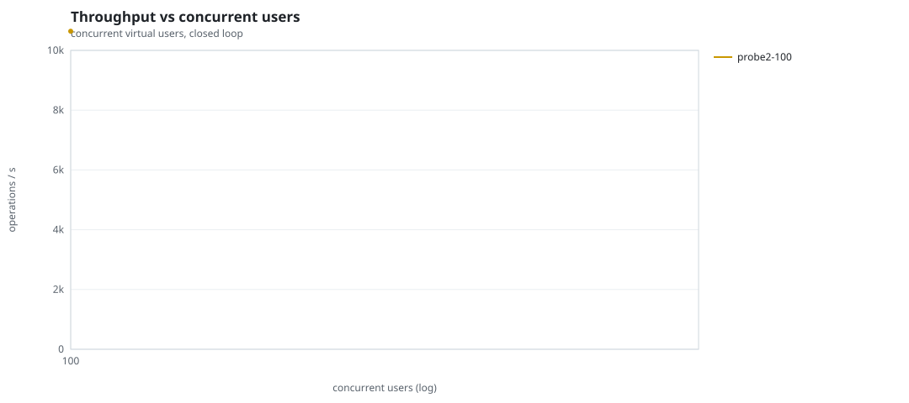
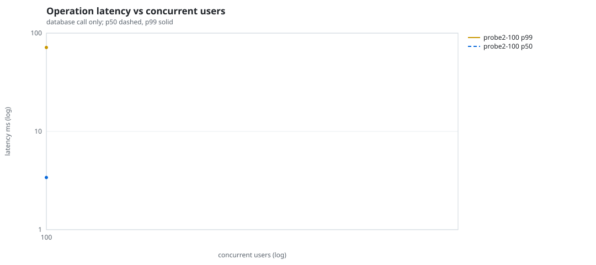
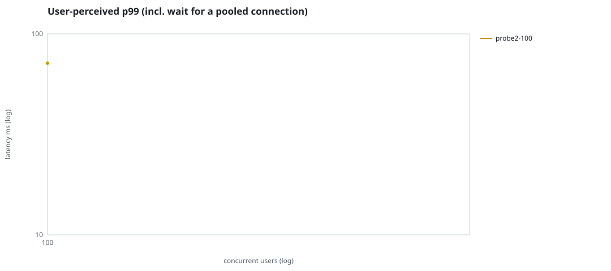
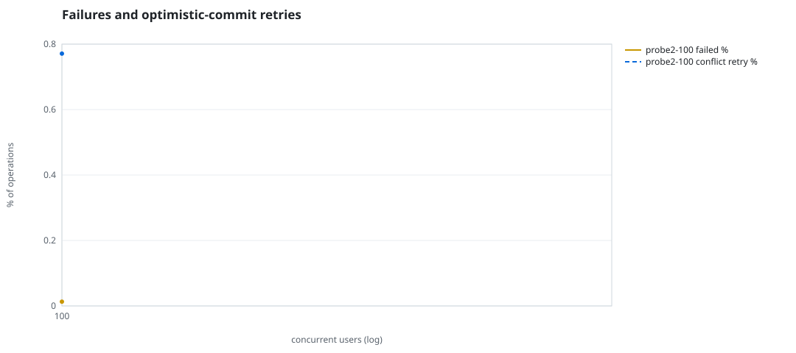
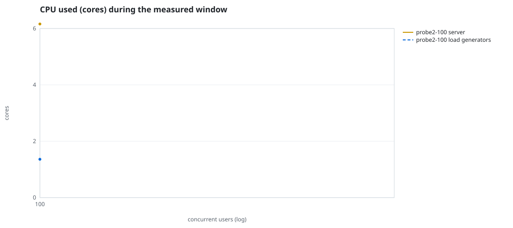
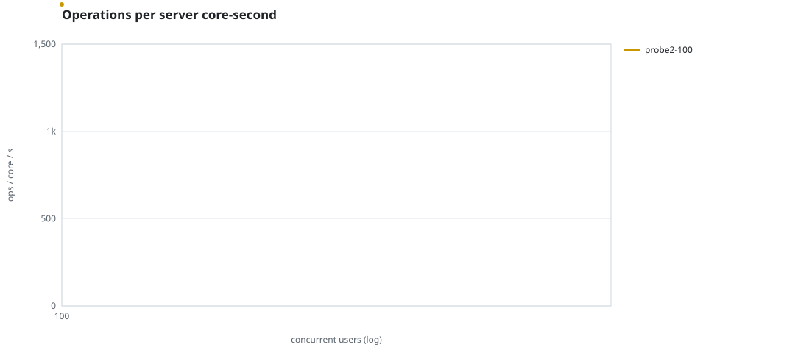
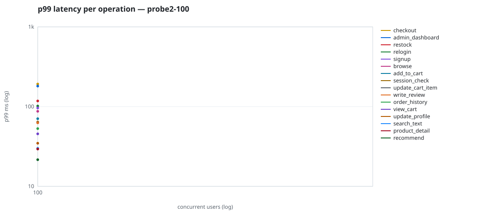

# Mini-SaaS concurrency simulation — sidecar

Run: `probe2-100` on 2026-09-23T13:00:24 · commit `92e0290` · macOS-26.6.2-arm64-arm-64bit · 10 CPUs

## Configuration

- **transport**: sidecar
- **levels**: [100]
- **duration**: 15.0
- **warmup**: 3.0
- **ramp**: 3.0
- **think**: [0.0, 0.0]
- **processes**: 0
- **connections**: 0
- **durability**: balanced
- **products**: 5000
- **accounts**: 20000
- **scenario**: compound-index
- **seed**: 1
- **fresh_per_stage**: False
- **seed time**: 1.22 s, 13.1 MiB after seeding

## Capacity and performance curve

Latencies are of the database call (service operation) in milliseconds; `user p99` adds the wait for a pooled connection.

| users | conns | ops/s | reads/s | writes/s | p50 | p95 | p99 | p99.9 | max | user p99 | success % | conflict retry % | srv CPU | srv RSS MiB | gen CPU | thr CV | invariants |
|---:|---:|---:|---:|---:|---:|---:|---:|---:|---:|---:|---:|---:|---:|---:|---:|---:|---:|
| 100 | 100 | 10641.7 | 8240.5 | 2401.1 | 3.396 | 32.13 | 71.484 | 154.441 | 1422.878 | 71.486 | 99.987 | 0.771 | 6.16 | 123.2 | 1.36 | 0.101 | ok |

## Insights

- **Peak throughput**: 10641.7 ops/s at 100 users (p99 71.484 ms).
- **Capacity at p99 ≤ 10 ms**: 0 users (DB latency); 0 users counting pool wait.
- **Capacity at p99 ≤ 50 ms**: 0 users (DB latency); 0 users counting pool wait.
- **Capacity at p99 ≤ 100 ms**: 100 users (DB latency); 100 users counting pool wait.
- **Capacity at p99 ≤ 250 ms**: 100 users (DB latency); 100 users counting pool wait.
- **Capacity at p99 ≤ 1000 ms**: 100 users (DB latency); 100 users counting pool wait.
- **Ops per server core-second**: 100→1728.
- **Read-your-writes violations**: none.
- **Business invariants**: all stages ok.
- **Offline integrity check** (elitesql check): ok in 5.37 s.
  - right after killing the server (no clean close): exit 3, 0 errors, 163244 warnings; after one clean open/close: exit 0, 0 errors, 0 warnings.
- **Database size**: 46.7 MiB after the first stage, 46.7 MiB after the last; 6791 paid orders in total.

## p99 latency per operation (ms)

| op | share % | 100 |
|---|---:|---:|
| add_to_cart | 10.02 | 70.52 |
| admin_dashboard | 1.04 | 180.78 |
| browse | 20.46 | 87.33 |
| checkout | 4.09 | 192.01 |
| order_history | 3.05 | 53.01 |
| product_detail | 17.33 | 29.37 |
| recommend | 7.14 | 21.60 |
| relogin | 1.58 | 101.63 |
| restock | 0.32 | 117.70 |
| search_text | 8.13 | 29.99 |
| session_check | 12.16 | 64.07 |
| signup | 0.49 | 96.08 |
| update_cart_item | 2.99 | 63.00 |
| update_profile | 1.03 | 34.69 |
| view_cart | 8.12 | 45.52 |
| write_review | 2.04 | 62.59 |

## Errors and business outcomes at the highest level

```json
{
 "statuses": {
  "ok": 157601,
  "empty_cart": 1992,
  "not_found": 12,
  "conflict_exhausted": 20
 },
 "errors": {
  "conflict_exhausted": {
   "count": 26,
   "first": "[elitesql:9] conflict, retry transaction: products/c20 changed after this transaction began",
   "ops": {
    "checkout": 24,
    "restock": 2
   }
  }
 }
}
```

## Charts








