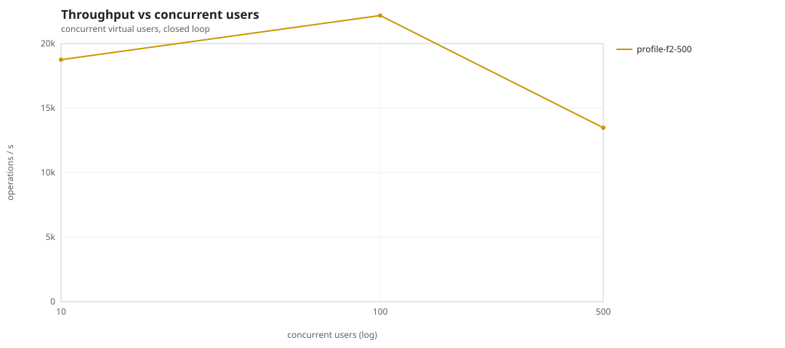
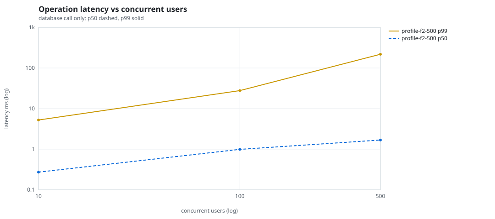
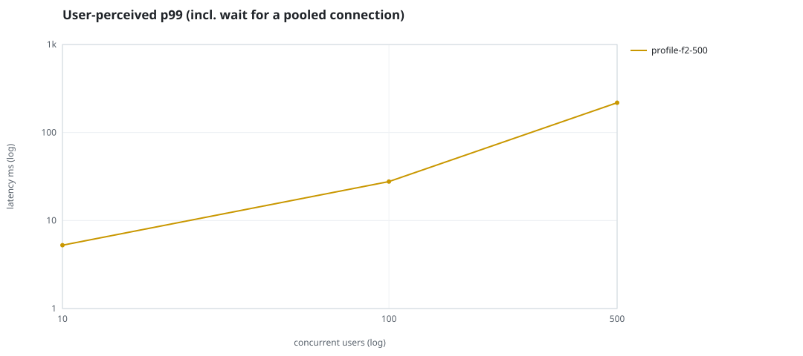
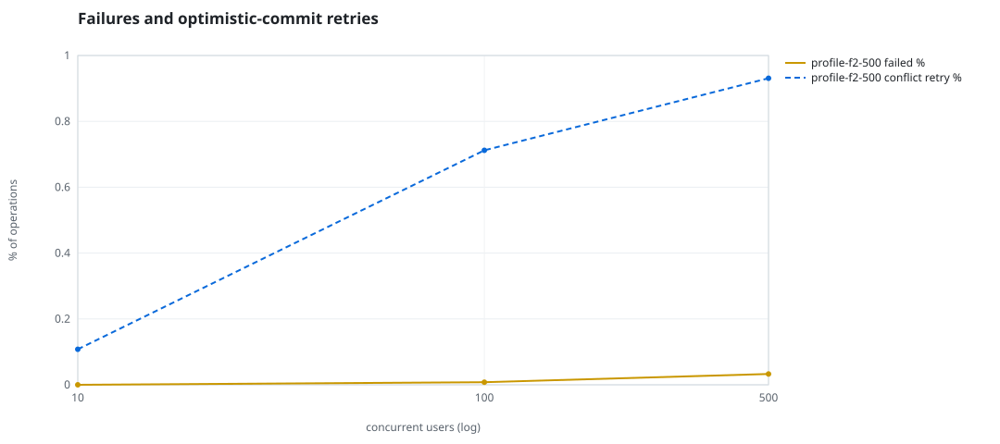
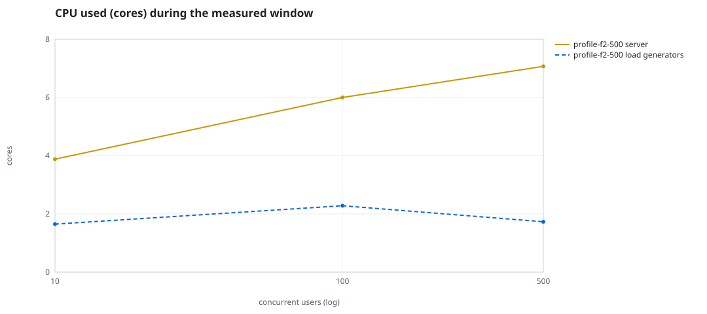
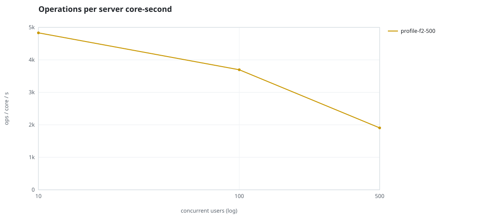
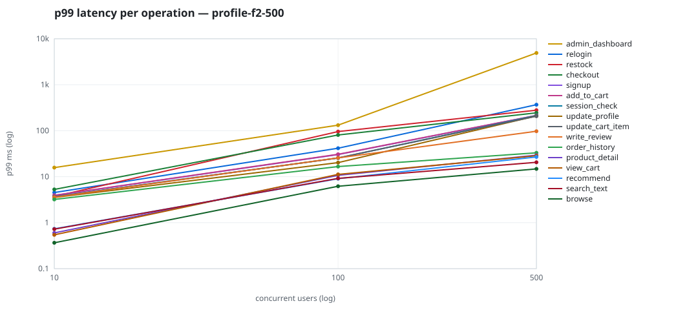

# Mini-SaaS concurrency simulation — sidecar

Run: `profile-f2-500` on 2026-09-23T15:52:53 · commit `92e0290` · macOS-26.6.2-arm64-arm-64bit · 10 CPUs

## Configuration

- **transport**: sidecar
- **levels**: [10, 100, 500]
- **duration**: 20.0
- **warmup**: 3.0
- **ramp**: 3.0
- **think**: [0.0, 0.0]
- **processes**: 0
- **connections**: 0
- **durability**: balanced
- **products**: 5000
- **accounts**: 20000
- **scenario**: compound-index
- **seed**: 1
- **fresh_per_stage**: False
- **seed time**: 1.13 s, 13.1 MiB after seeding

## Capacity and performance curve

Latencies are of the database call (service operation) in milliseconds; `user p99` adds the wait for a pooled connection.

| users | conns | ops/s | reads/s | writes/s | p50 | p95 | p99 | p99.9 | max | user p99 | success % | conflict retry % | srv CPU | srv RSS MiB | gen CPU | thr CV | invariants |
|---:|---:|---:|---:|---:|---:|---:|---:|---:|---:|---:|---:|---:|---:|---:|---:|---:|---:|
| 10 | 10 | 18747.7 | 14504.0 | 4243.6 | 0.272 | 1.501 | 5.243 | 12.48 | 578.094 | 5.244 | 100.0 | 0.108 | 3.88 | 180.2 | 1.65 | 0.152 | ok |
| 100 | 100 | 22170.4 | 17148.5 | 5021.9 | 0.99 | 15.628 | 27.706 | 74.306 | 966.734 | 27.707 | 99.992 | 0.712 | 6.0 | 272.7 | 2.28 | 0.09 | ok |
| 500 | 500 | 13473.8 | 10428.9 | 3044.9 | 1.68 | 124.796 | 218.037 | 2837.285 | 6642.976 | 218.038 | 99.967 | 0.931 | 7.07 | 448.6 | 1.73 | 0.24 | ok |

## Insights

- **Peak throughput**: 22170.4 ops/s at 100 users (p99 27.706 ms).
- **Capacity at p99 ≤ 10 ms**: 10 users (DB latency); 10 users counting pool wait.
- **Capacity at p99 ≤ 50 ms**: 100 users (DB latency); 100 users counting pool wait.
- **Capacity at p99 ≤ 100 ms**: 100 users (DB latency); 100 users counting pool wait.
- **Capacity at p99 ≤ 250 ms**: 500 users (DB latency); 500 users counting pool wait.
- **Capacity at p99 ≤ 1000 ms**: 500 users (DB latency); 500 users counting pool wait.
- **USL fit**: σ (contention) = 0.21, κ (coherency) = 3.98e-04, predicted peak at N ≈ 44.5 (rmse log 0.0194).
- **Ops per server core-second**: 10→4832, 100→3695, 500→1906.
- **Read-your-writes violations**: none.
- **Business invariants**: all stages ok.
- **Offline integrity check** (elitesql check): ok in 15.62 s.
  - right after killing the server (no clean close): exit 3, 0 errors, 648640 warnings; after one clean open/close: exit 0, 0 errors, 0 warnings.
- **Database size**: 86.8 MiB after the first stage, 169.6 MiB after the last; 38739 paid orders in total.

## p99 latency per operation (ms)

| op | share % | 10 | 100 | 500 |
|---|---:|---:|---:|---:|
| add_to_cart | 10.23 | 3.94 | 30.71 | 215.22 |
| admin_dashboard | 1.02 | 15.77 | 132.03 | 4905.71 |
| browse | 20.29 | 0.37 | 6.20 | 14.81 |
| checkout | 3.94 | 5.28 | 80.68 | 245.16 |
| order_history | 3.11 | 3.20 | 16.59 | 33.08 |
| product_detail | 17.32 | 0.60 | 10.70 | 29.41 |
| recommend | 7.1 | 0.74 | 9.04 | 26.89 |
| relogin | 1.55 | 4.53 | 41.60 | 367.94 |
| restock | 0.31 | 3.72 | 95.86 | 279.44 |
| search_text | 8.14 | 0.72 | 9.19 | 20.54 |
| session_check | 12.21 | 3.69 | 25.47 | 213.63 |
| signup | 0.49 | 3.92 | 30.34 | 215.31 |
| update_cart_item | 3.05 | 3.64 | 25.63 | 207.18 |
| update_profile | 1.04 | 3.53 | 20.24 | 209.65 |
| view_cart | 8.17 | 0.54 | 11.23 | 28.55 |
| write_review | 2.01 | 3.58 | 25.65 | 97.60 |

## Errors and business outcomes at the highest level

```json
{
 "statuses": {
  "ok": 266163,
  "empty_cart": 3157,
  "out_of_stock": 57,
  "conflict_exhausted": 89,
  "not_found": 8,
  "error:16": 1
 },
 "errors": {
  "conflict_exhausted": {
   "count": 98,
   "first": "[elitesql:9] conflict, retry transaction: products/b2 changed after this transaction began",
   "ops": {
    "checkout": 81,
    "restock": 17
   }
  },
  "error:16": {
   "count": 1,
   "first": "[elitesql:16] memory limit exceeded: query memory admission timed out",
   "ops": {
    "admin_dashboard": 1
   }
  }
 }
}
```

## Charts








