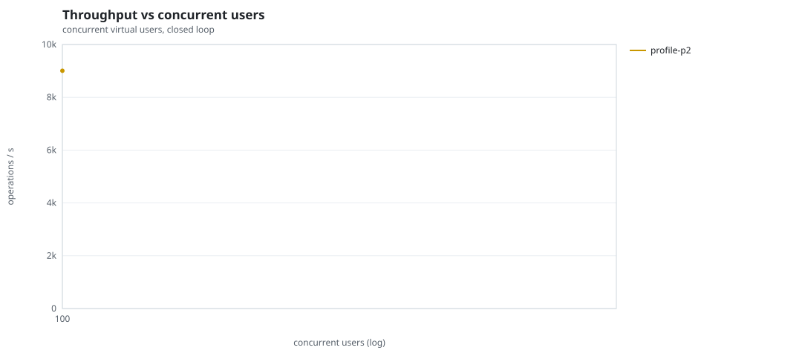
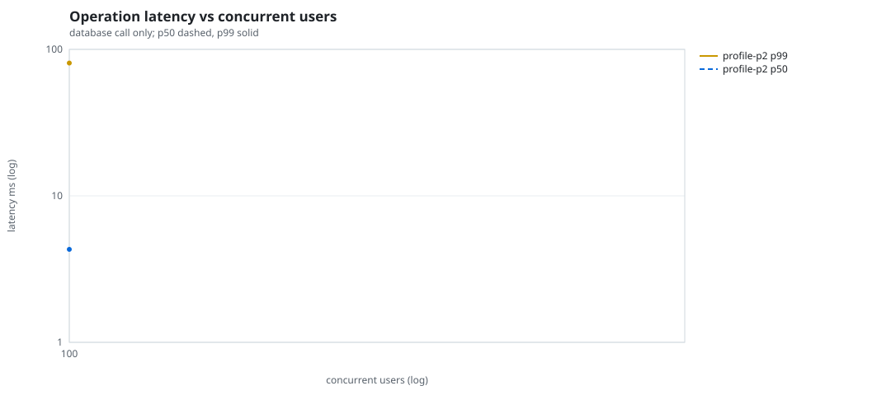
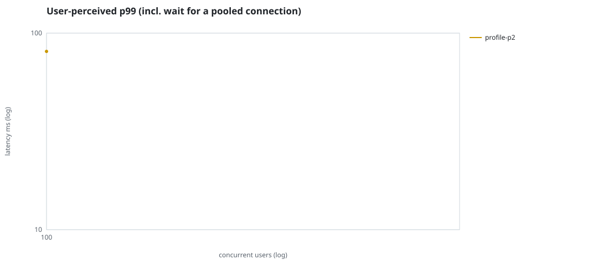
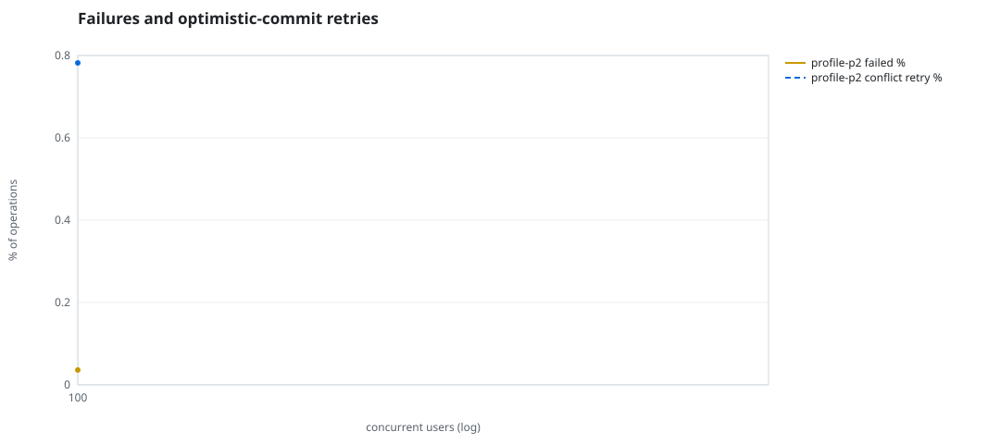
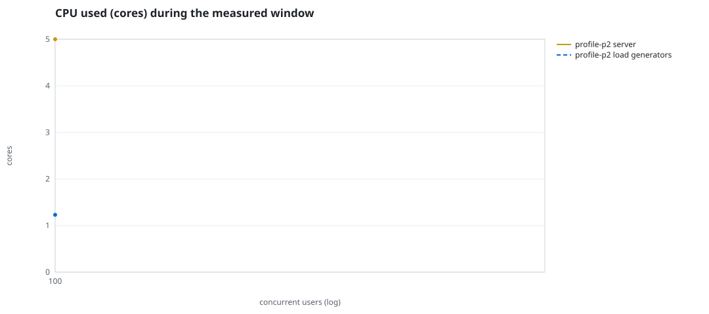
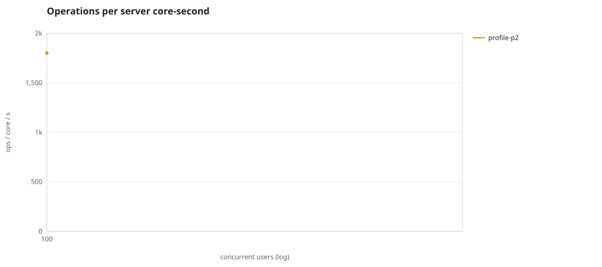
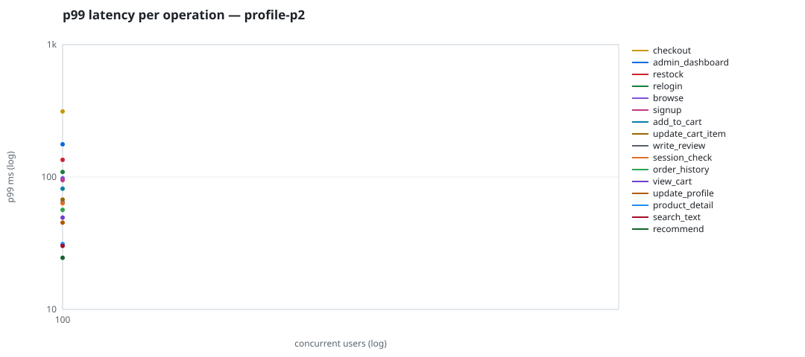

# Mini-SaaS concurrency simulation — sidecar

Run: `profile-p2` on 2026-09-23T13:14:13 · commit `92e0290` · macOS-26.6.2-arm64-arm-64bit · 10 CPUs

## Configuration

- **transport**: sidecar
- **levels**: [100]
- **duration**: 15.0
- **warmup**: 3.0
- **ramp**: 3.0
- **think**: [0.0, 0.0]
- **processes**: 0
- **connections**: 0
- **durability**: balanced
- **products**: 5000
- **accounts**: 20000
- **scenario**: compound-index
- **seed**: 1
- **fresh_per_stage**: False
- **seed time**: 1.16 s, 13.1 MiB after seeding

## Capacity and performance curve

Latencies are of the database call (service operation) in milliseconds; `user p99` adds the wait for a pooled connection.

| users | conns | ops/s | reads/s | writes/s | p50 | p95 | p99 | p99.9 | max | user p99 | success % | conflict retry % | srv CPU | srv RSS MiB | gen CPU | thr CV | invariants |
|---:|---:|---:|---:|---:|---:|---:|---:|---:|---:|---:|---:|---:|---:|---:|---:|---:|---:|
| 100 | 100 | 9005.6 | 6974.4 | 2031.2 | 4.313 | 39.462 | 80.711 | 203.028 | 2085.059 | 80.713 | 99.964 | 0.782 | 5.0 | 114.1 | 1.23 | 0.263 | ok |

## Insights

- **Peak throughput**: 9005.6 ops/s at 100 users (p99 80.711 ms).
- **Capacity at p99 ≤ 10 ms**: 0 users (DB latency); 0 users counting pool wait.
- **Capacity at p99 ≤ 50 ms**: 0 users (DB latency); 0 users counting pool wait.
- **Capacity at p99 ≤ 100 ms**: 100 users (DB latency); 100 users counting pool wait.
- **Capacity at p99 ≤ 250 ms**: 100 users (DB latency); 100 users counting pool wait.
- **Capacity at p99 ≤ 1000 ms**: 100 users (DB latency); 100 users counting pool wait.
- **Ops per server core-second**: 100→1801.
- **Read-your-writes violations**: none.
- **Business invariants**: all stages ok.
- **Offline integrity check** (elitesql check): ok in 4.77 s.
  - right after killing the server (no clean close): exit 3, 0 errors, 151852 warnings; after one clean open/close: exit 0, 0 errors, 0 warnings.
- **Database size**: 43.2 MiB after the first stage, 43.2 MiB after the last; 6039 paid orders in total.

## p99 latency per operation (ms)

| op | share % | 100 |
|---|---:|---:|
| add_to_cart | 10.08 | 81.63 |
| admin_dashboard | 1.05 | 176.63 |
| browse | 20.49 | 97.86 |
| checkout | 4.09 | 312.98 |
| order_history | 3.05 | 56.48 |
| product_detail | 17.29 | 31.14 |
| recommend | 7.16 | 24.53 |
| relogin | 1.56 | 109.23 |
| restock | 0.31 | 134.78 |
| search_text | 8.12 | 30.19 |
| session_check | 12.18 | 63.31 |
| signup | 0.49 | 94.75 |
| update_cart_item | 2.96 | 67.48 |
| update_profile | 1.04 | 45.23 |
| view_cart | 8.12 | 49.35 |
| write_review | 2.03 | 64.27 |

## Errors and business outcomes at the highest level

```json
{
 "statuses": {
  "ok": 133385,
  "empty_cart": 1642,
  "not_found": 8,
  "conflict_exhausted": 49
 },
 "errors": {
  "conflict_exhausted": {
   "count": 58,
   "first": "[elitesql:9] conflict, retry transaction: products/b6 changed after this transaction began",
   "ops": {
    "checkout": 58
   }
  }
 }
}
```

## Charts








