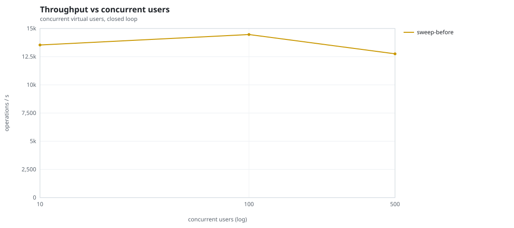
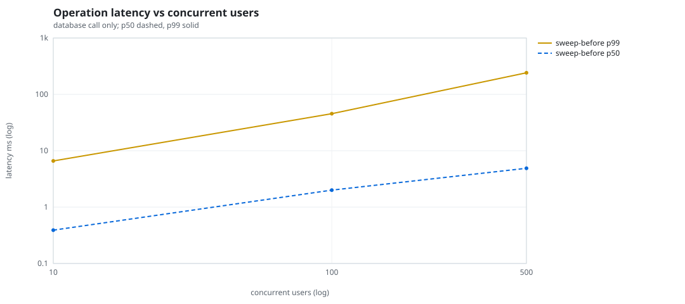
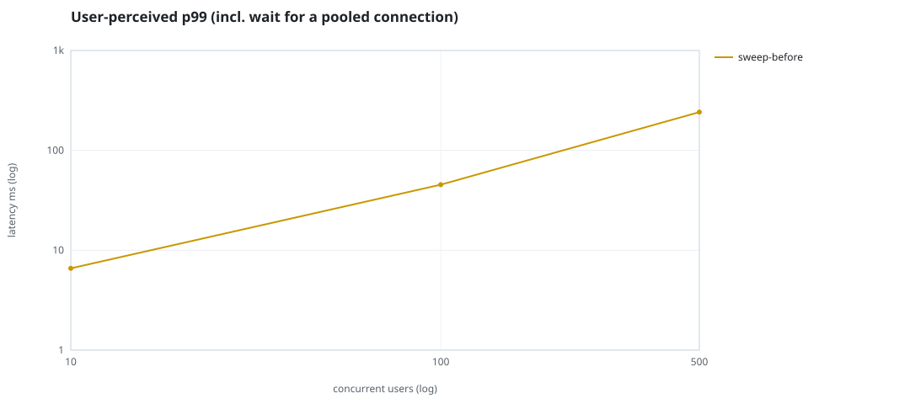
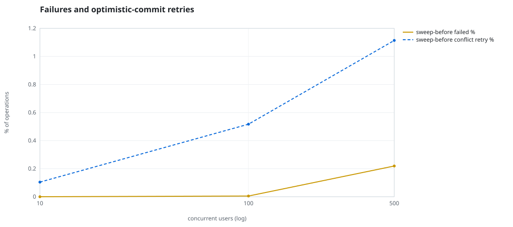
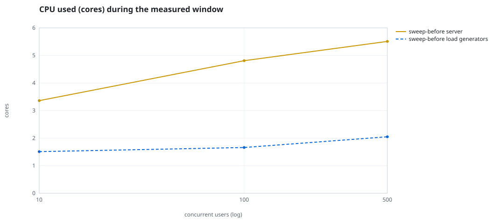
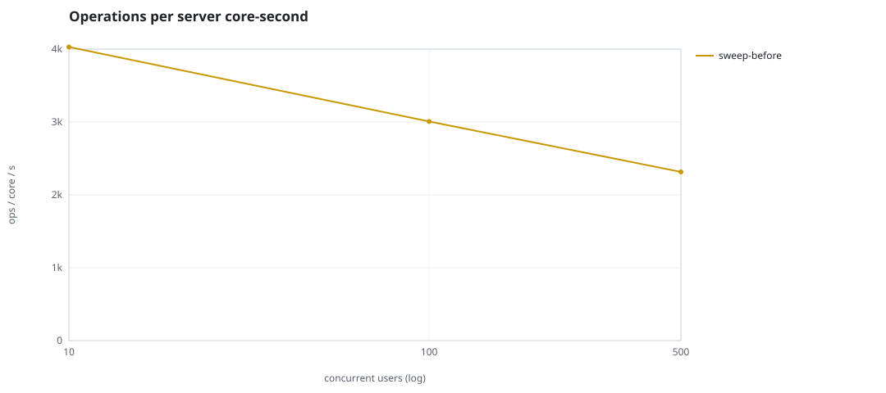
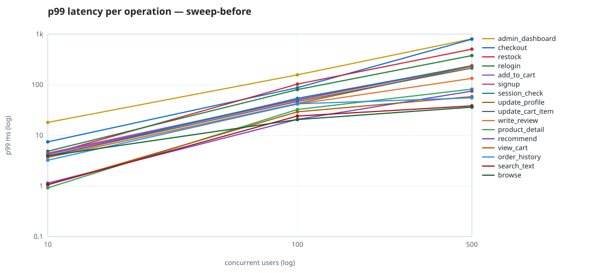

# Mini-SaaS concurrency simulation — sidecar

Run: `sweep-before` on 2026-09-23T12:40:51 · commit `92e0290` · macOS-26.6.2-arm64-arm-64bit · 10 CPUs

## Configuration

- **transport**: sidecar
- **levels**: [10, 100, 500]
- **duration**: 20.0
- **warmup**: 3.0
- **ramp**: 3.0
- **think**: [0.0, 0.0]
- **processes**: 0
- **connections**: 0
- **durability**: balanced
- **products**: 5000
- **accounts**: 20000
- **scenario**: compound-index
- **seed**: 1
- **fresh_per_stage**: False
- **seed time**: 1.17 s, 13.1 MiB after seeding

## Capacity and performance curve

Latencies are of the database call (service operation) in milliseconds; `user p99` adds the wait for a pooled connection.

| users | conns | ops/s | reads/s | writes/s | p50 | p95 | p99 | p99.9 | max | user p99 | success % | conflict retry % | srv CPU | srv RSS MiB | gen CPU | thr CV | invariants |
|---:|---:|---:|---:|---:|---:|---:|---:|---:|---:|---:|---:|---:|---:|---:|---:|---:|---:|
| 10 | 10 | 13537.1 | 10466.7 | 3070.4 | 0.39 | 2.051 | 6.588 | 13.705 | 553.498 | 6.591 | 100.0 | 0.104 | 3.36 | 133.4 | 1.51 | 0.171 | ok |
| 100 | 100 | 14464.3 | 11191.8 | 3272.5 | 2.001 | 22.563 | 45.396 | 117.924 | 1870.181 | 45.398 | 99.995 | 0.517 | 4.81 | 319.1 | 1.66 | 0.299 | ok |
| 500 | 500 | 12756.3 | 9871.2 | 2885.1 | 4.883 | 147.774 | 241.394 | 660.879 | 2104.917 | 241.397 | 99.781 | 1.114 | 5.51 | 289.6 | 2.05 | 0.107 | ok |

## Insights

- **Peak throughput**: 14464.3 ops/s at 100 users (p99 45.396 ms).
- **Capacity at p99 ≤ 10 ms**: 10 users (DB latency); 10 users counting pool wait.
- **Capacity at p99 ≤ 50 ms**: 100 users (DB latency); 100 users counting pool wait.
- **Capacity at p99 ≤ 100 ms**: 100 users (DB latency); 100 users counting pool wait.
- **Capacity at p99 ≤ 250 ms**: 500 users (DB latency); 500 users counting pool wait.
- **Capacity at p99 ≤ 1000 ms**: 500 users (DB latency); 500 users counting pool wait.
- **USL fit**: σ (contention) = 0.24, κ (coherency) = 1.58e-04, predicted peak at N ≈ 69.2 (rmse log 0.0496).
- **Ops per server core-second**: 10→4029, 100→3007, 500→2315.
- **Seconds with zero completed operations** (stalls): [(100, 1)].
- **Read-your-writes violations**: none.
- **Business invariants**: all stages ok.
- **Offline integrity check** (elitesql check): ok in 16.12 s.
  - right after killing the server (no clean close): exit 3, 0 errors, 526232 warnings; after one clean open/close: exit 0, 0 errors, 0 warnings.
- **Database size**: 64.2 MiB after the first stage, 111.3 MiB after the last; 30378 paid orders in total.

## p99 latency per operation (ms)

| op | share % | 10 | 100 | 500 |
|---|---:|---:|---:|---:|
| add_to_cart | 10.21 | 4.46 | 51.09 | 239.39 |
| admin_dashboard | 1.01 | 18.06 | 157.02 | 807.66 |
| browse | 20.3 | 3.92 | 20.50 | 36.12 |
| checkout | 3.95 | 7.44 | 87.41 | 795.28 |
| order_history | 3.08 | 3.23 | 42.02 | 55.19 |
| product_detail | 17.34 | 0.92 | 32.45 | 82.01 |
| recommend | 7.12 | 1.14 | 20.70 | 74.93 |
| relogin | 1.57 | 4.86 | 80.27 | 377.08 |
| restock | 0.31 | 4.16 | 102.97 | 504.79 |
| search_text | 8.12 | 1.06 | 24.12 | 38.27 |
| session_check | 12.2 | 3.84 | 54.02 | 233.51 |
| signup | 0.49 | 4.22 | 49.86 | 234.04 |
| update_cart_item | 3.07 | 3.94 | 46.68 | 213.21 |
| update_profile | 1.06 | 3.65 | 42.59 | 231.10 |
| view_cart | 8.15 | 1.05 | 29.17 | 58.39 |
| write_review | 2.03 | 3.70 | 41.48 | 133.50 |

## Errors and business outcomes at the highest level

```json
{
 "statuses": {
  "ok": 251677,
  "empty_cart": 2877,
  "conflict_exhausted": 559,
  "not_found": 13
 },
 "errors": {
  "conflict_exhausted": {
   "count": 598,
   "first": "[elitesql:9] conflict, retry transaction: products/b7 changed after this transaction began",
   "ops": {
    "restock": 54,
    "checkout": 544
   }
  }
 }
}
```

## Charts








