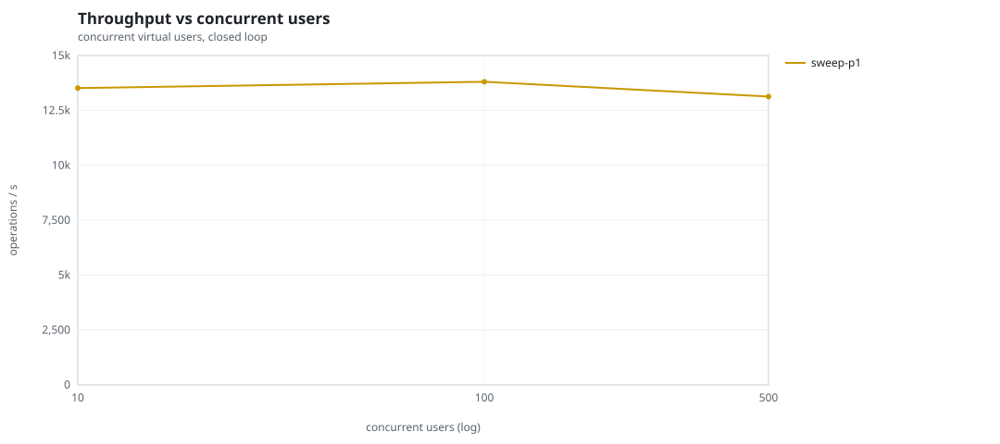
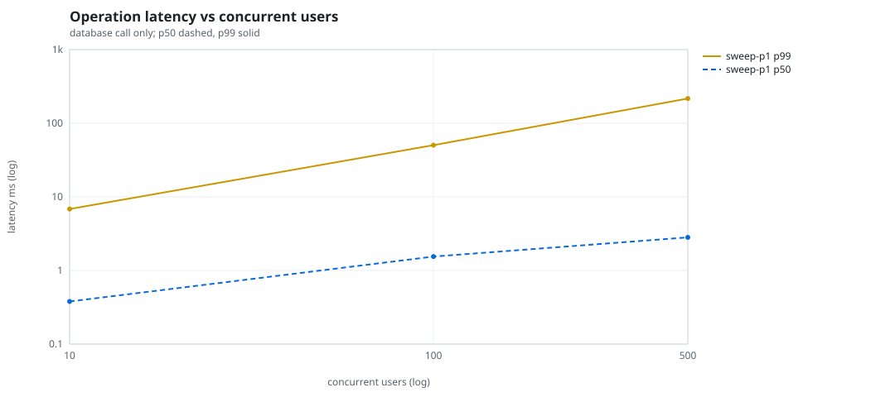
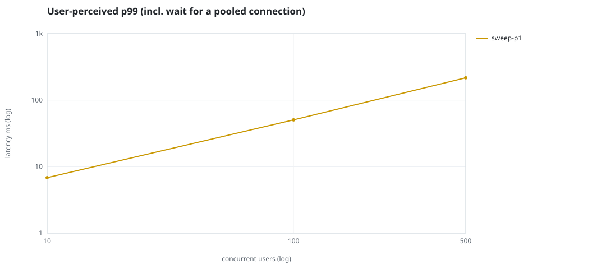
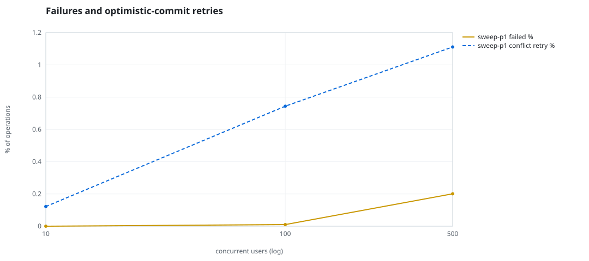
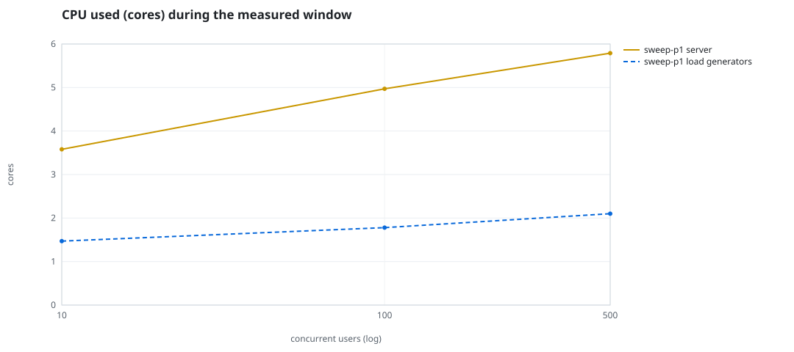
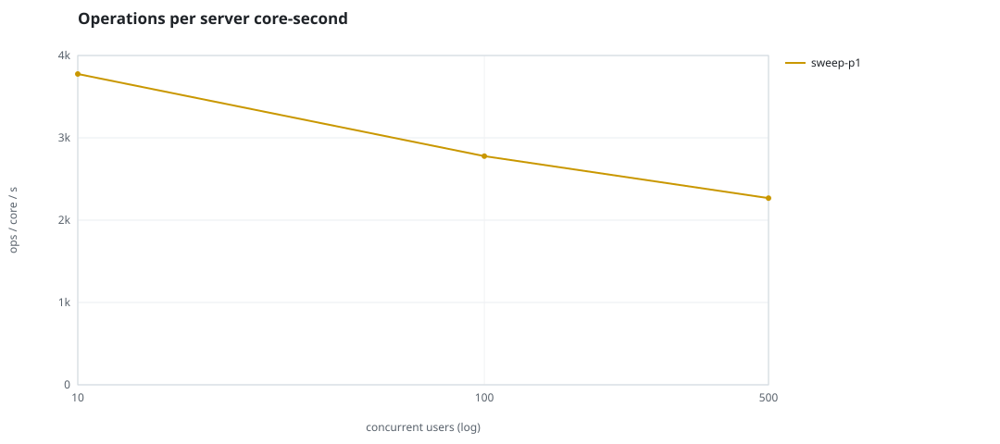
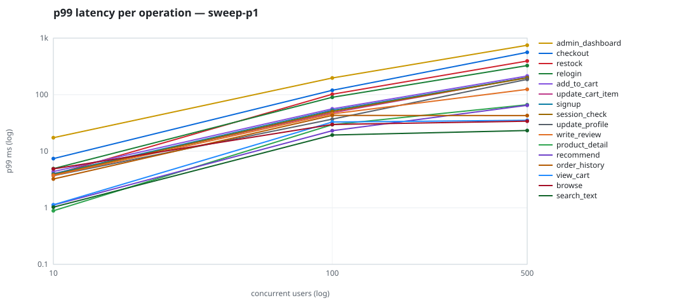

# Mini-SaaS concurrency simulation — sidecar

Run: `sweep-p1` on 2026-09-23T12:51:59 · commit `92e0290` · macOS-26.6.2-arm64-arm-64bit · 10 CPUs

## Configuration

- **transport**: sidecar
- **levels**: [10, 100, 500]
- **duration**: 20.0
- **warmup**: 3.0
- **ramp**: 3.0
- **think**: [0.0, 0.0]
- **processes**: 0
- **connections**: 0
- **durability**: balanced
- **products**: 5000
- **accounts**: 20000
- **scenario**: compound-index
- **seed**: 1
- **fresh_per_stage**: False
- **seed time**: 1.21 s, 13.1 MiB after seeding

## Capacity and performance curve

Latencies are of the database call (service operation) in milliseconds; `user p99` adds the wait for a pooled connection.

| users | conns | ops/s | reads/s | writes/s | p50 | p95 | p99 | p99.9 | max | user p99 | success % | conflict retry % | srv CPU | srv RSS MiB | gen CPU | thr CV | invariants |
|---:|---:|---:|---:|---:|---:|---:|---:|---:|---:|---:|---:|---:|---:|---:|---:|---:|---:|
| 10 | 10 | 13515.3 | 10447.9 | 3067.4 | 0.379 | 2.333 | 6.832 | 13.9 | 633.701 | 6.834 | 100.0 | 0.122 | 3.58 | 144.3 | 1.47 | 0.15 | ok |
| 100 | 100 | 13804.5 | 10679.4 | 3125.1 | 1.543 | 23.867 | 50.439 | 196.404 | 1898.248 | 50.441 | 99.99 | 0.744 | 4.97 | 322.2 | 1.78 | 0.322 | ok |
| 500 | 500 | 13129.1 | 10158.5 | 2970.6 | 2.815 | 142.693 | 216.811 | 506.416 | 1883.213 | 216.813 | 99.799 | 1.111 | 5.79 | 280.4 | 2.1 | 0.114 | ok |

## Insights

- **Peak throughput**: 13804.5 ops/s at 100 users (p99 50.439 ms).
- **Capacity at p99 ≤ 10 ms**: 10 users (DB latency); 10 users counting pool wait.
- **Capacity at p99 ≤ 50 ms**: 10 users (DB latency); 10 users counting pool wait.
- **Capacity at p99 ≤ 100 ms**: 100 users (DB latency); 100 users counting pool wait.
- **Capacity at p99 ≤ 250 ms**: 500 users (DB latency); 500 users counting pool wait.
- **Capacity at p99 ≤ 1000 ms**: 500 users (DB latency); 500 users counting pool wait.
- **USL fit**: σ (contention) = 0.25, κ (coherency) = 1.26e-04, predicted peak at N ≈ 77.2 (rmse log 0.0693).
- **Ops per server core-second**: 10→3775, 100→2778, 500→2268.
- **Connections refused while opening the pools** (listen backlog overflow, retried with backoff): [(500, 4)].
- **Seconds with zero completed operations** (stalls): [(100, 1)].
- **Read-your-writes violations**: none.
- **Business invariants**: all stages ok.
- **Offline integrity check** (elitesql check): ok in 15.87 s.
  - right after killing the server (no clean close): exit 3, 0 errors, 528572 warnings; after one clean open/close: exit 0, 0 errors, 0 warnings.
- **Database size**: 66.7 MiB after the first stage, 112.0 MiB after the last; 30530 paid orders in total.

## p99 latency per operation (ms)

| op | share % | 10 | 100 | 500 |
|---|---:|---:|---:|---:|
| add_to_cart | 10.22 | 4.37 | 56.22 | 213.77 |
| admin_dashboard | 1.02 | 17.35 | 197.27 | 748.05 |
| browse | 20.3 | 4.87 | 29.72 | 33.98 |
| checkout | 3.95 | 7.41 | 119.58 | 561.60 |
| order_history | 3.08 | 3.23 | 43.07 | 42.70 |
| product_detail | 17.32 | 0.89 | 29.47 | 66.47 |
| recommend | 7.09 | 1.12 | 23.08 | 65.00 |
| relogin | 1.57 | 4.92 | 89.86 | 326.76 |
| restock | 0.32 | 3.86 | 101.87 | 394.16 |
| search_text | 8.15 | 1.03 | 19.36 | 23.22 |
| session_check | 12.19 | 3.83 | 50.54 | 198.71 |
| signup | 0.49 | 3.98 | 52.93 | 200.59 |
| update_cart_item | 3.07 | 4.00 | 47.98 | 201.96 |
| update_profile | 1.06 | 3.69 | 36.97 | 186.67 |
| view_cart | 8.14 | 1.13 | 32.87 | 35.22 |
| write_review | 2.03 | 3.72 | 45.74 | 124.40 |

## Errors and business outcomes at the highest level

```json
{
 "statuses": {
  "ok": 259055,
  "empty_cart": 2989,
  "conflict_exhausted": 528,
  "not_found": 11
 },
 "errors": {
  "conflict_exhausted": {
   "count": 586,
   "first": "[elitesql:9] conflict, retry transaction: products/c11 changed after this transaction began",
   "ops": {
    "restock": 48,
    "checkout": 538
   }
  }
 }
}
```

## Charts








