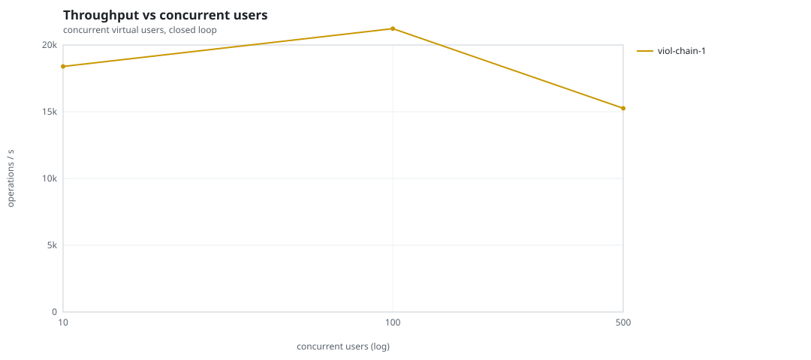
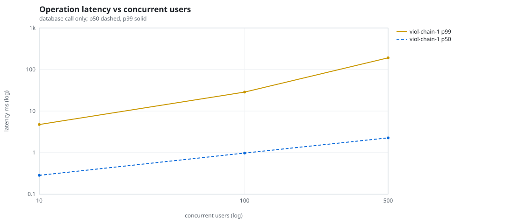
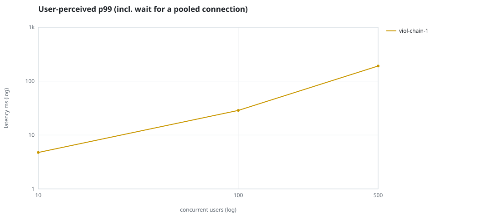
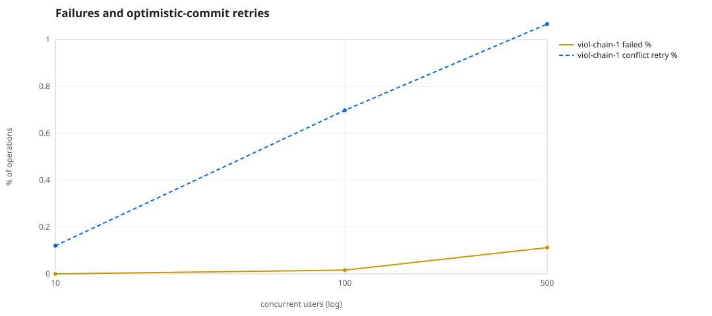
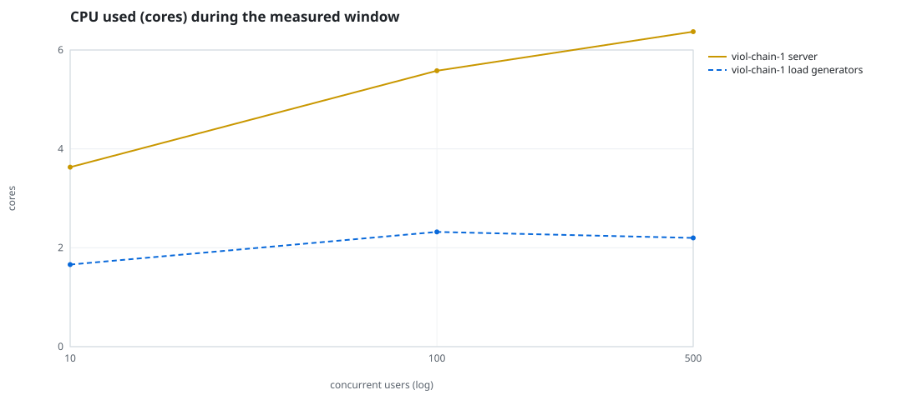
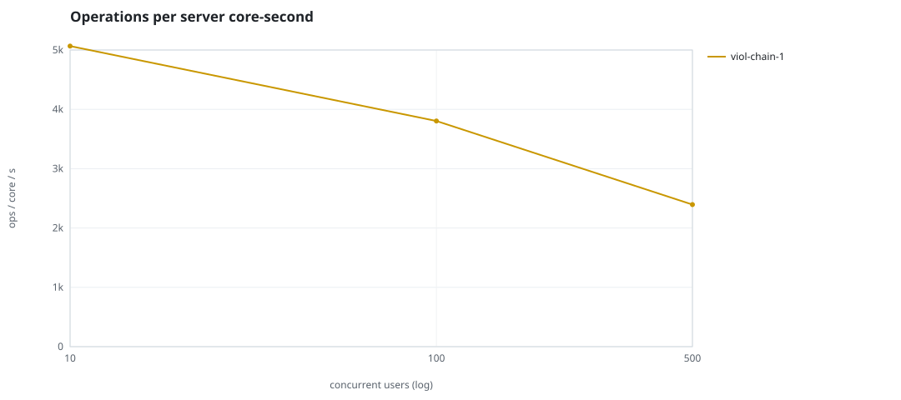
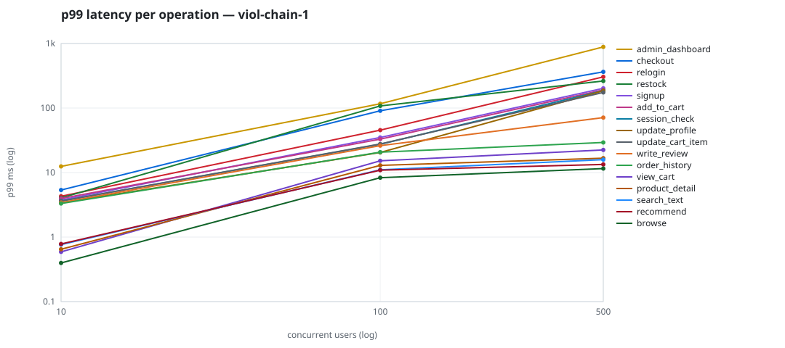

# Mini-SaaS concurrency simulation — sidecar

Run: `viol-chain-1` on 2026-09-23T16:41:56 · commit `92e0290` · macOS-26.6.2-arm64-arm-64bit · 10 CPUs

## Configuration

- **transport**: sidecar
- **levels**: [10, 100, 500]
- **duration**: 20.0
- **warmup**: 3.0
- **ramp**: 3.0
- **think**: [0.0, 0.0]
- **processes**: 0
- **connections**: 0
- **durability**: balanced
- **products**: 5000
- **accounts**: 20000
- **scenario**: compound-index
- **seed**: 1
- **fresh_per_stage**: False
- **seed time**: 1.12 s, 13.1 MiB after seeding

## Capacity and performance curve

Latencies are of the database call (service operation) in milliseconds; `user p99` adds the wait for a pooled connection.

| users | conns | ops/s | reads/s | writes/s | p50 | p95 | p99 | p99.9 | max | user p99 | success % | conflict retry % | srv CPU | srv RSS MiB | gen CPU | thr CV | invariants |
|---:|---:|---:|---:|---:|---:|---:|---:|---:|---:|---:|---:|---:|---:|---:|---:|---:|---:|
| 10 | 10 | 18392.0 | 14230.8 | 4161.2 | 0.284 | 1.512 | 4.747 | 9.952 | 568.569 | 4.748 | 100.0 | 0.12 | 3.63 | 169.5 | 1.66 | 0.198 | ok |
| 100 | 100 | 21224.8 | 16417.3 | 4807.4 | 0.974 | 15.609 | 28.629 | 75.671 | 1323.149 | 28.63 | 99.984 | 0.698 | 5.58 | 320.4 | 2.32 | 0.249 | ok |
| 500 | 500 | 15257.9 | 11798.5 | 3459.3 | 2.266 | 120.575 | 191.207 | 480.19 | 1788.066 | 191.208 | 99.888 | 1.066 | 6.37 | 524.3 | 2.2 | 0.079 | ok |

## Insights

- **Peak throughput**: 21224.8 ops/s at 100 users (p99 28.629 ms).
- **Capacity at p99 ≤ 10 ms**: 10 users (DB latency); 10 users counting pool wait.
- **Capacity at p99 ≤ 50 ms**: 100 users (DB latency); 100 users counting pool wait.
- **Capacity at p99 ≤ 100 ms**: 100 users (DB latency); 100 users counting pool wait.
- **Capacity at p99 ≤ 250 ms**: 500 users (DB latency); 500 users counting pool wait.
- **Capacity at p99 ≤ 1000 ms**: 500 users (DB latency); 500 users counting pool wait.
- **USL fit**: σ (contention) = 0.23, κ (coherency) = 2.51e-04, predicted peak at N ≈ 55.4 (rmse log 0.02).
- **Ops per server core-second**: 10→5067, 100→3804, 500→2395.
- **Seconds with zero completed operations** (stalls): [(100, 1)].
- **Read-your-writes violations**: none.
- **Business invariants**: all stages ok.
- **Offline integrity check** (elitesql check): ok in 16.4 s.
  - right after killing the server (no clean close): exit 3, 0 errors, 679502 warnings; after one clean open/close: exit 0, 0 errors, 0 warnings.
- **Database size**: 85.0 MiB after the first stage, 180.6 MiB after the last; 40691 paid orders in total.

## p99 latency per operation (ms)

| op | share % | 10 | 100 | 500 |
|---|---:|---:|---:|---:|
| add_to_cart | 10.22 | 3.96 | 32.97 | 190.81 |
| admin_dashboard | 1.02 | 12.46 | 116.42 | 886.29 |
| browse | 20.29 | 0.40 | 8.33 | 11.54 |
| checkout | 3.94 | 5.36 | 90.71 | 363.51 |
| order_history | 3.11 | 3.32 | 20.68 | 29.23 |
| product_detail | 17.33 | 0.65 | 12.92 | 16.70 |
| recommend | 7.1 | 0.78 | 10.89 | 13.34 |
| relogin | 1.56 | 4.29 | 45.40 | 304.06 |
| restock | 0.31 | 4.05 | 107.83 | 262.17 |
| search_text | 8.15 | 0.77 | 11.02 | 15.85 |
| session_check | 12.21 | 3.61 | 27.45 | 186.17 |
| signup | 0.49 | 3.76 | 35.02 | 202.38 |
| update_cart_item | 3.06 | 3.62 | 27.69 | 174.41 |
| update_profile | 1.04 | 3.40 | 20.45 | 184.95 |
| view_cart | 8.16 | 0.59 | 15.20 | 22.39 |
| write_review | 2.02 | 3.43 | 26.09 | 70.98 |

## Errors and business outcomes at the highest level

```json
{
 "statuses": {
  "empty_cart": 3564,
  "ok": 301141,
  "conflict_exhausted": 341,
  "out_of_stock": 96,
  "not_found": 15
 },
 "errors": {
  "conflict_exhausted": {
   "count": 358,
   "first": "[elitesql:9] conflict, retry transaction: products/c13 changed after this transaction began",
   "ops": {
    "checkout": 324,
    "restock": 34
   }
  }
 }
}
```

## Charts








