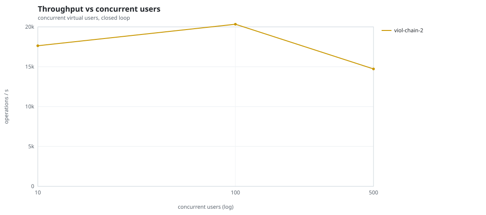
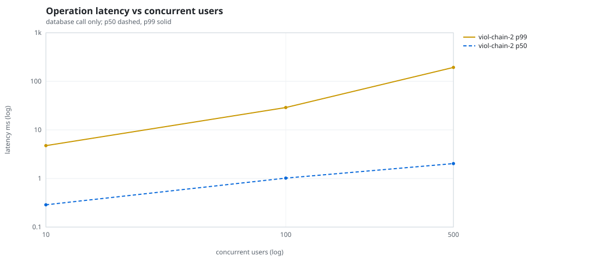
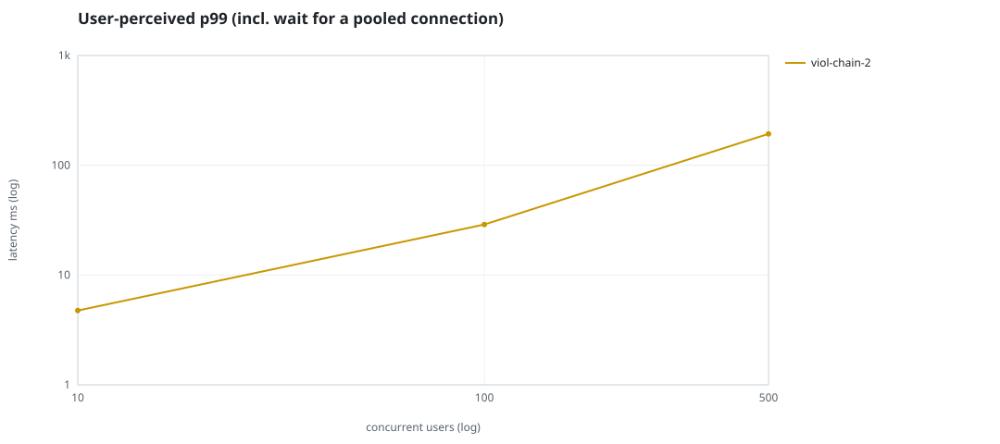
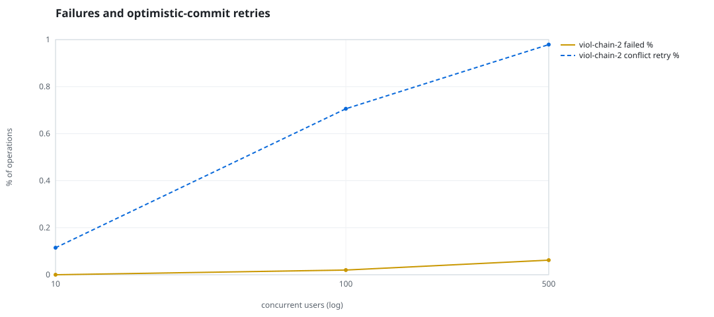
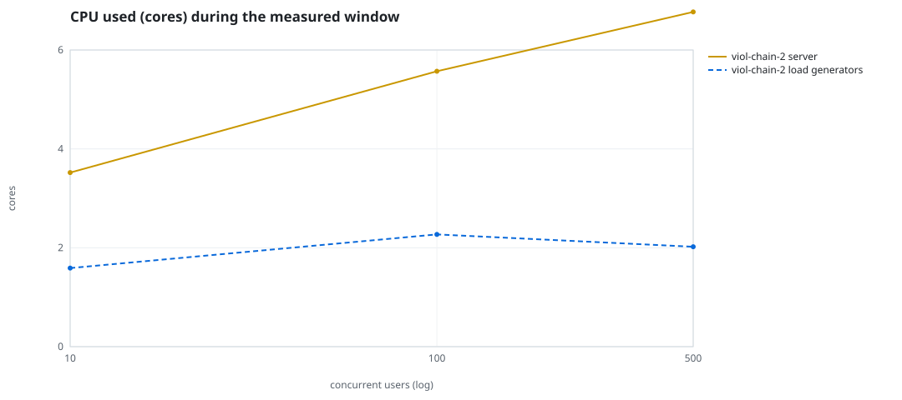
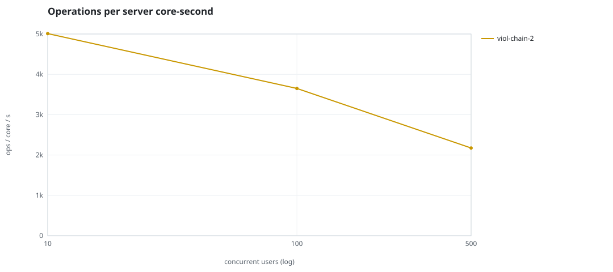
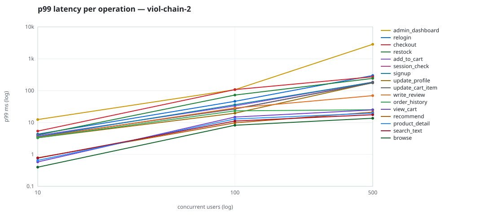

# Mini-SaaS concurrency simulation — sidecar

Run: `viol-chain-2` on 2026-09-23T16:43:57 · commit `92e0290` · macOS-26.6.2-arm64-arm-64bit · 10 CPUs

## Configuration

- **transport**: sidecar
- **levels**: [10, 100, 500]
- **duration**: 20.0
- **warmup**: 3.0
- **ramp**: 3.0
- **think**: [0.0, 0.0]
- **processes**: 0
- **connections**: 0
- **durability**: balanced
- **products**: 5000
- **accounts**: 20000
- **scenario**: compound-index
- **seed**: 1
- **fresh_per_stage**: False
- **seed time**: 1.13 s, 13.1 MiB after seeding

## Capacity and performance curve

Latencies are of the database call (service operation) in milliseconds; `user p99` adds the wait for a pooled connection.

| users | conns | ops/s | reads/s | writes/s | p50 | p95 | p99 | p99.9 | max | user p99 | success % | conflict retry % | srv CPU | srv RSS MiB | gen CPU | thr CV | invariants |
|---:|---:|---:|---:|---:|---:|---:|---:|---:|---:|---:|---:|---:|---:|---:|---:|---:|---:|
| 10 | 10 | 17635.9 | 13644.0 | 3991.9 | 0.287 | 1.461 | 4.745 | 10.145 | 596.691 | 4.746 | 100.0 | 0.115 | 3.52 | 168.2 | 1.59 | 0.238 | ok |
| 100 | 100 | 20329.5 | 15729.4 | 4600.1 | 1.019 | 15.573 | 28.854 | 91.048 | 1736.768 | 28.855 | 99.98 | 0.706 | 5.57 | 306.4 | 2.27 | 0.298 | ok |
| 500 | 500 | 14723.0 | 11380.0 | 3343.1 | 2.028 | 117.658 | 193.379 | 1400.561 | 4349.71 | 193.38 | 99.938 | 0.979 | 6.77 | 464.1 | 2.02 | 0.138 | ok |

## Insights

- **Peak throughput**: 20329.5 ops/s at 100 users (p99 28.854 ms).
- **Capacity at p99 ≤ 10 ms**: 10 users (DB latency); 10 users counting pool wait.
- **Capacity at p99 ≤ 50 ms**: 100 users (DB latency); 100 users counting pool wait.
- **Capacity at p99 ≤ 100 ms**: 100 users (DB latency); 100 users counting pool wait.
- **Capacity at p99 ≤ 250 ms**: 500 users (DB latency); 500 users counting pool wait.
- **Capacity at p99 ≤ 1000 ms**: 500 users (DB latency); 500 users counting pool wait.
- **USL fit**: σ (contention) = 0.23, κ (coherency) = 2.51e-04, predicted peak at N ≈ 55.4 (rmse log 0.0187).
- **Ops per server core-second**: 10→5010, 100→3650, 500→2175.
- **Read-your-writes violations**: none.
- **Business invariants**: all stages ok.
- **Offline integrity check** (elitesql check): ok in 16.04 s.
  - right after killing the server (no clean close): exit 3, 0 errors, 667910 warnings; after one clean open/close: exit 0, 0 errors, 0 warnings.
- **Database size**: 84.0 MiB after the first stage, 177.6 MiB after the last; 39999 paid orders in total.

## p99 latency per operation (ms)

| op | share % | 10 | 100 | 500 |
|---|---:|---:|---:|---:|
| add_to_cart | 10.22 | 3.91 | 33.28 | 185.85 |
| admin_dashboard | 1.01 | 12.43 | 107.34 | 2840.22 |
| browse | 20.29 | 0.40 | 8.24 | 13.64 |
| checkout | 3.94 | 5.40 | 108.04 | 271.49 |
| order_history | 3.12 | 3.32 | 23.29 | 25.26 |
| product_detail | 17.34 | 0.65 | 12.94 | 19.67 |
| recommend | 7.09 | 0.79 | 9.81 | 21.28 |
| relogin | 1.56 | 4.34 | 46.33 | 298.64 |
| restock | 0.31 | 4.10 | 72.84 | 242.29 |
| search_text | 8.15 | 0.77 | 11.16 | 17.61 |
| session_check | 12.2 | 3.59 | 26.60 | 183.97 |
| signup | 0.49 | 3.61 | 36.26 | 183.17 |
| update_cart_item | 3.06 | 3.51 | 27.07 | 175.78 |
| update_profile | 1.04 | 3.34 | 19.63 | 178.35 |
| view_cart | 8.15 | 0.58 | 14.87 | 24.97 |
| write_review | 2.01 | 3.41 | 28.64 | 69.76 |

## Errors and business outcomes at the highest level

```json
{
 "statuses": {
  "ok": 290711,
  "empty_cart": 3479,
  "out_of_stock": 72,
  "conflict_exhausted": 184,
  "not_found": 15
 },
 "errors": {
  "conflict_exhausted": {
   "count": 212,
   "first": "[elitesql:9] conflict, retry transaction: products/c16 changed after this transaction began",
   "ops": {
    "restock": 30,
    "checkout": 182
   }
  }
 }
}
```

## Charts








