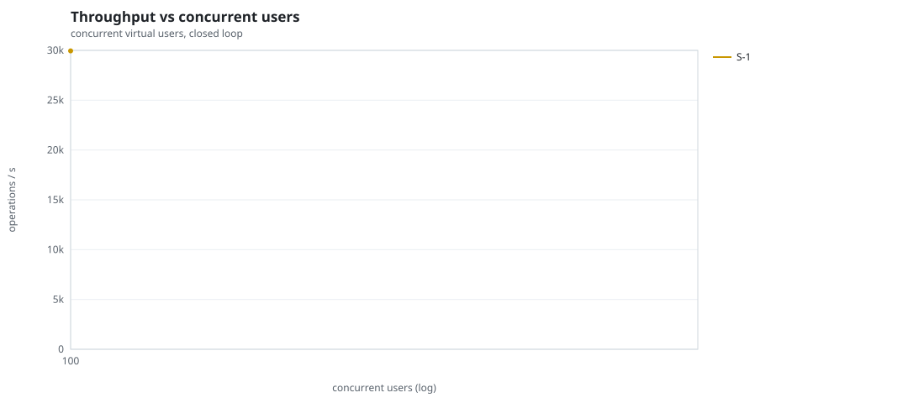
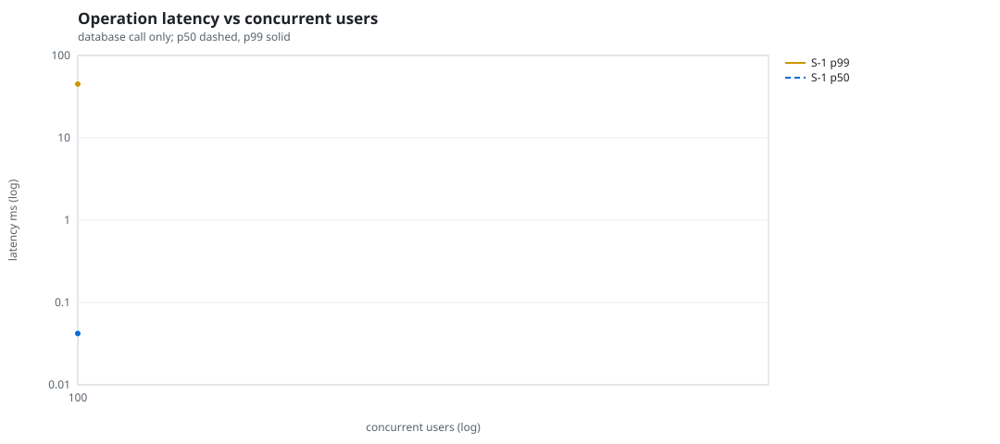
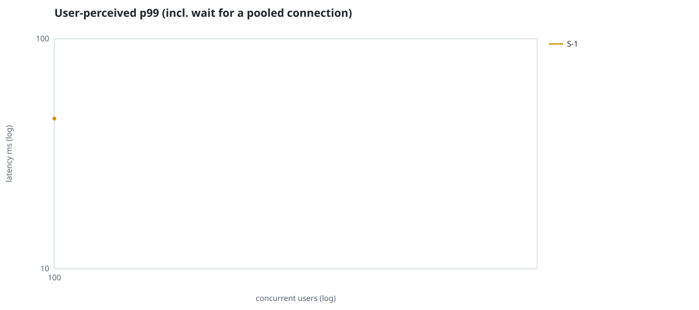
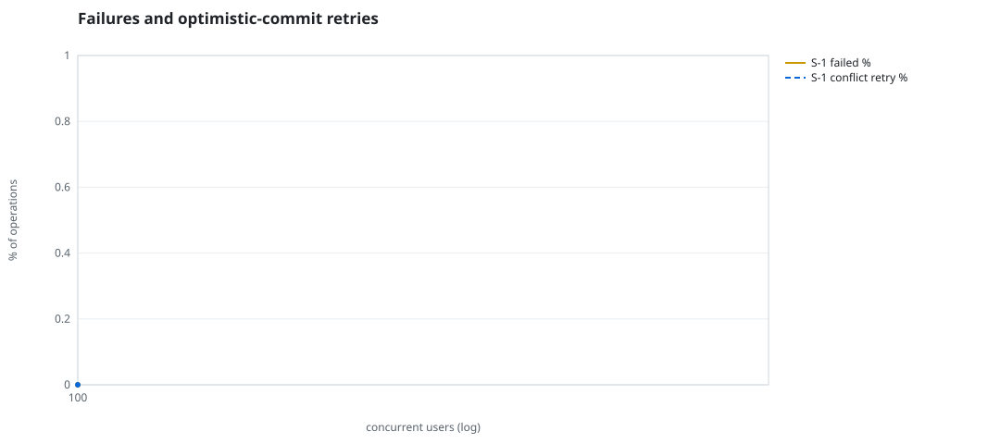
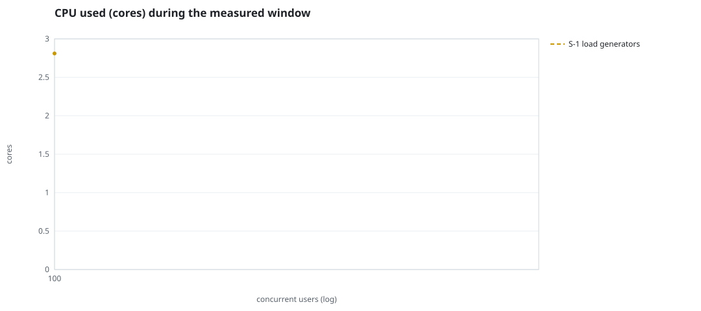
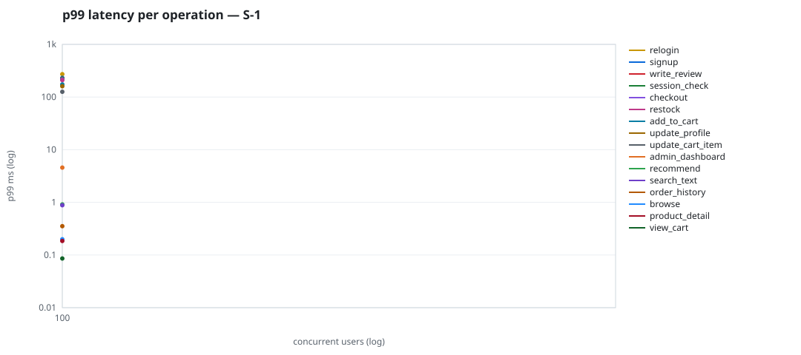

# Mini-SaaS concurrency simulation — sqlite

Run: `S-1` on 2026-09-23T14:07:13 · commit `92e0290` · macOS-26.6.2-arm64-arm-64bit · 10 CPUs

## Configuration

- **transport**: sqlite
- **levels**: [100]
- **duration**: 15.0
- **warmup**: 3.0
- **ramp**: 3.0
- **think**: [0.0, 0.0]
- **processes**: 0
- **connections**: 0
- **durability**: balanced
- **products**: 5000
- **accounts**: 20000
- **scenario**: compound-index
- **seed**: 1
- **fresh_per_stage**: False
- **seed time**: 0.14 s, 4.6 MiB after seeding

## Capacity and performance curve

Latencies are of the database call (service operation) in milliseconds; `user p99` adds the wait for a pooled connection.

| users | conns | ops/s | reads/s | writes/s | p50 | p95 | p99 | p99.9 | max | user p99 | success % | conflict retry % | srv CPU | srv RSS MiB | gen CPU | thr CV | invariants |
|---:|---:|---:|---:|---:|---:|---:|---:|---:|---:|---:|---:|---:|---:|---:|---:|---:|---:|
| 100 | 100 | 29946.5 | 23160.3 | 6786.2 | 0.042 | 1.654 | 44.961 | 704.887 | 4090.041 | 44.961 | 100.0 | 0.0 | None | None | 2.81 | 0.02 | ok |

## Insights

- **Peak throughput**: 29946.5 ops/s at 100 users (p99 44.961 ms).
- **Capacity at p99 ≤ 10 ms**: 0 users (DB latency); 0 users counting pool wait.
- **Capacity at p99 ≤ 50 ms**: 100 users (DB latency); 100 users counting pool wait.
- **Capacity at p99 ≤ 100 ms**: 100 users (DB latency); 100 users counting pool wait.
- **Capacity at p99 ≤ 250 ms**: 100 users (DB latency); 100 users counting pool wait.
- **Capacity at p99 ≤ 1000 ms**: 100 users (DB latency); 100 users counting pool wait.
- **Generator CPU includes the database**: SQLite runs inside the load-generator processes, so `gen CPU` is application plus engine and there is no server column.
- **Read-your-writes violations**: none.
- **Business invariants**: all stages ok.
- **Offline integrity check** (PRAGMA integrity_check): ok in 0.04 s.
- **Database size**: 10.7 MiB after the first stage, 10.7 MiB after the last; 18284 paid orders in total.

## p99 latency per operation (ms)

| op | share % | 100 |
|---|---:|---:|
| add_to_cart | 10.14 | 173.65 |
| admin_dashboard | 1.02 | 4.58 |
| browse | 20.34 | 0.20 |
| checkout | 4.09 | 215.11 |
| order_history | 3.01 | 0.35 |
| product_detail | 17.26 | 0.18 |
| recommend | 7.12 | 0.91 |
| relogin | 1.53 | 271.57 |
| restock | 0.29 | 209.74 |
| search_text | 8.2 | 0.88 |
| session_check | 12.21 | 223.12 |
| signup | 0.51 | 231.33 |
| update_cart_item | 3.03 | 125.93 |
| update_profile | 1.03 | 160.18 |
| view_cart | 8.17 | 0.09 |
| write_review | 2.04 | 223.29 |

## Errors and business outcomes at the highest level

```json
{
 "statuses": {
  "ok": 443677,
  "empty_cart": 5489,
  "not_found": 31
 },
 "errors": {}
}
```

## Charts








