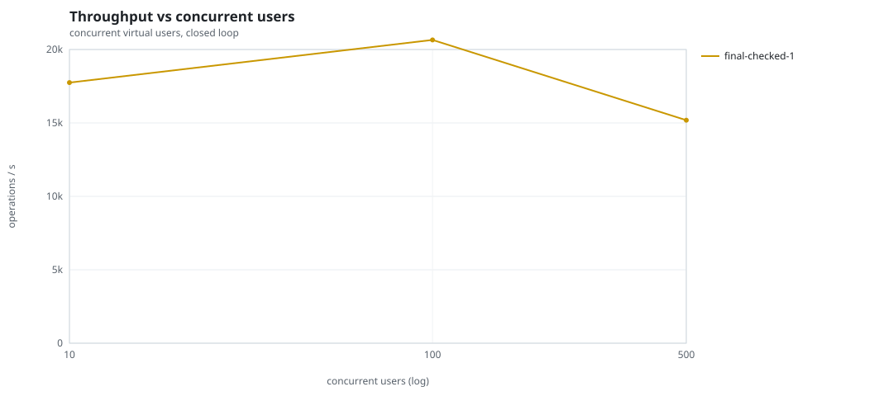
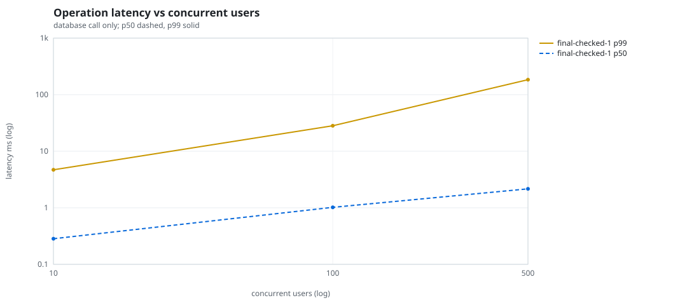
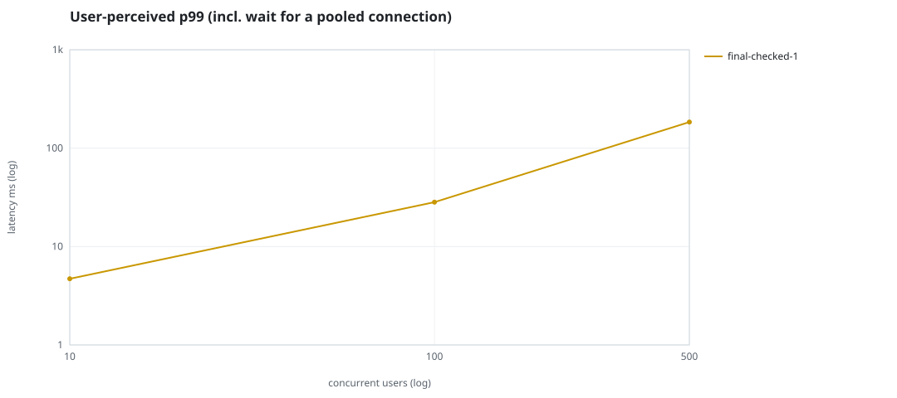
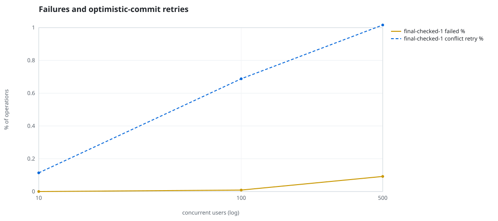
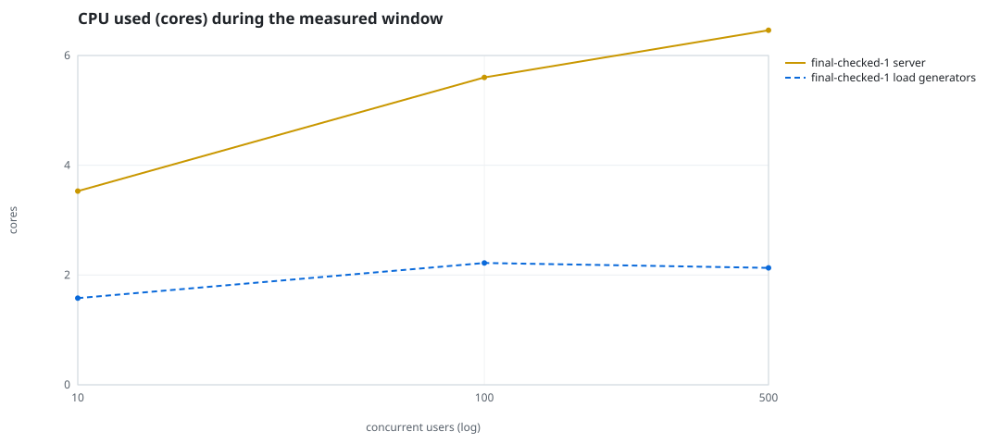
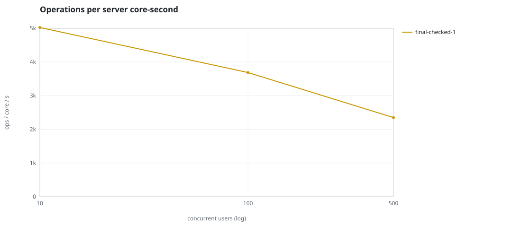
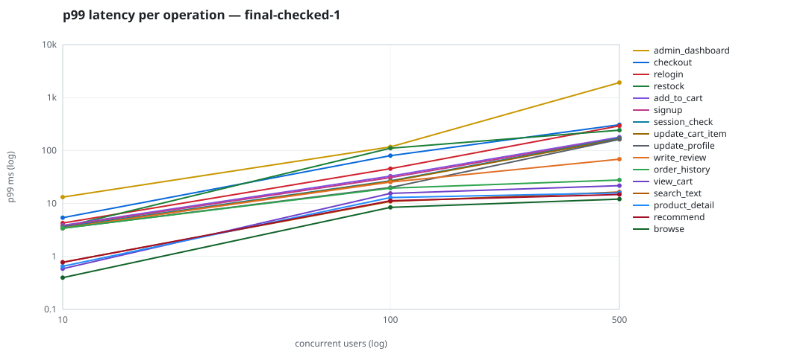

# Mini-SaaS concurrency simulation — sidecar

Run: `final-checked-1` on 2026-09-23T16:50:48 · commit `92e0290` · macOS-26.6.2-arm64-arm-64bit · 10 CPUs

## Configuration

- **transport**: sidecar
- **levels**: [10, 100, 500]
- **duration**: 20.0
- **warmup**: 3.0
- **ramp**: 3.0
- **think**: [0.0, 0.0]
- **processes**: 0
- **connections**: 0
- **durability**: balanced
- **products**: 5000
- **accounts**: 20000
- **scenario**: compound-index
- **seed**: 1
- **fresh_per_stage**: False
- **seed time**: 1.12 s, 13.1 MiB after seeding

## Capacity and performance curve

Latencies are of the database call (service operation) in milliseconds; `user p99` adds the wait for a pooled connection.

| users | conns | ops/s | reads/s | writes/s | p50 | p95 | p99 | p99.9 | max | user p99 | success % | conflict retry % | srv CPU | srv RSS MiB | gen CPU | thr CV | invariants |
|---:|---:|---:|---:|---:|---:|---:|---:|---:|---:|---:|---:|---:|---:|---:|---:|---:|---:|
| 10 | 10 | 17744.4 | 13726.7 | 4017.7 | 0.284 | 1.439 | 4.702 | 10.063 | 586.575 | 4.703 | 100.0 | 0.114 | 3.53 | 183.2 | 1.58 | 0.237 | ok |
| 100 | 100 | 20651.8 | 15975.4 | 4676.4 | 1.018 | 15.447 | 28.247 | 80.213 | 1921.78 | 28.248 | 99.991 | 0.688 | 5.6 | 398.1 | 2.22 | 0.293 | ok |
| 500 | 500 | 15188.0 | 11743.1 | 3444.8 | 2.164 | 118.716 | 183.982 | 741.986 | 2754.591 | 183.983 | 99.908 | 1.016 | 6.46 | 582.7 | 2.13 | 0.128 | ok |

## Insights

- **Peak throughput**: 20651.8 ops/s at 100 users (p99 28.247 ms).
- **Capacity at p99 ≤ 10 ms**: 10 users (DB latency); 10 users counting pool wait.
- **Capacity at p99 ≤ 50 ms**: 100 users (DB latency); 100 users counting pool wait.
- **Capacity at p99 ≤ 100 ms**: 100 users (DB latency); 100 users counting pool wait.
- **Capacity at p99 ≤ 250 ms**: 500 users (DB latency); 500 users counting pool wait.
- **Capacity at p99 ≤ 1000 ms**: 500 users (DB latency); 500 users counting pool wait.
- **USL fit**: σ (contention) = 0.22, κ (coherency) = 2.51e-04, predicted peak at N ≈ 55.7 (rmse log 0.013).
- **Ops per server core-second**: 10→5027, 100→3688, 500→2351.
- **Read-your-writes violations**: none.
- **Business invariants**: all stages ok.
- **Offline integrity check** (elitesql check): ok in 16.11 s.
  - right after killing the server (no clean close): exit 3, 0 errors, 676364 warnings; after one clean open/close: exit 0, 0 errors, 0 warnings.
- **Database size**: 84.3 MiB after the first stage, 179.1 MiB after the last; 40492 paid orders in total.

## p99 latency per operation (ms)

| op | share % | 10 | 100 | 500 |
|---|---:|---:|---:|---:|
| add_to_cart | 10.24 | 3.86 | 32.91 | 178.79 |
| admin_dashboard | 1.01 | 13.20 | 117.12 | 1922.57 |
| browse | 20.3 | 0.40 | 8.45 | 12.09 |
| checkout | 3.94 | 5.39 | 79.88 | 306.72 |
| order_history | 3.12 | 3.41 | 19.50 | 27.82 |
| product_detail | 17.33 | 0.65 | 12.94 | 15.82 |
| recommend | 7.1 | 0.78 | 11.26 | 14.78 |
| relogin | 1.56 | 4.27 | 45.38 | 292.97 |
| restock | 0.31 | 3.58 | 110.49 | 242.59 |
| search_text | 8.16 | 0.78 | 10.96 | 16.45 |
| session_check | 12.19 | 3.59 | 26.80 | 170.43 |
| signup | 0.49 | 3.73 | 30.83 | 171.21 |
| update_cart_item | 3.06 | 3.45 | 26.22 | 164.71 |
| update_profile | 1.04 | 3.40 | 20.04 | 162.52 |
| view_cart | 8.14 | 0.59 | 15.54 | 21.75 |
| write_review | 2.01 | 3.43 | 25.34 | 68.70 |

## Errors and business outcomes at the highest level

```json
{
 "statuses": {
  "ok": 299800,
  "conflict_exhausted": 278,
  "empty_cart": 3577,
  "out_of_stock": 91,
  "not_found": 14
 },
 "errors": {
  "conflict_exhausted": {
   "count": 310,
   "first": "[elitesql:9] conflict, retry transaction: products/b3 changed after this transaction began",
   "ops": {
    "checkout": 284,
    "restock": 26
   }
  }
 }
}
```

## Charts








