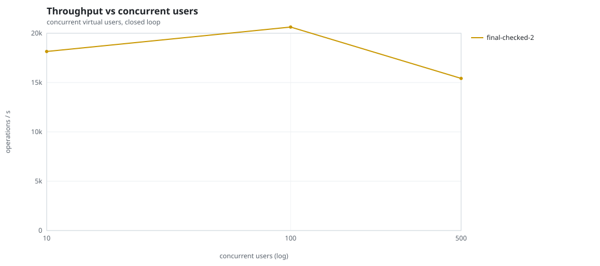
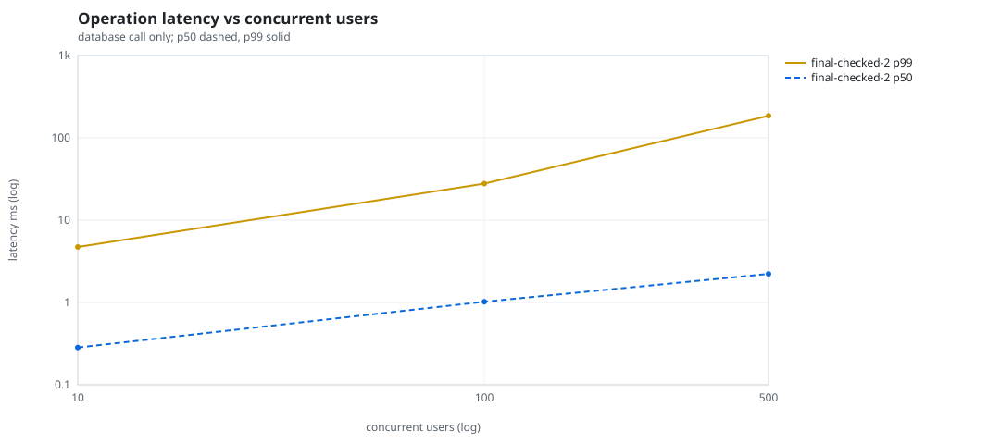
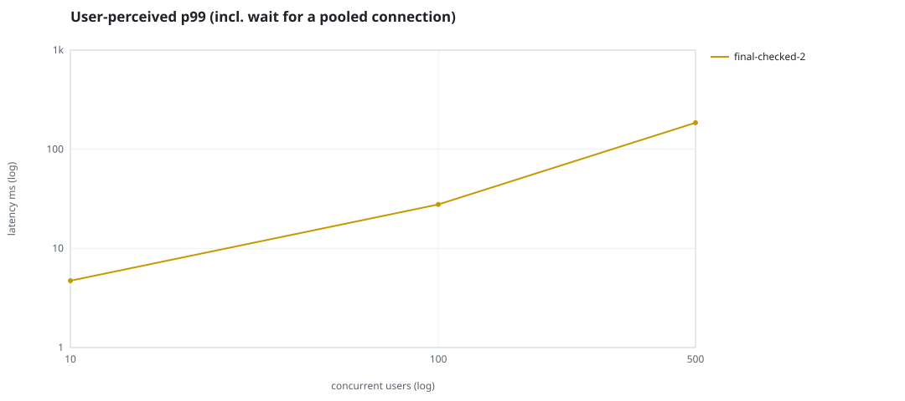
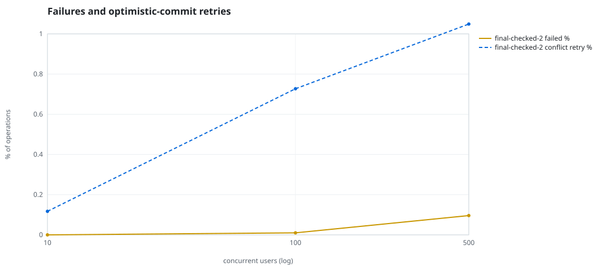
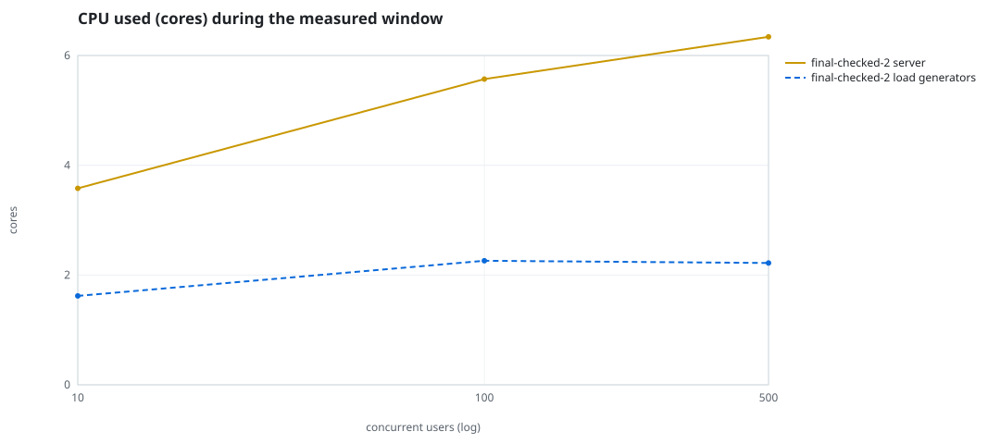
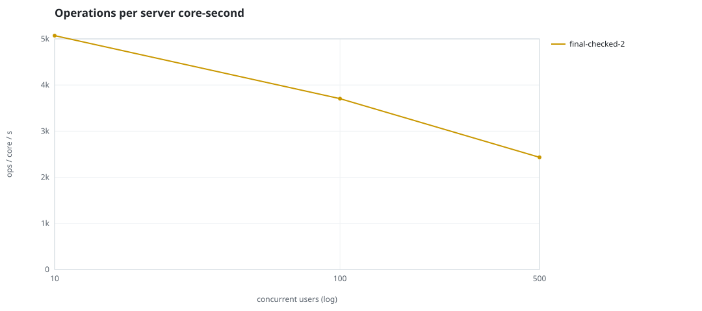
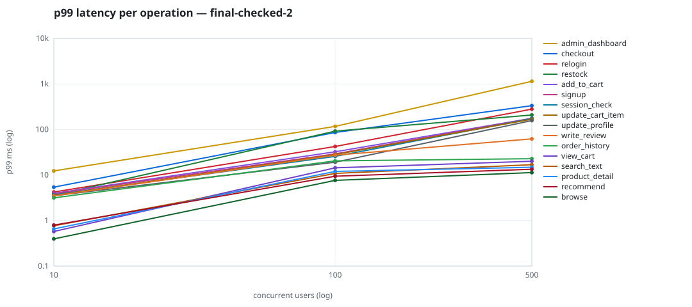

# Mini-SaaS concurrency simulation — sidecar

Run: `final-checked-2` on 2026-09-23T16:52:49 · commit `92e0290` · macOS-26.6.2-arm64-arm-64bit · 10 CPUs

## Configuration

- **transport**: sidecar
- **levels**: [10, 100, 500]
- **duration**: 20.0
- **warmup**: 3.0
- **ramp**: 3.0
- **think**: [0.0, 0.0]
- **processes**: 0
- **connections**: 0
- **durability**: balanced
- **products**: 5000
- **accounts**: 20000
- **scenario**: compound-index
- **seed**: 1
- **fresh_per_stage**: False
- **seed time**: 1.11 s, 13.1 MiB after seeding

## Capacity and performance curve

Latencies are of the database call (service operation) in milliseconds; `user p99` adds the wait for a pooled connection.

| users | conns | ops/s | reads/s | writes/s | p50 | p95 | p99 | p99.9 | max | user p99 | success % | conflict retry % | srv CPU | srv RSS MiB | gen CPU | thr CV | invariants |
|---:|---:|---:|---:|---:|---:|---:|---:|---:|---:|---:|---:|---:|---:|---:|---:|---:|---:|
| 10 | 10 | 18149.8 | 14041.8 | 4107.9 | 0.284 | 1.484 | 4.721 | 9.904 | 530.716 | 4.722 | 100.0 | 0.117 | 3.58 | 174.1 | 1.62 | 0.185 | ok |
| 100 | 100 | 20627.0 | 15952.4 | 4674.6 | 1.02 | 15.355 | 27.783 | 82.166 | 1867.907 | 27.784 | 99.99 | 0.727 | 5.57 | 372.1 | 2.26 | 0.298 | ok |
| 500 | 500 | 15419.2 | 11920.0 | 3499.2 | 2.226 | 117.92 | 185.093 | 449.157 | 1519.478 | 185.094 | 99.904 | 1.049 | 6.34 | 547.9 | 2.22 | 0.095 | ok |

## Insights

- **Peak throughput**: 20627.0 ops/s at 100 users (p99 27.783 ms).
- **Capacity at p99 ≤ 10 ms**: 10 users (DB latency); 10 users counting pool wait.
- **Capacity at p99 ≤ 50 ms**: 100 users (DB latency); 100 users counting pool wait.
- **Capacity at p99 ≤ 100 ms**: 100 users (DB latency); 100 users counting pool wait.
- **Capacity at p99 ≤ 250 ms**: 500 users (DB latency); 500 users counting pool wait.
- **Capacity at p99 ≤ 1000 ms**: 500 users (DB latency); 500 users counting pool wait.
- **USL fit**: σ (contention) = 0.23, κ (coherency) = 2.51e-04, predicted peak at N ≈ 55.4 (rmse log 0.0188).
- **Ops per server core-second**: 10→5070, 100→3703, 500→2432.
- **Read-your-writes violations**: none.
- **Business invariants**: all stages ok.
- **Offline integrity check** (elitesql check): ok in 16.11 s.
  - right after killing the server (no clean close): exit 3, 0 errors, 679346 warnings; after one clean open/close: exit 0, 0 errors, 0 warnings.
- **Database size**: 84.1 MiB after the first stage, 179.8 MiB after the last; 40730 paid orders in total.

## p99 latency per operation (ms)

| op | share % | 10 | 100 | 500 |
|---|---:|---:|---:|---:|
| add_to_cart | 10.22 | 3.96 | 32.36 | 175.59 |
| admin_dashboard | 1.02 | 12.31 | 116.85 | 1143.61 |
| browse | 20.29 | 0.40 | 7.63 | 11.32 |
| checkout | 3.95 | 5.41 | 85.82 | 332.85 |
| order_history | 3.11 | 3.15 | 20.44 | 22.81 |
| product_detail | 17.33 | 0.66 | 11.99 | 14.79 |
| recommend | 7.11 | 0.79 | 9.41 | 13.38 |
| relogin | 1.56 | 4.23 | 42.27 | 279.43 |
| restock | 0.31 | 3.56 | 92.08 | 207.60 |
| search_text | 8.16 | 0.77 | 10.84 | 16.82 |
| session_check | 12.2 | 3.66 | 25.63 | 173.79 |
| signup | 0.48 | 3.88 | 29.09 | 175.16 |
| update_cart_item | 3.06 | 3.56 | 28.13 | 167.70 |
| update_profile | 1.04 | 3.50 | 19.11 | 156.63 |
| view_cart | 8.15 | 0.58 | 14.35 | 20.03 |
| write_review | 2.02 | 3.48 | 27.22 | 62.24 |

## Errors and business outcomes at the highest level

```json
{
 "statuses": {
  "ok": 304373,
  "empty_cart": 3604,
  "conflict_exhausted": 297,
  "out_of_stock": 94,
  "not_found": 17
 },
 "errors": {
  "conflict_exhausted": {
   "count": 330,
   "first": "[elitesql:9] conflict, retry transaction: products/b9 changed after this transaction began",
   "ops": {
    "restock": 22,
    "checkout": 307,
    "write_review": 1
   }
  }
 }
}
```

## Charts








