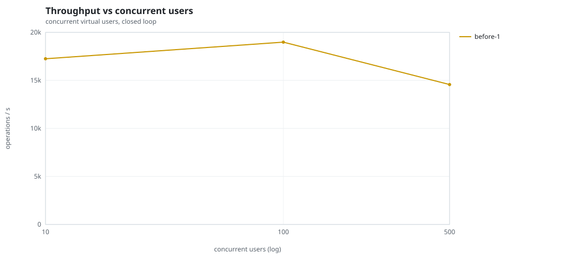
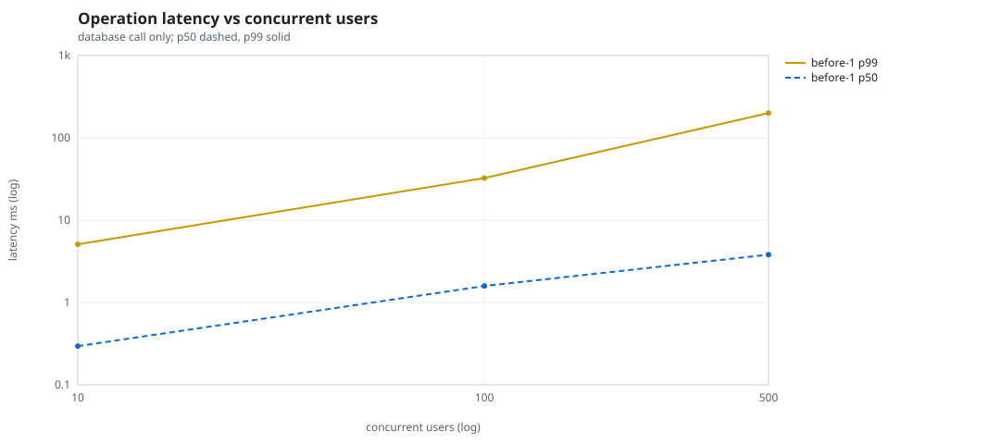
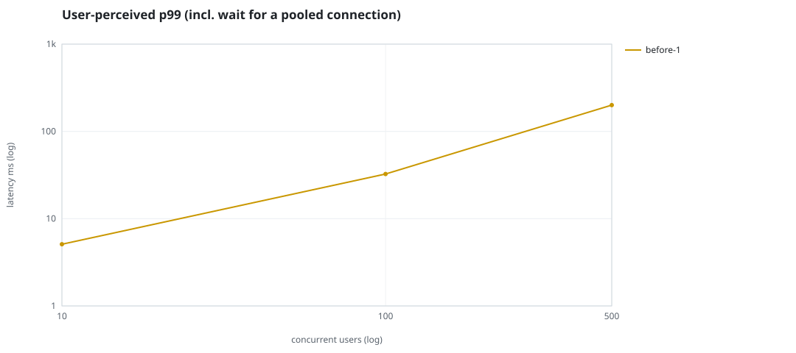
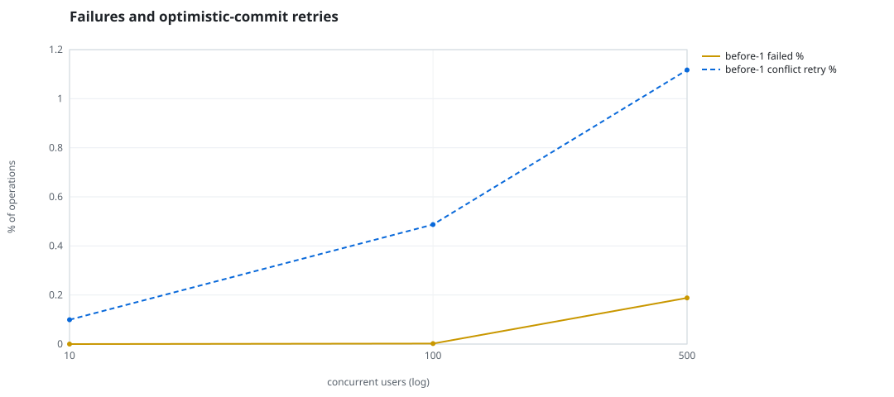
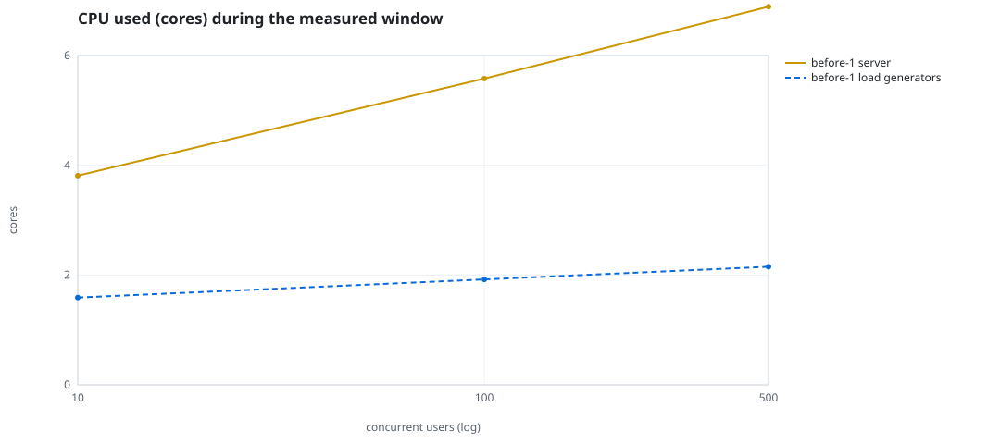
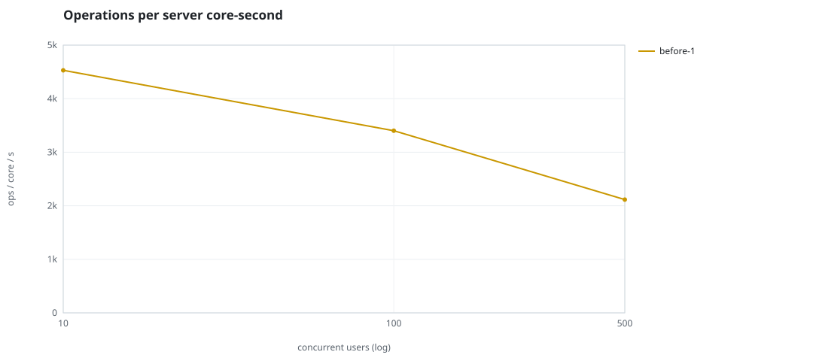
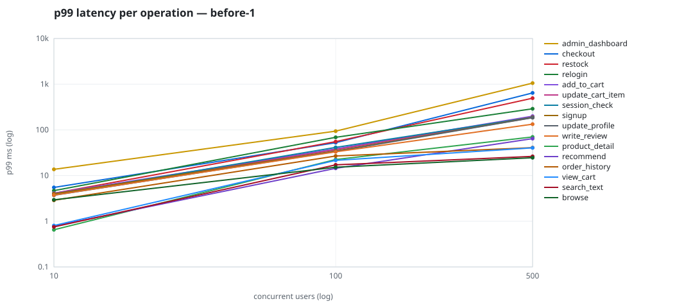

# Mini-SaaS concurrency simulation — sidecar

Run: `before-1` on 2026-09-23T16:18:55 · commit `92e0290` · macOS-26.6.2-arm64-arm-64bit · 10 CPUs

## Configuration

- **transport**: sidecar
- **levels**: [10, 100, 500]
- **duration**: 20.0
- **warmup**: 3.0
- **ramp**: 3.0
- **think**: [0.0, 0.0]
- **processes**: 0
- **connections**: 0
- **durability**: balanced
- **products**: 5000
- **accounts**: 20000
- **scenario**: compound-index
- **seed**: 1
- **fresh_per_stage**: False
- **seed time**: 1.14 s, 13.1 MiB after seeding

## Capacity and performance curve

Latencies are of the database call (service operation) in milliseconds; `user p99` adds the wait for a pooled connection.

| users | conns | ops/s | reads/s | writes/s | p50 | p95 | p99 | p99.9 | max | user p99 | success % | conflict retry % | srv CPU | srv RSS MiB | gen CPU | thr CV | invariants |
|---:|---:|---:|---:|---:|---:|---:|---:|---:|---:|---:|---:|---:|---:|---:|---:|---:|---:|
| 10 | 10 | 17255.5 | 13351.2 | 3904.2 | 0.295 | 1.633 | 5.089 | 10.82 | 568.048 | 5.09 | 100.0 | 0.099 | 3.81 | 167.9 | 1.59 | 0.212 | ok |
| 100 | 100 | 18980.6 | 14685.1 | 4295.4 | 1.584 | 16.47 | 32.467 | 84.266 | 1725.866 | 32.468 | 99.998 | 0.487 | 5.58 | 315.2 | 1.92 | 0.337 | ok |
| 500 | 500 | 14569.1 | 11267.8 | 3301.3 | 3.806 | 123.519 | 200.185 | 630.443 | 2361.056 | 200.186 | 99.812 | 1.117 | 6.89 | 426.0 | 2.15 | 0.109 | ok |

## Insights

- **Peak throughput**: 18980.6 ops/s at 100 users (p99 32.467 ms).
- **Capacity at p99 ≤ 10 ms**: 10 users (DB latency); 10 users counting pool wait.
- **Capacity at p99 ≤ 50 ms**: 100 users (DB latency); 100 users counting pool wait.
- **Capacity at p99 ≤ 100 ms**: 100 users (DB latency); 100 users counting pool wait.
- **Capacity at p99 ≤ 250 ms**: 500 users (DB latency); 500 users counting pool wait.
- **Capacity at p99 ≤ 1000 ms**: 500 users (DB latency); 500 users counting pool wait.
- **USL fit**: σ (contention) = 0.23, κ (coherency) = 2.51e-04, predicted peak at N ≈ 55.4 (rmse log 0.0282).
- **Ops per server core-second**: 10→4529, 100→3402, 500→2115.
- **Read-your-writes violations**: none.
- **Business invariants**: all stages ok.
- **Offline integrity check** (elitesql check): ok in 15.63 s.
  - right after killing the server (no clean close): exit 3, 0 errors, 645002 warnings; after one clean open/close: exit 0, 0 errors, 0 warnings.
- **Database size**: 81.6 MiB after the first stage, 168.4 MiB after the last; 38362 paid orders in total.

## p99 latency per operation (ms)

| op | share % | 10 | 100 | 500 |
|---|---:|---:|---:|---:|
| add_to_cart | 10.23 | 4.11 | 38.42 | 200.07 |
| admin_dashboard | 1.02 | 13.68 | 93.88 | 1055.13 |
| browse | 20.31 | 2.95 | 15.22 | 24.54 |
| checkout | 3.94 | 5.50 | 52.33 | 644.74 |
| order_history | 3.1 | 2.88 | 26.83 | 40.85 |
| product_detail | 17.34 | 0.65 | 22.47 | 70.06 |
| recommend | 7.1 | 0.78 | 14.39 | 64.43 |
| relogin | 1.55 | 4.67 | 68.62 | 289.79 |
| restock | 0.31 | 4.09 | 55.28 | 494.40 |
| search_text | 8.17 | 0.75 | 17.13 | 26.30 |
| session_check | 12.19 | 3.81 | 41.39 | 189.26 |
| signup | 0.49 | 3.99 | 34.63 | 186.95 |
| update_cart_item | 3.05 | 3.88 | 36.98 | 192.54 |
| update_profile | 1.04 | 3.70 | 33.76 | 184.70 |
| view_cart | 8.15 | 0.81 | 21.49 | 40.47 |
| write_review | 2.02 | 3.74 | 33.07 | 133.40 |

## Errors and business outcomes at the highest level

```json
{
 "statuses": {
  "ok": 287418,
  "conflict_exhausted": 549,
  "empty_cart": 3353,
  "out_of_stock": 50,
  "not_found": 13
 },
 "errors": {
  "conflict_exhausted": {
   "count": 590,
   "first": "[elitesql:9] conflict, retry transaction: products/b3 changed after this transaction began",
   "ops": {
    "checkout": 524,
    "restock": 66
   }
  }
 }
}
```

## Charts








