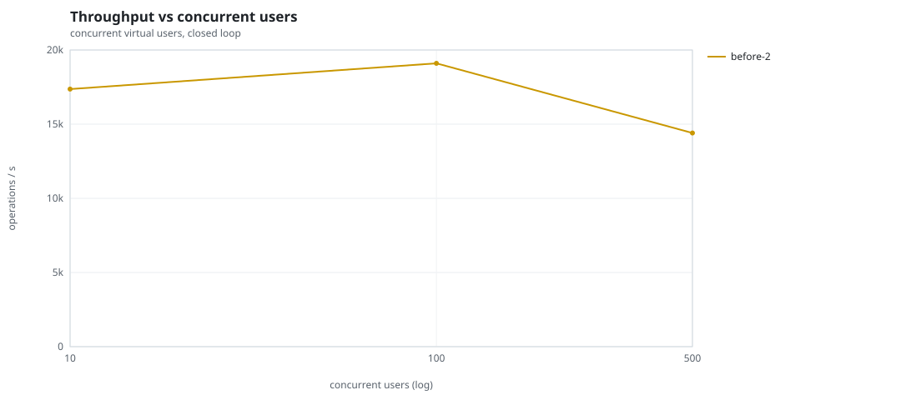
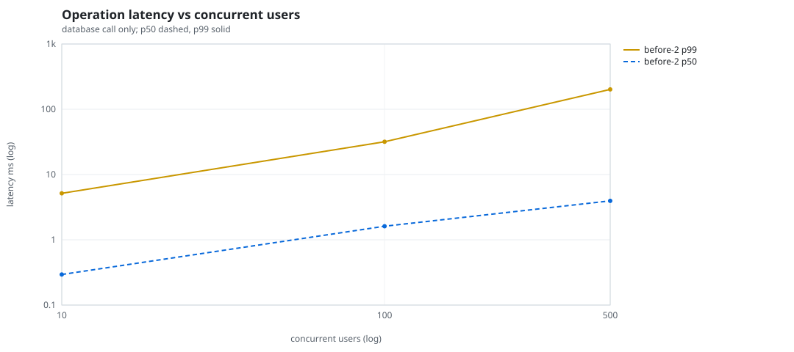
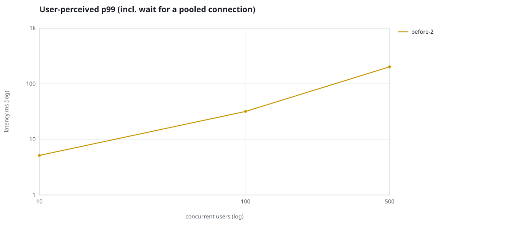
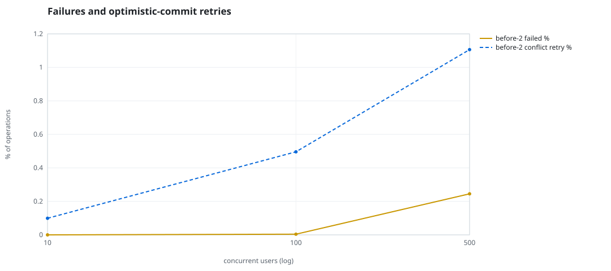
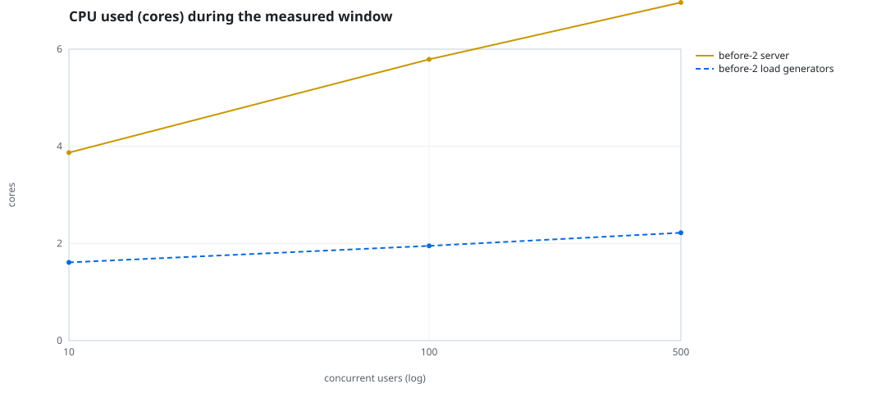
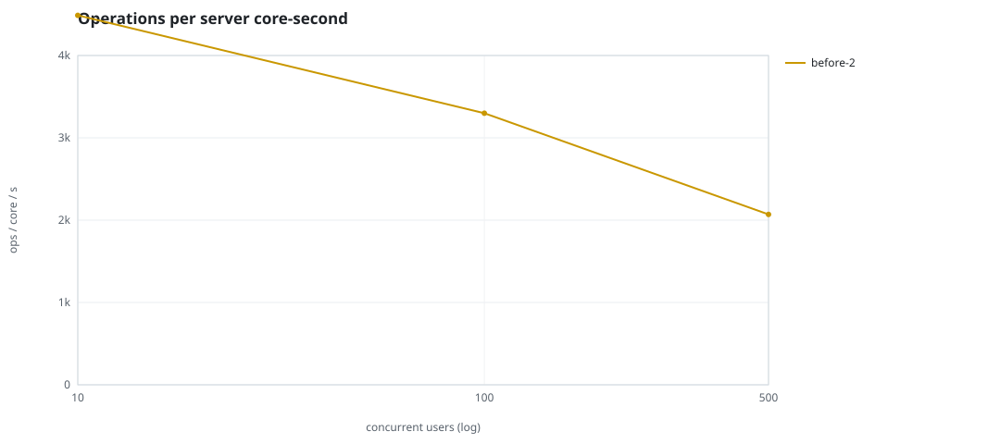
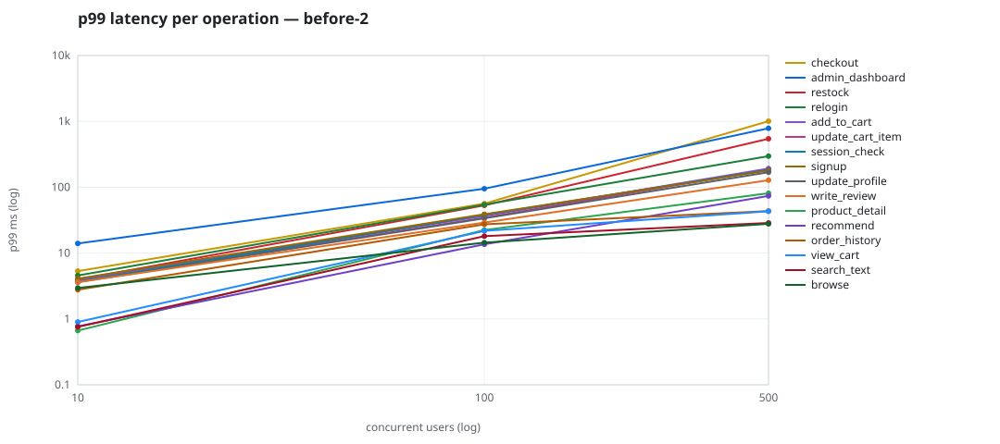

# Mini-SaaS concurrency simulation — sidecar

Run: `before-2` on 2026-09-23T16:24:33 · commit `92e0290` · macOS-26.6.2-arm64-arm-64bit · 10 CPUs

## Configuration

- **transport**: sidecar
- **levels**: [10, 100, 500]
- **duration**: 20.0
- **warmup**: 3.0
- **ramp**: 3.0
- **think**: [0.0, 0.0]
- **processes**: 0
- **connections**: 0
- **durability**: balanced
- **products**: 5000
- **accounts**: 20000
- **scenario**: compound-index
- **seed**: 1
- **fresh_per_stage**: False
- **seed time**: 1.14 s, 13.1 MiB after seeding

## Capacity and performance curve

Latencies are of the database call (service operation) in milliseconds; `user p99` adds the wait for a pooled connection.

| users | conns | ops/s | reads/s | writes/s | p50 | p95 | p99 | p99.9 | max | user p99 | success % | conflict retry % | srv CPU | srv RSS MiB | gen CPU | thr CV | invariants |
|---:|---:|---:|---:|---:|---:|---:|---:|---:|---:|---:|---:|---:|---:|---:|---:|---:|---:|
| 10 | 10 | 17366.9 | 13435.8 | 3931.2 | 0.294 | 1.622 | 5.152 | 11.032 | 550.923 | 5.153 | 100.0 | 0.099 | 3.87 | 170.2 | 1.61 | 0.19 | ok |
| 100 | 100 | 19101.6 | 14778.8 | 4322.8 | 1.612 | 16.311 | 31.785 | 84.245 | 1718.192 | 31.786 | 99.996 | 0.496 | 5.79 | 320.2 | 1.95 | 0.302 | ok |
| 500 | 500 | 14401.8 | 11134.3 | 3267.4 | 3.951 | 127.447 | 201.664 | 693.207 | 2287.049 | 201.665 | 99.755 | 1.106 | 6.96 | 415.8 | 2.22 | 0.108 | ok |

## Insights

- **Peak throughput**: 19101.6 ops/s at 100 users (p99 31.785 ms).
- **Capacity at p99 ≤ 10 ms**: 10 users (DB latency); 10 users counting pool wait.
- **Capacity at p99 ≤ 50 ms**: 100 users (DB latency); 100 users counting pool wait.
- **Capacity at p99 ≤ 100 ms**: 100 users (DB latency); 100 users counting pool wait.
- **Capacity at p99 ≤ 250 ms**: 500 users (DB latency); 500 users counting pool wait.
- **Capacity at p99 ≤ 1000 ms**: 500 users (DB latency); 500 users counting pool wait.
- **USL fit**: σ (contention) = 0.23, κ (coherency) = 2.51e-04, predicted peak at N ≈ 55.4 (rmse log 0.0292).
- **Ops per server core-second**: 10→4488, 100→3299, 500→2069.
- **Seconds with zero completed operations** (stalls): [(100, 1)].
- **Read-your-writes violations**: none.
- **Business invariants**: all stages ok.
- **Offline integrity check** (elitesql check): ok in 15.3 s.
  - right after killing the server (no clean close): exit 3, 0 errors, 644136 warnings; after one clean open/close: exit 0, 0 errors, 0 warnings.
- **Database size**: 82.0 MiB after the first stage, 168.1 MiB after the last; 38199 paid orders in total.

## p99 latency per operation (ms)

| op | share % | 10 | 100 | 500 |
|---|---:|---:|---:|---:|
| add_to_cart | 10.24 | 3.98 | 36.70 | 192.12 |
| admin_dashboard | 1.01 | 14.01 | 95.02 | 783.47 |
| browse | 20.31 | 2.95 | 14.40 | 27.74 |
| checkout | 3.95 | 5.32 | 56.38 | 1007.06 |
| order_history | 3.1 | 2.78 | 27.34 | 43.40 |
| product_detail | 17.34 | 0.67 | 22.41 | 81.05 |
| recommend | 7.1 | 0.77 | 13.58 | 73.75 |
| relogin | 1.56 | 4.57 | 54.52 | 296.24 |
| restock | 0.31 | 3.95 | 53.09 | 544.74 |
| search_text | 8.17 | 0.76 | 18.09 | 28.71 |
| session_check | 12.19 | 3.71 | 37.97 | 183.64 |
| signup | 0.49 | 4.10 | 38.92 | 179.72 |
| update_cart_item | 3.04 | 3.75 | 34.37 | 186.20 |
| update_profile | 1.04 | 3.61 | 33.72 | 168.61 |
| view_cart | 8.15 | 0.90 | 21.71 | 43.17 |
| write_review | 2.02 | 3.64 | 29.10 | 128.03 |

## Errors and business outcomes at the highest level

```json
{
 "statuses": {
  "ok": 284005,
  "empty_cart": 3262,
  "conflict_exhausted": 707,
  "out_of_stock": 48,
  "not_found": 13
 },
 "errors": {
  "conflict_exhausted": {
   "count": 739,
   "first": "[elitesql:9] conflict, retry transaction: products/b8 changed after this transaction began",
   "ops": {
    "restock": 64,
    "checkout": 675
   }
  }
 }
}
```

## Charts








