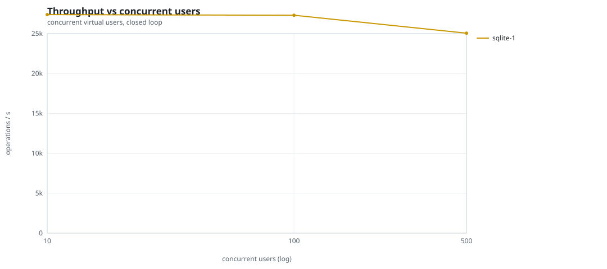
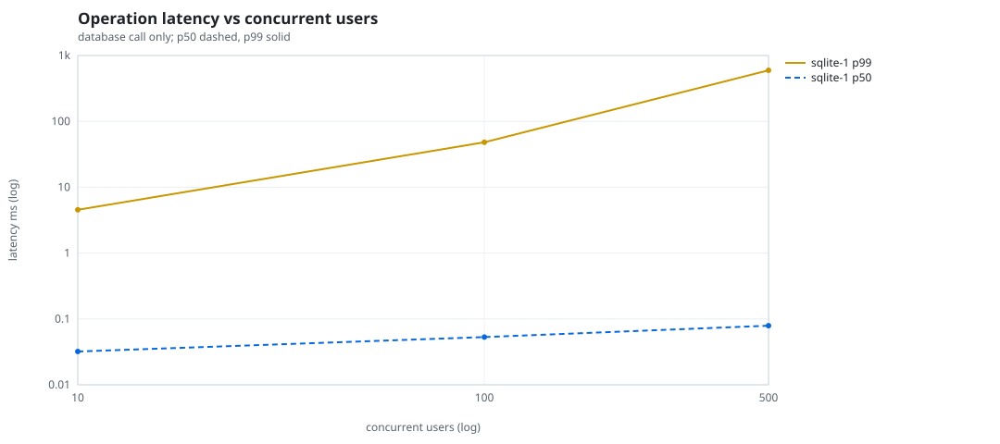
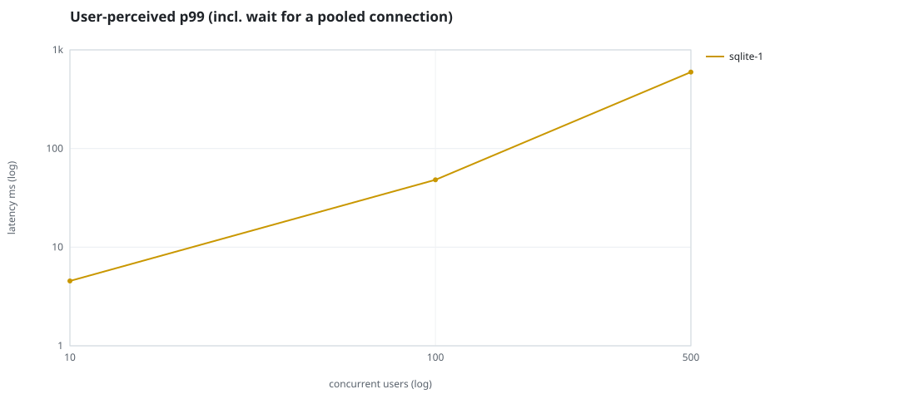
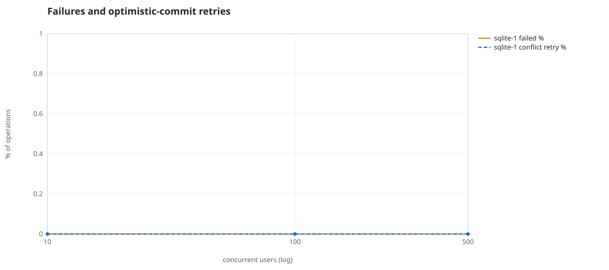
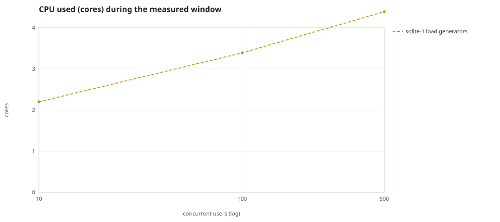
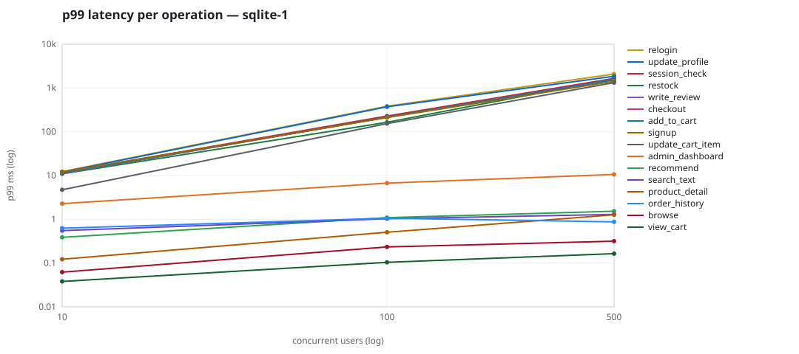

# Mini-SaaS concurrency simulation — sqlite

Run: `sqlite-1` on 2026-09-23T16:22:57 · commit `92e0290` · macOS-26.6.2-arm64-arm-64bit · 10 CPUs

## Configuration

- **transport**: sqlite
- **levels**: [10, 100, 500]
- **duration**: 20.0
- **warmup**: 3.0
- **ramp**: 3.0
- **think**: [0.0, 0.0]
- **processes**: 0
- **connections**: 0
- **durability**: balanced
- **products**: 5000
- **accounts**: 20000
- **scenario**: compound-index
- **seed**: 1
- **fresh_per_stage**: False
- **seed time**: 0.14 s, 4.6 MiB after seeding

## Capacity and performance curve

Latencies are of the database call (service operation) in milliseconds; `user p99` adds the wait for a pooled connection.

| users | conns | ops/s | reads/s | writes/s | p50 | p95 | p99 | p99.9 | max | user p99 | success % | conflict retry % | srv CPU | srv RSS MiB | gen CPU | thr CV | invariants |
|---:|---:|---:|---:|---:|---:|---:|---:|---:|---:|---:|---:|---:|---:|---:|---:|---:|---:|
| 10 | 10 | 27380.9 | 21171.4 | 6209.5 | 0.032 | 1.151 | 4.546 | 43.789 | 2103.776 | 4.546 | 100.0 | 0.0 | None | None | 2.2 | 0.035 | ok |
| 100 | 100 | 27301.8 | 21119.8 | 6181.9 | 0.053 | 2.598 | 48.159 | 794.484 | 3863.358 | 48.16 | 100.0 | 0.0 | None | None | 3.39 | 0.029 | ok |
| 500 | 500 | 25057.7 | 19388.0 | 5669.6 | 0.079 | 4.778 | 595.597 | 2807.475 | 8265.415 | 595.598 | 100.0 | 0.0 | None | None | 4.39 | 0.03 | ok |

## Insights

- **Peak throughput**: 27380.9 ops/s at 10 users (p99 4.546 ms).
- **Capacity at p99 ≤ 10 ms**: 10 users (DB latency); 10 users counting pool wait.
- **Capacity at p99 ≤ 50 ms**: 100 users (DB latency); 100 users counting pool wait.
- **Capacity at p99 ≤ 100 ms**: 100 users (DB latency); 100 users counting pool wait.
- **Capacity at p99 ≤ 250 ms**: 100 users (DB latency); 100 users counting pool wait.
- **Capacity at p99 ≤ 1000 ms**: 500 users (DB latency); 500 users counting pool wait.
- **USL fit**: σ (contention) = 0.25, κ (coherency) = 1.58e-04, predicted peak at N ≈ 68.8 (rmse log 0.0742).
- **Generator CPU includes the database**: SQLite runs inside the load-generator processes, so `gen CPU` is application plus engine and there is no server column.
- **Read-your-writes violations**: none.
- **Business invariants**: all stages ok.
- **Offline integrity check** (PRAGMA integrity_check): ok in 0.12 s.
- **Database size**: 11.4 MiB after the first stage, 24.9 MiB after the last; 58943 paid orders in total.

## p99 latency per operation (ms)

| op | share % | 10 | 100 | 500 |
|---|---:|---:|---:|---:|
| add_to_cart | 10.19 | 11.45 | 215.84 | 1546.14 |
| admin_dashboard | 1.02 | 2.28 | 6.70 | 10.58 |
| browse | 20.33 | 0.06 | 0.23 | 0.32 |
| checkout | 3.98 | 11.28 | 215.17 | 1551.50 |
| order_history | 3.1 | 0.63 | 1.06 | 0.87 |
| product_detail | 17.29 | 0.12 | 0.51 | 1.27 |
| recommend | 7.08 | 0.39 | 1.09 | 1.53 |
| relogin | 1.55 | 12.29 | 384.48 | 2080.95 |
| restock | 0.3 | 10.95 | 164.95 | 1630.46 |
| search_text | 8.12 | 0.55 | 1.03 | 1.30 |
| session_check | 12.22 | 11.77 | 228.85 | 1655.11 |
| signup | 0.49 | 12.08 | 211.01 | 1424.69 |
| update_cart_item | 3.09 | 4.73 | 153.52 | 1331.66 |
| update_profile | 1.04 | 11.98 | 372.11 | 1856.66 |
| view_cart | 8.16 | 0.04 | 0.10 | 0.16 |
| write_review | 2.03 | 11.14 | 215.66 | 1559.14 |

## Errors and business outcomes at the highest level

```json
{
 "statuses": {
  "ok": 494323,
  "empty_cart": 5810,
  "out_of_stock": 987,
  "not_found": 33
 },
 "errors": {}
}
```

## Charts








