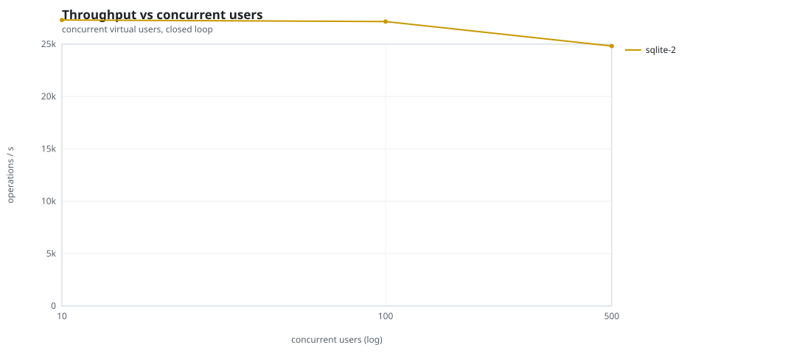
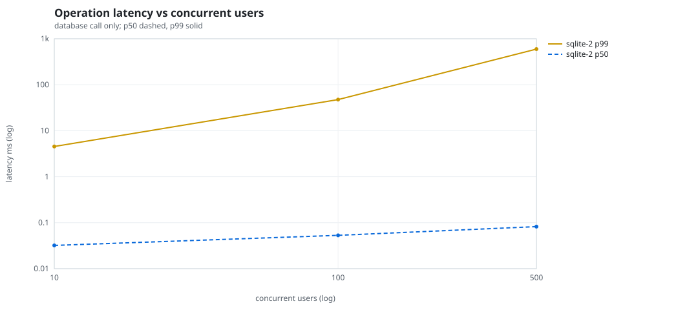
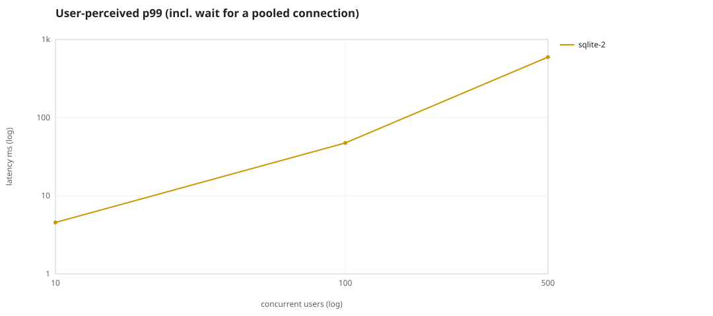
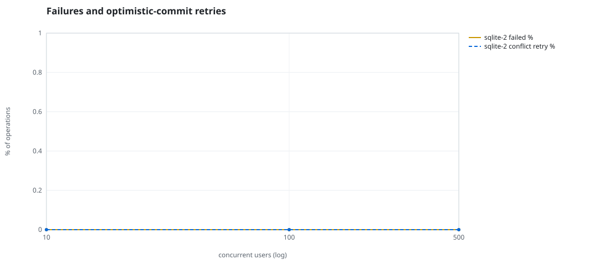
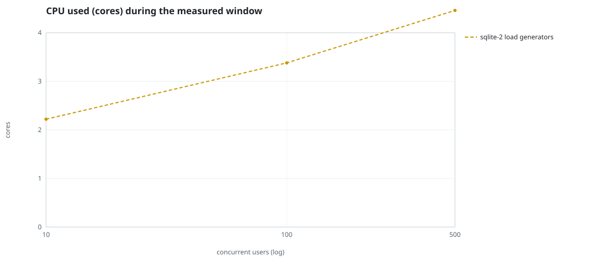
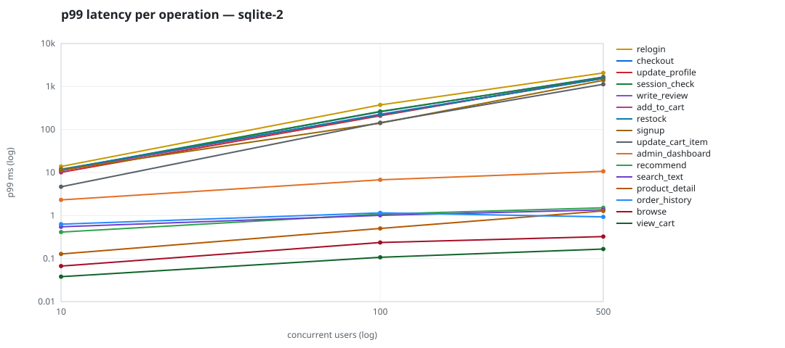

# Mini-SaaS concurrency simulation — sqlite

Run: `sqlite-2` on 2026-09-23T16:28:34 · commit `92e0290` · macOS-26.6.2-arm64-arm-64bit · 10 CPUs

## Configuration

- **transport**: sqlite
- **levels**: [10, 100, 500]
- **duration**: 20.0
- **warmup**: 3.0
- **ramp**: 3.0
- **think**: [0.0, 0.0]
- **processes**: 0
- **connections**: 0
- **durability**: balanced
- **products**: 5000
- **accounts**: 20000
- **scenario**: compound-index
- **seed**: 1
- **fresh_per_stage**: False
- **seed time**: 0.14 s, 4.6 MiB after seeding

## Capacity and performance curve

Latencies are of the database call (service operation) in milliseconds; `user p99` adds the wait for a pooled connection.

| users | conns | ops/s | reads/s | writes/s | p50 | p95 | p99 | p99.9 | max | user p99 | success % | conflict retry % | srv CPU | srv RSS MiB | gen CPU | thr CV | invariants |
|---:|---:|---:|---:|---:|---:|---:|---:|---:|---:|---:|---:|---:|---:|---:|---:|---:|---:|
| 10 | 10 | 27302.7 | 21107.0 | 6195.8 | 0.032 | 1.223 | 4.547 | 44.078 | 1304.188 | 4.547 | 100.0 | 0.0 | None | None | 2.22 | 0.032 | ok |
| 100 | 100 | 27159.0 | 21004.2 | 6154.8 | 0.053 | 2.561 | 47.46 | 799.914 | 4087.072 | 47.461 | 100.0 | 0.0 | None | None | 3.38 | 0.031 | ok |
| 500 | 500 | 24815.5 | 19200.3 | 5615.1 | 0.082 | 4.837 | 595.812 | 2805.035 | 11085.163 | 595.813 | 100.0 | 0.0 | None | None | 4.46 | 0.023 | ok |

## Insights

- **Peak throughput**: 27302.7 ops/s at 10 users (p99 4.547 ms).
- **Capacity at p99 ≤ 10 ms**: 10 users (DB latency); 10 users counting pool wait.
- **Capacity at p99 ≤ 50 ms**: 100 users (DB latency); 100 users counting pool wait.
- **Capacity at p99 ≤ 100 ms**: 100 users (DB latency); 100 users counting pool wait.
- **Capacity at p99 ≤ 250 ms**: 100 users (DB latency); 100 users counting pool wait.
- **Capacity at p99 ≤ 1000 ms**: 500 users (DB latency); 500 users counting pool wait.
- **USL fit**: σ (contention) = 0.25, κ (coherency) = 1.58e-04, predicted peak at N ≈ 68.8 (rmse log 0.0751).
- **Generator CPU includes the database**: SQLite runs inside the load-generator processes, so `gen CPU` is application plus engine and there is no server column.
- **Read-your-writes violations**: none.
- **Business invariants**: all stages ok.
- **Offline integrity check** (PRAGMA integrity_check): ok in 0.12 s.
- **Database size**: 11.4 MiB after the first stage, 24.8 MiB after the last; 58554 paid orders in total.

## p99 latency per operation (ms)

| op | share % | 10 | 100 | 500 |
|---|---:|---:|---:|---:|
| add_to_cart | 10.2 | 11.52 | 218.46 | 1552.80 |
| admin_dashboard | 1.03 | 2.32 | 6.80 | 10.69 |
| browse | 20.31 | 0.07 | 0.24 | 0.33 |
| checkout | 3.99 | 11.44 | 259.61 | 1656.29 |
| order_history | 3.11 | 0.63 | 1.15 | 0.93 |
| product_detail | 17.33 | 0.13 | 0.50 | 1.28 |
| recommend | 7.07 | 0.41 | 1.08 | 1.51 |
| relogin | 1.54 | 13.84 | 373.96 | 2069.41 |
| restock | 0.31 | 11.94 | 221.00 | 1541.37 |
| search_text | 8.14 | 0.55 | 1.01 | 1.36 |
| session_check | 12.21 | 11.62 | 263.84 | 1631.01 |
| signup | 0.5 | 11.47 | 140.92 | 1391.56 |
| update_cart_item | 3.09 | 4.67 | 144.59 | 1129.71 |
| update_profile | 1.04 | 10.11 | 208.94 | 1640.26 |
| view_cart | 8.13 | 0.04 | 0.11 | 0.17 |
| write_review | 2.04 | 11.00 | 226.79 | 1554.77 |

## Errors and business outcomes at the highest level

```json
{
 "statuses": {
  "ok": 489548,
  "empty_cart": 5770,
  "out_of_stock": 962,
  "not_found": 29
 },
 "errors": {}
}
```

## Charts








