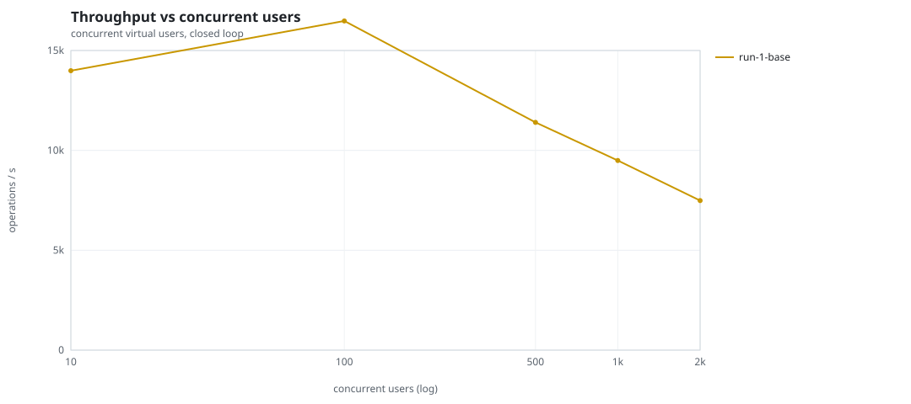
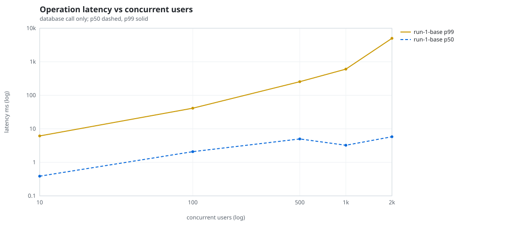
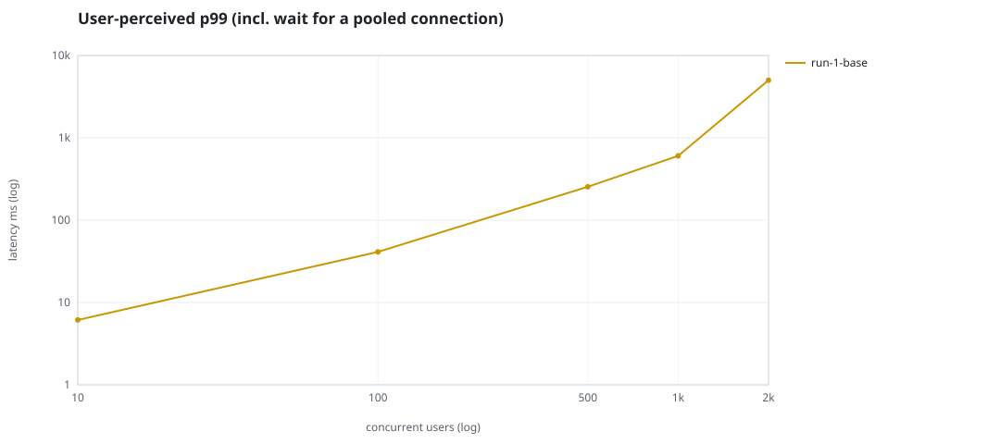
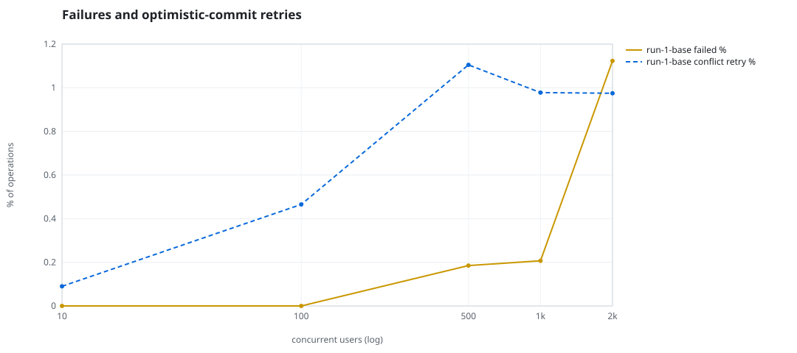
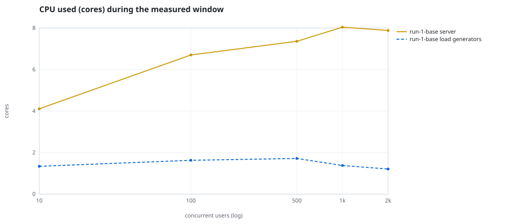
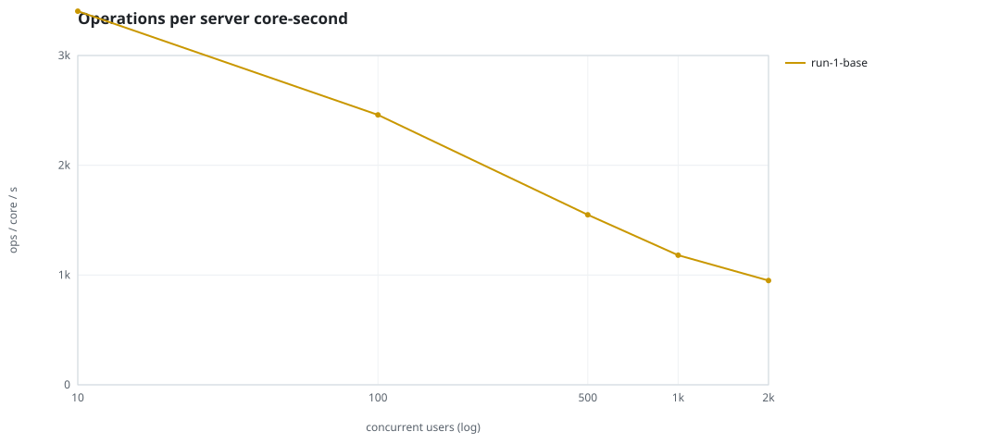
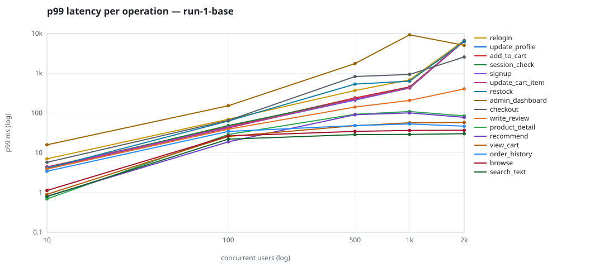

# Mini-SaaS concurrency simulation — sidecar

Run: `run-1-base` on 2026-09-25T22:39:55 · commit `a26bf2f` · macOS-26.6.2-arm64-arm-64bit · 10 CPUs

## Configuration

- **transport**: sidecar
- **levels**: [10, 100, 500, 1000, 2000]
- **duration**: 30.0
- **warmup**: 5.0
- **ramp**: 5.0
- **think**: [0.0, 0.0]
- **processes**: 0
- **connections**: 0
- **durability**: balanced
- **products**: 5000
- **accounts**: 20000
- **scenario**: baseline
- **seed**: 1
- **fresh_per_stage**: False
- **seed time**: 1.28 s, 12.9 MiB after seeding

## Capacity and performance curve

Latencies are of the database call (service operation) in milliseconds; `user p99` adds the wait for a pooled connection.

| users | conns | ops/s | reads/s | writes/s | p50 | p95 | p99 | p99.9 | max | user p99 | success % | conflict retry % | srv CPU | srv RSS MiB | gen CPU | thr CV | invariants |
|---:|---:|---:|---:|---:|---:|---:|---:|---:|---:|---:|---:|---:|---:|---:|---:|---:|---:|
| 10 | 10 | 13987.8 | 10814.2 | 3173.6 | 0.387 | 1.942 | 6.13 | 12.578 | 2256.056 | 6.131 | 100.0 | 0.09 | 4.11 | 316.0 | 1.34 | 0.281 | ok |
| 100 | 100 | 16477.2 | 12741.6 | 3735.6 | 2.085 | 21.069 | 41.193 | 92.315 | 1041.1 | 41.194 | 100.0 | 0.465 | 6.7 | 420.8 | 1.63 | 0.111 | ok |
| 500 | 500 | 11400.7 | 8818.6 | 2582.1 | 4.989 | 156.084 | 254.718 | 982.963 | 3082.433 | 254.719 | 99.815 | 1.105 | 7.36 | 451.5 | 1.72 | 0.083 | ok |
| 1000 | 1000 | 9493.3 | 7346.8 | 2146.5 | 3.238 | 317.084 | 603.733 | 6224.038 | 12504.568 | 603.734 | 99.793 | 0.978 | 8.04 | 547.2 | 1.38 | 0.16 | ok |
| 2000 | 2000 | 7486.6 | 5788.9 | 1697.6 | 5.806 | 804.938 | 5005.91 | 6628.477 | 8008.388 | 5005.911 | 98.877 | 0.975 | 7.88 | 855.2 | 1.21 | 0.33 | ok |

## Insights

- **Peak throughput**: 16477.2 ops/s at 100 users (p99 41.193 ms).
- **Capacity at p99 ≤ 10 ms**: 10 users (DB latency); 10 users counting pool wait.
- **Capacity at p99 ≤ 50 ms**: 100 users (DB latency); 100 users counting pool wait.
- **Capacity at p99 ≤ 100 ms**: 100 users (DB latency); 100 users counting pool wait.
- **Capacity at p99 ≤ 250 ms**: 100 users (DB latency); 100 users counting pool wait.
- **Capacity at p99 ≤ 1000 ms**: 1000 users (DB latency); 1000 users counting pool wait.
- **USL fit**: σ (contention) = 0.23, κ (coherency) = 2.00e-04, predicted peak at N ≈ 62.1 (rmse log 0.0725).
- **Ops per server core-second**: 10→3403, 100→2459, 500→1549, 1000→1181, 2000→950.
- **Connections refused while opening the pools** (listen backlog overflow, retried with backoff): [(1000, 3), (2000, 18)].
- **Seconds with zero completed operations** (stalls): [(10, 1)].
- **Read-your-writes violations**: none.
- **Business invariants**: all stages ok.
- **Offline integrity check** (elitesql check): ok in 25.14 s.
  - right after killing the server (no clean close): exit 3, 0 errors, 1103602 warnings; after one clean open/close: exit 0, 0 errors, 0 warnings.
- **Database size**: 39.5 MiB after the first stage, 129.9 MiB after the last; 66693 paid orders in total.

## p99 latency per operation (ms)

| op | share % | 10 | 100 | 500 | 1000 | 2000 |
|---|---:|---:|---:|---:|---:|---:|
| add_to_cart | 10.23 | 4.40 | 45.14 | 239.94 | 453.87 | 6476.57 |
| admin_dashboard | 1.02 | 15.86 | 152.37 | 1753.12 | 9258.80 | 5030.32 |
| browse | 20.31 | 1.13 | 26.59 | 34.55 | 36.47 | 36.80 |
| checkout | 3.97 | 5.75 | 65.33 | 829.39 | 933.40 | 2564.32 |
| order_history | 3.11 | 3.42 | 34.42 | 48.33 | 53.02 | 46.63 |
| product_detail | 17.35 | 0.69 | 28.76 | 92.75 | 109.04 | 84.46 |
| recommend | 7.06 | 0.81 | 18.82 | 90.32 | 100.55 | 77.65 |
| relogin | 1.55 | 7.05 | 69.68 | 368.69 | 681.29 | 6696.50 |
| restock | 0.31 | 4.09 | 63.07 | 534.45 | 630.93 | 6266.23 |
| search_text | 8.13 | 0.79 | 21.98 | 28.64 | 29.00 | 30.15 |
| session_check | 12.19 | 4.04 | 48.33 | 223.46 | 438.22 | 6473.00 |
| signup | 0.49 | 4.25 | 43.34 | 214.69 | 428.83 | 6441.21 |
| update_cart_item | 3.07 | 4.08 | 41.84 | 225.44 | 425.56 | 6437.33 |
| update_profile | 1.04 | 3.91 | 43.36 | 212.05 | 427.80 | 6512.86 |
| view_cart | 8.15 | 0.90 | 25.70 | 48.06 | 56.73 | 57.93 |
| write_review | 2.03 | 3.90 | 39.19 | 141.43 | 206.94 | 404.04 |

## Errors and business outcomes at the highest level

```json
{
 "statuses": {
  "ok": 218854,
  "error:16": 2235,
  "empty_cart": 2441,
  "not_found": 13,
  "out_of_stock": 767,
  "conflict_exhausted": 287
 },
 "errors": {
  "conflict_exhausted": {
   "count": 388,
   "first": "[elitesql:9] conflict, retry transaction: products/b4 changed after this transaction began",
   "ops": {
    "restock": 52,
    "checkout": 336
   }
  },
  "error:16": {
   "count": 3001,
   "first": "[elitesql:16] memory limit exceeded: query memory admission timed out",
   "ops": {
    "admin_dashboard": 3001
   }
  }
 }
}
```

## Charts








