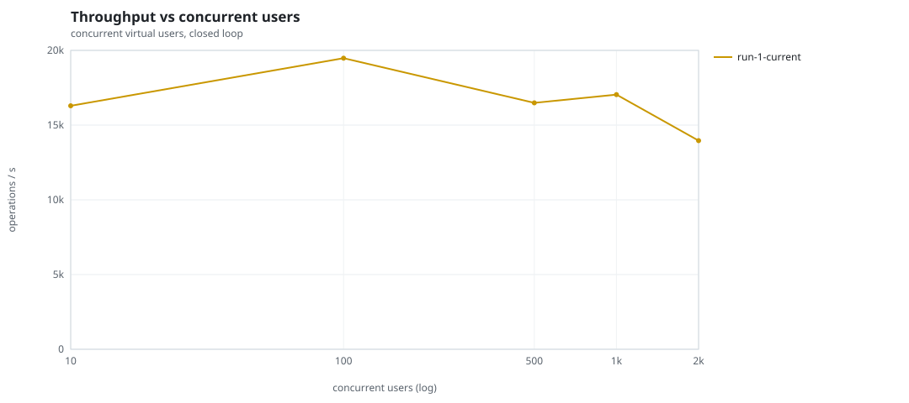
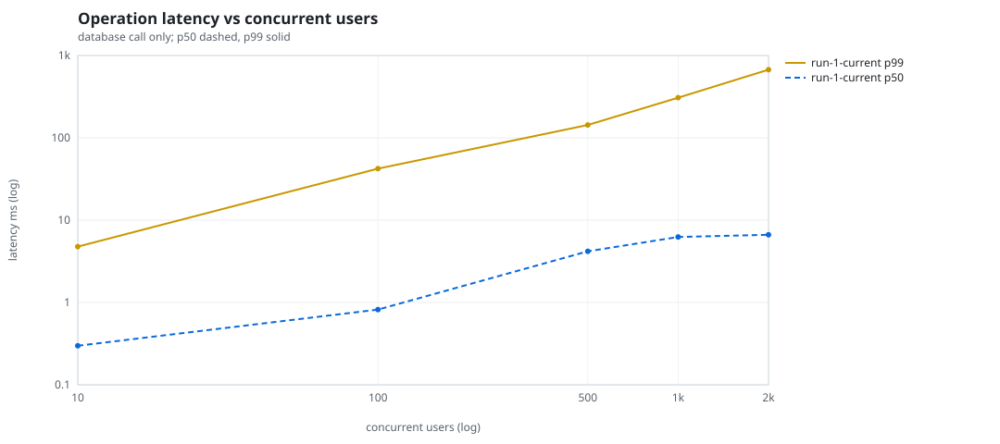
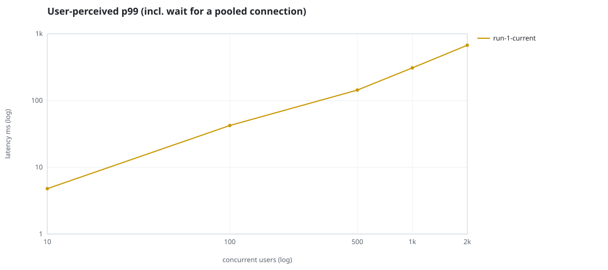
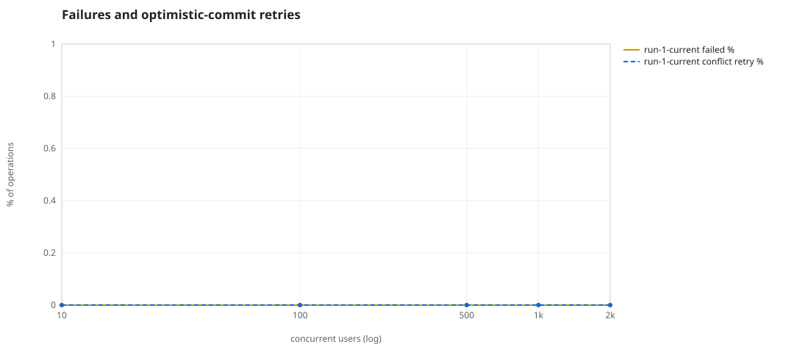
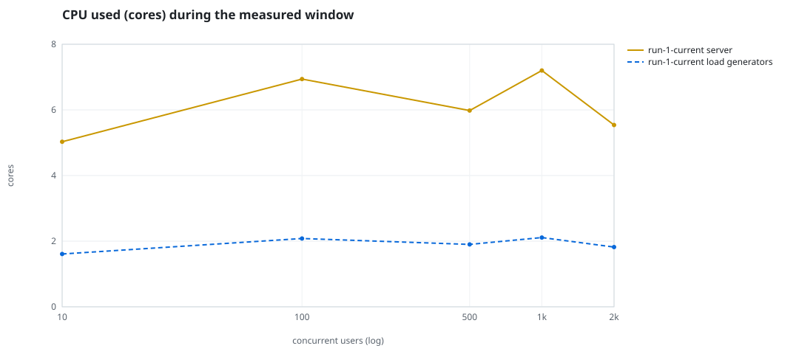
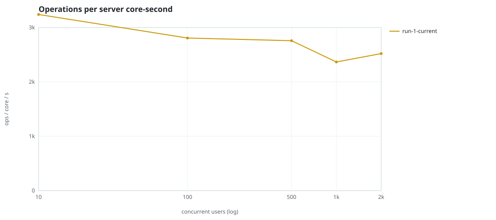
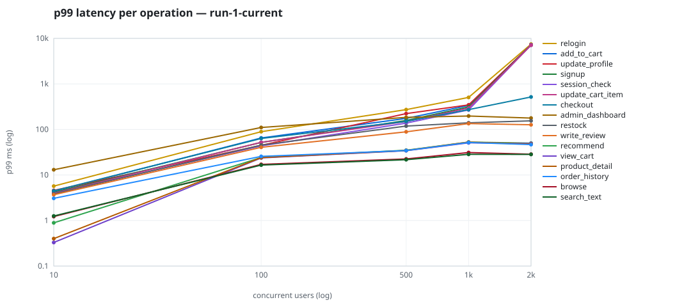

# Mini-SaaS concurrency simulation — sidecar

Run: `run-1-current` on 2026-09-25T22:44:31 · commit `a26bf2f` · macOS-26.6.2-arm64-arm-64bit · 10 CPUs

## Configuration

- **transport**: sidecar
- **levels**: [10, 100, 500, 1000, 2000]
- **duration**: 30.0
- **warmup**: 5.0
- **ramp**: 5.0
- **think**: [0.0, 0.0]
- **processes**: 0
- **connections**: 0
- **durability**: balanced
- **products**: 5000
- **accounts**: 20000
- **scenario**: baseline
- **seed**: 1
- **fresh_per_stage**: False
- **seed time**: 1.28 s, 12.9 MiB after seeding

## Capacity and performance curve

Latencies are of the database call (service operation) in milliseconds; `user p99` adds the wait for a pooled connection.

| users | conns | ops/s | reads/s | writes/s | p50 | p95 | p99 | p99.9 | max | user p99 | success % | conflict retry % | srv CPU | srv RSS MiB | gen CPU | thr CV | invariants |
|---:|---:|---:|---:|---:|---:|---:|---:|---:|---:|---:|---:|---:|---:|---:|---:|---:|---:|
| 10 | 10 | 16292.2 | 12595.6 | 3696.6 | 0.298 | 1.501 | 4.775 | 10.231 | 2208.0 | 4.776 | 100.0 | 0.0 | 5.03 | 320.0 | 1.61 | 0.317 | ok |
| 100 | 100 | 19475.0 | 15056.3 | 4418.7 | 0.819 | 20.578 | 42.203 | 91.039 | 1953.544 | 42.205 | 100.0 | 0.0 | 6.94 | 423.2 | 2.08 | 0.087 | ok |
| 500 | 500 | 16487.1 | 12748.7 | 3738.4 | 4.185 | 99.288 | 143.366 | 4278.201 | 4499.878 | 143.367 | 100.0 | 0.0 | 5.98 | 633.0 | 1.9 | 0.417 | ok |
| 1000 | 1000 | 17037.6 | 13166.2 | 3871.4 | 6.244 | 209.359 | 307.732 | 425.517 | 3628.068 | 307.733 | 100.0 | 0.0 | 7.2 | 658.5 | 2.11 | 0.072 | ok |
| 2000 | 2000 | 13962.4 | 10795.8 | 3166.7 | 6.651 | 395.959 | 672.531 | 7235.568 | 7741.285 | 672.532 | 100.0 | 0.0 | 5.54 | 861.5 | 1.82 | 0.529 | ok |

## Insights

- **Peak throughput**: 19475.0 ops/s at 100 users (p99 42.203 ms).
- **Capacity at p99 ≤ 10 ms**: 10 users (DB latency); 10 users counting pool wait.
- **Capacity at p99 ≤ 50 ms**: 100 users (DB latency); 100 users counting pool wait.
- **Capacity at p99 ≤ 100 ms**: 100 users (DB latency); 100 users counting pool wait.
- **Capacity at p99 ≤ 250 ms**: 500 users (DB latency); 500 users counting pool wait.
- **Capacity at p99 ≤ 1000 ms**: 2000 users (DB latency); 2000 users counting pool wait.
- **USL fit**: σ (contention) = 0.24, κ (coherency) = 5.01e-05, predicted peak at N ≈ 123.1 (rmse log 0.0551).
- **Ops per server core-second**: 10→3239, 100→2806, 500→2757, 1000→2366, 2000→2520.
- **Connections refused while opening the pools** (listen backlog overflow, retried with backoff): [(1000, 8), (2000, 17)].
- **Seconds with zero completed operations** (stalls): [(10, 1), (500, 4), (2000, 6)].
- **Read-your-writes violations**: none.
- **Business invariants**: all stages ok.
- **Offline integrity check** (elitesql check): ok in 47.53 s.
  - right after killing the server (no clean close): exit 3, 0 errors, 1513030 warnings; after one clean open/close: exit 0, 0 errors, 0 warnings.
- **Database size**: 53.3 MiB after the first stage, 215.5 MiB after the last; 92308 paid orders in total.

## p99 latency per operation (ms)

| op | share % | 10 | 100 | 500 | 1000 | 2000 |
|---|---:|---:|---:|---:|---:|---:|
| add_to_cart | 10.19 | 4.38 | 64.95 | 175.21 | 337.77 | 7185.43 |
| admin_dashboard | 1.02 | 13.03 | 110.68 | 184.50 | 197.46 | 178.06 |
| browse | 20.32 | 1.22 | 17.11 | 22.49 | 31.15 | 28.59 |
| checkout | 3.99 | 4.49 | 63.35 | 150.21 | 272.34 | 516.91 |
| order_history | 3.11 | 3.07 | 25.60 | 34.42 | 51.66 | 46.54 |
| product_detail | 17.32 | 0.40 | 24.11 | 34.45 | 52.73 | 47.66 |
| recommend | 7.08 | 0.89 | 24.19 | 34.91 | 52.68 | 50.03 |
| relogin | 1.55 | 5.69 | 89.41 | 272.19 | 505.66 | 7471.88 |
| restock | 0.31 | 3.85 | 45.21 | 118.68 | 139.97 | 154.62 |
| search_text | 8.13 | 1.26 | 16.53 | 21.63 | 28.43 | 28.36 |
| session_check | 12.19 | 3.99 | 43.58 | 137.80 | 269.43 | 7144.83 |
| signup | 0.5 | 4.16 | 51.82 | 157.36 | 311.78 | 7168.93 |
| update_cart_item | 3.07 | 3.95 | 52.19 | 149.98 | 294.85 | 7107.00 |
| update_profile | 1.04 | 4.58 | 44.77 | 222.79 | 345.99 | 7184.03 |
| view_cart | 8.14 | 0.33 | 23.69 | 34.20 | 50.86 | 49.20 |
| write_review | 2.03 | 3.68 | 40.58 | 88.59 | 134.77 | 126.66 |

## Errors and business outcomes at the highest level

```json
{
 "statuses": {
  "ok": 411903,
  "empty_cart": 4229,
  "out_of_stock": 2717,
  "not_found": 24
 },
 "errors": {}
}
```

## Charts








