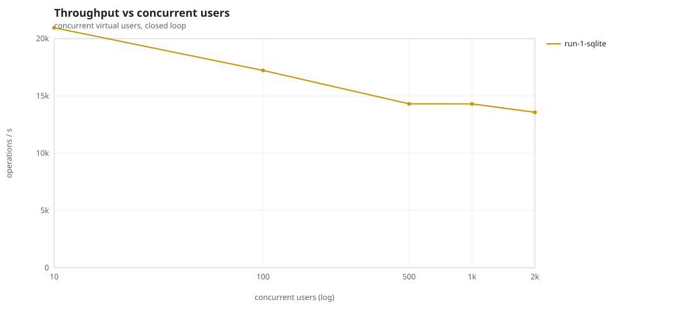
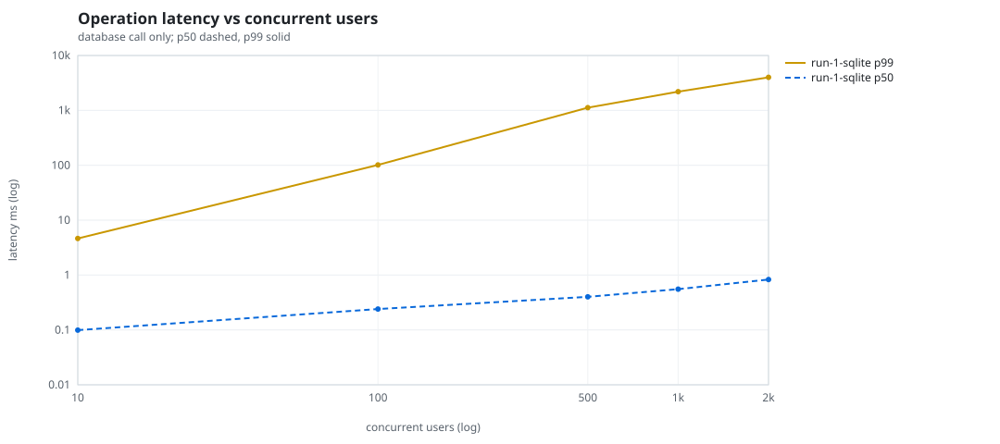
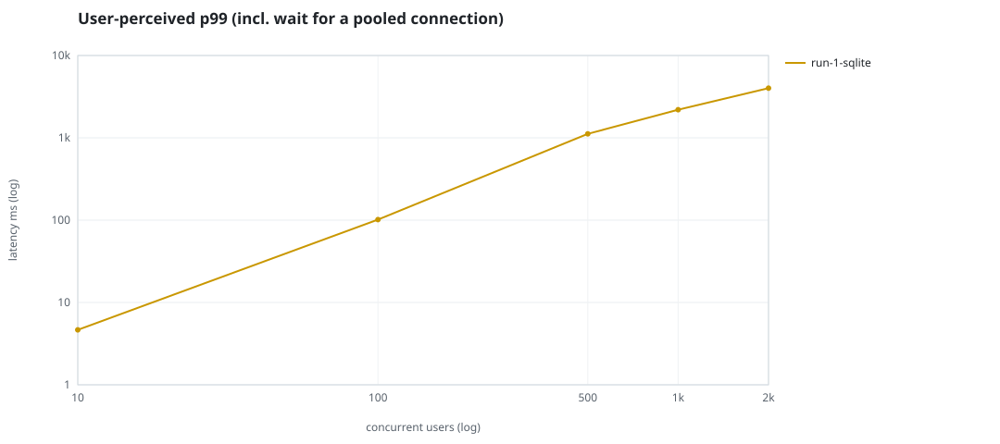
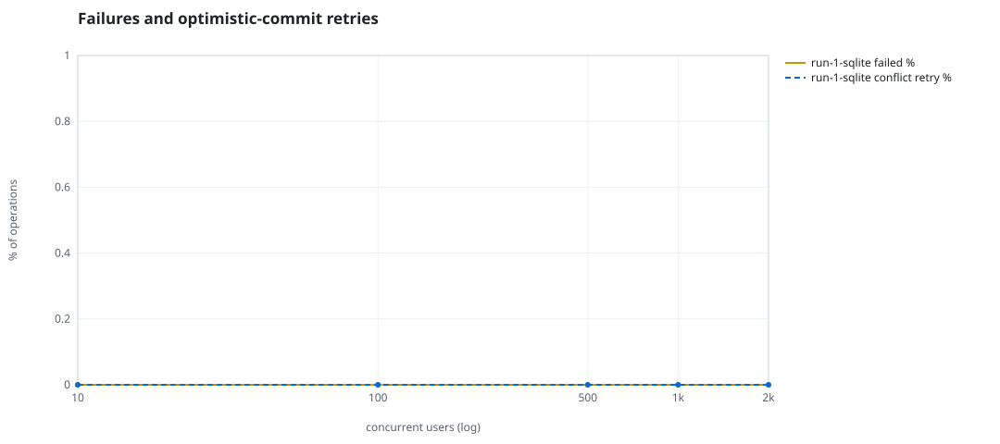
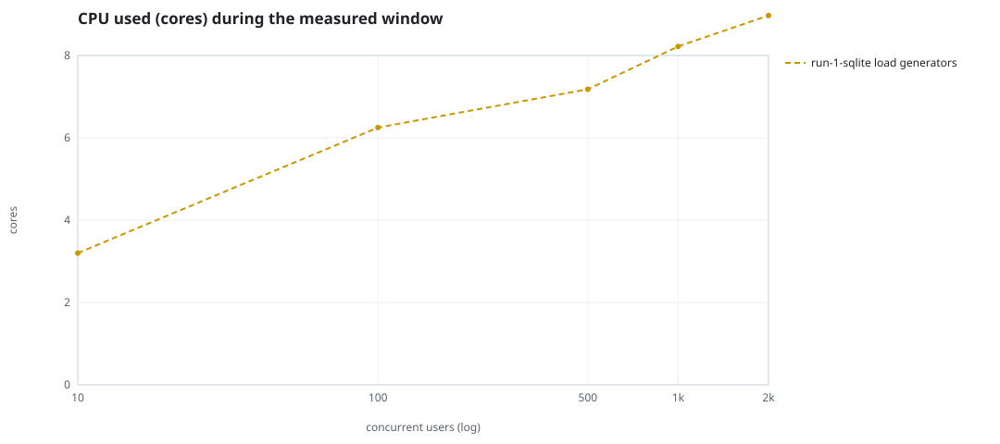
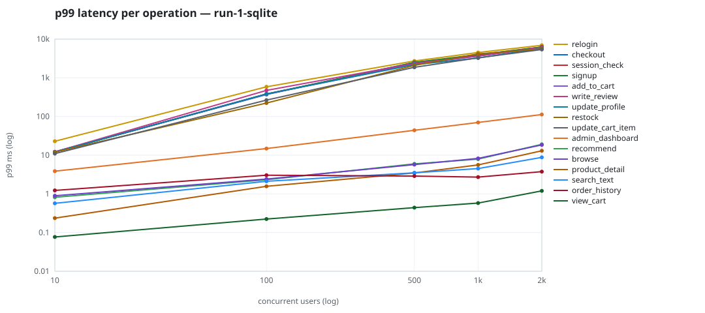

# Mini-SaaS concurrency simulation — sqlite

Run: `run-1-sqlite` on 2026-09-25T22:49:31 · commit `a26bf2f` · macOS-26.6.2-arm64-arm-64bit · 10 CPUs

## Configuration

- **transport**: sqlite
- **levels**: [10, 100, 500, 1000, 2000]
- **duration**: 30.0
- **warmup**: 5.0
- **ramp**: 5.0
- **think**: [0.0, 0.0]
- **processes**: 0
- **connections**: 0
- **durability**: balanced
- **products**: 5000
- **accounts**: 20000
- **scenario**: baseline
- **seed**: 1
- **fresh_per_stage**: False
- **seed time**: 0.15 s, 4.6 MiB after seeding

## Capacity and performance curve

Latencies are of the database call (service operation) in milliseconds; `user p99` adds the wait for a pooled connection.

| users | conns | ops/s | reads/s | writes/s | p50 | p95 | p99 | p99.9 | max | user p99 | success % | conflict retry % | srv CPU | srv RSS MiB | gen CPU | thr CV | invariants |
|---:|---:|---:|---:|---:|---:|---:|---:|---:|---:|---:|---:|---:|---:|---:|---:|---:|---:|
| 10 | 10 | 20949.3 | 16193.4 | 4755.9 | 0.099 | 1.554 | 4.646 | 47.222 | 1304.411 | 4.647 | 100.0 | 0.0 | None | None | 3.2 | 0.055 | ok |
| 100 | 100 | 17222.7 | 13323.5 | 3899.1 | 0.24 | 4.709 | 101.567 | 1016.928 | 4485.976 | 101.568 | 100.0 | 0.0 | None | None | 6.25 | 0.029 | ok |
| 500 | 500 | 14309.4 | 11069.5 | 3239.8 | 0.401 | 24.674 | 1118.754 | 3927.926 | 12064.314 | 1118.755 | 100.0 | 0.0 | None | None | 7.18 | 0.218 | ok |
| 1000 | 1000 | 14303.8 | 11065.3 | 3238.5 | 0.553 | 99.002 | 2193.533 | 5603.657 | 13246.962 | 2193.534 | 100.0 | 0.0 | None | None | 8.22 | 0.018 | ok |
| 2000 | 2000 | 13572.0 | 10493.6 | 3078.4 | 0.827 | 504.52 | 4009.043 | 8570.232 | 20435.31 | 4009.044 | 100.0 | 0.0 | None | None | 8.97 | 0.024 | ok |

## Insights

- **Peak throughput**: 20949.3 ops/s at 10 users (p99 4.646 ms).
- **Capacity at p99 ≤ 10 ms**: 10 users (DB latency); 10 users counting pool wait.
- **Capacity at p99 ≤ 50 ms**: 10 users (DB latency); 10 users counting pool wait.
- **Capacity at p99 ≤ 100 ms**: 10 users (DB latency); 10 users counting pool wait.
- **Capacity at p99 ≤ 250 ms**: 100 users (DB latency); 100 users counting pool wait.
- **Capacity at p99 ≤ 1000 ms**: 100 users (DB latency); 100 users counting pool wait.
- **USL fit**: σ (contention) = 0.32, κ (coherency) = 1.00e-04, predicted peak at N ≈ 82.5 (rmse log 0.1533).
- **Generator CPU includes the database**: SQLite runs inside the load-generator processes, so `gen CPU` is application plus engine and there is no server column.
- **Read-your-writes violations**: none.
- **Business invariants**: all stages ok.
- **Offline integrity check** (PRAGMA integrity_check): ok in 0.18 s.
- **Database size**: 12.6 MiB after the first stage, 36.9 MiB after the last; 88144 paid orders in total.

## p99 latency per operation (ms)

| op | share % | 10 | 100 | 500 | 1000 | 2000 |
|---|---:|---:|---:|---:|---:|---:|
| add_to_cart | 10.2 | 12.22 | 378.76 | 2290.69 | 3651.70 | 6054.66 |
| admin_dashboard | 1.03 | 3.86 | 14.86 | 44.04 | 70.19 | 112.58 |
| browse | 20.33 | 0.89 | 2.42 | 5.72 | 8.28 | 18.49 |
| checkout | 4.01 | 12.24 | 371.24 | 2494.12 | 3776.94 | 6246.52 |
| order_history | 3.09 | 1.23 | 3.04 | 2.88 | 2.72 | 3.76 |
| product_detail | 17.28 | 0.24 | 1.57 | 3.48 | 5.60 | 13.03 |
| recommend | 7.08 | 0.82 | 2.32 | 5.96 | 7.91 | 19.12 |
| relogin | 1.54 | 22.91 | 587.21 | 2721.26 | 4512.32 | 6953.67 |
| restock | 0.31 | 12.04 | 222.76 | 2092.65 | 4164.97 | 5606.71 |
| search_text | 8.11 | 0.57 | 2.11 | 3.50 | 4.51 | 8.80 |
| session_check | 12.23 | 12.15 | 380.40 | 2389.45 | 3952.59 | 6243.78 |
| signup | 0.49 | 12.07 | 380.17 | 2498.69 | 3980.39 | 6210.38 |
| update_cart_item | 3.08 | 11.00 | 265.68 | 1872.20 | 3281.02 | 5393.16 |
| update_profile | 1.04 | 12.07 | 384.10 | 2193.76 | 3259.33 | 5793.06 |
| view_cart | 8.15 | 0.08 | 0.22 | 0.44 | 0.58 | 1.20 |
| write_review | 2.04 | 12.21 | 473.22 | 2369.89 | 3678.76 | 6033.05 |

## Errors and business outcomes at the highest level

```json
{
 "statuses": {
  "ok": 400523,
  "empty_cart": 4223,
  "out_of_stock": 2390,
  "not_found": 24
 },
 "errors": {}
}
```

## Charts








