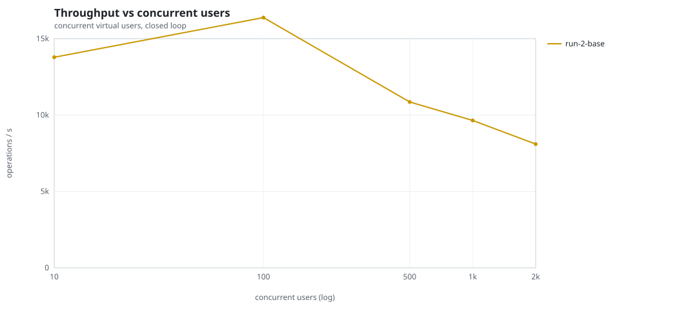
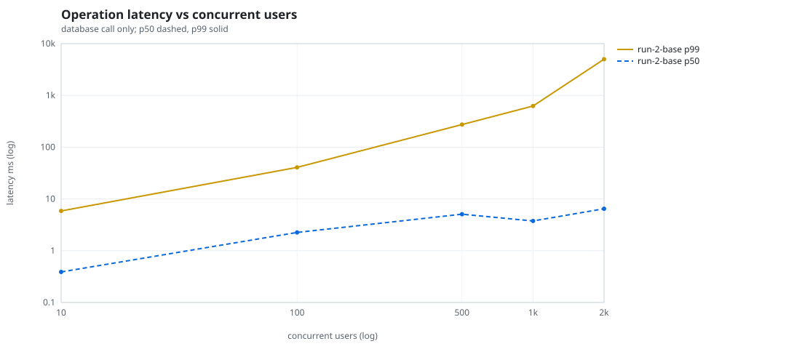
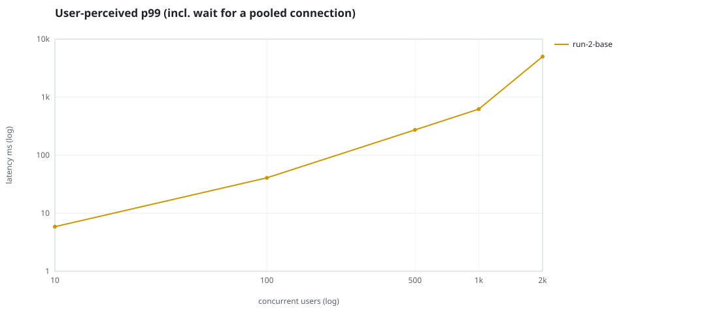
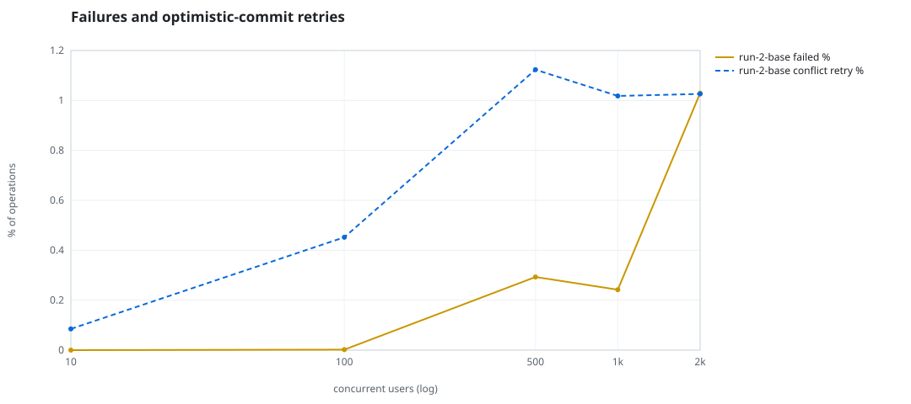
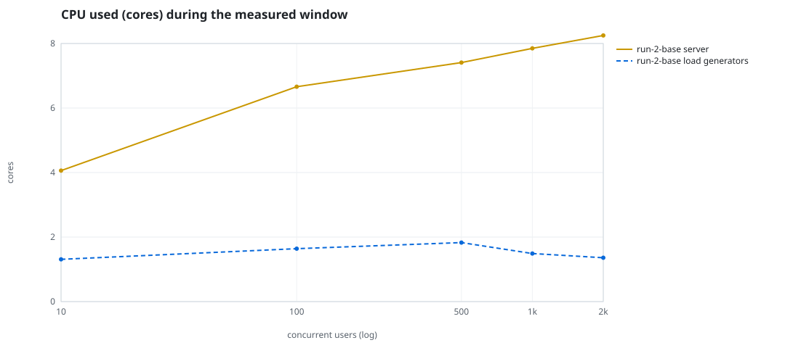
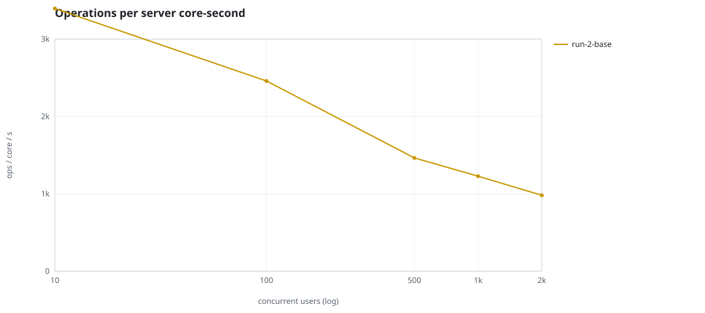
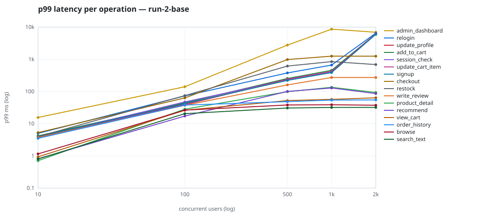

# Mini-SaaS concurrency simulation — sidecar

Run: `run-2-base` on 2026-09-25T22:53:32 · commit `a26bf2f` · macOS-26.6.2-arm64-arm-64bit · 10 CPUs

## Configuration

- **transport**: sidecar
- **levels**: [10, 100, 500, 1000, 2000]
- **duration**: 30.0
- **warmup**: 5.0
- **ramp**: 5.0
- **think**: [0.0, 0.0]
- **processes**: 0
- **connections**: 0
- **durability**: balanced
- **products**: 5000
- **accounts**: 20000
- **scenario**: baseline
- **seed**: 1
- **fresh_per_stage**: False
- **seed time**: 1.28 s, 12.9 MiB after seeding

## Capacity and performance curve

Latencies are of the database call (service operation) in milliseconds; `user p99` adds the wait for a pooled connection.

| users | conns | ops/s | reads/s | writes/s | p50 | p95 | p99 | p99.9 | max | user p99 | success % | conflict retry % | srv CPU | srv RSS MiB | gen CPU | thr CV | invariants |
|---:|---:|---:|---:|---:|---:|---:|---:|---:|---:|---:|---:|---:|---:|---:|---:|---:|---:|
| 10 | 10 | 13783.7 | 10661.9 | 3121.8 | 0.389 | 1.808 | 5.871 | 12.406 | 2156.473 | 5.872 | 100.0 | 0.085 | 4.06 | 310.6 | 1.31 | 0.34 | ok |
| 100 | 100 | 16378.3 | 12664.7 | 3713.6 | 2.252 | 20.741 | 40.736 | 94.374 | 877.15 | 40.737 | 99.998 | 0.452 | 6.66 | 400.7 | 1.64 | 0.148 | ok |
| 500 | 500 | 10852.2 | 8388.9 | 2463.3 | 5.066 | 163.128 | 273.071 | 1266.129 | 4245.46 | 273.072 | 99.707 | 1.123 | 7.41 | 443.1 | 1.83 | 0.13 | ok |
| 1000 | 1000 | 9645.1 | 7464.1 | 2180.9 | 3.75 | 313.052 | 623.564 | 5776.932 | 11840.613 | 623.565 | 99.758 | 1.018 | 7.85 | 464.6 | 1.49 | 0.159 | ok |
| 2000 | 2000 | 8100.0 | 6266.6 | 1833.4 | 6.47 | 799.924 | 5003.01 | 6405.575 | 9728.688 | 5003.011 | 98.971 | 1.026 | 8.25 | 659.1 | 1.36 | 0.139 | ok |

## Insights

- **Peak throughput**: 16378.3 ops/s at 100 users (p99 40.736 ms).
- **Capacity at p99 ≤ 10 ms**: 10 users (DB latency); 10 users counting pool wait.
- **Capacity at p99 ≤ 50 ms**: 100 users (DB latency); 100 users counting pool wait.
- **Capacity at p99 ≤ 100 ms**: 100 users (DB latency); 100 users counting pool wait.
- **Capacity at p99 ≤ 250 ms**: 100 users (DB latency); 100 users counting pool wait.
- **Capacity at p99 ≤ 1000 ms**: 1000 users (DB latency); 1000 users counting pool wait.
- **USL fit**: σ (contention) = 0.25, κ (coherency) = 1.58e-04, predicted peak at N ≈ 68.8 (rmse log 0.0968).
- **Ops per server core-second**: 10→3395, 100→2459, 500→1465, 1000→1229, 2000→982.
- **Connections refused while opening the pools** (listen backlog overflow, retried with backoff): [(1000, 5), (2000, 13)].
- **Seconds with zero completed operations** (stalls): [(10, 1)].
- **Read-your-writes violations**: none.
- **Business invariants**: all stages ok.
- **Offline integrity check** (elitesql check): ok in 24.5 s.
  - right after killing the server (no clean close): exit 3, 0 errors, 1098932 warnings; after one clean open/close: exit 0, 0 errors, 0 warnings.
- **Database size**: 39.4 MiB after the first stage, 129.4 MiB after the last; 66021 paid orders in total.

## p99 latency per operation (ms)

| op | share % | 10 | 100 | 500 | 1000 | 2000 |
|---|---:|---:|---:|---:|---:|---:|
| add_to_cart | 10.23 | 4.19 | 44.72 | 253.68 | 455.83 | 6184.90 |
| admin_dashboard | 1.02 | 15.60 | 140.54 | 2765.56 | 8636.41 | 6925.38 |
| browse | 20.32 | 1.15 | 26.40 | 38.18 | 38.77 | 37.44 |
| checkout | 3.95 | 5.30 | 63.22 | 983.56 | 1254.58 | 1250.00 |
| order_history | 3.11 | 3.50 | 37.87 | 48.42 | 54.17 | 54.85 |
| product_detail | 17.35 | 0.71 | 28.25 | 98.58 | 134.87 | 93.48 |
| recommend | 7.06 | 0.82 | 17.29 | 100.69 | 128.61 | 86.10 |
| relogin | 1.55 | 5.00 | 73.09 | 378.07 | 663.64 | 6515.40 |
| restock | 0.31 | 3.98 | 74.45 | 617.76 | 846.81 | 686.61 |
| search_text | 8.14 | 0.80 | 20.49 | 30.67 | 31.93 | 32.01 |
| session_check | 12.2 | 3.84 | 47.58 | 234.24 | 408.62 | 6170.53 |
| signup | 0.49 | 3.99 | 42.34 | 220.86 | 387.19 | 5939.58 |
| update_cart_item | 3.06 | 3.88 | 38.74 | 240.22 | 423.36 | 6123.96 |
| update_profile | 1.04 | 3.71 | 40.86 | 238.71 | 410.74 | 6186.16 |
| view_cart | 8.15 | 0.93 | 26.18 | 52.25 | 56.98 | 63.72 |
| write_review | 2.03 | 3.73 | 37.21 | 160.25 | 272.44 | 272.79 |

## Errors and business outcomes at the highest level

```json
{
 "statuses": {
  "ok": 236971,
  "error:16": 2137,
  "empty_cart": 2680,
  "out_of_stock": 831,
  "conflict_exhausted": 364,
  "not_found": 18
 },
 "errors": {
  "conflict_exhausted": {
   "count": 573,
   "first": "[elitesql:9] conflict, retry transaction: products/b1 changed after this transaction began",
   "ops": {
    "checkout": 474,
    "restock": 99
   }
  },
  "error:16": {
   "count": 2859,
   "first": "[elitesql:16] memory limit exceeded: query memory admission timed out",
   "ops": {
    "admin_dashboard": 2859
   }
  }
 }
}
```

## Charts








