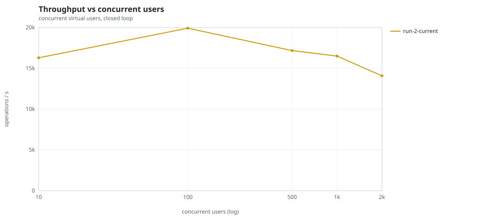
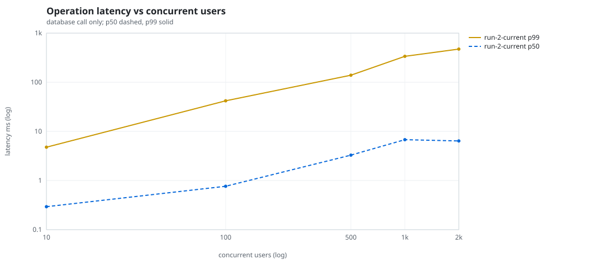
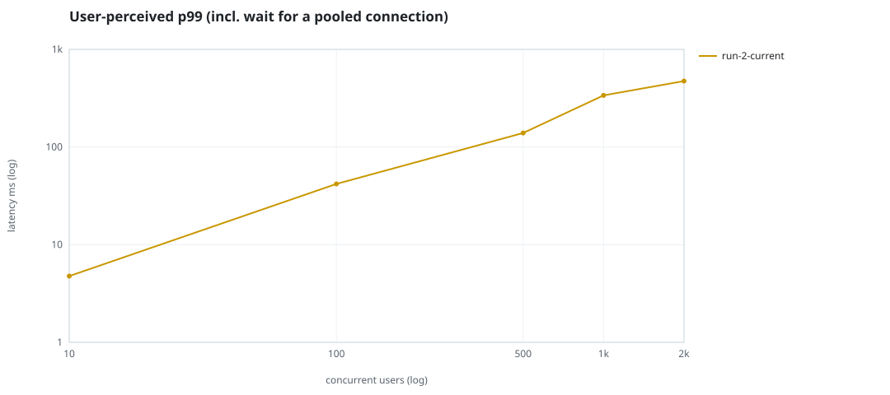
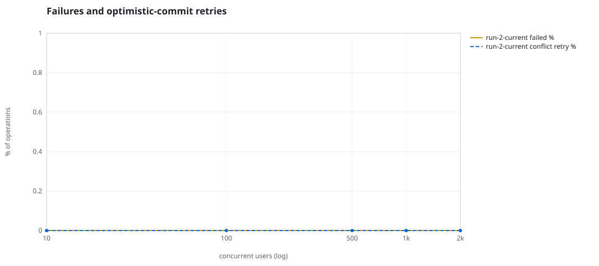
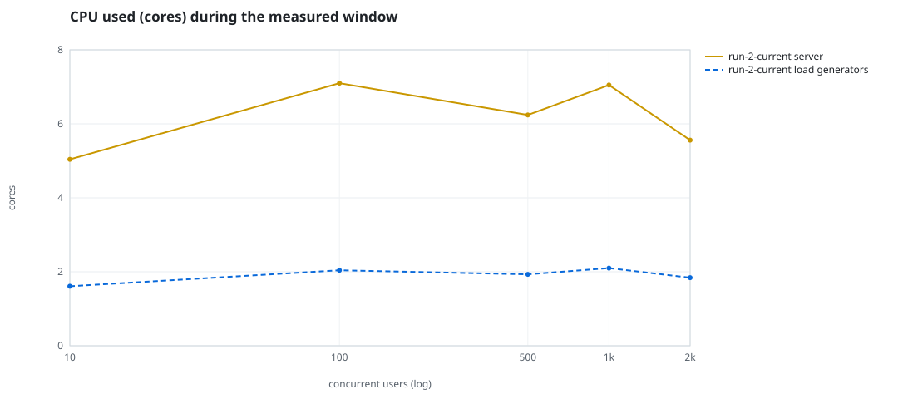
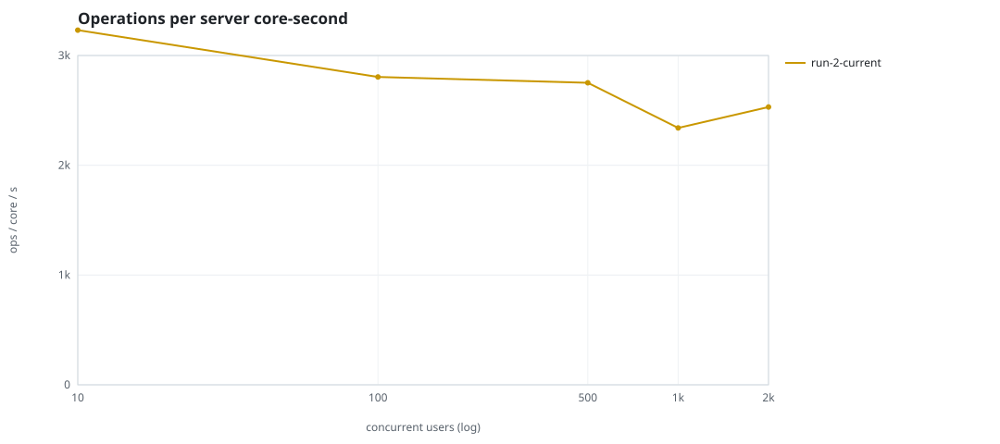
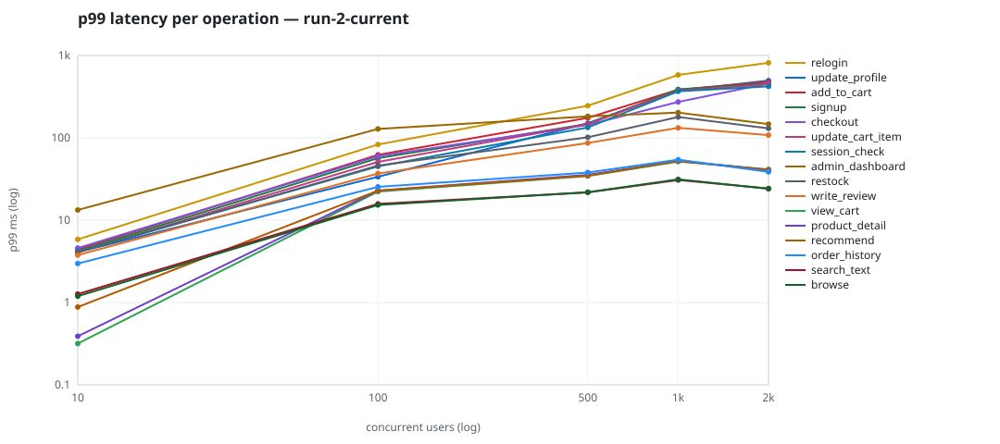

# Mini-SaaS concurrency simulation — sidecar

Run: `run-2-current` on 2026-09-25T22:58:09 · commit `a26bf2f` · macOS-26.6.2-arm64-arm-64bit · 10 CPUs

## Configuration

- **transport**: sidecar
- **levels**: [10, 100, 500, 1000, 2000]
- **duration**: 30.0
- **warmup**: 5.0
- **ramp**: 5.0
- **think**: [0.0, 0.0]
- **processes**: 0
- **connections**: 0
- **durability**: balanced
- **products**: 5000
- **accounts**: 20000
- **scenario**: baseline
- **seed**: 1
- **fresh_per_stage**: False
- **seed time**: 1.27 s, 12.9 MiB after seeding

## Capacity and performance curve

Latencies are of the database call (service operation) in milliseconds; `user p99` adds the wait for a pooled connection.

| users | conns | ops/s | reads/s | writes/s | p50 | p95 | p99 | p99.9 | max | user p99 | success % | conflict retry % | srv CPU | srv RSS MiB | gen CPU | thr CV | invariants |
|---:|---:|---:|---:|---:|---:|---:|---:|---:|---:|---:|---:|---:|---:|---:|---:|---:|---:|
| 10 | 10 | 16285.4 | 12590.4 | 3695.1 | 0.293 | 1.494 | 4.767 | 10.246 | 2162.004 | 4.768 | 100.0 | 0.0 | 5.04 | 327.0 | 1.61 | 0.341 | ok |
| 100 | 100 | 19914.5 | 15399.1 | 4515.4 | 0.764 | 19.517 | 41.916 | 97.149 | 2043.815 | 41.917 | 100.0 | 0.0 | 7.1 | 446.8 | 2.04 | 0.139 | ok |
| 500 | 500 | 17167.2 | 13281.5 | 3885.7 | 3.288 | 94.208 | 139.341 | 312.731 | 4503.929 | 139.342 | 100.0 | 0.0 | 6.24 | 647.8 | 1.93 | 0.401 | ok |
| 1000 | 1000 | 16496.9 | 12754.7 | 3742.2 | 6.782 | 217.75 | 337.706 | 438.076 | 3399.744 | 337.707 | 100.0 | 0.0 | 7.05 | 699.5 | 2.1 | 0.077 | ok |
| 2000 | 2000 | 14072.3 | 10883.0 | 3189.3 | 6.399 | 392.467 | 473.412 | 7082.593 | 7687.429 | 473.413 | 100.0 | 0.0 | 5.56 | 868.5 | 1.84 | 0.549 | ok |

## Insights

- **Peak throughput**: 19914.5 ops/s at 100 users (p99 41.916 ms).
- **Capacity at p99 ≤ 10 ms**: 10 users (DB latency); 10 users counting pool wait.
- **Capacity at p99 ≤ 50 ms**: 100 users (DB latency); 100 users counting pool wait.
- **Capacity at p99 ≤ 100 ms**: 100 users (DB latency); 100 users counting pool wait.
- **Capacity at p99 ≤ 250 ms**: 500 users (DB latency); 500 users counting pool wait.
- **Capacity at p99 ≤ 1000 ms**: 2000 users (DB latency); 2000 users counting pool wait.
- **USL fit**: σ (contention) = 0.23, κ (coherency) = 6.31e-05, predicted peak at N ≈ 110.5 (rmse log 0.0391).
- **Ops per server core-second**: 10→3231, 100→2805, 500→2751, 1000→2340, 2000→2531.
- **Connections refused while opening the pools** (listen backlog overflow, retried with backoff): [(1000, 2), (2000, 14)].
- **Seconds with zero completed operations** (stalls): [(10, 1), (500, 3), (2000, 6)].
- **Read-your-writes violations**: none.
- **Business invariants**: all stages ok.
- **Offline integrity check** (elitesql check): ok in 47.9 s.
  - right after killing the server (no clean close): exit 3, 0 errors, 1519698 warnings; after one clean open/close: exit 0, 0 errors, 0 warnings.
- **Database size**: 53.2 MiB after the first stage, 218.4 MiB after the last; 92702 paid orders in total.

## p99 latency per operation (ms)

| op | share % | 10 | 100 | 500 | 1000 | 2000 |
|---|---:|---:|---:|---:|---:|---:|
| add_to_cart | 10.19 | 4.40 | 62.16 | 174.90 | 385.09 | 480.27 |
| admin_dashboard | 1.02 | 13.29 | 128.27 | 182.48 | 202.73 | 146.54 |
| browse | 20.32 | 1.19 | 15.27 | 21.84 | 31.28 | 24.02 |
| checkout | 3.99 | 4.58 | 59.90 | 143.47 | 272.55 | 458.35 |
| order_history | 3.11 | 2.97 | 25.35 | 37.86 | 54.23 | 38.55 |
| product_detail | 17.33 | 0.39 | 22.86 | 35.50 | 52.36 | 40.90 |
| recommend | 7.07 | 0.88 | 22.83 | 34.68 | 52.50 | 40.64 |
| relogin | 1.54 | 5.84 | 83.05 | 245.68 | 581.43 | 815.18 |
| restock | 0.31 | 4.06 | 45.97 | 101.60 | 178.93 | 130.17 |
| search_text | 8.12 | 1.27 | 15.77 | 21.72 | 30.71 | 24.24 |
| session_check | 12.2 | 4.14 | 44.93 | 133.74 | 367.05 | 421.79 |
| signup | 0.5 | 4.21 | 56.62 | 147.86 | 387.25 | 458.56 |
| update_cart_item | 3.07 | 4.06 | 51.09 | 146.69 | 375.53 | 447.24 |
| update_profile | 1.04 | 4.08 | 33.66 | 150.66 | 374.57 | 496.00 |
| view_cart | 8.14 | 0.32 | 22.26 | 34.36 | 51.45 | 41.33 |
| write_review | 2.03 | 3.76 | 36.86 | 86.61 | 132.34 | 107.86 |

## Errors and business outcomes at the highest level

```json
{
 "statuses": {
  "ok": 415088,
  "empty_cart": 4282,
  "out_of_stock": 2775,
  "not_found": 24
 },
 "errors": {}
}
```

## Charts








