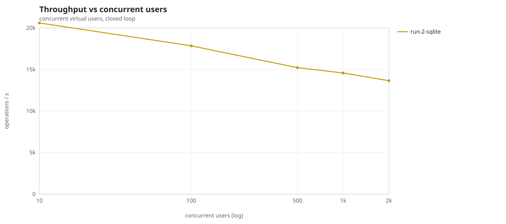
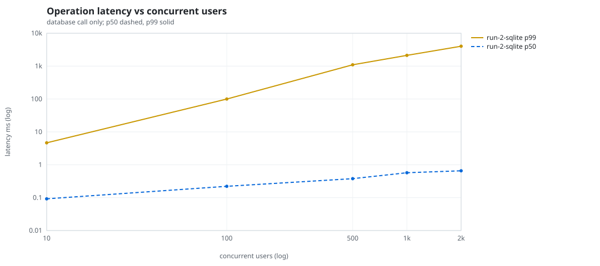
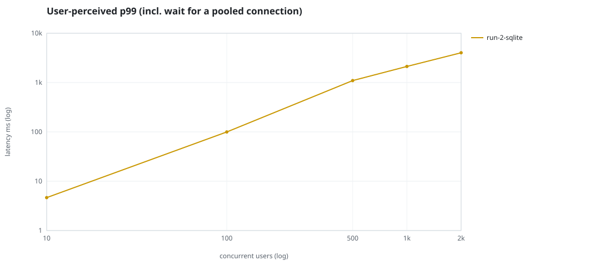
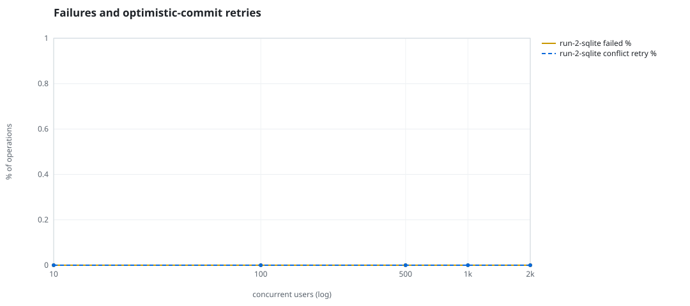
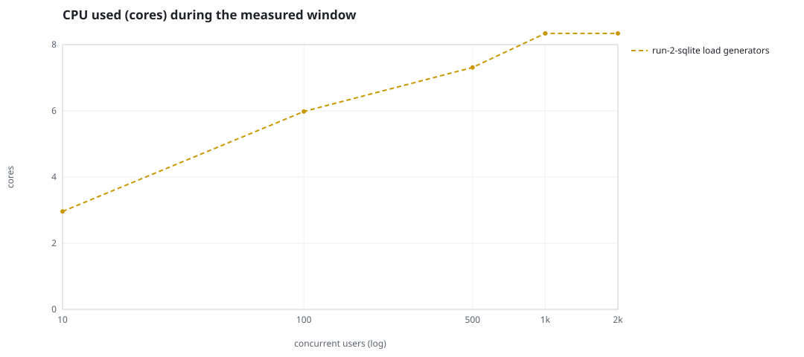
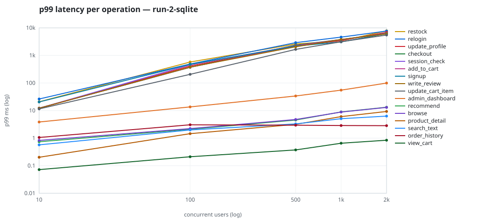

# Mini-SaaS concurrency simulation — sqlite

Run: `run-2-sqlite` on 2026-09-25T23:03:07 · commit `a26bf2f` · macOS-26.6.2-arm64-arm-64bit · 10 CPUs

## Configuration

- **transport**: sqlite
- **levels**: [10, 100, 500, 1000, 2000]
- **duration**: 30.0
- **warmup**: 5.0
- **ramp**: 5.0
- **think**: [0.0, 0.0]
- **processes**: 0
- **connections**: 0
- **durability**: balanced
- **products**: 5000
- **accounts**: 20000
- **scenario**: baseline
- **seed**: 1
- **fresh_per_stage**: False
- **seed time**: 0.14 s, 4.6 MiB after seeding

## Capacity and performance curve

Latencies are of the database call (service operation) in milliseconds; `user p99` adds the wait for a pooled connection.

| users | conns | ops/s | reads/s | writes/s | p50 | p95 | p99 | p99.9 | max | user p99 | success % | conflict retry % | srv CPU | srv RSS MiB | gen CPU | thr CV | invariants |
|---:|---:|---:|---:|---:|---:|---:|---:|---:|---:|---:|---:|---:|---:|---:|---:|---:|---:|
| 10 | 10 | 20608.8 | 15929.9 | 4678.8 | 0.092 | 1.55 | 4.647 | 60.602 | 981.12 | 4.647 | 100.0 | 0.0 | None | None | 2.96 | 0.069 | ok |
| 100 | 100 | 17853.8 | 13808.3 | 4045.5 | 0.221 | 4.669 | 99.71 | 1004.563 | 4456.275 | 99.711 | 100.0 | 0.0 | None | None | 5.98 | 0.027 | ok |
| 500 | 500 | 15226.5 | 11773.7 | 3452.7 | 0.378 | 23.044 | 1097.947 | 3682.975 | 11389.413 | 1097.948 | 100.0 | 0.0 | None | None | 7.31 | 0.128 | ok |
| 1000 | 1000 | 14586.8 | 11277.9 | 3308.8 | 0.573 | 102.875 | 2125.058 | 5586.18 | 14156.822 | 2125.059 | 100.0 | 0.0 | None | None | 8.34 | 0.016 | ok |
| 2000 | 2000 | 13657.0 | 10561.6 | 3095.3 | 0.657 | 491.944 | 4026.881 | 9068.592 | 20288.825 | 4026.882 | 100.0 | 0.0 | None | None | 8.34 | 0.03 | ok |

## Insights

- **Peak throughput**: 20608.8 ops/s at 10 users (p99 4.647 ms).
- **Capacity at p99 ≤ 10 ms**: 10 users (DB latency); 10 users counting pool wait.
- **Capacity at p99 ≤ 50 ms**: 10 users (DB latency); 10 users counting pool wait.
- **Capacity at p99 ≤ 100 ms**: 100 users (DB latency); 100 users counting pool wait.
- **Capacity at p99 ≤ 250 ms**: 100 users (DB latency); 100 users counting pool wait.
- **Capacity at p99 ≤ 1000 ms**: 100 users (DB latency); 100 users counting pool wait.
- **USL fit**: σ (contention) = 0.3, κ (coherency) = 1.00e-04, predicted peak at N ≈ 83.7 (rmse log 0.1319).
- **Generator CPU includes the database**: SQLite runs inside the load-generator processes, so `gen CPU` is application plus engine and there is no server column.
- **Read-your-writes violations**: none.
- **Business invariants**: all stages ok.
- **Offline integrity check** (PRAGMA integrity_check): ok in 0.18 s.
- **Database size**: 12.4 MiB after the first stage, 37.4 MiB after the last; 89387 paid orders in total.

## p99 latency per operation (ms)

| op | share % | 10 | 100 | 500 | 1000 | 2000 |
|---|---:|---:|---:|---:|---:|---:|
| add_to_cart | 10.2 | 12.22 | 373.13 | 2267.13 | 3770.37 | 6199.44 |
| admin_dashboard | 1.04 | 3.85 | 13.60 | 33.87 | 55.23 | 99.67 |
| browse | 20.34 | 0.83 | 2.22 | 4.74 | 8.82 | 13.02 |
| checkout | 4.01 | 12.28 | 371.46 | 2380.82 | 3783.70 | 6298.74 |
| order_history | 3.09 | 1.06 | 3.06 | 2.94 | 2.86 | 2.83 |
| product_detail | 17.26 | 0.20 | 1.45 | 3.17 | 6.04 | 9.28 |
| recommend | 7.09 | 0.74 | 2.10 | 4.53 | 8.95 | 13.20 |
| relogin | 1.54 | 26.32 | 488.66 | 2915.00 | 4623.53 | 7691.38 |
| restock | 0.31 | 20.81 | 576.78 | 2606.19 | 3357.32 | 7839.17 |
| search_text | 8.1 | 0.57 | 1.98 | 3.29 | 5.07 | 6.29 |
| session_check | 12.23 | 12.16 | 459.63 | 2272.68 | 3674.30 | 6220.84 |
| signup | 0.49 | 20.49 | 477.21 | 2181.68 | 3103.37 | 6154.48 |
| update_cart_item | 3.09 | 11.49 | 206.14 | 1659.35 | 3133.77 | 5505.53 |
| update_profile | 1.04 | 12.07 | 415.61 | 2199.82 | 3461.02 | 6895.28 |
| view_cart | 8.15 | 0.07 | 0.21 | 0.37 | 0.65 | 0.84 |
| write_review | 2.04 | 12.15 | 378.71 | 2061.89 | 3778.03 | 6052.40 |

## Errors and business outcomes at the highest level

```json
{
 "statuses": {
  "ok": 402903,
  "empty_cart": 4316,
  "out_of_stock": 2461,
  "not_found": 29
 },
 "errors": {}
}
```

## Charts








