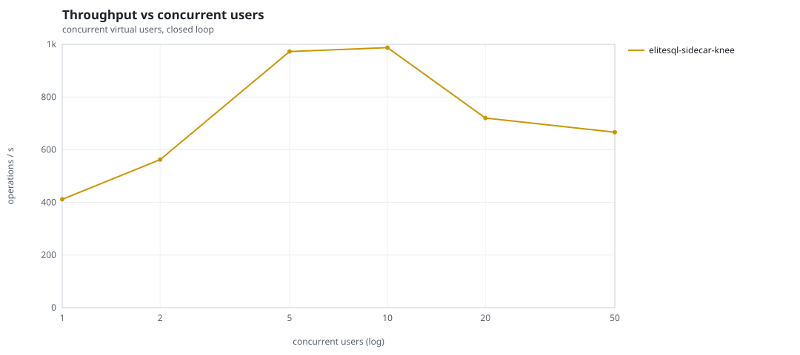
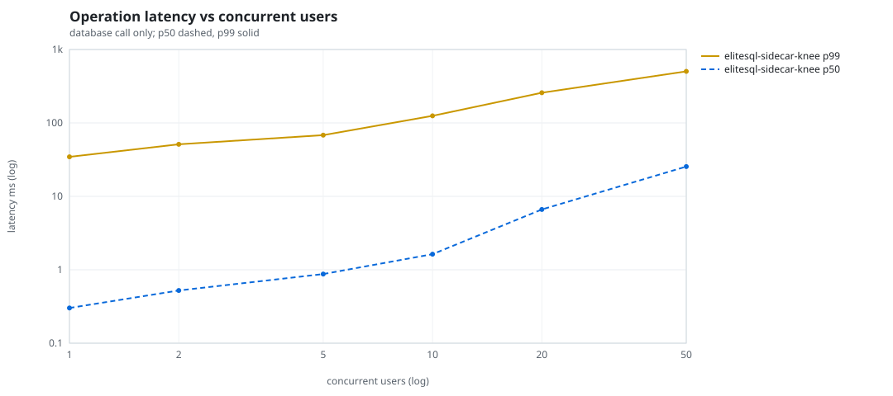
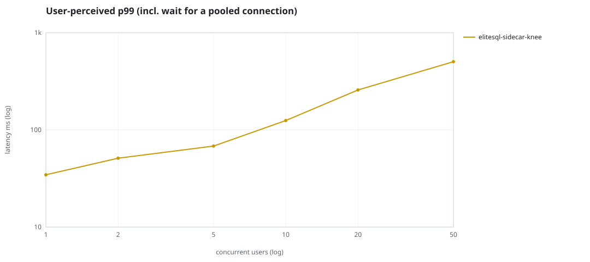
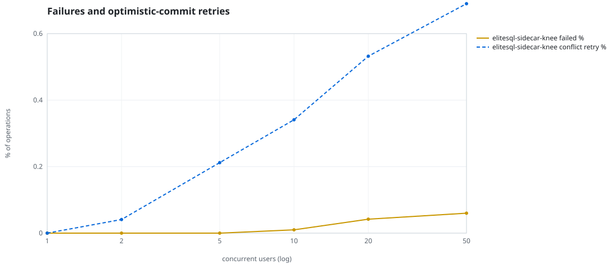
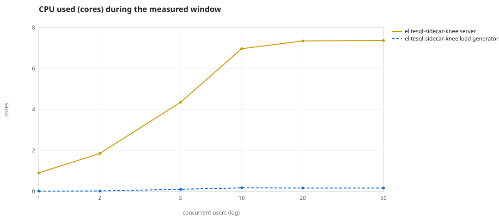
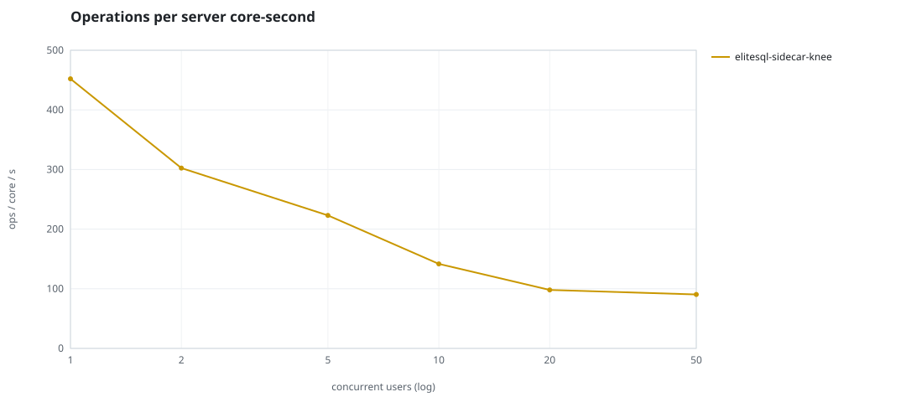
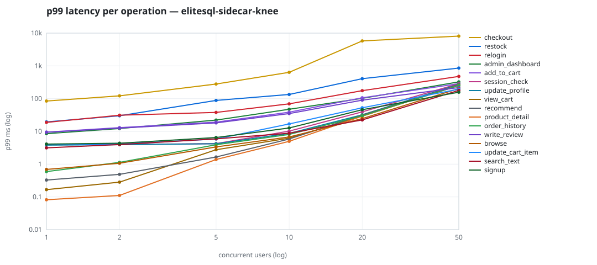

# Mini-SaaS concurrency simulation — sidecar

Run: `elitesql-sidecar-knee` on 2026-09-12T20:31:13 · commit `abfe3ae` · macOS-26.6.2-arm64-arm-64bit-Mach-O · 10 CPUs

## Configuration

- **transport**: sidecar
- **levels**: [1, 2, 5, 10, 20, 50]
- **duration**: 30.0
- **warmup**: 5.0
- **ramp**: 2.0
- **think**: [0.0, 0.0]
- **processes**: 0
- **connections**: 0
- **durability**: balanced
- **products**: 5000
- **accounts**: 20000
- **seed**: 1
- **fresh_per_stage**: False
- **seed time**: 1.1 s, 18.5 MiB after seeding

## Capacity and performance curve

Latencies are of the database call (service operation) in milliseconds; `user p99` adds the wait for a pooled connection.

| users | conns | ops/s | reads/s | writes/s | p50 | p95 | p99 | p99.9 | max | user p99 | success % | conflict retry % | srv CPU | srv RSS MiB | gen CPU | thr CV | invariants |
|---:|---:|---:|---:|---:|---:|---:|---:|---:|---:|---:|---:|---:|---:|---:|---:|---:|---:|
| 1 | 1 | 411.4 | 317.4 | 94.0 | 0.302 | 9.327 | 34.546 | 67.146 | 110.833 | 34.546 | 100.0 | 0.0 | 0.91 | 58.7 | 0.02 | 0.092 | ok |
| 2 | 2 | 562.5 | 434.0 | 128.6 | 0.522 | 12.715 | 51.171 | 102.933 | 316.139 | 51.171 | 100.0 | 0.041 | 1.86 | 105.7 | 0.03 | 0.08 | ok |
| 5 | 5 | 972.7 | 751.6 | 221.1 | 0.873 | 18.88 | 68.188 | 192.44 | 459.39 | 68.189 | 100.0 | 0.212 | 4.36 | 197.3 | 0.11 | 0.058 | ok |
| 10 | 10 | 987.5 | 762.5 | 225.0 | 1.632 | 39.233 | 124.932 | 426.265 | 4410.398 | 124.933 | 99.99 | 0.341 | 6.97 | 482.2 | 0.18 | 0.089 | ok |
| 20 | 20 | 720.3 | 559.0 | 161.2 | 6.631 | 86.124 | 257.833 | 1552.356 | 9101.823 | 257.834 | 99.958 | 0.532 | 7.35 | 808.5 | 0.17 | 0.116 | ok |
| 50 | 50 | 666.3 | 514.7 | 151.6 | 25.43 | 229.62 | 503.603 | 5313.857 | 14287.311 | 503.604 | 99.94 | 0.69 | 7.37 | 1395.8 | 0.17 | 0.145 | ok |

## Insights

- **Peak throughput**: 987.5 ops/s at 10 users (p99 124.932 ms).
- **Capacity at p99 ≤ 10 ms**: 0 users (DB latency); 0 users counting pool wait.
- **Capacity at p99 ≤ 50 ms**: 1 users (DB latency); 1 users counting pool wait.
- **Capacity at p99 ≤ 100 ms**: 5 users (DB latency); 5 users counting pool wait.
- **Capacity at p99 ≤ 250 ms**: 10 users (DB latency); 10 users counting pool wait.
- **Capacity at p99 ≤ 1000 ms**: 50 users (DB latency); 50 users counting pool wait.
- **USL fit**: σ (contention) = 0.44, κ (coherency) = 1.00e-03, predicted peak at N ≈ 23.7 (rmse log 0.1741).
- **Ops per server core-second**: 1→452, 2→302, 5→223, 10→142, 20→98, 50→90.
- **Read-your-writes violations**: none.
- **Business invariants**: all stages ok.
- **Offline integrity check** (elitesql check): ok in 4.57 s.
  - right after killing the server (no clean close): exit 3, 0 errors, 126084 warnings; after one clean open/close: exit 0, 0 errors, 0 warnings.
- **Database size**: 21.4 MiB after the first stage, 69.8 MiB after the last; 4744 paid orders in total.

## p99 latency per operation (ms)

| op | share % | 1 | 2 | 5 | 10 | 20 | 50 |
|---|---:|---:|---:|---:|---:|---:|---:|
| add_to_cart | 10.23 | 9.50 | 13.00 | 19.21 | 38.60 | 106.22 | 286.91 |
| admin_dashboard | 1.01 | 8.54 | 12.21 | 22.13 | 47.37 | 102.30 | 324.68 |
| browse | 20.64 | 0.69 | 1.07 | 3.36 | 6.76 | 24.56 | 203.39 |
| checkout | 4.06 | 84.57 | 121.65 | 279.65 | 636.70 | 5780.68 | 8108.63 |
| order_history | 3.05 | 0.59 | 1.13 | 3.91 | 8.06 | 30.10 | 250.44 |
| product_detail | 16.71 | 0.08 | 0.11 | 1.38 | 4.97 | 29.24 | 254.00 |
| recommend | 7.07 | 0.33 | 0.49 | 1.65 | 5.85 | 31.83 | 258.64 |
| relogin | 1.53 | 18.82 | 31.18 | 38.02 | 69.44 | 175.24 | 476.56 |
| restock | 0.36 | 19.47 | 30.05 | 88.31 | 134.30 | 406.48 | 858.71 |
| search_text | 8.18 | 3.14 | 3.96 | 5.92 | 8.80 | 22.37 | 178.55 |
| session_check | 12.29 | 4.02 | 3.97 | 4.24 | 10.20 | 39.55 | 286.15 |
| signup | 0.5 | 4.10 | 4.36 | 6.51 | 12.70 | 45.91 | 157.21 |
| update_cart_item | 3.1 | 3.95 | 4.12 | 5.85 | 16.86 | 52.72 | 194.79 |
| update_profile | 0.93 | 3.80 | 3.94 | 4.19 | 8.70 | 32.10 | 273.23 |
| view_cart | 8.2 | 0.17 | 0.28 | 2.76 | 6.23 | 29.17 | 260.67 |
| write_review | 2.14 | 9.39 | 12.62 | 18.18 | 34.98 | 89.88 | 217.58 |

## Errors and business outcomes at the highest level

```json
{
 "statuses": {
  "ok": 19728,
  "empty_cart": 247,
  "conflict_exhausted": 12,
  "not_found": 1
 },
 "errors": {
  "conflict_exhausted": {
   "count": 14,
   "first": "[elitesql:9] conflict, retry transaction: products/01M2C67MW3Z5GANERE2WMEKMD9 changed after this transaction began",
   "ops": {
    "checkout": 14
   }
  }
 }
}
```

## Charts








