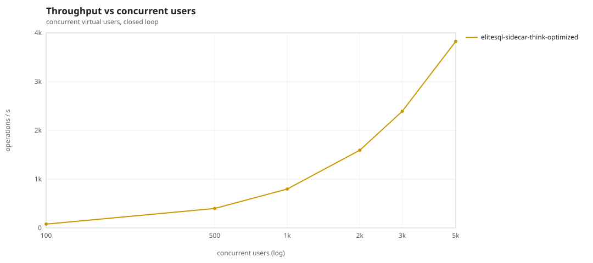
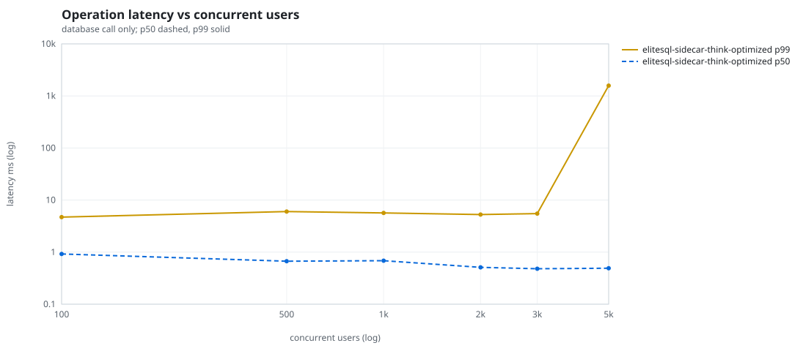
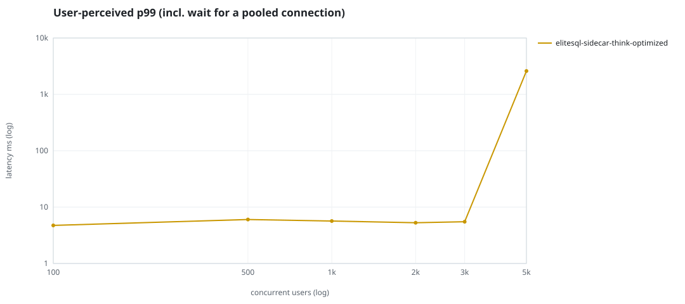
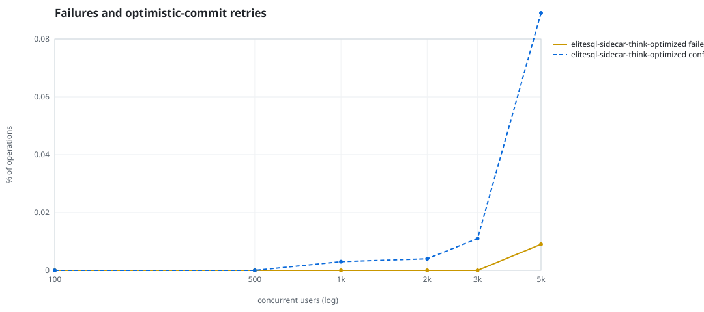
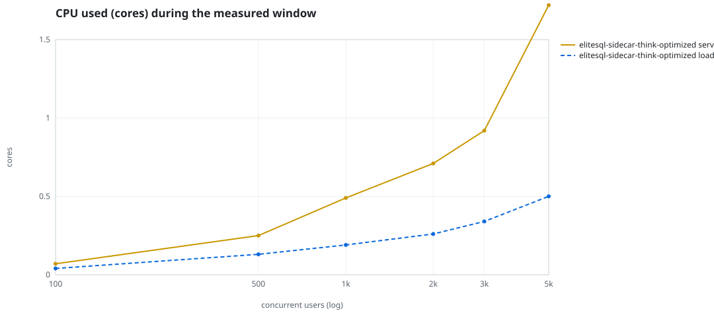
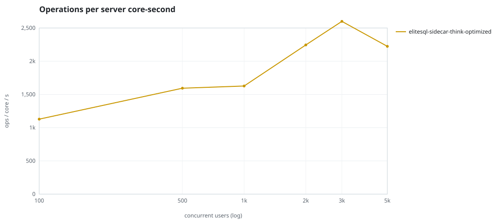
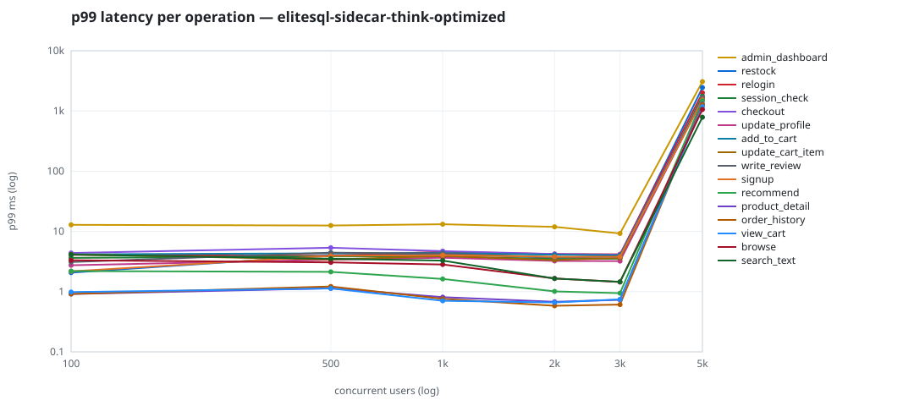

# Mini-SaaS concurrency simulation — sidecar

Run: `elitesql-sidecar-think-optimized` on 2026-09-12T23:16:37 · commit `abfe3ae` · macOS-26.6.2-arm64-arm-64bit-Mach-O · 10 CPUs

## Configuration

- **transport**: sidecar
- **levels**: [100, 500, 1000, 2000, 3000, 5000]
- **duration**: 45.0
- **warmup**: 5.0
- **ramp**: 5.0
- **think**: [0.5, 2.0]
- **processes**: 0
- **connections**: 0
- **durability**: balanced
- **products**: 5000
- **accounts**: 20000
- **seed**: 1
- **fresh_per_stage**: False
- **seed time**: 1.05 s, 18.5 MiB after seeding

## Capacity and performance curve

Latencies are of the database call (service operation) in milliseconds; `user p99` adds the wait for a pooled connection.

| users | conns | ops/s | reads/s | writes/s | p50 | p95 | p99 | p99.9 | max | user p99 | success % | conflict retry % | srv CPU | srv RSS MiB | gen CPU | thr CV | invariants |
|---:|---:|---:|---:|---:|---:|---:|---:|---:|---:|---:|---:|---:|---:|---:|---:|---:|---:|
| 100 | 100 | 79.0 | 60.8 | 18.2 | 0.922 | 3.017 | 4.713 | 11.129 | 13.015 | 4.734 | 100.0 | 0.0 | 0.07 | 28.4 | 0.04 | 0.066 | ok |
| 500 | 500 | 398.6 | 309.7 | 88.9 | 0.669 | 2.574 | 6.009 | 11.211 | 22.635 | 6.025 | 100.0 | 0.0 | 0.25 | 61.4 | 0.13 | 0.033 | ok |
| 1000 | 1000 | 797.2 | 617.9 | 179.2 | 0.685 | 2.399 | 5.656 | 11.058 | 15.331 | 5.665 | 100.0 | 0.003 | 0.49 | 101.7 | 0.19 | 0.019 | ok |
| 2000 | 2000 | 1594.2 | 1233.1 | 361.1 | 0.51 | 1.494 | 5.27 | 9.14 | 15.579 | 5.278 | 100.0 | 0.004 | 0.71 | 176.1 | 0.26 | 0.017 | ok |
| 3000 | 2000 | 2391.6 | 1849.1 | 542.5 | 0.48 | 1.37 | 5.49 | 8.322 | 715.036 | 5.499 | 100.0 | 0.011 | 0.92 | 227.3 | 0.34 | 0.01 | ok |
| 5000 | 2000 | 3825.4 | 2959.5 | 865.9 | 0.491 | 4.147 | 1576.183 | 2856.831 | 3476.609 | 2596.151 | 99.991 | 0.089 | 1.72 | 402.5 | 0.5 | 0.158 | ok |

## Insights

- **Peak throughput**: 3825.4 ops/s at 5000 users (p99 1576.183 ms).
- **Capacity at p99 ≤ 10 ms**: 3000 users (DB latency); 3000 users counting pool wait.
- **Capacity at p99 ≤ 50 ms**: 3000 users (DB latency); 3000 users counting pool wait.
- **Capacity at p99 ≤ 100 ms**: 3000 users (DB latency); 3000 users counting pool wait.
- **Capacity at p99 ≤ 250 ms**: 3000 users (DB latency); 3000 users counting pool wait.
- **Capacity at p99 ≤ 1000 ms**: 3000 users (DB latency); 3000 users counting pool wait.
- **USL fit**: σ (contention) = 0.0, κ (coherency) = 1.26e-09, predicted peak at N ≈ 28183.8 (rmse log 0.0116).
- **Ops per server core-second**: 100→1129, 500→1594, 1000→1627, 2000→2245, 3000→2600, 5000→2224.
- **Connections refused while opening the pools** (listen backlog overflow, retried with backoff): [(1000, 2), (2000, 14), (3000, 18), (5000, 16)].
- **Read-your-writes violations**: none.
- **Business invariants**: all stages ok.
- **Offline integrity check** (elitesql check): ok in 6.1 s.
  - right after killing the server (no clean close): exit 3, 0 errors, 301724 warnings; after one clean open/close: exit 0, 0 errors, 0 warnings.
- **Database size**: 19.2 MiB after the first stage, 66.1 MiB after the last; 12551 paid orders in total.

## p99 latency per operation (ms)

| op | share % | 100 | 500 | 1000 | 2000 | 3000 | 5000 |
|---|---:|---:|---:|---:|---:|---:|---:|
| add_to_cart | 10.3 | 4.16 | 4.33 | 4.38 | 4.09 | 4.01 | 1591.82 |
| admin_dashboard | 0.87 | 12.86 | 12.56 | 13.16 | 11.92 | 9.26 | 3072.68 |
| browse | 20.99 | 3.32 | 3.07 | 2.83 | 1.66 | 1.45 | 1061.24 |
| checkout | 4.22 | 4.39 | 5.35 | 4.71 | 4.21 | 4.09 | 1630.62 |
| order_history | 3.52 | 0.92 | 1.22 | 0.76 | 0.58 | 0.61 | 1270.35 |
| product_detail | 16.74 | 0.91 | 1.14 | 0.81 | 0.68 | 0.73 | 1302.78 |
| recommend | 6.3 | 2.19 | 2.13 | 1.62 | 1.01 | 0.94 | 1481.27 |
| relogin | 1.32 | 4.09 | 3.92 | 4.58 | 4.20 | 4.17 | 2007.55 |
| restock | 0.31 | 2.07 | 4.01 | 4.23 | 3.66 | 3.92 | 2445.68 |
| search_text | 7.96 | 4.13 | 3.52 | 3.28 | 1.65 | 1.46 | 786.71 |
| session_check | 11.54 | 3.63 | 3.86 | 3.84 | 3.48 | 3.53 | 1756.86 |
| signup | 0.53 | 2.17 | 3.93 | 4.04 | 3.79 | 3.80 | 1533.26 |
| update_cart_item | 3.04 | 4.16 | 3.42 | 3.90 | 3.35 | 3.63 | 1585.25 |
| update_profile | 1.07 | 2.75 | 3.39 | 3.66 | 3.23 | 3.22 | 1626.02 |
| view_cart | 9.03 | 0.98 | 1.13 | 0.71 | 0.66 | 0.75 | 1179.74 |
| write_review | 2.25 | 3.10 | 4.44 | 4.28 | 3.72 | 3.80 | 1576.95 |

## Errors and business outcomes at the highest level

```json
{
 "statuses": {
  "ok": 169843,
  "empty_cart": 2277,
  "conflict_exhausted": 15,
  "not_found": 6
 },
 "errors": {
  "conflict_exhausted": {
   "count": 15,
   "first": "[elitesql:9] conflict, retry transaction: products/01M2CFPH9HYHVHDDY5CX7KTZ82 changed after this transaction began",
   "ops": {
    "checkout": 8,
    "restock": 7
   }
  }
 }
}
```

## Charts








