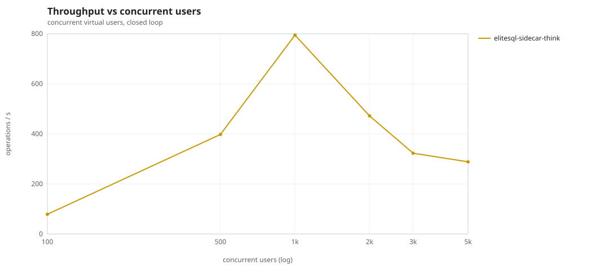
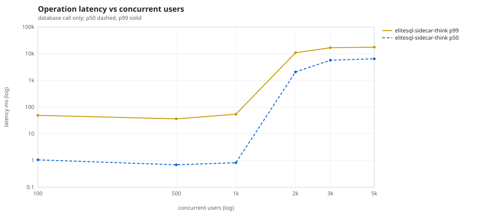
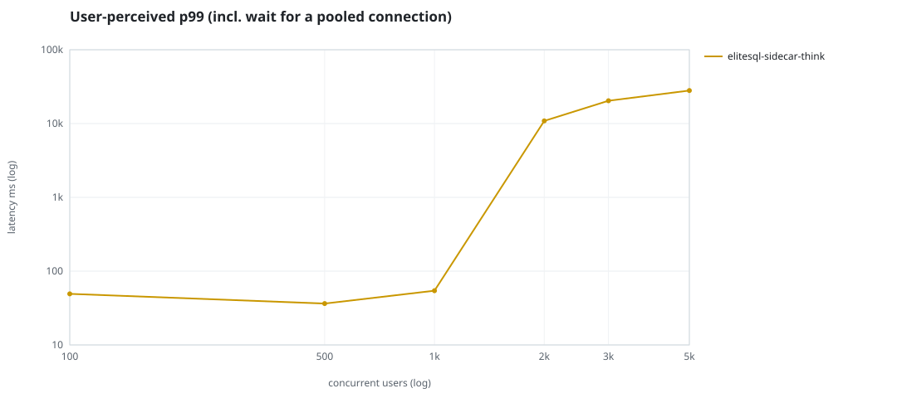
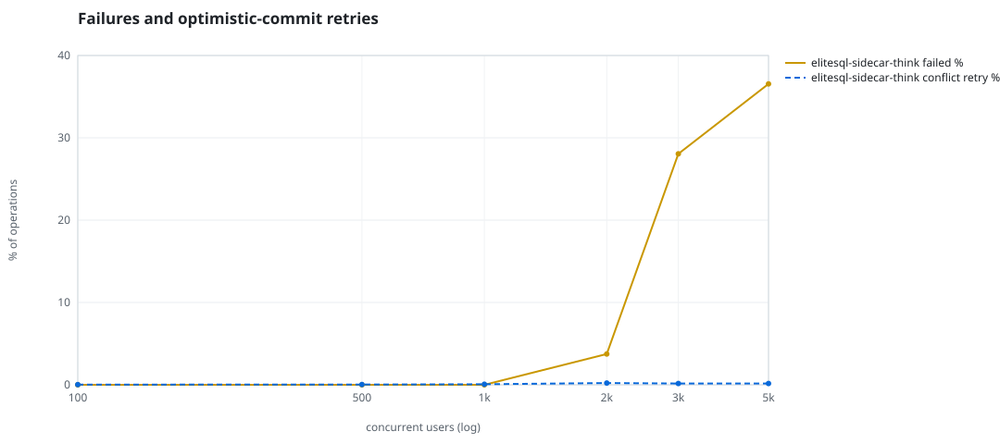
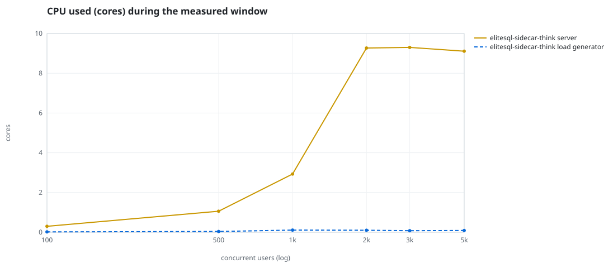
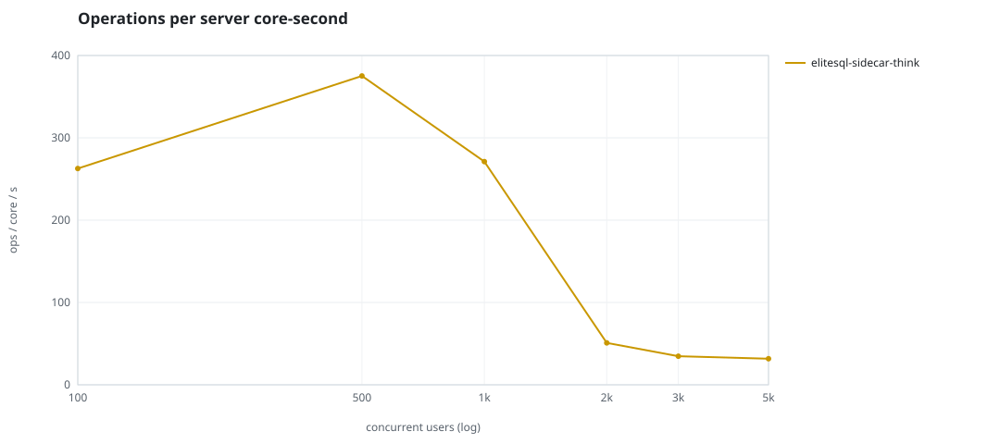
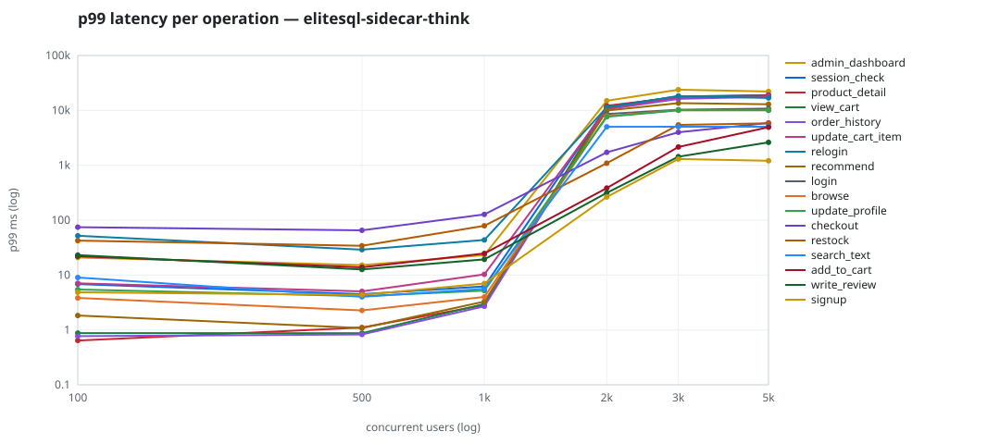

# Mini-SaaS concurrency simulation — sidecar

Run: `elitesql-sidecar-think` on 2026-09-12T20:35:30 · commit `abfe3ae` · macOS-26.6.2-arm64-arm-64bit-Mach-O · 10 CPUs

## Configuration

- **transport**: sidecar
- **levels**: [100, 500, 1000, 2000, 3000, 5000]
- **duration**: 45.0
- **warmup**: 5.0
- **ramp**: 5.0
- **think**: [0.5, 2.0]
- **processes**: 0
- **connections**: 0
- **durability**: balanced
- **products**: 5000
- **accounts**: 20000
- **seed**: 1
- **fresh_per_stage**: False
- **seed time**: 1.06 s, 18.5 MiB after seeding

## Capacity and performance curve

Latencies are of the database call (service operation) in milliseconds; `user p99` adds the wait for a pooled connection.

| users | conns | ops/s | reads/s | writes/s | p50 | p95 | p99 | p99.9 | max | user p99 | success % | conflict retry % | srv CPU | srv RSS MiB | gen CPU | thr CV | invariants |
|---:|---:|---:|---:|---:|---:|---:|---:|---:|---:|---:|---:|---:|---:|---:|---:|---:|---:|
| 100 | 100 | 78.8 | 60.7 | 18.1 | 1.058 | 20.552 | 49.17 | 69.553 | 97.566 | 49.183 | 100.0 | 0.028 | 0.3 | 93.1 | 0.02 | 0.054 | ok |
| 500 | 500 | 397.7 | 308.9 | 88.8 | 0.69 | 12.184 | 36.386 | 60.277 | 81.971 | 36.392 | 100.0 | 0.034 | 1.06 | 152.8 | 0.04 | 0.028 | ok |
| 1000 | 1000 | 794.5 | 615.8 | 178.8 | 0.826 | 19.486 | 54.237 | 94.928 | 302.168 | 54.243 | 100.0 | 0.073 | 2.93 | 466.3 | 0.11 | 0.018 | ok |
| 2000 | 2000 | 472.1 | 362.9 | 109.2 | 2072.656 | 8201.717 | 10859.005 | 13990.88 | 16183.021 | 10859.009 | 96.253 | 0.217 | 9.27 | 3497.2 | 0.1 | 0.148 | ok |
| 3000 | 2000 | 322.6 | 227.3 | 95.2 | 5699.941 | 12924.806 | 16805.45 | 19699.961 | 25455.012 | 20377.795 | 71.941 | 0.158 | 9.3 | 4784.0 | 0.08 | 0.267 | ok |
| 5000 | 2000 | 288.4 | 189.2 | 99.2 | 6425.947 | 13247.334 | 17596.617 | 19555.915 | 24835.324 | 28013.452 | 63.449 | 0.154 | 9.11 | 5123.2 | 0.09 | 0.267 | ok |

## Insights

- **Peak throughput**: 794.5 ops/s at 1000 users (p99 54.237 ms).
- **Capacity at p99 ≤ 10 ms**: 0 users (DB latency); 0 users counting pool wait.
- **Capacity at p99 ≤ 50 ms**: 500 users (DB latency); 500 users counting pool wait.
- **Capacity at p99 ≤ 100 ms**: 1000 users (DB latency); 1000 users counting pool wait.
- **Capacity at p99 ≤ 250 ms**: 1000 users (DB latency); 1000 users counting pool wait.
- **Capacity at p99 ≤ 1000 ms**: 1000 users (DB latency); 1000 users counting pool wait.
- **USL fit**: σ (contention) = 0.0, κ (coherency) = 6.31e-07, predicted peak at N ≈ 1258.9 (rmse log 0.1931).
- **Ops per server core-second**: 100→263, 500→375, 1000→271, 2000→51, 3000→35, 5000→32.
- **Connections refused while opening the pools** (listen backlog overflow, retried with backoff): [(1000, 3), (2000, 17), (3000, 20), (5000, 21)].
- **Read-your-writes violations**: none.
- **Business invariants**: all stages ok.
- **Offline integrity check** (elitesql check): ok in 4.02 s.
  - right after killing the server (no clean close): exit 3, 0 errors, 148376 warnings; after one clean open/close: exit 0, 0 errors, 0 warnings.
- **Database size**: 19.2 MiB after the first stage, 53.2 MiB after the last; 2560 paid orders in total.

## p99 latency per operation (ms)

| op | share % | 100 | 500 | 1000 | 2000 | 3000 | 5000 |
|---|---:|---:|---:|---:|---:|---:|---:|
| add_to_cart | 10.32 | 22.00 | 13.82 | 24.74 | 384.34 | 2149.40 | 4949.88 |
| admin_dashboard | 0.87 | 20.87 | 15.18 | 23.10 | 15006.67 | 23792.93 | 22081.73 |
| browse | 21.04 | 3.82 | 2.27 | 4.00 | 7897.77 | 10048.37 | 10072.76 |
| checkout | 4.2 | 74.52 | 65.28 | 126.99 | 1718.24 | 3997.33 | 5897.27 |
| login | 0.51 | – | – | – | 8593.35 | 10273.83 | 10768.21 |
| order_history | 3.53 | 0.77 | 0.83 | 2.70 | 10432.64 | 16230.16 | 17701.71 |
| product_detail | 16.75 | 0.64 | 1.10 | 2.83 | 12143.34 | 17501.21 | 18740.94 |
| recommend | 6.29 | 1.83 | 1.08 | 3.28 | 9929.10 | 13534.27 | 12920.10 |
| relogin | 1.33 | 51.86 | 28.95 | 43.61 | 11351.59 | 18257.34 | 16819.74 |
| restock | 0.31 | 42.44 | 34.15 | 79.07 | 1092.44 | 5445.67 | 5819.32 |
| search_text | 7.95 | 9.01 | 4.01 | 5.59 | 5009.53 | 5030.77 | 5028.11 |
| session_check | 11.59 | 6.86 | 4.49 | 6.20 | 11664.18 | 17880.46 | 19030.49 |
| signup | 0.51 | 4.85 | 4.35 | 7.00 | 265.35 | 1299.05 | 1209.06 |
| update_cart_item | 3.05 | 7.06 | 5.03 | 10.28 | 10735.09 | 17232.64 | 17631.23 |
| update_profile | 1.04 | 5.45 | 4.13 | 5.19 | 7628.49 | 10043.57 | 10049.43 |
| view_cart | 9.0 | 0.87 | 0.87 | 2.97 | 11519.64 | 18137.85 | 18352.26 |
| write_review | 2.23 | 23.06 | 12.65 | 19.33 | 314.57 | 1434.48 | 2618.31 |

## Errors and business outcomes at the highest level

```json
{
 "statuses": {
  "empty_cart": 318,
  "ok": 7917,
  "error:16": 4744
 },
 "errors": {
  "error:16": {
   "count": 6142,
   "first": "[elitesql:16] memory limit exceeded: query memory admission timed out",
   "ops": {
    "login": 2199,
    "product_detail": 1061,
    "browse": 822,
    "order_history": 118,
    "session_check": 776,
    "relogin": 74,
    "update_cart_item": 161,
    "view_cart": 412,
    "search_text": 59,
    "recommend": 337,
    "admin_dashboard": 78,
    "update_profile": 45
   }
  }
 }
}
```

## Charts








