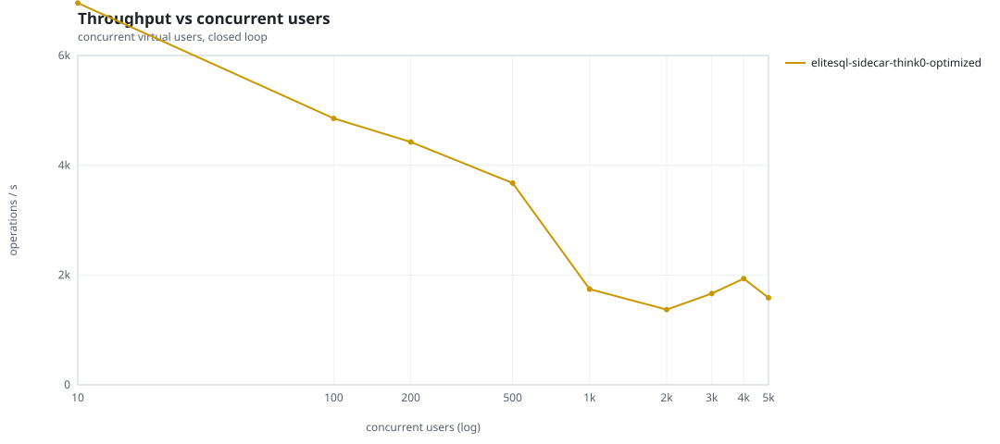
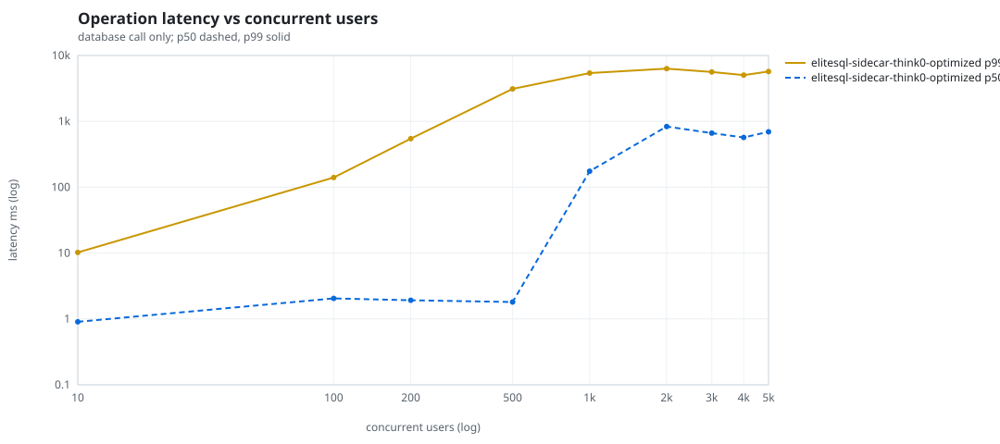
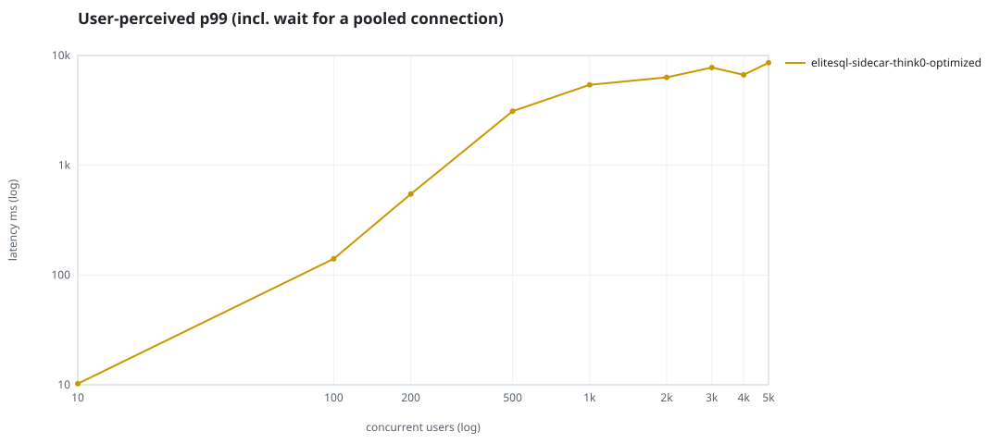
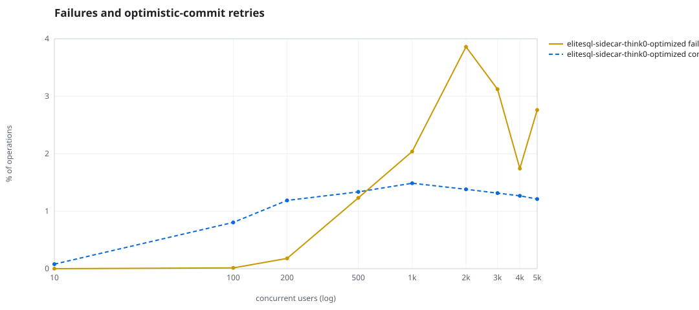
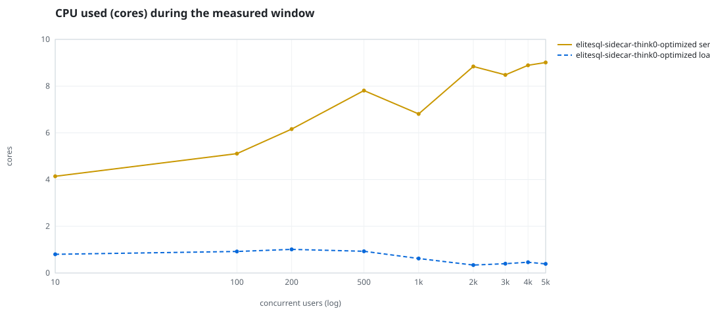
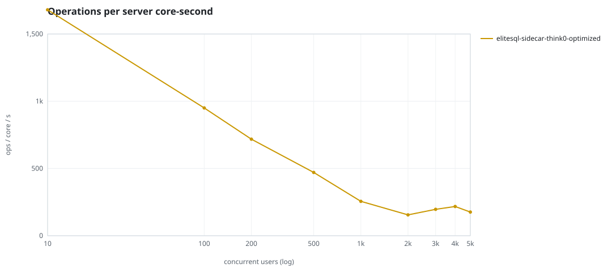
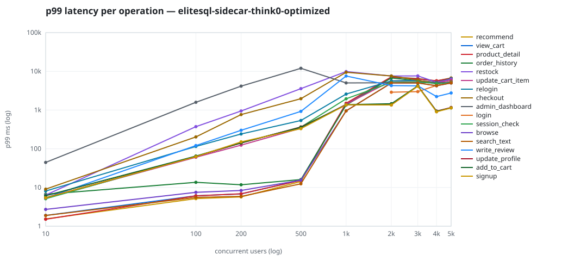

# Mini-SaaS concurrency simulation — sidecar

Run: `elitesql-sidecar-think0-optimized` on 2026-09-12T23:41:39 · commit `abfe3ae` · macOS-26.6.2-arm64-arm-64bit-Mach-O · 10 CPUs

## Configuration

- **transport**: sidecar
- **levels**: [10, 100, 200, 500, 1000, 2000, 3000, 4000, 5000]
- **duration**: 60.0
- **warmup**: 5.0
- **ramp**: 5.0
- **think**: [0.0, 0.0]
- **processes**: 0
- **connections**: 0
- **durability**: balanced
- **products**: 5000
- **accounts**: 20000
- **seed**: 1
- **fresh_per_stage**: False
- **seed time**: 1.04 s, 18.5 MiB after seeding

## Capacity and performance curve

Latencies are of the database call (service operation) in milliseconds; `user p99` adds the wait for a pooled connection.

| users | conns | ops/s | reads/s | writes/s | p50 | p95 | p99 | p99.9 | max | user p99 | success % | conflict retry % | srv CPU | srv RSS MiB | gen CPU | thr CV | invariants |
|---:|---:|---:|---:|---:|---:|---:|---:|---:|---:|---:|---:|---:|---:|---:|---:|---:|---:|
| 10 | 10 | 6955.4 | 5380.4 | 1575.0 | 0.905 | 3.728 | 10.227 | 31.516 | 1527.819 | 10.229 | 100.0 | 0.079 | 4.14 | 328.9 | 0.8 | 0.272 | ok |
| 100 | 100 | 4854.2 | 3756.3 | 1097.9 | 2.048 | 50.605 | 140.645 | 1060.274 | 2719.621 | 140.647 | 99.987 | 0.804 | 5.11 | 536.2 | 0.92 | 0.24 | ok |
| 200 | 200 | 4423.4 | 3424.8 | 998.6 | 1.923 | 107.113 | 546.109 | 2563.23 | 5550.155 | 546.111 | 99.821 | 1.188 | 6.16 | 538.2 | 1.01 | 0.082 | ok |
| 500 | 500 | 3675.3 | 2842.6 | 832.7 | 1.806 | 266.942 | 3109.457 | 8942.389 | 14054.599 | 3109.458 | 98.768 | 1.336 | 7.81 | 657.4 | 0.93 | 0.251 | ok |
| 1000 | 1000 | 1742.1 | 1346.5 | 395.6 | 174.786 | 1519.982 | 5410.52 | 9306.329 | 28248.045 | 5410.523 | 97.962 | 1.487 | 6.81 | 581.0 | 0.62 | 0.169 | ok |
| 2000 | 2000 | 1370.5 | 1062.2 | 308.3 | 833.906 | 5006.746 | 6325.682 | 8325.22 | 11046.034 | 6325.683 | 96.141 | 1.381 | 8.84 | 571.2 | 0.34 | 0.206 | ok |
| 3000 | 2000 | 1664.1 | 1289.6 | 374.6 | 663.692 | 4628.818 | 5618.818 | 7934.237 | 16575.694 | 7768.33 | 96.878 | 1.315 | 8.48 | 813.8 | 0.4 | 0.383 | ok |
| 4000 | 2000 | 1934.4 | 1496.3 | 438.1 | 570.137 | 3684.062 | 5041.275 | 6680.626 | 9610.075 | 6662.257 | 98.258 | 1.267 | 8.89 | 767.4 | 0.46 | 0.178 | ok |
| 5000 | 2000 | 1585.2 | 1225.1 | 360.1 | 692.864 | 4623.826 | 5709.927 | 7793.121 | 10207.491 | 8603.724 | 97.239 | 1.211 | 9.01 | 781.0 | 0.39 | 0.244 | ok |

## Insights

- **Peak throughput**: 6955.4 ops/s at 10 users (p99 10.227 ms).
- **Capacity at p99 ≤ 10 ms**: 0 users (DB latency); 0 users counting pool wait.
- **Capacity at p99 ≤ 50 ms**: 10 users (DB latency); 10 users counting pool wait.
- **Capacity at p99 ≤ 100 ms**: 10 users (DB latency); 10 users counting pool wait.
- **Capacity at p99 ≤ 250 ms**: 100 users (DB latency); 100 users counting pool wait.
- **Capacity at p99 ≤ 1000 ms**: 200 users (DB latency); 200 users counting pool wait.
- **USL fit**: σ (contention) = 0.43, κ (coherency) = 2.51e-04, predicted peak at N ≈ 47.6 (rmse log 0.3248).
- **Ops per server core-second**: 10→1680, 100→950, 200→718, 500→471, 1000→256, 2000→155, 3000→196, 4000→218, 5000→176.
- **Connections refused while opening the pools** (listen backlog overflow, retried with backoff): [(1000, 6), (2000, 20), (3000, 22), (4000, 16), (5000, 19)].
- **Seconds with zero completed operations** (stalls): [(100, 2)].
- **Read-your-writes violations**: none.
- **Business invariants**: all stages ok.
- **Offline integrity check** (elitesql check): ok in 21.67 s.
  - right after killing the server (no clean close): exit 3, 0 errors, 986514 warnings; after one clean open/close: exit 0, 0 errors, 0 warnings.
- **Database size**: 75.7 MiB after the first stage, 235.6 MiB after the last; 55471 paid orders in total.

## p99 latency per operation (ms)

| op | share % | 10 | 100 | 200 | 500 | 1000 | 2000 | 3000 | 4000 | 5000 |
|---|---:|---:|---:|---:|---:|---:|---:|---:|---:|---:|
| add_to_cart | 10.24 | 6.14 | 64.69 | 143.31 | 358.90 | 1375.35 | 1453.69 | 4203.43 | 927.71 | 1138.54 |
| admin_dashboard | 1.02 | 44.39 | 1587.16 | 4147.59 | 12003.06 | 5025.96 | 5076.96 | 5069.01 | 5119.68 | 5083.69 |
| browse | 20.33 | 2.72 | 7.49 | 8.37 | 15.45 | 951.25 | 5013.10 | 5009.35 | 4246.73 | 5007.65 |
| checkout | 3.95 | 9.05 | 202.69 | 764.89 | 1968.11 | 9435.92 | 7592.16 | 5941.58 | 4743.32 | 5325.11 |
| login | 0.01 | – | – | – | – | – | 2890.70 | 2988.30 | 4331.26 | 5066.10 |
| order_history | 3.1 | 6.69 | 13.60 | 11.74 | 16.03 | 1344.35 | 6732.49 | 5735.86 | 5203.80 | 6487.75 |
| product_detail | 17.29 | 1.51 | 6.10 | 6.88 | 15.26 | 1500.42 | 7158.43 | 6345.86 | 5696.29 | 6567.80 |
| recommend | 7.09 | 1.54 | 5.15 | 5.71 | 14.29 | 1487.39 | 7096.97 | 6536.74 | 5684.04 | 6763.61 |
| relogin | 1.54 | 8.10 | 114.93 | 240.90 | 537.67 | 2583.85 | 5656.69 | 5862.75 | 4779.59 | 5332.63 |
| restock | 0.31 | 6.36 | 372.72 | 947.74 | 3576.42 | 9881.00 | 7583.40 | 7624.85 | 5217.64 | 6299.62 |
| search_text | 8.13 | 1.89 | 5.55 | 5.88 | 12.48 | 953.51 | 5007.72 | 5005.03 | 4244.74 | 5005.40 |
| session_check | 12.22 | 5.11 | 64.18 | 141.07 | 362.08 | 1952.54 | 5190.80 | 5371.69 | 4834.87 | 5056.51 |
| signup | 0.49 | 5.41 | 62.48 | 150.68 | 330.70 | 1362.93 | 1356.36 | 4126.65 | 902.79 | 1133.08 |
| update_cart_item | 3.06 | 5.32 | 60.31 | 124.29 | 339.20 | 1415.69 | 5651.27 | 5740.59 | 5021.17 | 5864.51 |
| update_profile | 1.04 | 5.44 | 63.32 | 141.16 | 366.19 | 1357.84 | 1360.67 | 4220.65 | 939.66 | 1165.78 |
| view_cart | 8.16 | 1.90 | 6.11 | 6.82 | 15.55 | 1467.63 | 7090.54 | 6414.16 | 5602.86 | 6628.66 |
| write_review | 2.02 | 5.38 | 121.19 | 299.90 | 925.51 | 7582.74 | 4292.13 | 4213.29 | 2232.63 | 2762.86 |

## Errors and business outcomes at the highest level

```json
{
 "statuses": {
  "ok": 91167,
  "error:16": 2427,
  "conflict_exhausted": 199,
  "out_of_stock": 129,
  "empty_cart": 1189,
  "not_found": 2
 },
 "errors": {
  "error:16": {
   "count": 2781,
   "first": "[elitesql:16] memory limit exceeded: query memory admission timed out",
   "ops": {
    "admin_dashboard": 1046,
    "session_check": 164,
    "login": 29,
    "browse": 295,
    "product_detail": 528,
    "order_history": 72,
    "recommend": 218,
    "view_cart": 228,
    "update_cart_item": 52,
    "search_text": 132,
    "relogin": 17
   }
  },
  "conflict_exhausted": {
   "count": 264,
   "first": "[elitesql:9] conflict, retry transaction: products/01M2CH4BNAYK49BKJSVPP5DWWR changed after this transaction began",
   "ops": {
    "checkout": 157,
    "restock": 105,
    "write_review": 2
   }
  }
 }
}
```

## Charts








