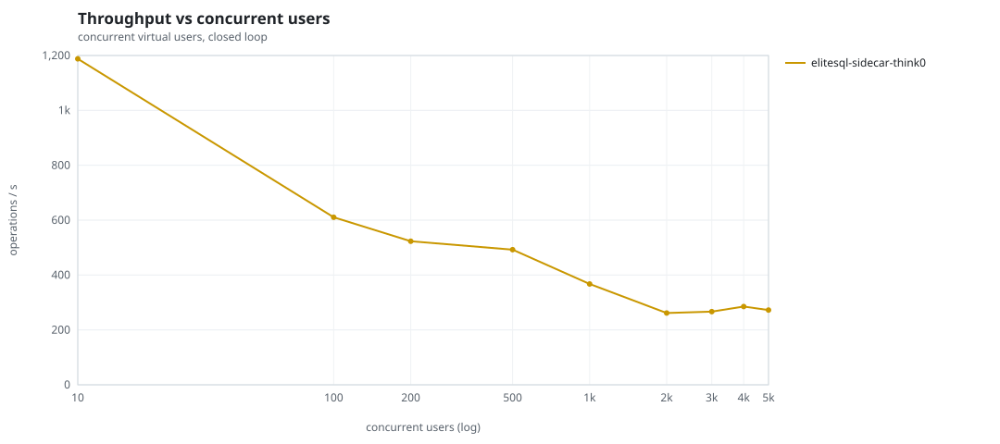
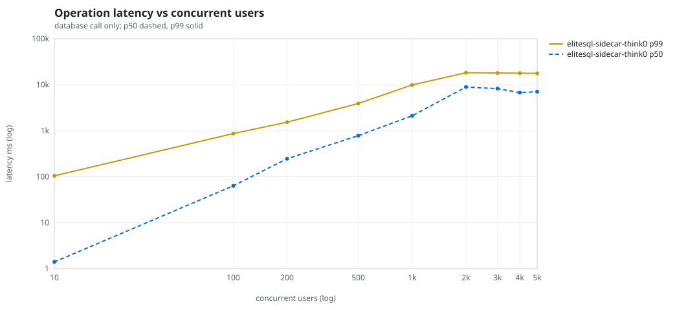
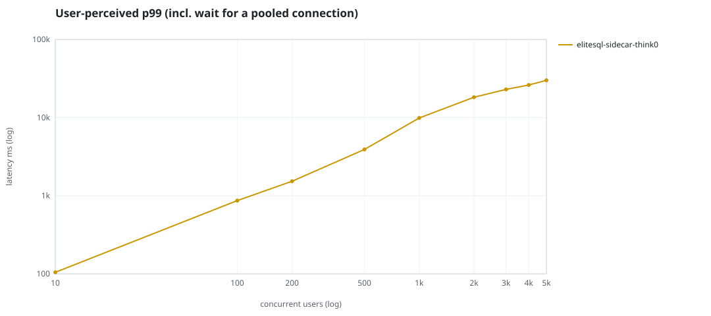
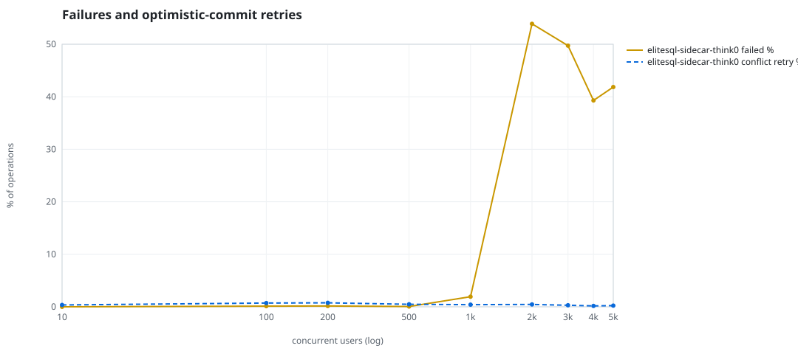
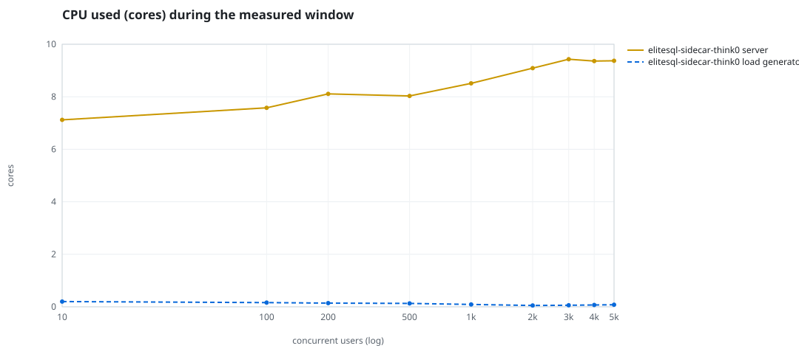
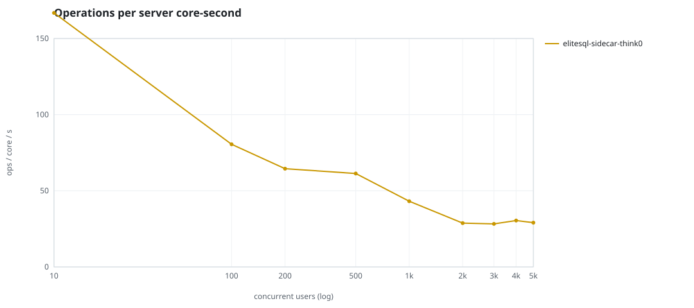
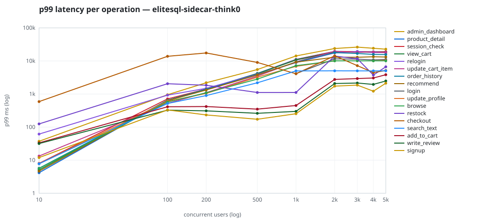

# Mini-SaaS concurrency simulation — sidecar

Run: `elitesql-sidecar-think0` on 2026-09-12T20:00:29 · commit `abfe3ae` · macOS-26.6.2-arm64-arm-64bit-Mach-O · 10 CPUs

## Configuration

- **transport**: sidecar
- **levels**: [10, 100, 200, 500, 1000, 2000, 3000, 4000, 5000]
- **duration**: 60.0
- **warmup**: 5.0
- **ramp**: 5.0
- **think**: [0.0, 0.0]
- **processes**: 0
- **connections**: 0
- **durability**: balanced
- **products**: 5000
- **accounts**: 20000
- **seed**: 1
- **fresh_per_stage**: False
- **seed time**: 1.07 s, 18.5 MiB after seeding

## Capacity and performance curve

Latencies are of the database call (service operation) in milliseconds; `user p99` adds the wait for a pooled connection.

| users | conns | ops/s | reads/s | writes/s | p50 | p95 | p99 | p99.9 | max | user p99 | success % | conflict retry % | srv CPU | srv RSS MiB | gen CPU | thr CV | invariants |
|---:|---:|---:|---:|---:|---:|---:|---:|---:|---:|---:|---:|---:|---:|---:|---:|---:|---:|
| 10 | 10 | 1187.7 | 920.0 | 267.6 | 1.402 | 32.231 | 104.725 | 373.089 | 3049.246 | 104.726 | 99.997 | 0.355 | 7.12 | 479.4 | 0.2 | 0.093 | ok |
| 100 | 100 | 610.3 | 472.1 | 138.3 | 63.41 | 499.925 | 866.697 | 10230.298 | 22306.769 | 866.697 | 99.869 | 0.718 | 7.58 | 1110.1 | 0.16 | 0.242 | ok |
| 200 | 200 | 523.1 | 404.9 | 118.1 | 245.78 | 1017.533 | 1533.748 | 13200.651 | 23998.865 | 1533.749 | 99.847 | 0.765 | 8.11 | 1334.5 | 0.14 | 0.184 | ok |
| 500 | 500 | 492.6 | 381.2 | 111.4 | 781.824 | 2838.387 | 3911.092 | 5924.326 | 20559.78 | 3911.094 | 99.949 | 0.484 | 8.03 | 1003.8 | 0.13 | 0.118 | ok |
| 1000 | 1000 | 367.3 | 283.1 | 84.2 | 2112.737 | 7400.424 | 9894.122 | 13126.905 | 19815.806 | 9894.123 | 98.081 | 0.413 | 8.51 | 1404.0 | 0.09 | 0.122 | ok |
| 2000 | 2000 | 261.7 | 176.8 | 85.0 | 8912.57 | 13302.204 | 18246.824 | 19935.546 | 37704.378 | 18246.825 | 46.109 | 0.452 | 9.09 | 2874.9 | 0.05 | 0.17 | ok |
| 3000 | 2000 | 266.6 | 170.2 | 96.3 | 8231.747 | 13249.596 | 18020.809 | 19788.524 | 27680.167 | 22991.37 | 50.269 | 0.294 | 9.43 | 3124.4 | 0.06 | 0.217 | ok |
| 4000 | 2000 | 285.1 | 196.3 | 88.8 | 6730.77 | 13883.612 | 17815.101 | 19968.702 | 25027.114 | 26156.757 | 60.706 | 0.175 | 9.36 | 4114.9 | 0.07 | 0.437 | ok |
| 5000 | 2000 | 272.5 | 186.8 | 85.7 | 7063.523 | 13627.854 | 17681.747 | 19844.472 | 23356.533 | 30011.85 | 58.147 | 0.226 | 9.37 | 4358.3 | 0.08 | 0.901 | ok |

## Insights

- **Peak throughput**: 1187.7 ops/s at 10 users (p99 104.725 ms).
- **Capacity at p99 ≤ 10 ms**: 0 users (DB latency); 0 users counting pool wait.
- **Capacity at p99 ≤ 50 ms**: 0 users (DB latency); 0 users counting pool wait.
- **Capacity at p99 ≤ 100 ms**: 0 users (DB latency); 0 users counting pool wait.
- **Capacity at p99 ≤ 250 ms**: 10 users (DB latency); 10 users counting pool wait.
- **Capacity at p99 ≤ 1000 ms**: 100 users (DB latency); 100 users counting pool wait.
- **USL fit**: σ (contention) = 0.51, κ (coherency) = 2.51e-04, predicted peak at N ≈ 44.2 (rmse log 0.2845).
- **Ops per server core-second**: 10→167, 100→81, 200→65, 500→61, 1000→43, 2000→29, 3000→28, 4000→30, 5000→29.
- **Connections refused while opening the pools** (listen backlog overflow, retried with backoff): [(1000, 5), (2000, 30), (3000, 22), (4000, 20), (5000, 23)].
- **Read-your-writes violations**: none.
- **Business invariants**: all stages ok.
- **Offline integrity check** (elitesql check): ok in 6.5 s.
  - right after killing the server (no clean close): exit 3, 0 errors, 234316 warnings; after one clean open/close: exit 0, 0 errors, 0 warnings.
- **Database size**: 45.4 MiB after the first stage, 96.5 MiB after the last; 7001 paid orders in total.

## p99 latency per operation (ms)

| op | share % | 10 | 100 | 200 | 500 | 1000 | 2000 | 3000 | 4000 | 5000 |
|---|---:|---:|---:|---:|---:|---:|---:|---:|---:|---:|
| add_to_cart | 10.0 | 33.38 | 411.92 | 418.42 | 349.27 | 450.33 | 2759.98 | 2939.59 | 3055.92 | 3843.95 |
| admin_dashboard | 0.98 | 37.32 | 951.51 | 2196.52 | 5490.69 | 14187.46 | 23774.22 | 26174.59 | 24199.73 | 22696.31 |
| browse | 20.38 | 5.60 | 575.80 | 1089.68 | 2827.53 | 7215.36 | 10066.09 | 10058.49 | 10054.95 | 10060.59 |
| checkout | 4.12 | 591.07 | 13838.07 | 17427.93 | 9020.62 | 4094.04 | 14257.19 | 7218.11 | 4450.84 | 5160.95 |
| login | 0.03 | – | – | – | – | 4150.45 | 11550.05 | 11291.27 | 10808.68 | 11104.79 |
| order_history | 3.17 | 5.71 | 644.64 | 1397.39 | 3821.27 | 9165.20 | 17857.73 | 16829.31 | 15732.68 | 15650.11 |
| product_detail | 17.24 | 4.17 | 646.74 | 1428.75 | 4202.76 | 11158.60 | 19484.95 | 18884.43 | 18952.65 | 18937.64 |
| recommend | 7.18 | 4.64 | 627.24 | 1324.59 | 3776.15 | 9186.44 | 12973.73 | 12965.52 | 13392.29 | 13147.34 |
| relogin | 1.57 | 61.47 | 924.08 | 1490.86 | 3937.53 | 8904.69 | 17478.14 | 19461.17 | 17888.06 | 17931.71 |
| restock | 0.32 | 124.81 | 2052.82 | 1840.59 | 1111.55 | 1117.17 | 14045.60 | 11697.42 | 3743.78 | 6663.08 |
| search_text | 8.05 | 7.76 | 517.35 | 897.41 | 2187.72 | 5004.00 | 5033.99 | 5023.02 | 5027.10 | 5036.04 |
| session_check | 12.23 | 7.99 | 712.84 | 1410.54 | 4090.18 | 10925.56 | 19318.76 | 19228.02 | 18732.19 | 18929.12 |
| signup | 0.51 | 11.97 | 330.49 | 233.54 | 172.87 | 253.81 | 1732.09 | 1859.97 | 1219.45 | 2124.06 |
| update_cart_item | 2.98 | 13.34 | 522.42 | 1103.12 | 3483.82 | 9399.12 | 19386.87 | 18258.38 | 18751.51 | 17779.35 |
| update_profile | 0.98 | 7.80 | 604.15 | 1041.92 | 3235.85 | 6870.96 | 10083.31 | 10069.90 | 10057.15 | 10435.52 |
| view_cart | 8.24 | 5.08 | 648.85 | 1390.41 | 4130.64 | 10667.36 | 18576.57 | 18354.30 | 18438.79 | 18042.88 |
| write_review | 2.04 | 31.78 | 325.46 | 309.69 | 261.50 | 299.78 | 2080.07 | 2151.26 | 1953.38 | 2483.76 |

## Errors and business outcomes at the highest level

```json
{
 "statuses": {
  "ok": 9079,
  "error:16": 6843,
  "empty_cart": 428
 },
 "errors": {
  "error:16": {
   "count": 7896,
   "first": "[elitesql:16] memory limit exceeded: query memory admission timed out",
   "ops": {
    "login": 2056,
    "view_cart": 626,
    "session_check": 1112,
    "browse": 1255,
    "order_history": 220,
    "search_text": 107,
    "product_detail": 1498,
    "relogin": 134,
    "update_profile": 72,
    "update_cart_item": 234,
    "recommend": 470,
    "admin_dashboard": 112
   }
  }
 }
}
```

## Charts








