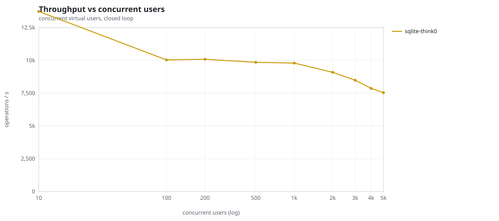
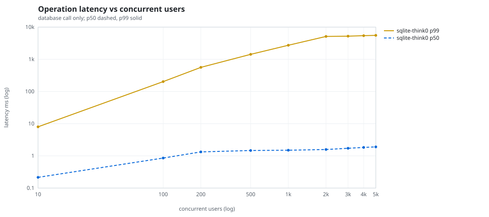
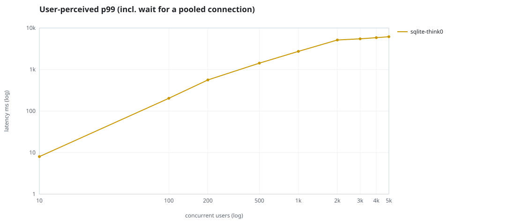
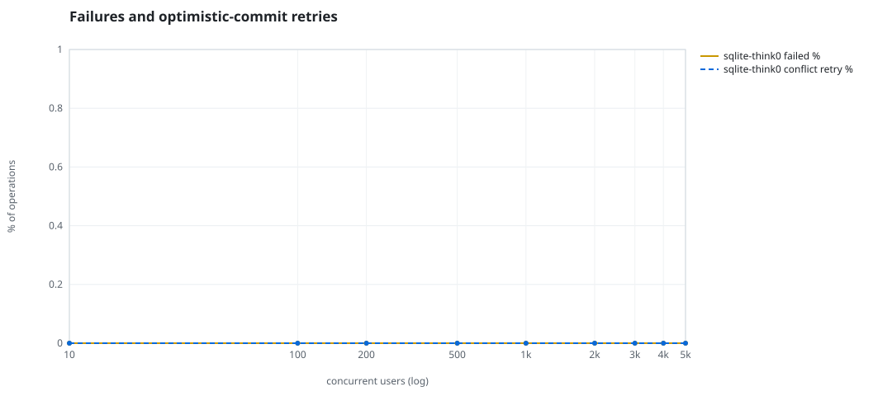
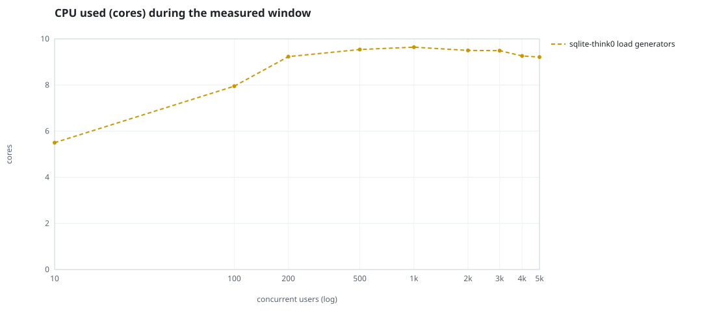
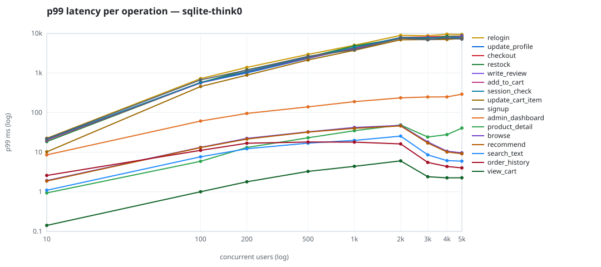

# Mini-SaaS concurrency simulation — sqlite

Run: `sqlite-think0` on 2026-09-12T20:18:13 · commit `abfe3ae` · macOS-26.6.2-arm64-arm-64bit-Mach-O · 10 CPUs

## Configuration

- **transport**: sqlite
- **levels**: [10, 100, 200, 500, 1000, 2000, 3000, 4000, 5000]
- **duration**: 60.0
- **warmup**: 5.0
- **ramp**: 5.0
- **think**: [0.0, 0.0]
- **processes**: 0
- **connections**: 0
- **durability**: balanced
- **products**: 5000
- **accounts**: 20000
- **seed**: 1
- **fresh_per_stage**: False
- **seed time**: None s, 0.0 MiB after seeding

## Capacity and performance curve

Latencies are of the database call (service operation) in milliseconds; `user p99` adds the wait for a pooled connection.

| users | conns | ops/s | reads/s | writes/s | p50 | p95 | p99 | p99.9 | max | user p99 | success % | conflict retry % | srv CPU | srv RSS MiB | gen CPU | thr CV | invariants |
|---:|---:|---:|---:|---:|---:|---:|---:|---:|---:|---:|---:|---:|---:|---:|---:|---:|---:|
| 10 | 10 | 13735.3 | 10618.7 | 3116.6 | 0.215 | 1.745 | 8.008 | 40.04 | 356.991 | 8.008 | 100.0 | 0.0 | None | None | 5.5 | 0.102 | ok |
| 100 | 100 | 10034.0 | 7760.8 | 2273.2 | 0.856 | 21.217 | 203.155 | 1081.426 | 4172.511 | 203.155 | 100.0 | 0.0 | None | None | 7.95 | 0.141 | ok |
| 200 | 200 | 10088.9 | 7804.6 | 2284.3 | 1.329 | 42.011 | 562.227 | 1795.359 | 5123.628 | 562.228 | 100.0 | 0.0 | None | None | 9.23 | 0.042 | ok |
| 500 | 500 | 9855.5 | 7625.8 | 2229.7 | 1.47 | 125.271 | 1426.876 | 3679.345 | 10159.901 | 1426.877 | 100.0 | 0.0 | None | None | 9.54 | 0.027 | ok |
| 1000 | 1000 | 9795.7 | 7572.6 | 2223.0 | 1.497 | 357.151 | 2734.727 | 6252.782 | 19626.9 | 2734.727 | 100.0 | 0.0 | None | None | 9.64 | 0.033 | ok |
| 2000 | 2000 | 9092.2 | 7029.2 | 2063.0 | 1.579 | 1294.135 | 5139.752 | 10774.565 | 32829.976 | 5139.753 | 100.0 | 0.0 | None | None | 9.5 | 0.034 | ok |
| 3000 | 2000 | 8487.4 | 6563.8 | 1923.5 | 1.722 | 1501.675 | 5244.236 | 10518.675 | 21966.009 | 5483.458 | 100.0 | 0.0 | None | None | 9.49 | 0.058 | ok |
| 4000 | 2000 | 7869.0 | 6088.9 | 1780.1 | 1.833 | 1706.251 | 5432.377 | 10590.095 | 29155.902 | 5859.686 | 100.0 | 0.0 | None | None | 9.26 | 0.043 | ok |
| 5000 | 2000 | 7541.9 | 5831.3 | 1710.6 | 1.903 | 1808.985 | 5554.7 | 10892.45 | 30426.336 | 6165.308 | 100.0 | 0.0 | None | None | 9.21 | 0.027 | ok |

## Insights

- **Peak throughput**: 13735.3 ops/s at 10 users (p99 8.008 ms).
- **Capacity at p99 ≤ 10 ms**: 10 users (DB latency); 10 users counting pool wait.
- **Capacity at p99 ≤ 50 ms**: 10 users (DB latency); 10 users counting pool wait.
- **Capacity at p99 ≤ 100 ms**: 10 users (DB latency); 10 users counting pool wait.
- **Capacity at p99 ≤ 250 ms**: 100 users (DB latency); 100 users counting pool wait.
- **Capacity at p99 ≤ 1000 ms**: 200 users (DB latency); 200 users counting pool wait.
- **USL fit**: σ (contention) = 0.36, κ (coherency) = 3.98e-05, predicted peak at N ≈ 126.8 (rmse log 0.1303).
- **Generator CPU includes the database**: SQLite runs inside the load-generator processes, so `gen CPU` is application plus engine and there is no server column.
- **Read-your-writes violations**: none.
- **Business invariants**: all stages ok.
- **Offline integrity check** (PRAGMA integrity_check): ok in 0.32 s.
- **Database size**: 13.9 MiB after the first stage, 65.5 MiB after the last; 146772 paid orders in total.

## p99 latency per operation (ms)

| op | share % | 10 | 100 | 200 | 500 | 1000 | 2000 | 3000 | 4000 | 5000 |
|---|---:|---:|---:|---:|---:|---:|---:|---:|---:|---:|
| add_to_cart | 10.21 | 20.11 | 568.35 | 1084.28 | 2414.09 | 4220.99 | 7571.15 | 7687.07 | 7530.21 | 7836.27 |
| admin_dashboard | 1.03 | 8.56 | 61.17 | 95.29 | 139.49 | 188.96 | 235.47 | 247.79 | 249.03 | 291.95 |
| browse | 20.34 | 1.92 | 13.24 | 22.29 | 32.61 | 41.97 | 47.33 | 18.06 | 10.55 | 9.63 |
| checkout | 4.01 | 20.67 | 573.01 | 1070.27 | 2428.20 | 4371.15 | 7860.92 | 8121.69 | 8418.77 | 8540.42 |
| order_history | 3.08 | 2.58 | 11.12 | 16.82 | 18.05 | 17.94 | 16.17 | 5.52 | 4.35 | 4.02 |
| product_detail | 17.28 | 0.94 | 5.88 | 13.16 | 23.08 | 34.84 | 48.75 | 24.18 | 27.81 | 40.68 |
| recommend | 7.1 | 1.87 | 13.05 | 21.44 | 32.10 | 40.07 | 46.02 | 17.06 | 10.14 | 9.12 |
| relogin | 1.54 | 22.55 | 720.72 | 1388.29 | 2941.73 | 5012.32 | 8900.57 | 8706.12 | 9536.77 | 9382.54 |
| restock | 0.31 | 18.58 | 571.40 | 1198.54 | 2524.58 | 4800.02 | 7468.17 | 7404.21 | 8412.52 | 8309.68 |
| search_text | 8.12 | 1.09 | 7.64 | 12.22 | 16.93 | 19.83 | 25.47 | 8.58 | 6.11 | 5.95 |
| session_check | 12.21 | 21.34 | 572.79 | 1082.96 | 2514.98 | 4393.53 | 7847.32 | 7674.46 | 7721.31 | 7754.00 |
| signup | 0.5 | 22.02 | 669.74 | 1182.75 | 2635.11 | 3871.75 | 7550.34 | 6862.65 | 7615.83 | 7148.73 |
| update_cart_item | 3.06 | 10.20 | 456.09 | 881.88 | 2127.93 | 3739.53 | 6900.65 | 6987.82 | 7020.35 | 7426.65 |
| update_profile | 1.04 | 20.92 | 566.10 | 1004.12 | 2335.02 | 4290.83 | 7446.86 | 7719.83 | 7304.71 | 8751.50 |
| view_cart | 8.15 | 0.14 | 1.00 | 1.79 | 3.27 | 4.40 | 6.03 | 2.40 | 2.25 | 2.26 |
| write_review | 2.03 | 21.17 | 559.26 | 1084.92 | 2525.46 | 4089.00 | 7716.85 | 7813.05 | 7771.40 | 8226.87 |

## Errors and business outcomes at the highest level

```json
{
 "statuses": {
  "ok": 442257,
  "empty_cart": 3852,
  "out_of_stock": 6374,
  "not_found": 33
 },
 "errors": {}
}
```

## Charts








